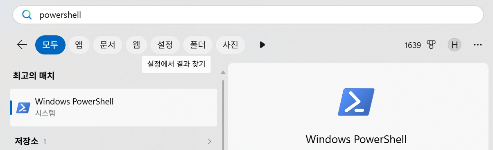

# 실습 사전 준비

## 최초 로그인
- Azure 포탈 접근
  https://portal.azure.com/

- 다른 계정 사용 클릭

- email과 초기 암호 입력
  ex) b2b32@ktaiacademy.onmicrosoft.com
  
  초기 비밀번호 입력 후 비밀번호 변경 필요		
이름	ID	PW
강태원	b2b3@ktaiacademy.onmicrosoft.com	fc1017!!
김경훈	b2b4@ktaiacademy.onmicrosoft.com	fc1017!!
손준영	b2b5@ktaiacademy.onmicrosoft.com	fc1017!!
김동식	b2b6@ktaiacademy.onmicrosoft.com	fc1017!!
박득선	b2b7@ktaiacademy.onmicrosoft.com	fc1017!!
배지연	b2b8@ktaiacademy.onmicrosoft.com	fc1017!!
		
차혜인	b2b10@ktaiacademy.onmicrosoft.com	fc1017!!
김경배	b2b11@ktaiacademy.onmicrosoft.com	fc1017!!
김나영	b2b12@ktaiacademy.onmicrosoft.com	fc1017!!
김석우	b2b13@ktaiacademy.onmicrosoft.com	fc1017!!
김의삭	b2b14@ktaiacademy.onmicrosoft.com	fc1017!!
정찬명	b2b15@ktaiacademy.onmicrosoft.com	fc1017!!
이길우	b2b16@ktaiacademy.onmicrosoft.com	fc1017!!
정주헌	b2b17@ktaiacademy.onmicrosoft.com	fc1017!!
김주환	b2b18@ktaiacademy.onmicrosoft.com	fc1017!!
최지현	b2b19@ktaiacademy.onmicrosoft.com	fc1017!!
박상현	b2b20@ktaiacademy.onmicrosoft.com	fc1017!!
강도연	b2b21@ktaiacademy.onmicrosoft.com	fc1017!!
유상원	b2b22@ktaiacademy.onmicrosoft.com	fc1017!!
윤종원	b2b23@ktaiacademy.onmicrosoft.com	fc1017!!
박주연	b2b24@ktaiacademy.onmicrosoft.com	fc1017!!
채동윤	b2b25@ktaiacademy.onmicrosoft.com	fc1017!!

- 암호 변경: 초기 암호를 본인 암호로 변경  

- 디바이스 등록
  - 'Microsoft Authenticator' 앱을 앱스토어에서 검색하여 설치
  - 웹 화면에 나온 QR코드를 Authenticator 앱의 QR 찍기로 찍음
  - Authenticator에서 등록한 Device를 눌러 코드 입력

---

## 로그인
- Azure 포탈 접근
  https://portal.azure.com/
- 계정 선택
- ID/PW 입력
  https://docs.google.com/spreadsheets/d/18KIclYdM8GsVFUwUMMzPYxU6avlQj4DuemuU7vQ2tF8/edit?gid=801552886#gid=801552886
  
- Authenticator 실행하여 일회성 코드 입력
  
---

## 실습 Git 소스 다운로드   
- Window 사용자 
  - PowerShell 실행
      
        
  - 아래 명령 수행 
    ```
    cd ~
    mkdir workspace
    cd workspace
    git clone https://github.com/unicorn-campus/finops-handson
    ``` 
    
- Mac 사용자 
  - 터미널 실행
  - 아래 명령 수행 
    ```
    mkdir -p ~/workspace && cd ~/workspace
    git clone https://github.com/unicorn-campus/finops-handson
    ``` 
  
---

## Claude 가입 및 Claude Code 설치(강사가 요청한 경우만 수행)  
- Claude 가입: 강사가 제공한 Claude 가입 링크를 클릭하고 gmail이나 naver 메일로 가입  
- 아래 링크 참조하여 설치  
  - Claude Code 설치: https://github.com/unicorn-plugins/npd/blob/main/resources/guides/setup/prepare.md#claude-desktop-%EC%84%A4%EC%B9%98
  - Git Client 섶치: https://github.com/unicorn-plugins/npd/blob/main/resources/guides/setup/prepare.md#git-client-%EC%84%A4%EC%B9%98

---

