# 관리그룹

## 관리그룹 작성
관리 그룹은 여러 구독을 계층으로 묶어 정책(Policy), RBAC(액세스 제어), 비용 예산 및 알림을 그룹별로 관리할 수 있도록 함    
관리 그룹별 비용 가시화는 EA계약에서만 지원됨   

예시 구조는 아래와 같음 (최대 6단계)  
```
Tenant Root Group (루트 — 직접 구독 배치 금지)
└─ {회사명} (조직 최상위 관리 그룹)
   ├─ Platform          ← 공유 인프라 (네트워크·보안·로깅)
   │   ├─ Identity
   │   ├─ Management
   │   └─ Connectivity
   ├─ Landing Zones     ← 실제 워크로드
   │   ├─ Corp          (내부용, 인터넷 미노출)
   │   └─ Online        (외부 서비스용)
   ├─ Sandbox           ← 실험/PoC (프로덕션 정책 격리)
   └─ Decommissioned    ← 폐기 예정 구독 격리
```
**작성 가이드**      
- 깊이는 3~4단계 이내 — 최대 6단계까지 가능하나, 깊어질수록 정책 상속 추적이 어려워짐
- 'Tenant Root Group'에 구독 직접 배치 금지 — 루트 정책은 모든 것에 영향, 사고 시 전사 마비
- 환경(Prod/Dev)이 아니라 "관리 주체·정책 요구"로 분리 — 같은 정책·같은 팀이 관리하는 것끼리 묶기
- 비용 배분(FinOps) 관점 태그와 정렬 — 관리 그룹은 정책 경계, 태그는 세밀 배분. 둘을 혼동하지 말 것
- Sandbox는 반드시 격리 — 실습·실험 구독은 프로덕션 가드레일에서 분리하되, 예산 알림은 필수

- '구독' 클릭 후 '관리그룹' 선택
  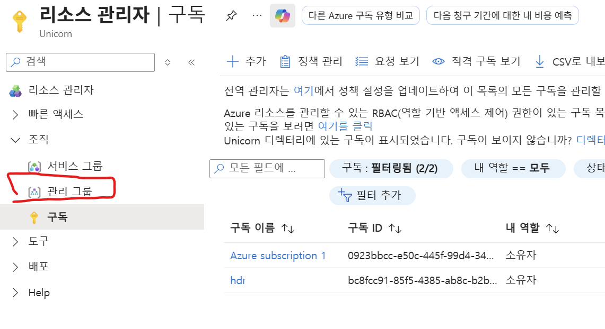

- 관리 그룹 작성 및 구독 배치 
  

## 구독 배치
구독은 각 관리그룹의 말단(Leaf)그룹에만 배치하는 것이 권고사항임   
```
Landing Zones          ← 여기 구독을 직접 두면 ✗
├─ [구독 A]            ← Corp/Online 정책과 별개로 붕 뜸
├─ Corp
│   └─ [구독 B] ✓      ← 리프에 배치 (권장)
└─ Online
    └─ [구독 C] ✓
```

## 관리그룹에 정책 설정  
설정할 관리 그룹 클릭하여 설정합니다. 

- 거버넌스 > 정책 클릭  
  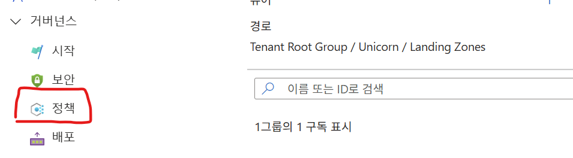
- 정책 할당 클릭
    
- 정책 할당 
    
    
  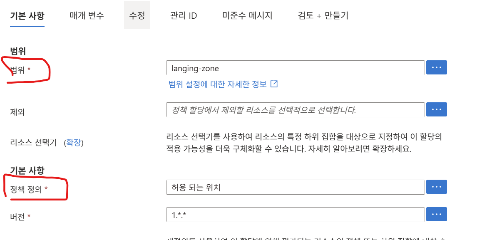  
    
  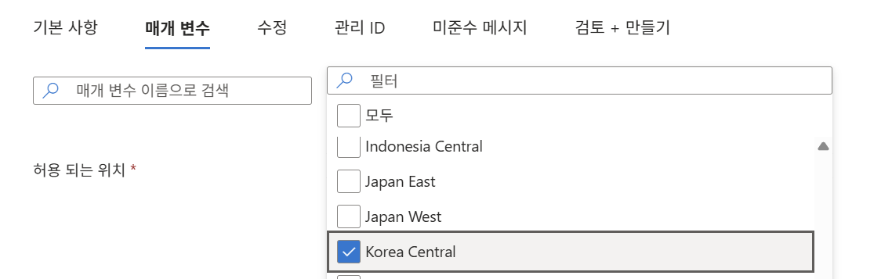   

※ Tag 값 체크 정책 적용 
'Require a tag and its value on resources' 정책 적용 
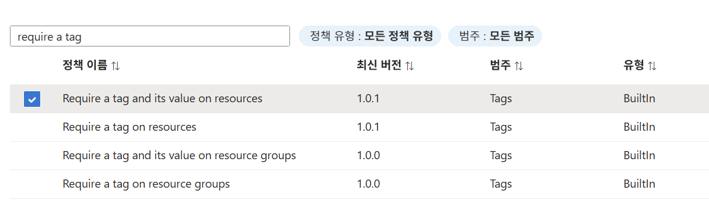
  
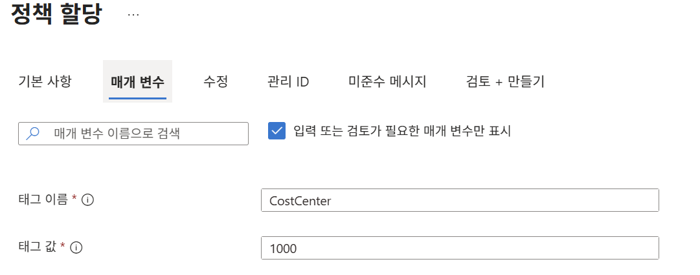  
  
  
  
※ 정책 준수 확인  
   

## 관리그룹에 이니셔티브 할당
이니셔티브는 "규칙 여러 개를 담은 정책 세트"입니다.   

- 이니셔티브 생성 
  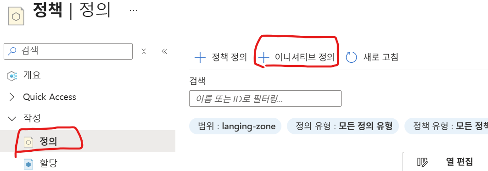  

- 기본사항    
  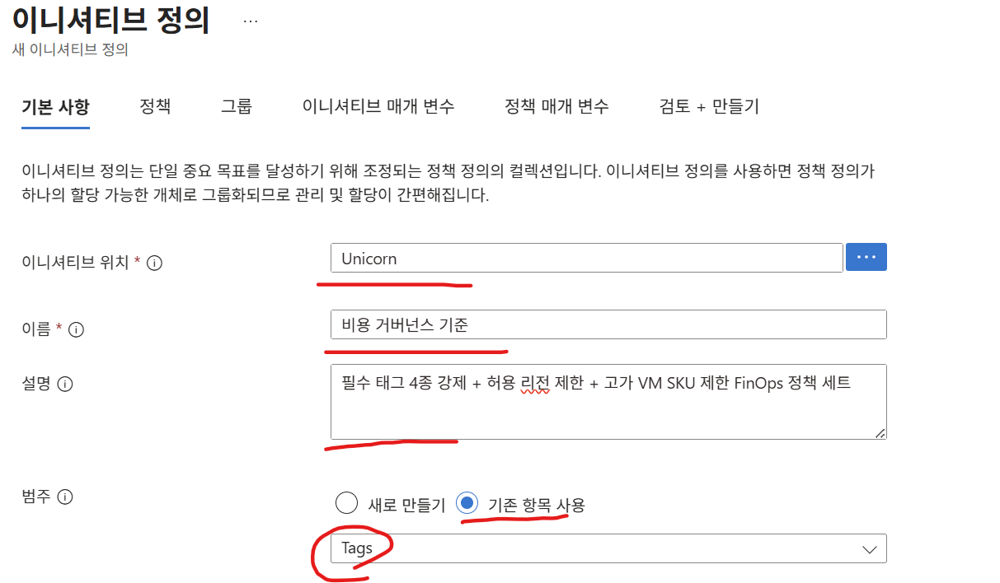   
  
- 정책       
  4가지 Tag 정책 추가 위해 'Require a tag on resource' 4번 추가   
  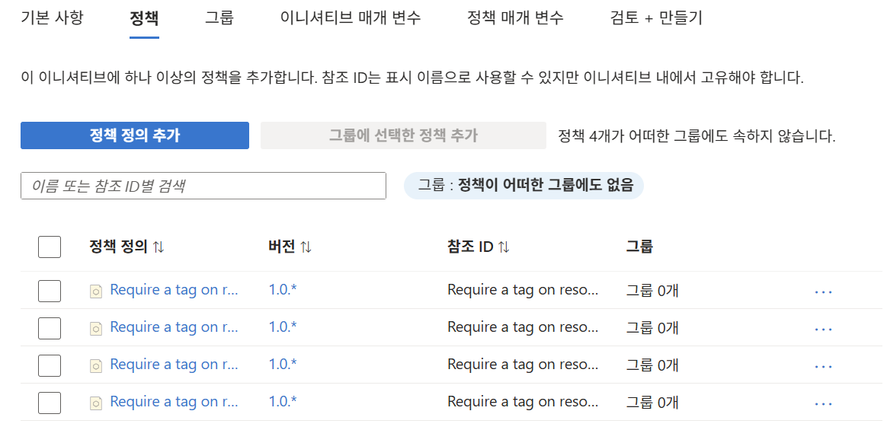  
  Allowed locations와 Allowed virtual machine size SKUs 정책 추가    

- 정책 매개변수  
  TagName: CostCenter, Environment, Owner, Project   
  허용된 위치: Korea Central, Korea South
  허용된 VM SKU: Standard_B2s, Standard_B2ms, Standard_D2s_v5, Standard_D4s_v5

  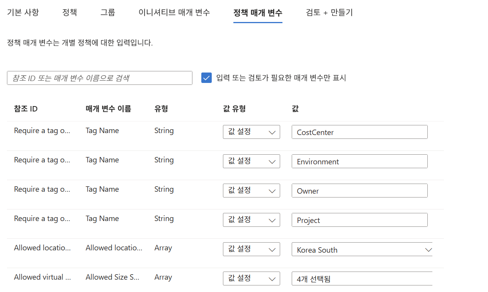  
  
- 이니셔티브 할당    
  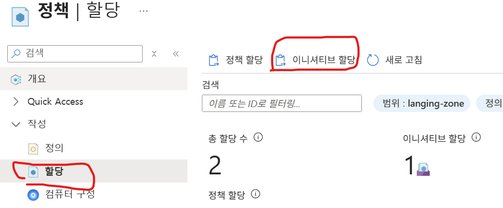   

## 관리그룹에 RBAC(권한제어) 적용   
- Entra ID 진입: 아이콘 없으면 검색바에서 서치   
     
- 좌측에서 그룹 선택 
     
- 새로운 그룹 작성: 보안 그룹으로 작성   
  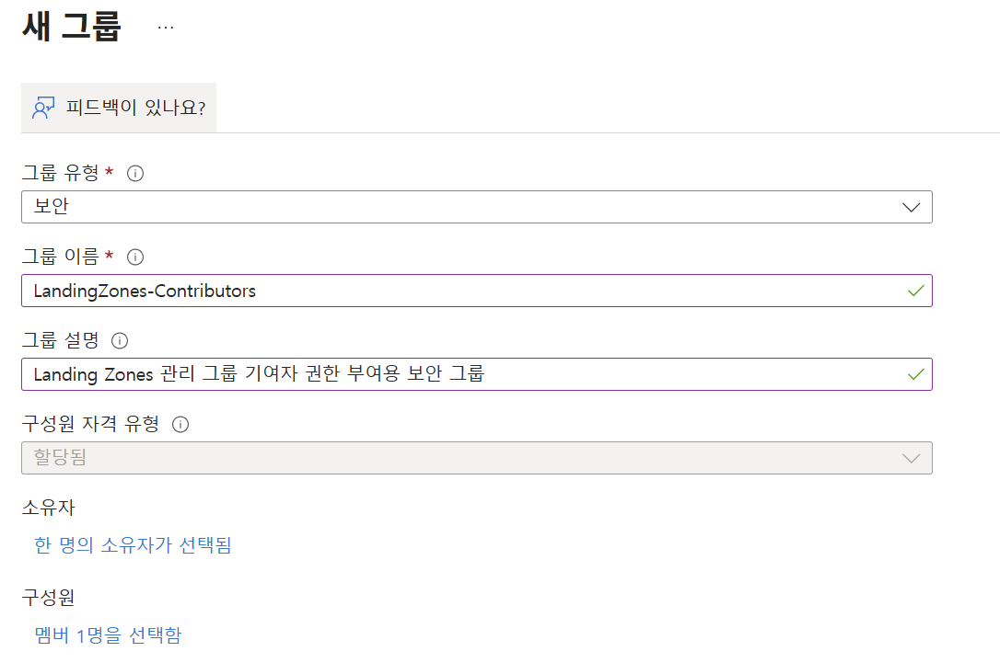  

- 관리그룹에 보안그룹을 '기여자' 권한으로 추가     
  관리그룹에서 권한 부여할 그룹 선택(예: Langing Zones) 후 '액세스 제어' 클릭   
  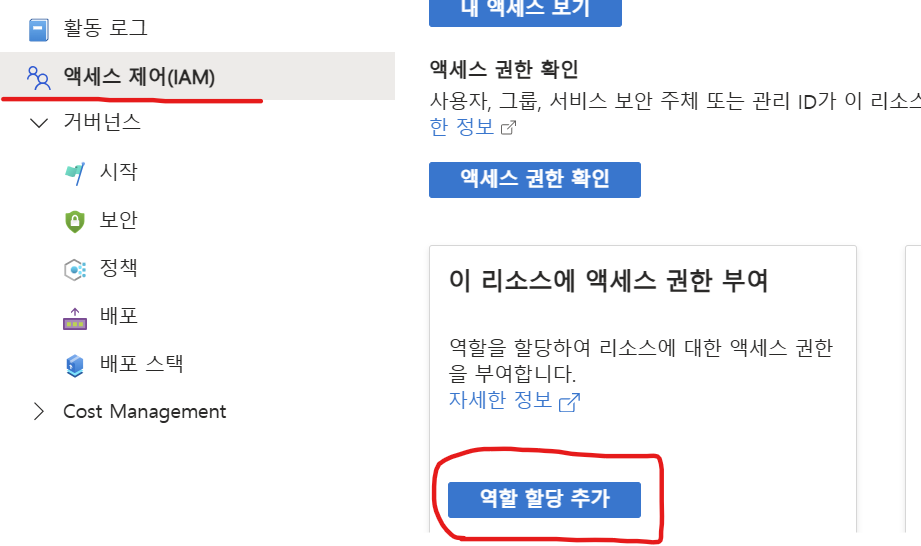  
  
  기여자 권한 선택   
  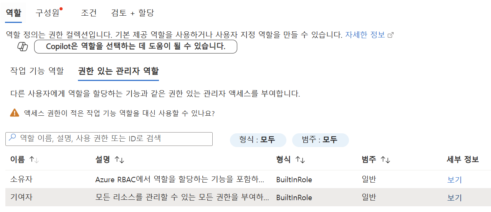  
  
  구성원으로 보안 그룹 지정   
  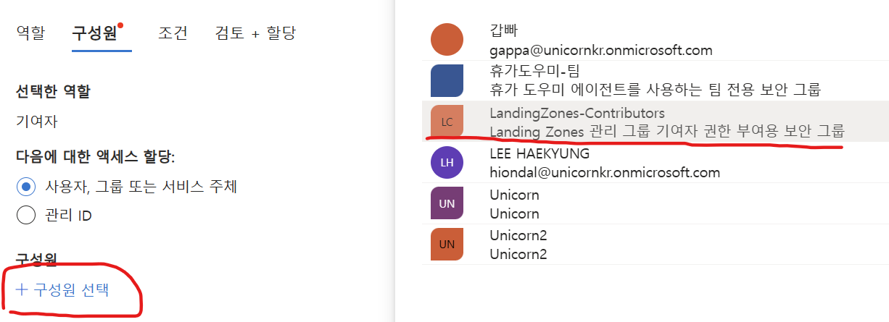  

## 관리그룹별 비용 가시화
관리 그룹을 조직 단위 비용 배분 도구로 쓰는 것은 EA에서만 제대로 됨      
MCA에서는 하위 MG별 비용 조회 불가 → 태그·청구 프로필로 배분해야 함   

## 관리그룹별 예산 수립 및 알림  
관리그룹별 예산 만들기   
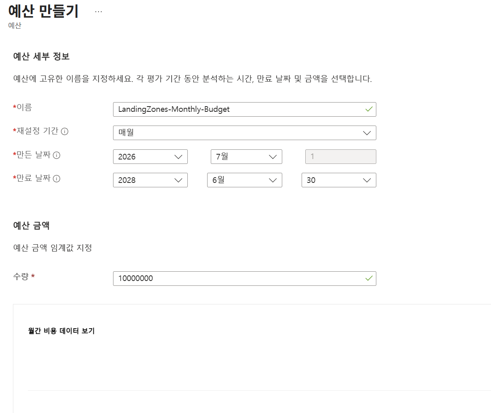   

   

※ 주의: EA 계약에서만 정상 동작함
MCA(MS Customer Agreement)계약에서는 관리그룹별 비용 추적이 잘 되지 않아 예산 초과에 대한 알림이 오지 않을 수 있음   
단, MCA도 최상위 루트그룹(Tenant Root Group)별로는 비용 집계가 되지만 예약(RI)·Savings Plan·Marketplace 구매는 제외되고   
사용량 베이스의 비용만 집계됨   

※ Marketplace 구매
Azure 장터에서 산 "제3자 소프트웨어·솔루션" 비용.   
Azure 기본 사용료(usage)와 달리 "구매" 항목이라 **관리 그룹 비용 집계에서 빠지고**, **청구 계정/프로필에서만 보임**   

---

## 정보 조회 시 관리그룹 변경 방법   
- 비용관리 + 청구로 이동 후 Cost Management 클릭  
     

- 좌측에서 설정 > 구성 클릭  
  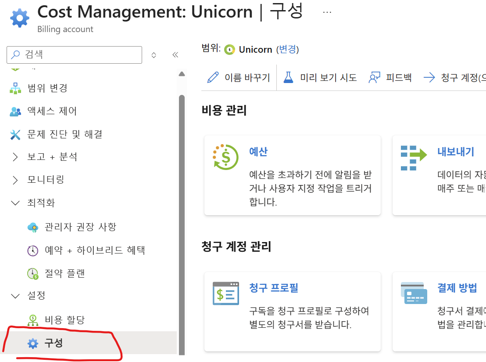

- 상단의 '변경' 클릭
    

- '루트 관리 그룹' 클릭
   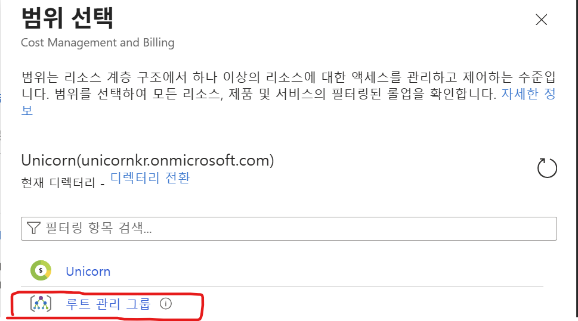   

- 조회하고자 하는 관리그룹 선택   
    

- 다른 메뉴에서도 관리그룹을 변경하면서 정보 조회 가능
  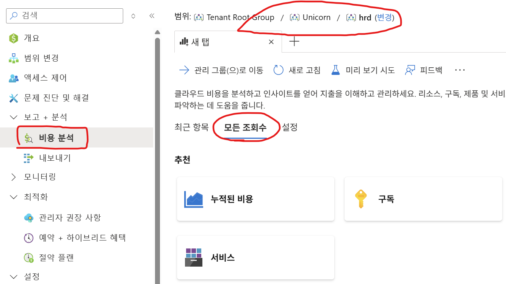   
