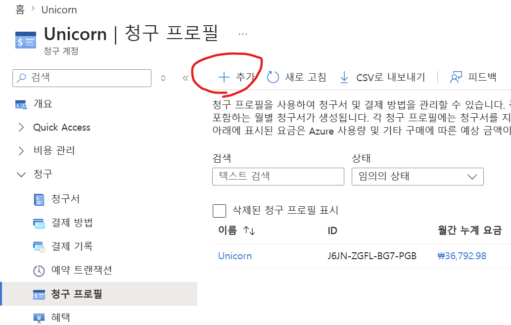
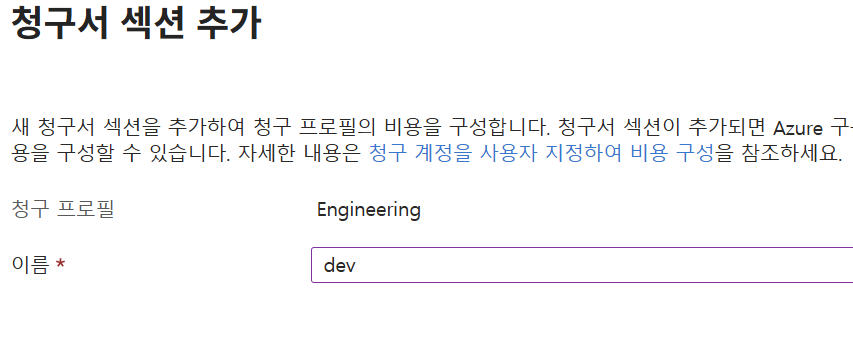
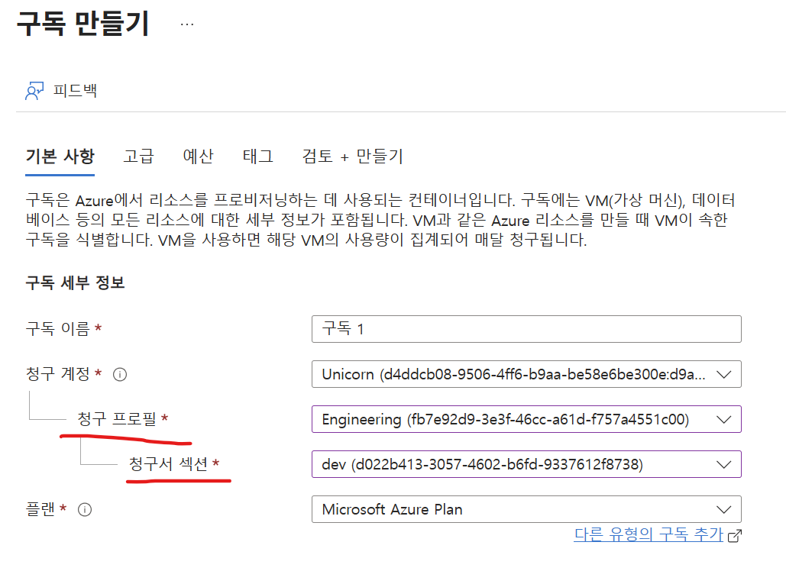
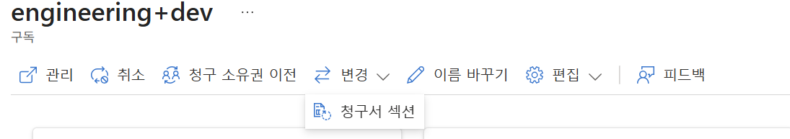
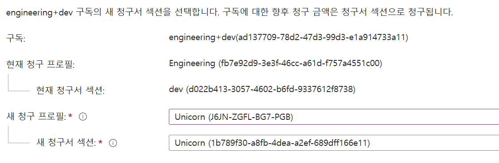

# 청구 프로파일(Billing profile)과 청구서 섹션(Invoice section)

MCA(Microsoft Customer Agreement)일때 BU(Business Unit)별로 청구서를 분리하여 관리하고 싶을 때 Billing Profile을 작성합니다.   
청구서 섹션은 조직 단위가 아닌 환경이나 제품군별로 분리하여 활용할 수 있습니다.   

## 청구 프로파일 작성
디폴트로 Azure 가입 시 이름으로 생성되어 있고 추가 생성할 수 있음
EA계약이 아닌 경우 청구 프로파일과 청구서 섹션을 이용하여 관리 그룹의 "조직 단위" 역할을 대체할 수 있음
  
- 새로운 청구 프로파일(Billing profile) 작성 
  
  
  

- Billing profile 하위에 여러개의 청구서 섹션(Invoice section) 구성   
  동일한 청구 프로파일을 제품군이나 개발 환경 별로 쉽게 비용을 추적하려면 청구서 섹션을 만듦   
  기본 청구서 섹션은 청구 프로파일과 동일한 이름으로 생성되어 있음  

  - 청구 프로파일 클릭 후 '청구서 섹션' 클릭. 상단에서 '추가' 클릭 
        
  - 새로운 청구서 섹션 생성: 예제에서는 환경별로 dev, prod로 작성 
    

- 구독에 청구 프로프일과 청구서 섹션 매핑
  - 구독 작성 시 지정   
      

  - 기존 구독 변경   
    비용관리+청구 -> 제품 + 서비스 > 모든 청구 구독에서 변경할 구독을 클릭  
      
    변경할 청구프로파일과 청구서 섹션 지정     
        

