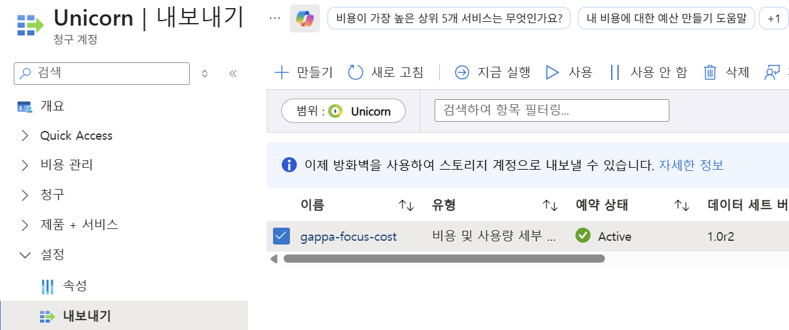
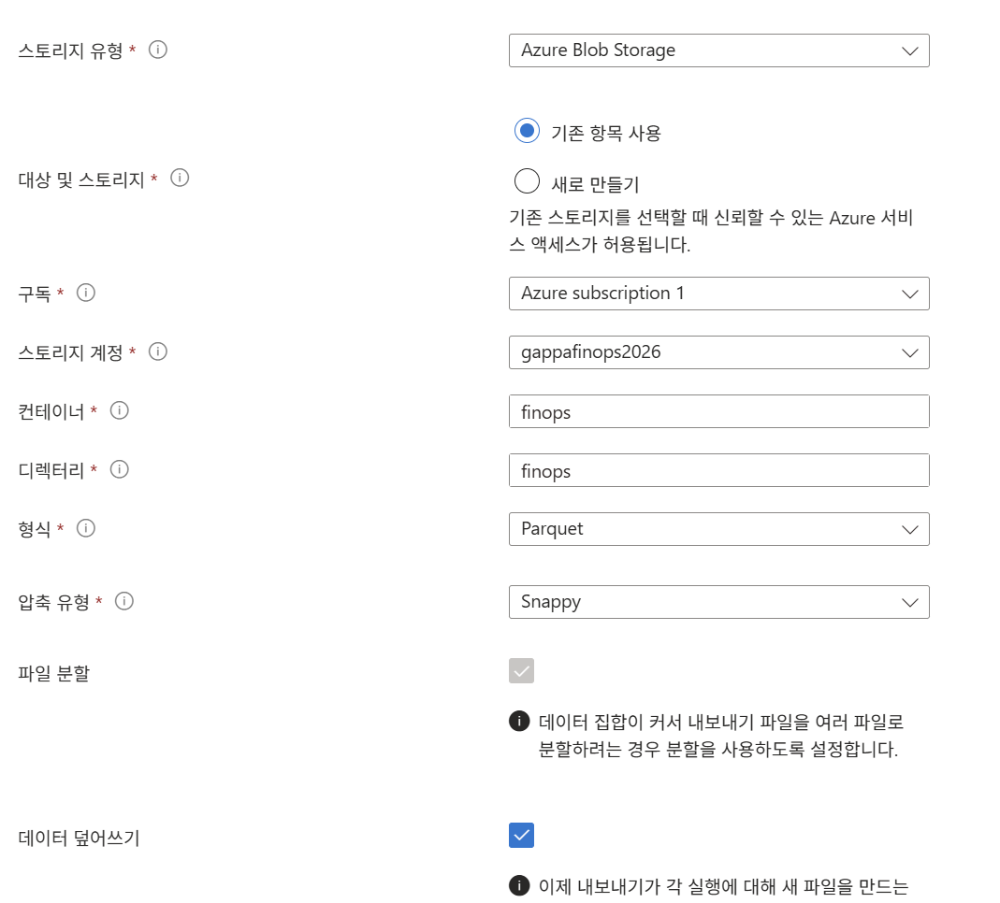

# FinOps Toolkit과 Power BI 사용 비용 분석 

## FinOps팀 관리자용   
- CostManagementConnector.pbix 다운로드   
  https://github.com/microsoft/finops-toolkit/releases   

- Power BI Desktop 다운로드  
  https://www.microsoft.com/ko-kr/download/details.aspx?id=58494&culture=ko-kr

- Power BI Dashboard 실행 후 CostManagementConnector.pbix 열기 
- 데이터 변환 클릭
     

- 매개변수 수정 
      
  - Scope: EA계약은 Enrollment Number, MCA는 Scope ID 형태로 입력  
    - Scope ID 구하기 
      - 비용관리+청구 메뉴 클릭 -> 청구 > 청구 프로필 클릭 -> 조회할 청구 프로필 선택  
      - 선택한 청구 프로필 메뉴에서 설정 > 속성 클릭   
        Scope ID: /providers/Microsoft.Billing/billingAccounts/{청구계정ID}/billingProfiles/{청구프로필ID}  
        ex) /providers/Microsoft.Billing/billingAccounts/d4ddcb08-9506-4ff6-b9aa-be58e6be300e:d9a68dbb-4602-45dc-87c0-5a60fb01c494_2019-05-31/billingProfiles/J6JN-ZGFL-BG7-PGB
           
           
      
  - Type: EA계약은 Enrollment number, MCA 계약은: Manually Input Scope 선택      
       

  - Number of month: 조회할 월 수 입력
  
- 비용 데이터 로드
     

- Tag 변환: Tag 값이 JSON 문자열로 되어 있는 경우 아래와 같이 분할 
  - Tags열이 없어지면 안되므로 복제함     
          
  - 복제한 열에서 JSON 구문분석      
          
  - 구문분석 완료 JSON 버튼 클릭  
         
  - 열 이름 선택: 선택된 이름으로 기존 Tags열을 분할한 열을 생성   
         
  
       

- 데이터 적용: 닫기 및 적용 클릭            
  
     
     

---

## FinOps 부서 담당자용 
### Storage Account 생성  
Premium ADLS Gen2 로 만들어야 함. 앞에 정책에 의해 Korea South에 만들어야 함     
    
  
계층 구조 네임스페이스 사용 선택  
  

정책 준용 위해 태그 입력  
  


### 권한 부여
'Storage Blob Data Reader' 권한 부여

### 내보내기 설정
  
  
  


---

## Claude Code를 이용한 비용 분석    

- PDF로 내보내기   
  

- Claude Code 실행 
- 작업 디렉토리 지정: ~/workspace/finops-handson, 수행 모드: 권한 건너뛰기, Sonnet5 + 높음 선택  
     
- 아래 프롬프트 수행 
  ```
  `prompts/analyze-optimize-cost-powerbi.md` 프롬프트를 수행하세요.   
  ``` 

※ 각 시트별 비용 분석 예시: [Connector(admin)](./cost-analyze-example-admin) · [Storage(dept)](./cost-analyze-example-dept)

---

