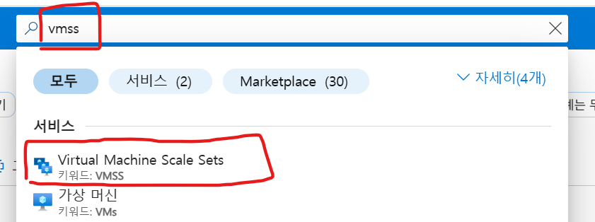
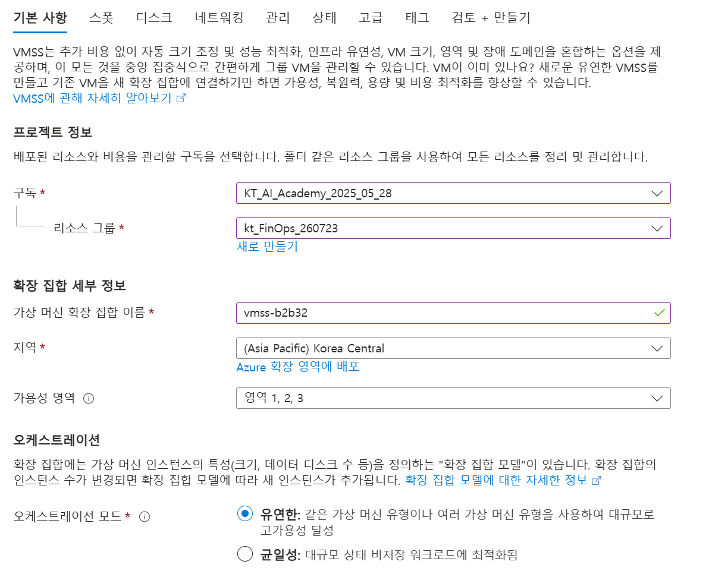
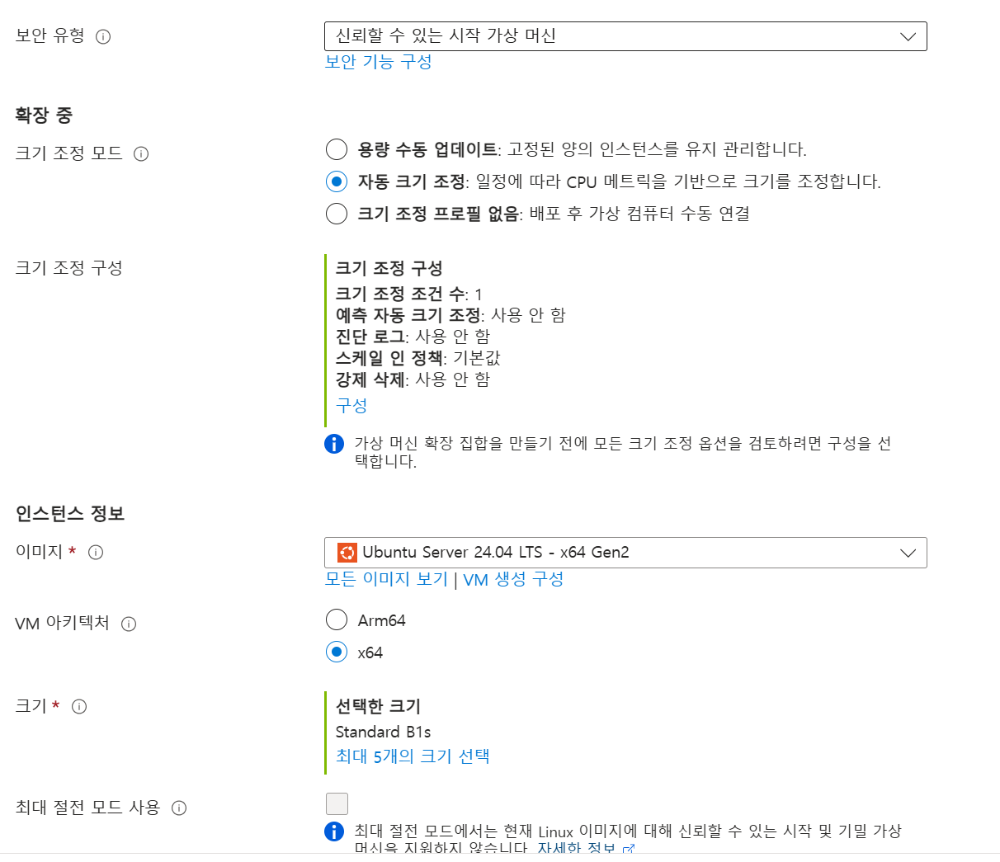
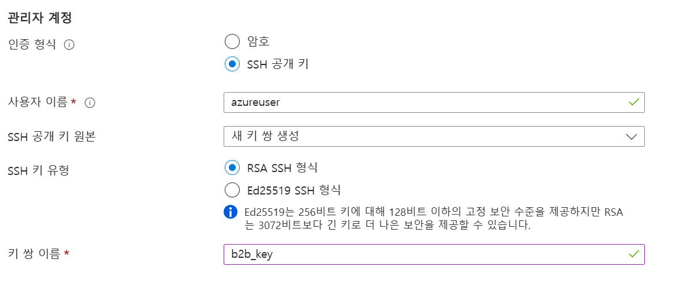
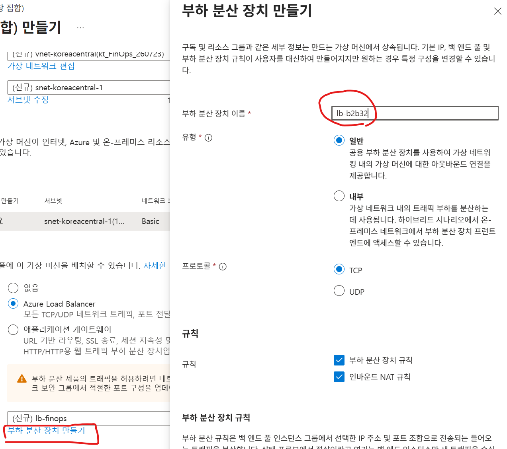

# 정책(Policy) 적용

## Tag 값 체크 정책 적용 
'Require a tag and its value on resources' 정책 적용 

  
  
  
  
  
※ 정책 준수 확인  
   

## 관리그룹에 이니셔티브 할당
이니셔티브는 "규칙 여러 개를 담은 정책 세트"입니다.   

- 이니셔티브 생성 
    

- 기본사항    
     
  
- 정책       
  4가지 Tag 정책 추가 위해 'Require a tag on resource' 4번 추가   
    
  Allowed locations와 Allowed virtual machine size SKUs 정책 추가    

- 정책 매개변수  
  TagName: CostCenter, Environment, Owner, Project   
  허용된 위치: Korea Central, Korea South
  허용된 VM SKU: Standard_B2s, Standard_B2ms, Standard_D2s_v5, Standard_D4s_v5

    
  
- 이니셔티브 할당    
     

## VMSS 작성
정책 적용 확인과 VMSS(Virtual Machine Scale Sets)실습을 위해 VMSS를 생성합니다.   

- vmss를 찾아 메뉴 진입하고 '만들기' 클릭    
     

- 기본 탭  
  - 가상 머신 확장 집합 이름: vmss-{본인ID}     
       
  
  - 확장 중 > 크기 조정 모드: 자동 크기 조정 선택    
  - 인스턴스 정보 > 크기: B시리즈의 B1s 선택    
      

  - 키 쌍 이름: b2b_key  
       

- 네트워팅 탭 
  부하 분산 장치 만들고 선택  
    
 
 