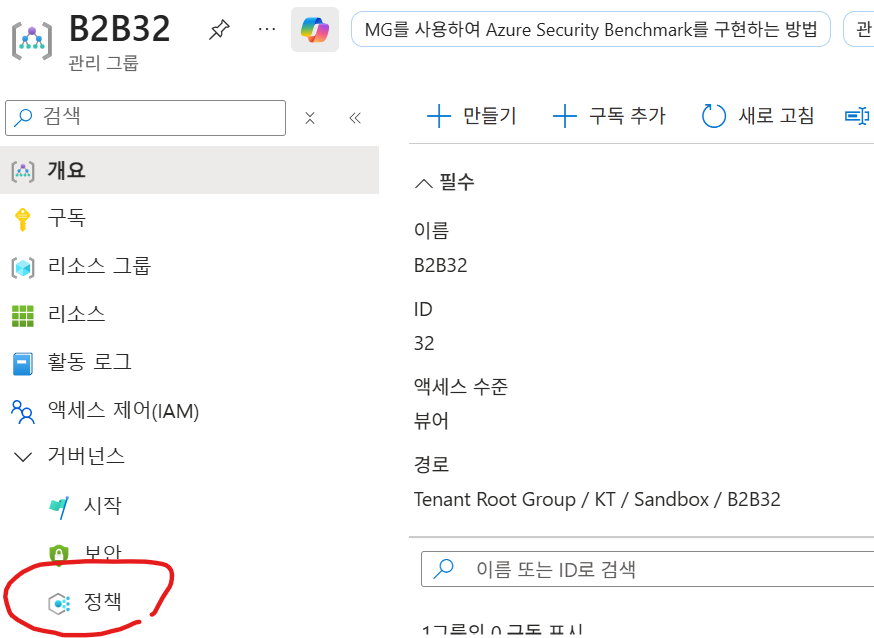

# 정책(Policy) 적용

관리그룹에 정책을 적용하면 그 하위에 있는 구독으로 생성되는 모든 리소스에   
적용됩니다.   

## Tag 값 체크 정책 적용 
CostCenter를 특정값으로 강제하는 정책을 적용해 봅니다.   
본인의 관리그룹으로 이동하여 수행합니다.   
   

'Require a tag and its value on resources' 정책 적용 

  
  
  
  
  
※ 정책 준수 확인  
   

## 관리그룹에 이니셔티브 할당
이니셔티브는 "규칙 여러 개를 담은 정책 세트"입니다.   

- 이니셔티브 생성 
    

- 기본사항    
     
  
- 정책       
  4가지 Tag 정책 추가 위해 'Require a tag on resource' 4번 추가   
    
  Allowed locations와 Allowed virtual machine size SKUs 정책 추가    

- 정책 매개변수  
  TagName: CostCenter, Environment, Owner, Project   
  허용된 위치: Korea Central, Korea South
  허용된 VM SKU: Standard_B2s, Standard_B2ms, Standard_D2s_v5, Standard_D4s_v5

    
  
- 이니셔티브 할당    
     

## 관리그룹 하위에 구독이 없는 경우
- 미리 관리그룹의 구조를 만드는 경우 유용  
- 그 관리그룹에 적용된 정책, 예산, 비용이 적용되는 리소스는 0개임   
- 나중에 구독을 관리그룹 하위로 옮기면 정책, 예산, 비용이 적용됨. 정책 위반시 '준수' 메뉴에서 확인 가능함   
  