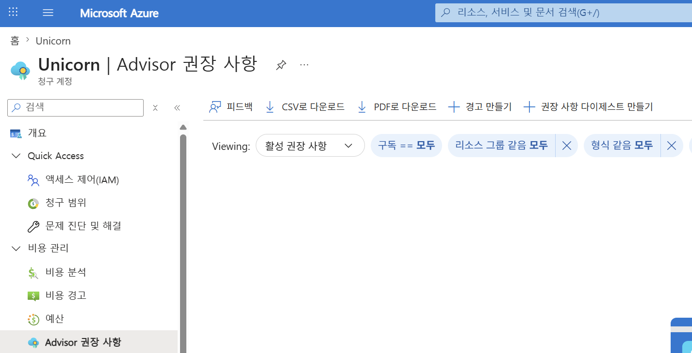
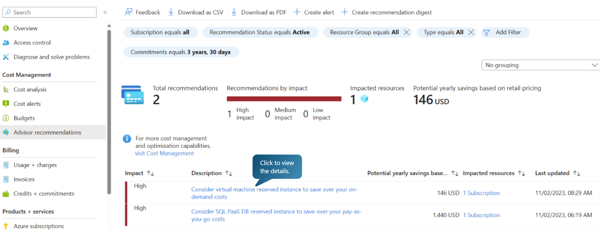
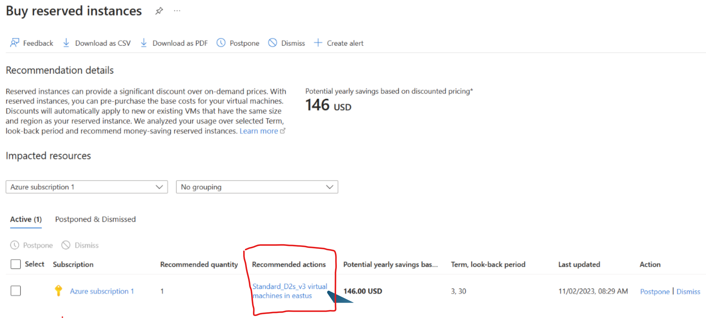
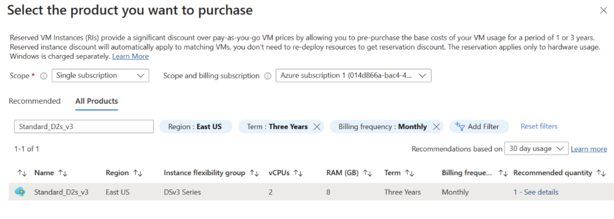

# 비용 최적화

## Advisor 이용 
- 비용관리 + 청구 메뉴 수행 

- 비용관리 > Advisory 권장 사항 클릭 
    

  ※ 권장 사항이 비어 있는 경우     
  - Advisory는 실제 리소스 사용 telemetry를 약 7일 이상 관찰해 "저활용/유휴" 패턴을 찾아냅
  - 대상 리소스: VM, Storage, DB, 네트워크 인프라(게이트웨이, 로드밸런서, 공용IP 등)
  - 대상 리소스 사용이 없는 경우 빈 값 나옮
  

- **예시:**    
  - 권장사항 클릭  
         
  - 추천에 따라 RI(Reserved Instance)나 SP(Saving Plan) 연결 
       
  - 추천 Action에 따른 구매할 리소스 선택
    예제에서는 VM 구매임  
      
      
 