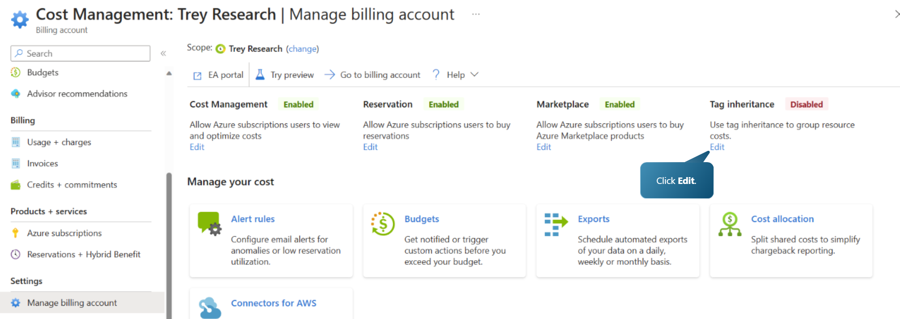
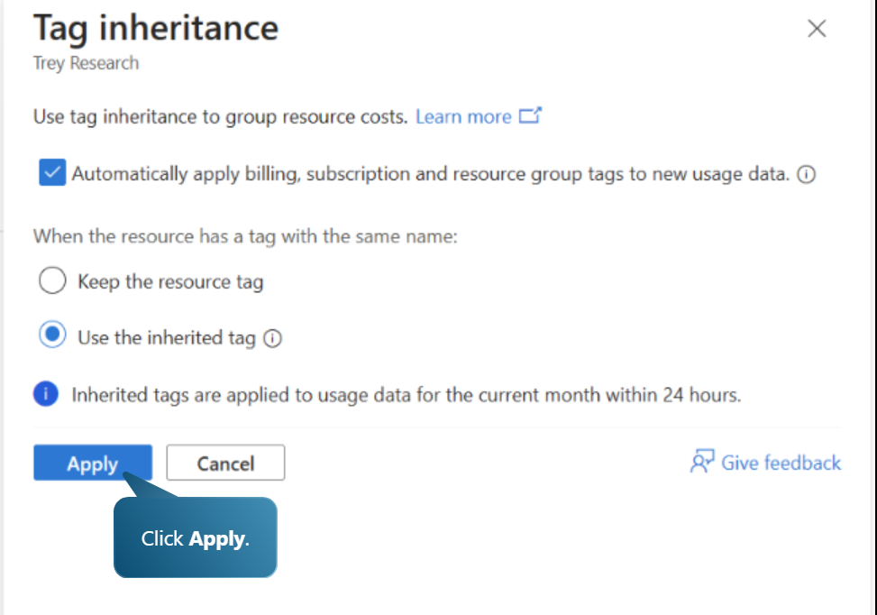
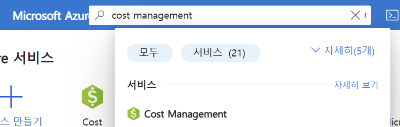
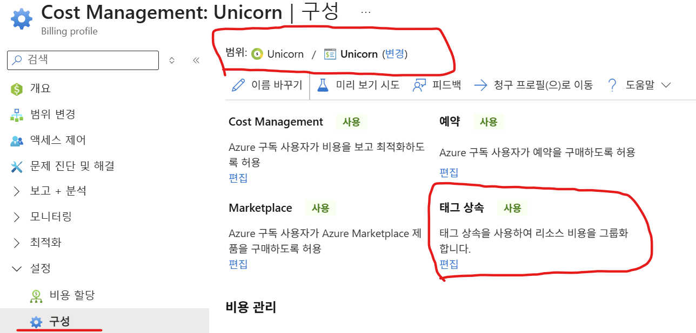
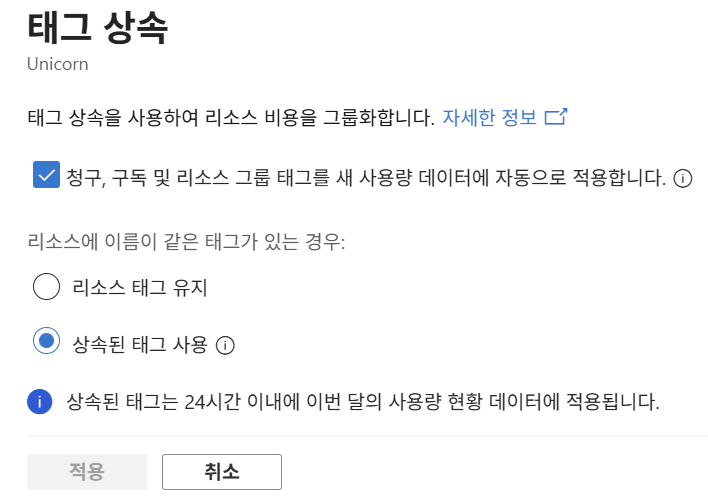
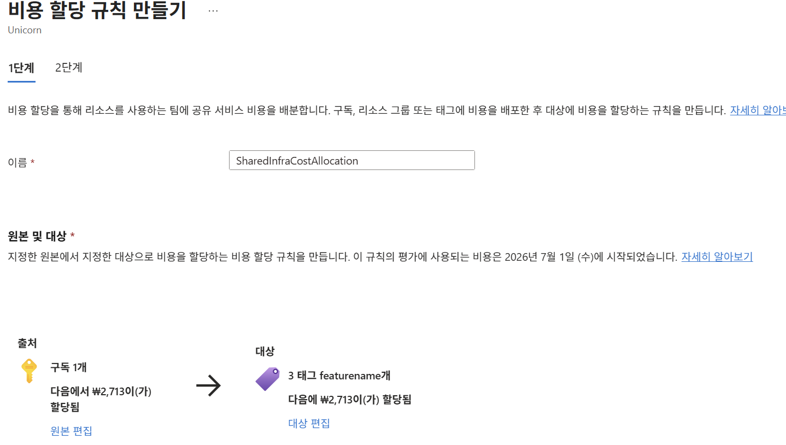
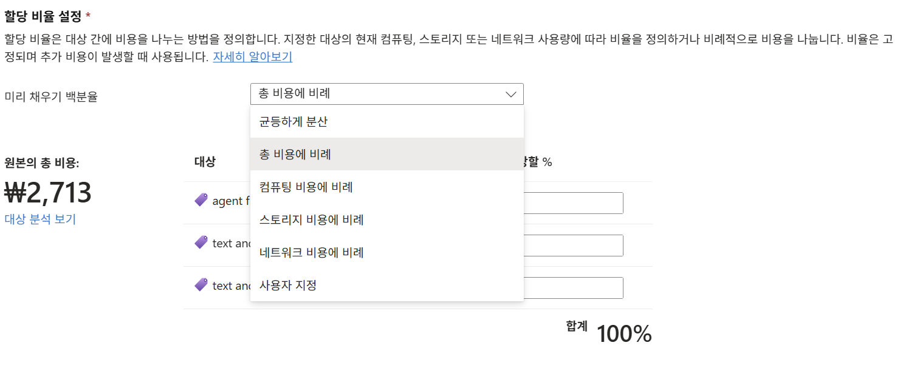
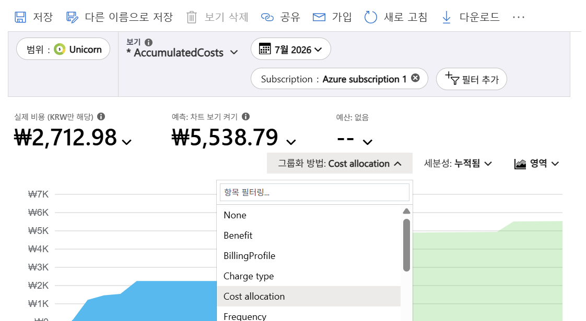

# 태그 상속과 공유 비용 할당

본인 계정이 해당 Billing Account에 Billing account owner 역할을 갖고 있어야 가능 합니다.    
다른 Azure Portal에서 데모하면서 설명만 합니다.   

## 리소스 태그가 아닌 비용 데이터에 태깅하는 방법 -> 태그 상속 기능 
리소스에 태그가 없어도, 상위(구독/RG) 태그를 "비용 데이터"에 자동으로 입혀 비용 배분 누락을 막는 기능.   
태그 강제 정책과 짝으로 쓰면 배분 정확도가 크게 올라감.   

예시)
```
[문제] 개발자가 VM 만들 때 CostCenter 태그를 안 달았음
   → 그 VM 비용이 "미분류"로 빠져 부서 배분 불가

[해결: 태그 상속]
   → 리소스 그룹/구독에 CostCenter=Eng 태그만 있으면
   → 그 안의 모든 리소스 "비용 데이터"에 CostCenter=Eng 자동 상속
   → 개별 리소스에 태그 없어도 배분됨
```

- EA 계약: 빌링 계정 관리에서 지정
     
   
    

- MCA 계약: 청구 프로파일에서 지정
  '비용관리+청구' 메뉴가 아닌 'Cost Management'라는 별도 메뉴를 클릭    
      
    
     
    
    

---

## 공유 비용 할당
비용할당은 구독 또는 리소스그룹 또는 태그에 공유 비용을 분배하는 기능    
이 기능을 이용하여 공유 비용(예: 공유 네트워크·중앙 로깅·방화벽)을 조직별로 할당하여 Showback과 Chargeback을 할 수 있음        
※ Showback과 Chargeback 
- 쇼백 = "얼마 썼는지 보여주기"(돈은 중앙 부담)  
- 차지백 = "쓴 만큼 실제로 청구"(팀 예산 차감)  
- 쇼백으로 시작해 신뢰를 쌓은 뒤 차지백으로 발전하는 것이 정석  
  
| 보고 싶은 것 | 필요한 것 |
|---|---|
| 각 팀이 **자기 리소스**에 쓴 비용 분리 | **태그/구독/RG로 그룹화**만 하면 됨 (할당 불필요) |
| 태그 안 단 리소스까지 누락 없이 분리 | **태그 상속** (할당 아님) |
| **공유 비용**을 팀별로 쪼개서 표시 | **비용 할당(Cost allocation) 규칙 필요** |
   
즉, showback 리포트에서
```
[비용 할당 없이 — 그룹화만]
  A팀 ₩1,000만   ← 자기 리소스만
  B팀 ₩800만
  platform ₩500만  ← 공유비용이 여기 통째로 남음 (분리 안 됨)

[비용 할당 적용 후]
  A팀 ₩1,250만   ← 자기 것 + 공유비용 분담분
  B팀 ₩1,050만
  platform ₩0     ← 공유비용이 각 팀으로 재분배됨
```
  
**한 줄 요약**    
> **팀별 "직접 비용" 분리 = 태그/그룹화로 충분(할당 불필요).** **공유 비용을 팀별로 쪼개 보이게 하려면 = 비용 할당 규칙 필요.**   
> 즉 비용 할당은 "showback을 위한 것"이 아니라 "공유 비용 분배를 위한 것"입니다.

**보완 팁**:   
완성도 높은 showback = **태그 강제(정책)** + **태그 상속(누락 보완)** + **비용 할당(공유비용 분배)** 3종 세트    

Cost Management나 비용관리+청구 메뉴에서 수행할 수 있음    
    

### 예제 시나리오 
````
## 상황 설정

HBT 클라우드에 3개 팀 + 공유 인프라가 있습니다.

| 구독/리소스 | 태그 | 이번 달 직접 비용 |
|---|---|---|
| 커머스팀 리소스 | `Team=Commerce` | ₩1,000만 |
| 미디어팀 리소스 | `Team=Media` | ₩600만 |
| AI팀 리소스 | `Team=AI` | ₩400만 |
| **공유 인프라** (공유 네트워크·중앙 로깅·방화벽) | `Team=Platform` | **₩300만** |
| **합계** | | **₩2,300만** |

문제: 공유 인프라 **₩300만**은 세 팀이 함께 쓰는데 platform 한 곳에 몰려 있음. showback에 이걸 어떻게 나눌까?

---

## STEP 1 — 비용 할당 없이 (그룹화만)

비용 분석에서 `그룹화: Team 태그`

```
Commerce   ₩1,000만
Media        ₩600만
AI           ₩400만
Platform     ₩300만   ← 공유비용이 여기 통째로 남음 ❌
```
→ 각 팀 "직접 비용"은 잘 분리됨. 하지만 공유 ₩300만이 팀에 안 붙음.

---

## STEP 2 — 비용 할당 규칙 생성

```
규칙 이름: Shared-Infra-Allocation
├─ 원천(Source):  Team = Platform  (₩300만)
├─ 대상(Target):  Team = Commerce, Media, AI
└─ 배분 방식:     직접 비용에 비례 (proportional)
```

**비례 배분 계산** (각 팀 직접비용 ÷ 팀 직접비용 합 ₩2,000만):

| 팀 | 직접비용 | 비중 | 공유비 분담 (₩300만 ×비중) |
|---|---|---|---|
| Commerce | ₩1,000만 | 50% | **₩150만** |
| Media | ₩600만 | 30% | **₩90만** |
| AI | ₩400만 | 20% | **₩60만** |

---

## STEP 3 — 비용 할당 적용 후 showback

```
Commerce   ₩1,150만   (직접 1,000 + 공유 150)
Media        ₩690만   (직접 600 + 공유 90)
AI           ₩460만   (직접 400 + 공유 60)
Platform       ₩0     ← 공유비용이 세 팀으로 재분배됨 ✅
─────────────────────
합계        ₩2,300만   (총액 불변)
```

→ 이제 각 팀의 **진짜 총소유비용(TCO)** 이 showback에 나타남. Platform은 0으로 비워짐.

---

## 배분 방식을 바꾸면?

같은 ₩300만이라도 방식에 따라 결과가 달라집니다.

| 방식 | Commerce | Media | AI | 언제 쓰나 |
|---|---|---|---|---|
| **비례**(직접비용) | 150 | 90 | 60 | 큰 팀이 더 부담 (기본 권장) |
| **균등** | 100 | 100 | 100 | 팀 수로 N등분 (단순) |
| **사용자 지정%** | 예: 60/30/10 | 180 | 90 | 30 | 실제 사용 계약·합의 반영 |

---

## 이 예시가 보여주는 3종 세트

```
① 태그 강제(Policy)   → Team 태그가 반드시 붙음 (분류 기반)
② 태그 상속           → 태그 빠진 리소스도 상위 태그로 분류 (누락 방지)
③ 비용 할당           → 공유 ₩300만을 세 팀에 재분배 (공유비 배분)
= 완성된 팀별 showback → (예산 차감까지 하면) chargeback
```

**차지백 시나리오**라면: 위 최종 금액(Commerce ₩1,150만 등)이 각 팀 예산에서 실제 차감됩니다. **쇼백**이라면: 보고만 되고 비용은 중앙이 부담합니다.
````

### 공유 비용 할당 방법
- 이름, 소스 구독/리소스그룹/태그, 타겟 구독/리소스그룹/태그 지정. 소스와 타겟은 복수로 지정 가능   
    
- 비용 배분 방식에 따라 배분   
    
 
- 할당된 비용 보기
  비용분석에서 'Cost allocation'별로 볼 수 있음    
     

