# 비용 분석 대시보드 레포트 — RAG_KT_AI_Academy_June_2025

| 항목 | 값 |
|---|---|
| 범위(Scope) | RAG_KT_AI_Academy_June_2025 (Subscription) |
| 기간 | 2025-07-01 ~ 2026-06-30(지난 12개월) |
| 통화 | KRW |
| 총액 | ₩7,891,230.00 |
| 입력 이미지 | 12개(01~08 그룹화 + S1·A1·A2·T3 필터, 자동 캡처·Mode A) |

---

## 1. 분석 요약 · 시사점 · 권고

### 분석 요약

- 총액 ₩7,891,230(지난 12개월) 중 **Virtual Machines 서비스명 축 61%(₩4,820,248)** 가 최상위를 차지함(이미지 02).
- 그러나 **Resource type 축에서는 microsoft.machinelearningservices/workspaces가 63%(₩4,999,228)로 최대**를 차지함(이미지 04) — 서비스명 축과 리소스유형 축의 최댓값이 불일치하는 축 교차 사례임.
- 리전은 **kr central 단일 리전에 95%(₩7,485,812) 집중**되고 나머지 18개 리전에는 소액 분산됨(이미지 05).
- `project` 태그 기준 **미태깅 비중 42%(₩3,293,115)** 로 배분 사각지대가 큼(이미지 06). 표준태그키(team·workload·CostCenter·env·owner) 중 실제 존재하는 키는 `project` 1개뿐이며, 나머지 키는 조직에 부재함(태그 목록에서 시스템 자동생성 태그만 확인).
- **Pricing Model=OnDemand 100%(₩7,891,230)** — 약정(RI/Savings Plan) 전혀 미적용(이미지 07).
- 월별 소비는 간헐적(bursty) 패턴이며 **11월(₩2,369,492) 피크**, 8·12·1·5·6월은 0에 근접(이미지 01·08).
- 리소스그룹은 **155개로 롱테일 분산**되며, 최상위 `00_ai_rg`가 15%(₩1,186,281)로 소폭 우세(이미지 03).

### 시사점

- **약정 부적합(S1 반증)**: Virtual Machines(온디맨드 최대 서비스)의 월별 소비를 격리한 결과, 7월 ₩1,192,052 ↔ 8월 ₩77,491 ↔ 11월 ₩1,034,718 ↔ 5·6월 ₩0으로 **최대 15배 이상 편차**를 보임. 이는 steady-state가 아닌 명백한 간헐적 소비이므로 **RI/Savings Plan 약정 시 유휴월 낭비 위험이 큼**(가이드 §3.1 반증 조건 충족).
- **배분 전제 확증(A1)**: 미태깅 ₩3,293,582(태그 없음 + 태그 미지원 합산) 중 `00_ai_rg` 단독이 36%(₩1,180,872)를 차지함. `00_ai_rg`는 전체 총액에서도 99.5%가 미태깅 상태로, **배분 사각지대의 최대 원인**으로 확증됨.
- **공유 인프라 확증(A2)**: `00_ai_rg` 내부를 Service name으로 재그룹화한 결과 **Foundry Models(48%)·API Management(29%)·Azure Cognitive Search(20%)** 3개 서비스가 97%를 차지함 — 개별 학습자 리소스가 아닌 **공통 AI 플랫폼(RAG 백엔드) 성격의 공유 인프라**로 판정됨. 명칭(`00_ai_rg`)과 구성이 일치함.
- **급증 원인 기각(T3)**: 11월 Virtual Machines 급증(₩1,034,718)을 Resource group name으로 격리한 결과 **32개 RG로 분산**되며 최상위 RG(`b2b32workspace_test`)도 6.9%(₩71,116)에 불과함. 단일 RG의 배포·이벤트가 아니라 **다수 학습자(RG)가 동시에 실습을 진행한 구조적 확산**으로 판정됨(단일 사건 가설 기각).
- **축 교차 원칙 확인**: Service name 축(Virtual Machines 최대) vs Resource type 축(machinelearningservices/workspaces 최대) 불일치는 **Azure Machine Learning 관리형 컴퓨트 인스턴스가 과금 시 Service name=Virtual Machines로 집계되면서 Resource type만 AML 고유 유형으로 노출**되는 구조적 특성으로 해석됨(가이드 §2.4 주의사항과 정확히 부합하는 실제 사례).
- **거버넌스 공백**: 표준태그키 6종(team·workload·CostCenter·project·env·owner) 중 `project`만 존재하고 나머지는 전무함 → 팀·워크로드·환경 단위 배분 자체가 원천적으로 불가능한 상태.

### 권고 사항

| 우선순위 | 대상 | 조치 | 단계 |
|---|---|---|---|
| 1 | `00_ai_rg`(공유 AI 인프라, ₩1,186,281/15%) | `CostCenter=Shared` 태그 부여 후 사용량 기반(호출 수·토큰) 배분 모델 설계 | Inform(Allocation) |
| 2 | 미태깅 42%(₩3,293,582) | Azure Policy로 `team`·`workload`·`env`·`owner` 태그 필수화 + 상속 정책 적용(현재 `project`만 존재) | Inform(Allocation) |
| 3 | Virtual Machines(₩4,820,248/61%) | 약정 전환 대신 **auto-shutdown·scale-to-0** 등 스케줄링 우선 적용(간헐적 소비 확인) | Optimize(Workload Optimization) |
| 4 | 리소스유형 microsoft.machinelearningservices/workspaces(₩4,999,228/63%) | AML 컴퓨트 인스턴스 유휴 시간 점검 및 컴퓨트 클러스터(오토스케일) 전환 검토 | Optimize(Workload Optimization) |
| 5 | kr central 집중(95%) | 의도된 리전 전략(단일 리전 운영)인지 확인 — 데이터 레지던시·DR 요건과 대조(정리 불필요 시 현행 유지) | Inform |

> **정량 절감액은 본 대시보드만으로 확정 불가**(할인율·중단 허용성 확인 필요) → Optimize 단계에서 실측 후 확정.

---

## 2. 관점별(이미지별) 해설

### 1. 총액·추이 — 가이드 §2.1(None+월별)

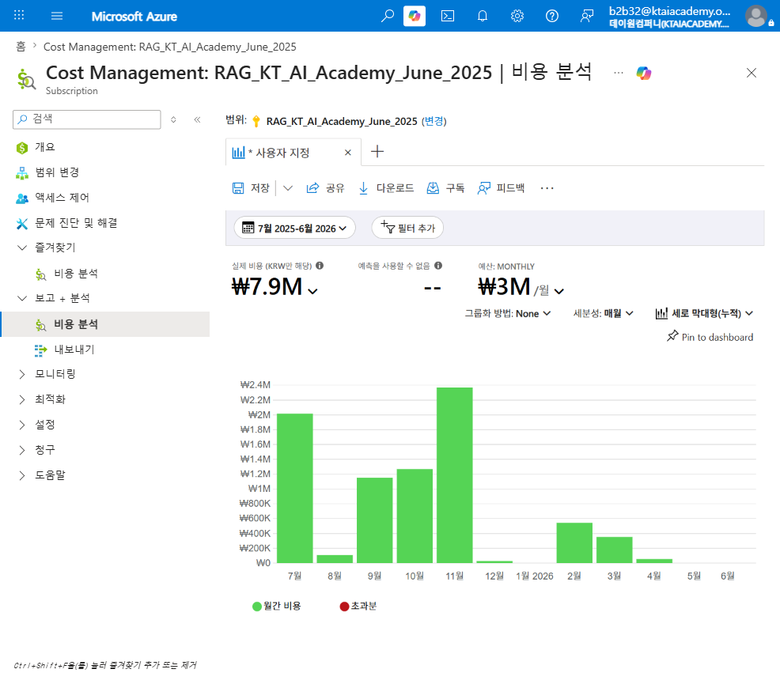

**액션(설정):** 그룹화=None · 세분성=월별 · 차트=세로 막대형(누적)

**관찰:** 총액 ₩7,891,230(2025-07~2026-06). 월별 막대 높이 판독(라벨 미표시, 근사): 7월↑ · 8월↓(근접 0) · 9~10월 중간 · **11월 최고**(이미지 08의 11월 서비스별 행 합산 시 ₩2,369,492) · 12월~1월 근접 0 · 2월 중간 · 3월 낮음 · 4~6월 근접 0.

**해설:** 피크(11월)와 유휴월(8·12·1·5·6월)이 뚜렷이 구분되는 **간헐적(bursty) 소비 패턴**임. Azure 예측(Forecast) 산출이 어려운 소비 유형에 해당하며, 이 패턴 자체가 이후 S1(약정) 가설의 반증 근거로 이어짐. FinOps: Inform(Reporting·Forecasting)

### 2. 서비스별 집중 비용원 — 가이드 §2.2(Service name)

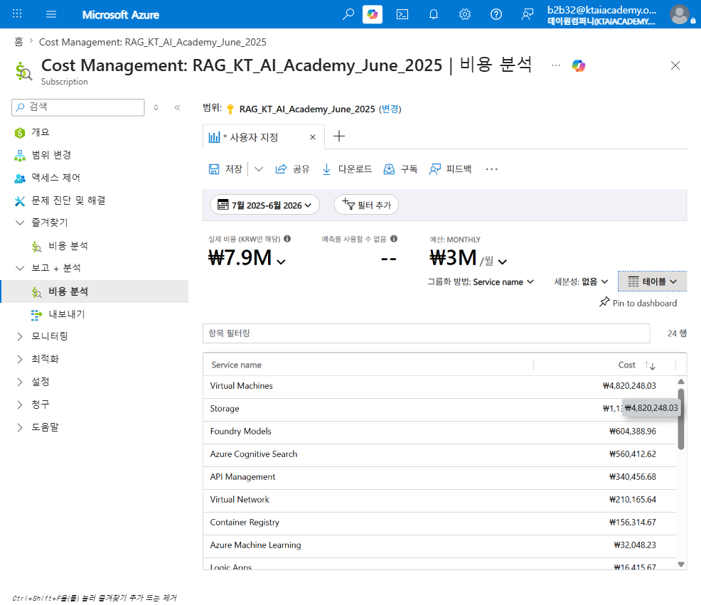

**액션(설정):** 그룹화=Service name · 세분성=없음 · 차트=테이블(24행)

**관찰:** Virtual Machines ₩4,820,248.03(61%) · Storage ₩1,136,858.45(14%) · Foundry Models ₩604,388.96(8%) · Azure Cognitive Search ₩560,412.62(7%) · API Management ₩340,456.68(4%) · Virtual Network ₩210,165.64 · Container Registry ₩156,314.67 · Azure Machine Learning ₩32,048.23 · Logic Apps ₩16,415.67 · SQL Database ₩5,408.02(이하 소액 다수).

**해설:** 상위 1개(Virtual Machines)가 총액의 과반을 차지하는 집중형 구조. 다만 이 서비스명 축의 최댓값이 관리 주체(Resource type)와 일치하는지는 이미지 04와 교차 필요(§2.4). FinOps: Inform(Reporting·Allocation)

### 3. 리소스그룹별 배분 — 가이드 §2.3(Resource group name)

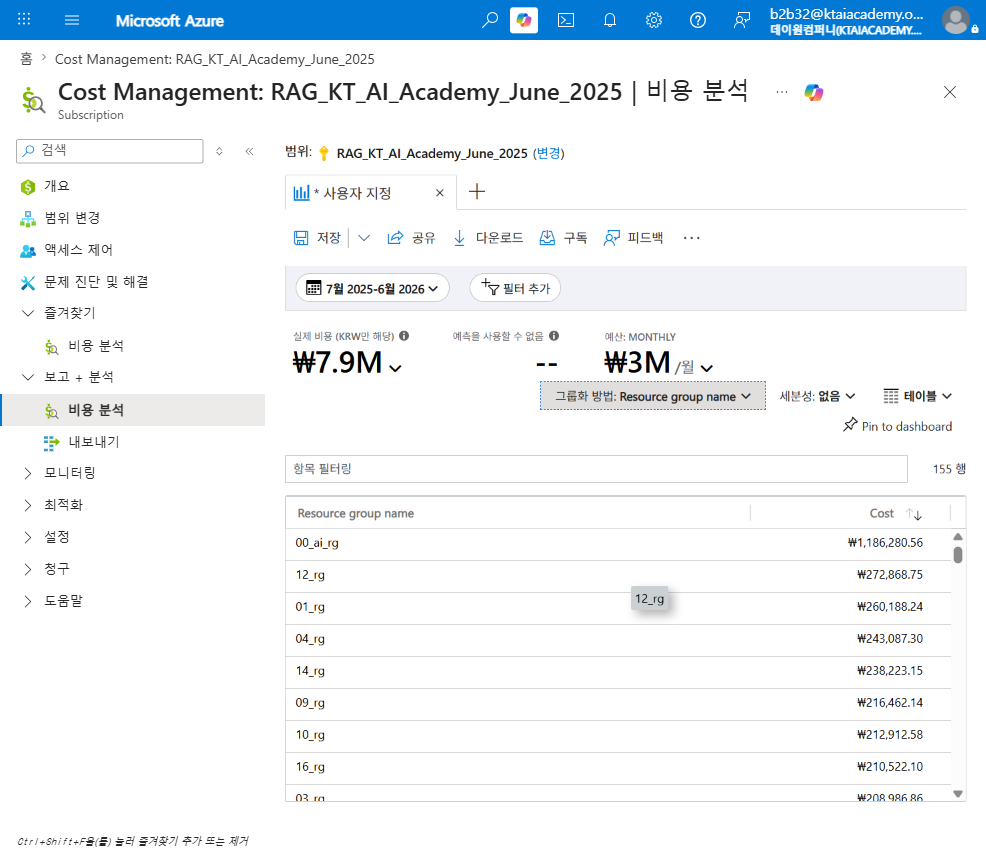

**액션(설정):** 그룹화=Resource group name · 세분성=없음 · 차트=테이블(155행)

**관찰:** `00_ai_rg` ₩1,186,280.56(15%) · `12_rg` ₩272,868.75 · `01_rg` ₩260,188.24 · `04_rg` ₩243,087.30 · `14_rg` ₩238,223.15 · `09_rg` ₩216,462.14 등 155개 RG로 롱테일 분산(상위 이하 유사 규모 반복).

**해설:** `00_ai_rg`가 소폭 우세하나 지배적 단일 RG는 아니며, 나머지는 `NN_rg` 명명규칙의 유사 규모 RG가 다수 반복됨 — 학습자/코호트별 개별 리소스그룹 구조로 추정됨. 155개라는 RG 수 자체가 다수 참가자 환경의 특징으로 해석됨. FinOps: Inform(Allocation)

### 4. 리소스 유형별 원가동인 재확인 — 가이드 §2.4(Resource type)

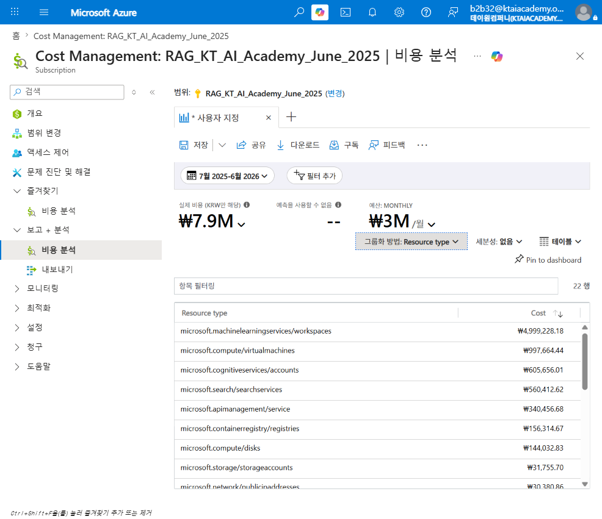

**액션(설정):** 그룹화=Resource type · 세분성=없음 · 차트=테이블(22행)

**관찰:** microsoft.machinelearningservices/workspaces ₩4,999,228.18(63%) · microsoft.compute/virtualmachines ₩997,664.44(13%) · microsoft.cognitiveservices/accounts ₩605,656.01 · microsoft.search/searchservices ₩560,412.62 · microsoft.apimanagement/service ₩340,456.68 · microsoft.containerregistry/registries ₩156,314.67 · microsoft.compute/disks ₩144,032.83 등.

**해설:** **핵심 발견** — 이 축의 최댓값(machinelearningservices/workspaces, 63%)이 이미지 02(Service name 최댓값=Virtual Machines, 61%)와 불일치함. 동일 총액을 두 렌즈로 본 결과이며, Azure Machine Learning 관리형 컴퓨트 인스턴스가 청구 시 Service name 축에서는 "Virtual Machines"로, Resource type 축에서는 AML 고유 유형으로 분류되는 구조적 특성으로 해석됨(가이드 §2.4 주의사항의 실제 재현 사례). FinOps: Inform → Optimize

### 5. 리전별 분포 — 가이드 §2.5(Location)

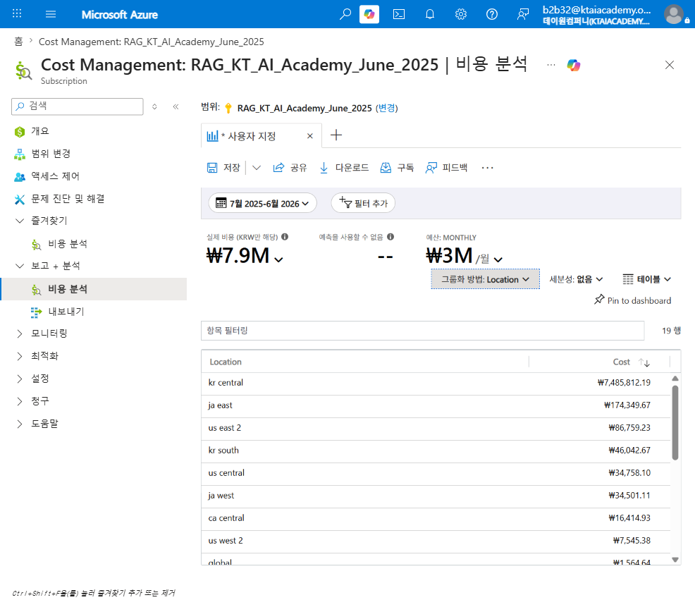

**액션(설정):** 그룹화=Location · 세분성=없음 · 차트=테이블(19행, 전량 판독)

**관찰:** kr central ₩7,485,812.19(95%) · ja east ₩174,349.67 · us east 2 ₩86,759.23 · kr south ₩46,042.67 · us central ₩34,758.10 · ja west ₩34,501.11 · ca central ₩16,414.93 · us west 2 ₩7,545.38 · 이하 10개 리전 각 ₩1,564.64 이하.

**해설:** 단일 리전(kr central)에 압도적 집중이며 나머지 18개 리전은 총액의 5% 미만 소액 분산. 데이터 레지던시 관점에서는 양호하나, 다수 소액 리전은 거버넌스 오버헤드(리전 스프롤, S6) 후보로 기록(규모가 작아 우선순위 낮음). FinOps: Inform

### 6. 태그 기반 배분·거버넌스 — 가이드 §2.6(Tag=project)

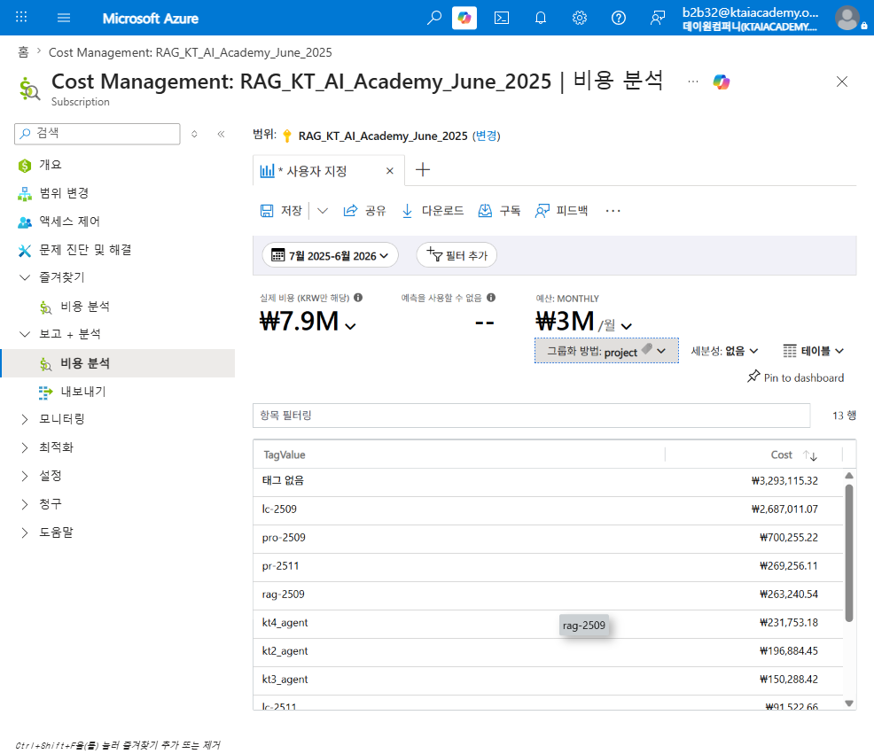

**액션(설정):** 그룹화=Tag(project) · 세분성=없음 · 차트=테이블(13행)

**관찰:** 태그 없음 ₩3,293,115.32(42%) · `lc-2509` ₩2,687,011.07(34%) · `pro-2509` ₩700,255.22 · `pr-2511` ₩269,256.11 · `rag-2509` ₩263,240.54 · `kt4_agent` ₩231,753.18 · `kt2_agent` ₩196,884.45 · `kt3_agent` ₩150,288.42 · `lc-2511` ₩91,522.66 · 이하 소액. 사용 가능한 태그 키 목록 확인 결과 표준태그키(team·workload·CostCenter·env·owner) 중 `project`만 존재, 나머지는 amlresourcetype·openai 등 시스템 자동생성 태그뿐임.

**해설:** 미태깅 비중이 42%로 매우 높아 배분 사각지대가 큼. 값 체계(`lc-2509`, `pro-2509` 등)에 연월(YYMM) 패턴이 포함되어 있어 가이드 §1.2가 경고하는 "명칭에 타이밍 인코딩" 안티패턴 여지가 있음(실제 착수·종료일은 CMDB로 별도 검증 필요). FinOps: Inform(Allocation)

### 7. 요금 모델(커버리지) — 가이드 §2.7(Pricing Model)

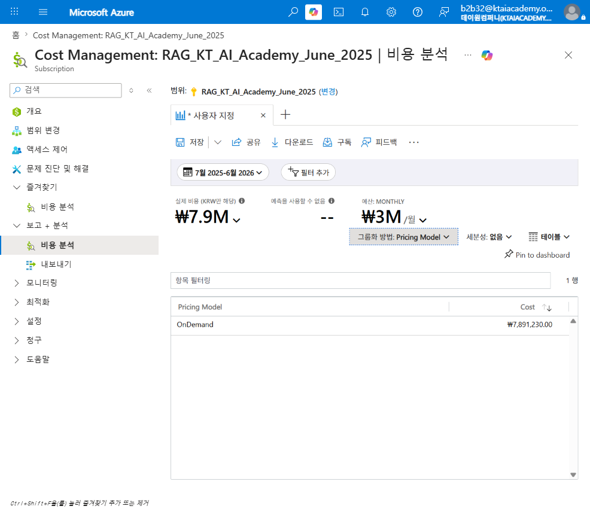

**액션(설정):** 그룹화=Pricing Model · 세분성=없음 · 차트=테이블(1행)

**관찰:** OnDemand ₩7,891,230.00(100%). 예약(Reservation)·Savings Plan·Spot 행 없음.

**해설:** 약정 커버리지 0%. 다만 처방은 소비 패턴에 따라 달라짐(이미지 01의 간헐적 패턴과 교차 필요) — 실제 S1 드릴다운에서 반증됨(관점 9 참조). FinOps: Optimize(Rate Optimization)

### 8. 월별×서비스 이상신호 — 가이드 §2.8(Service name+월별)

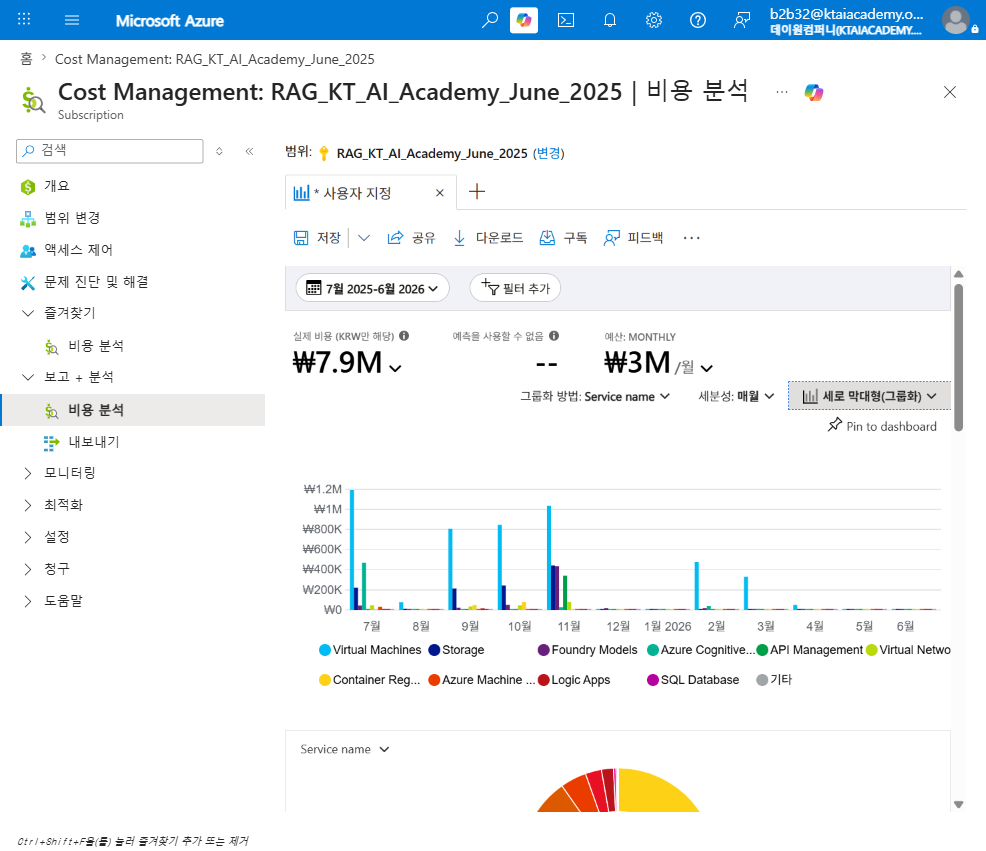

**액션(설정):** 그룹화=Service name · 세분성=월별 · 차트=세로 막대형(그룹화)(110행, 정렬 상위 발췌)

**관찰:** 2025-07 Virtual Machines ₩1,192,051.85(최대) · 2025-11 Virtual Machines ₩1,034,717.75 · 2025-10 VM ₩846,681.05 · 2025-09 VM ₩807,980.48 · 2026-02 VM ₩476,818.66 · 2025-07 Azure Cognitive Search ₩469,929.36 · 2025-11 Storage ₩441,419.62 · 2025-11 Foundry Models ₩435,388.76 · 2025-11 API Management ₩340,456.68.

**해설:** 11월은 VM·Storage·Foundry Models·API Management가 **동시에** 튀는 다중서비스 동반 급증이며, 7월은 VM·Cognitive Search 급증이 두드러짐. 월별만으로는 1회성/지속성 판별이 불가하므로 T3(관점 12)에서 RG 격리로 규명함. FinOps: Inform(Anomaly Management)

### 9. S1 약정 커버리지·여지 격리(반증) — 가이드 §3.1

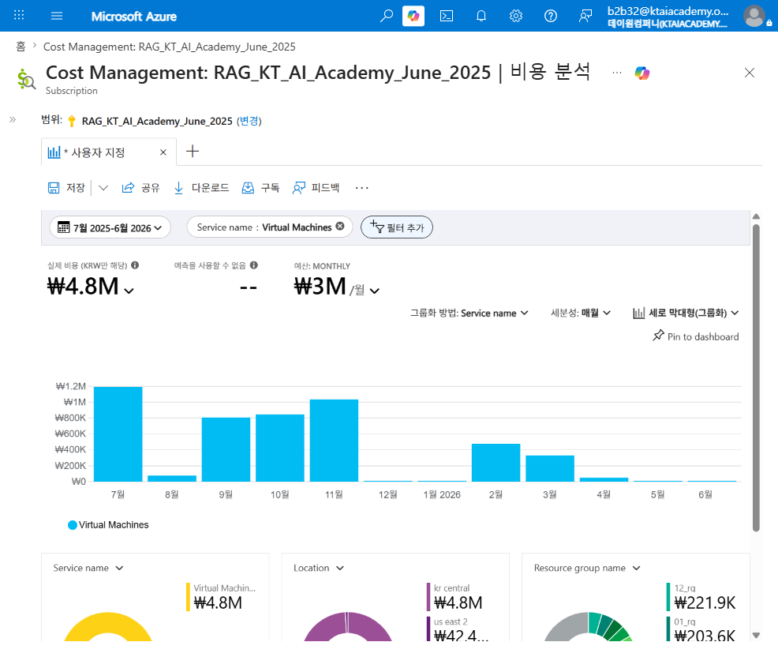

**액션(설정):** 필터=Service name=Virtual Machines · 그룹화=None · 세분성=월별 · 차트=세로 막대형(그룹화)
> 가이드 §3.1 표준 절차는 "필터=Pricing Model=OnDemand → 그룹화=Service name"이나, 이미지 07에서 이미 OnDemand 100%로 확인되어 이 필터는 무의미(전량 통과)함. 따라서 최대 온디맨드 서비스(VM)를 직접 격리해 동일한 검증 목적(steady-state 여부)을 재현함(테오 검증 반영).

**관찰:** VM 총액 ₩4,820,248.03. 월별(이미지 08 교차검증 정확값): 7월 ₩1,192,051.85 · 8월 ₩77,491.40 · 9월 ₩807,980.48 · 10월 ₩846,681.05 · 11월 ₩1,034,717.75 · 12월~1월 ₩0 · 2월 ₩476,818.66 · 3월 ₩330,705.33 · 4월 ₩50,099.13 · 5~6월 ₩0.

**해설:** 최대 서비스(VM)가 온디맨드 100%이지만, 월별 편차가 최대 15배 이상(₩77K~₩1.19M)이며 완전한 0원 달(12·1·5·6월)이 4개월 존재 — steady-state가 아닌 명백한 **간헐적 소비**로 **S1(약정 여지) 가설은 반증됨**. RI/Savings Plan 전환 시 유휴월 낭비가 확실시됨. FinOps: Rate Optimization(반증 확인)

### 10. A1 미태깅 범인 식별(확증) — 가이드 §3.9

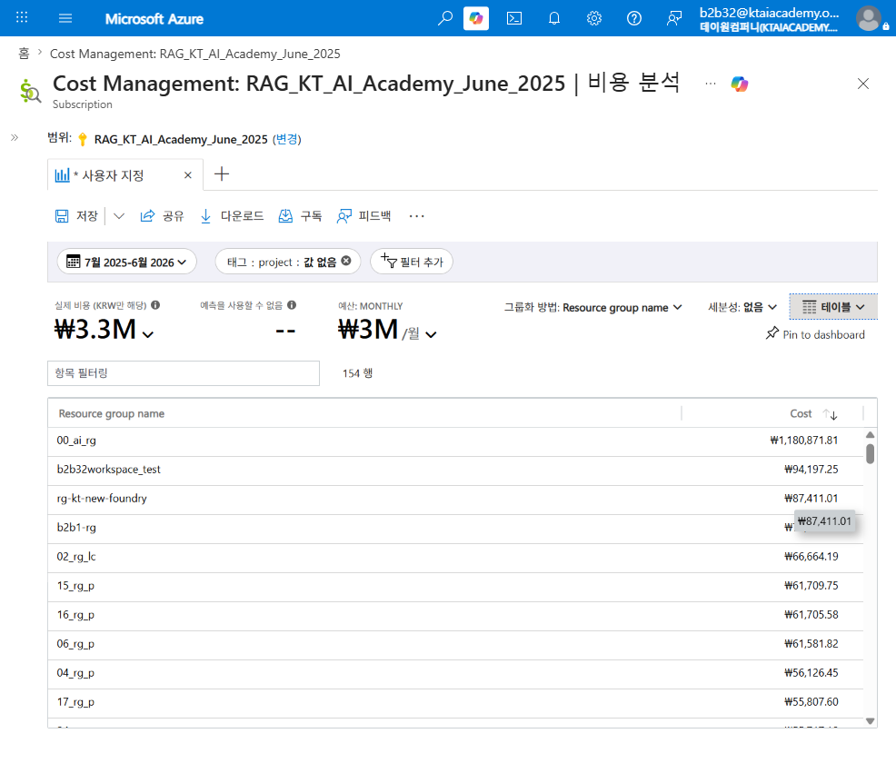

**액션(설정):** 필터=Tag(project)=값 없음 · 그룹화=Resource group name · 세분성=없음 · 차트=테이블(154행)

**관찰:** 미태깅 총액 ₩3,293,582. `00_ai_rg` ₩1,180,871.81(36%) · `b2b32workspace_test` ₩94,197.25 · `rg-kt-new-foundry` ₩87,411.01 · `b2b1-rg` ₩70,375.63 · `02_rg_lc` ₩66,664.19 · `15_rg_p` ₩61,709.75 · `16_rg_p` ₩61,705.58 · `06_rg_p` ₩61,581.82 · `04_rg_p` ₩56,126.45 · 나머지 145개 RG는 소액 롱테일.

**해설:** `00_ai_rg`가 미태깅의 36%로 단일 최대 원인이며, `00_ai_rg` 전체 비용(₩1,186,280.56)의 99.5%가 미태깅 상태임을 확인(관점 3 대비). 나머지는 다수 RG에 얇게 분산된 롱테일로, 조직 차원의 태그 강제 정책(`team`/`workload`/`env` 등) 부재가 근본 원인으로 확증됨. FinOps: Allocation(확증)

### 11. A2 공유 리소스 구성(확증) — 가이드 §3.10

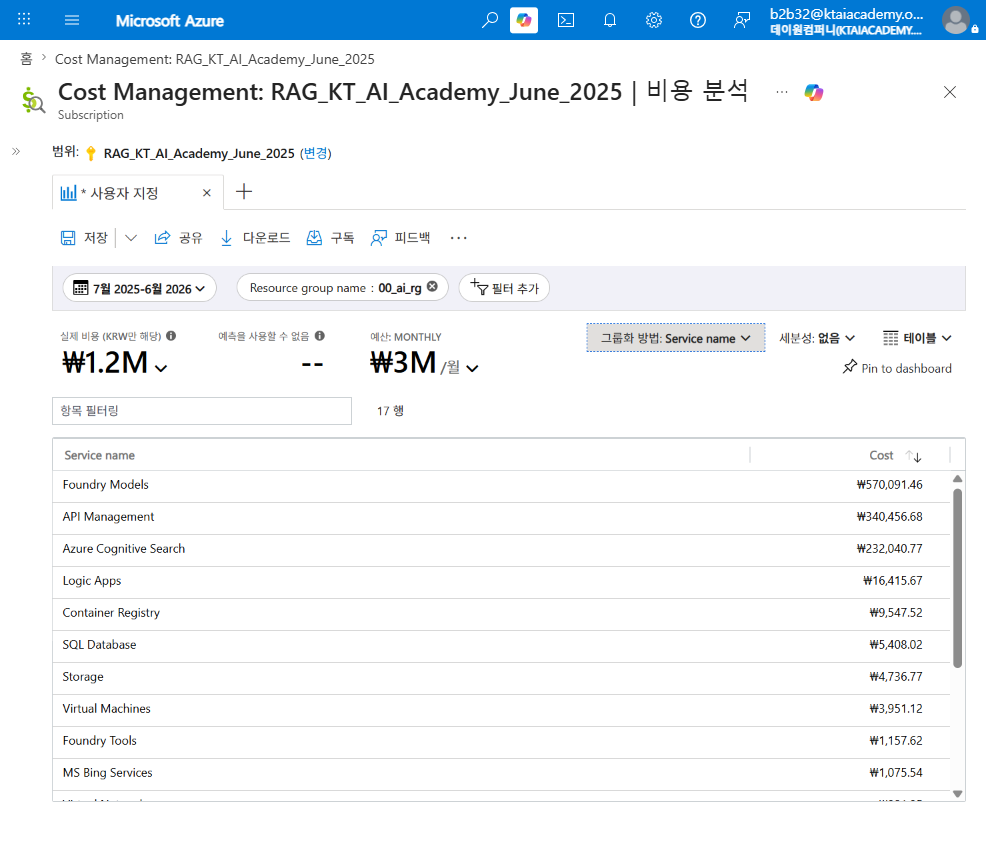

**액션(설정):** 필터=Resource group name=00_ai_rg · 그룹화=Service name · 세분성=없음 · 차트=테이블(17행)

**관찰:** Foundry Models ₩570,091.46(48%) · API Management ₩340,456.68(29%) · Azure Cognitive Search ₩232,040.77(20%) · Logic Apps ₩16,415.67 · Container Registry ₩9,547.52 · SQL Database ₩5,408.02 · Storage ₩4,736.77 · Virtual Machines ₩3,951.12 · 이하 소액.

**해설:** 상위 3개 서비스(Foundry Models·API Management·Cognitive Search)가 97%를 차지하며, 모두 **공통 AI 플랫폼(RAG 백엔드) 성격의 공유 인프라**임이 확인됨. 개별 학습자 워크로드(VM)는 이 RG 내에서 0.3%에 불과 — `00_ai_rg`=공유 인프라 가설이 확증됨. `CostCenter=Shared` 태그 부여 후 호출량 기반 배분 모델 설계가 필요함. FinOps: Allocation(Shared Cost, 확증)

### 12. T3 급증 격리(기각) — 가이드 §3.14

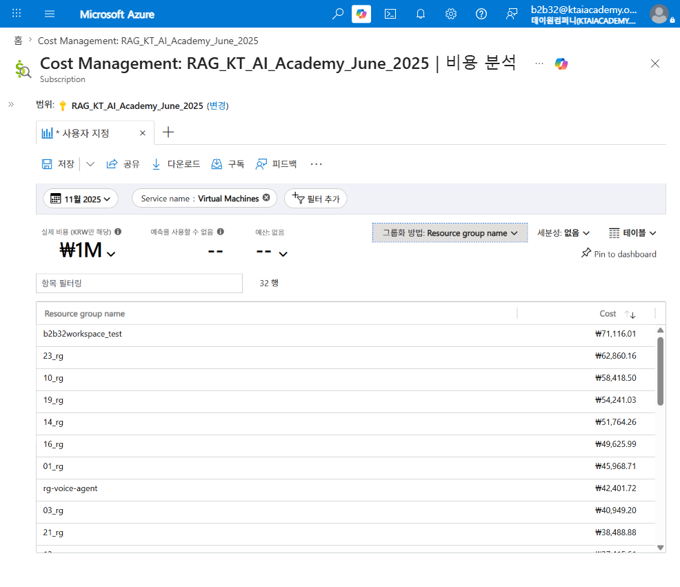

**액션(설정):** 필터=Service name=Virtual Machines · 기간=2025년 11월(피크월 단월) · 그룹화=Resource group name · 세분성=없음 · 차트=테이블(32행)

**관찰:** 11월 VM 총액 ₩1,034,717.75(기간 필터로 정확 재확인). `b2b32workspace_test` ₩71,116.01(6.9%, 최상위) · `23_rg` ₩62,860.16 · `10_rg` ₩58,418.50 · `19_rg` ₩54,241.03 · `14_rg` ₩51,764.26 · `16_rg` ₩49,625.99 · `01_rg` ₩45,968.71 · `rg-voice-agent` ₩42,401.72 · `03_rg` ₩40,949.20 · `21_rg` ₩38,488.88 · 이하 22개 RG 소액 분산.

**해설:** 단일 RG가 전액을 차지하는 패턴(가이드 기대 시나리오)이 아니라 **32개 RG로 고르게 분산**됨(최상위도 6.9%뿐). 11월 VM 급증은 특정 배포·게이트웨이 가동 등 1회성 이벤트가 아니라, **다수 학습자(RG)가 같은 시기에 동시 실습(VM 사용 증가)한 구조적 확산**으로 판정 — **T3(단일 RG 급증) 가설은 기각**됨. FinOps: Anomaly Management(기각)

---

## 부록 · 데이터 정합성 노트

- 06(미태깅 42%, ₩3,293,115.32)과 10/A1(미태깅 필터 총액 ₩3,293,582)의 차이(₩466.91)는 "태그를 사용할 수 없음" 범주(₩466.91)가 A1 필터에는 포함되고 06 단독 "태그 없음" 행에는 별도 표기된 데이터 정합 결과로, 창작·오류가 아닌 Azure 포털 태그 분류 체계상 정상 차이임.
- 01(월별 총액)의 정확 수치는 세로 막대형 차트에 라벨이 없어 근사 판독이며, 11월만 이미지 08(Service name×월별 테이블)의 11월 행 전체를 합산(₩1,034,717.75+441,419.62+435,388.76+340,456.68+80,101.00+26,894.98+9,091.39+1,283.38+93.71+22.19+17.83+5.13+0+0=₩2,369,492.42)해 정확값을 교차검증함. 그 외 월은 근사 판독임을 명시함(창작 금지 원칙 준수).
- 02·04·05·06·07의 표 수치는 이미지에서 직접 판독한 정확값이며, 03·04·08·10·12는 전체 행 수 대비 상위 일부만 캡처됨(각 섹션에 행 수 명시). 미표시 하위 행은 소액이며 상위 판독값의 결론(집중도·확증/기각)에 영향 없음.
