# 라이브 비용 분석 대시보드 실습 — RAG_KT_AI_Academy_June_2025

> 기준 프레임워크: `reports/260718/all-subscriptions/cost-analysis.md`
> (FinOps Toolkit Power BI "Cost Management connector report", 16관점)를
> **Azure Portal 네이티브 Cost analysis**에 옮겨 적용한 실습 기록임.
> **리포트 = 완성형 예시 / 포털 = 내 실데이터**로 프레이밍하며, 수치 재현이 아닌
> **분석 렌즈(각 축에서 무엇을 읽는가)** 전이가 목표임.

| 항목 | 값 |
|---|---|
| 범위(Scope) | `RAG_KT_AI_Academy_June_2025` 구독 (단일 구독) |
| 기간 | 2025-07 ~ 2026-06 (지난 12개월) |
| 통화 | KRW(₩) |
| 실제 비용(12개월) | ₩7,891,230 (100% 온디맨드) |
| 월 예산 | ₩3M / 월 (초과 월 없음) |
| 예측 | 사용 불가(간헐적 소비로 추세 산출 불가) |
| 로그인 | b2b32@ktaiacademy.onmicrosoft.com (데이원컴퍼니 테넌트) |
| 작성일 | 2026-07-19 |

---

## 📌 분석 요약 · 시사점 · 권고 (Executive Summary)

### 분석 요약
- **총액·성격**: 지난 12개월 실제 비용 **₩7,891,230**, **100% 온디맨드**(약정·Spot 0). 월 예산 ₩3M **초과 월 없음**.
- **소비 패턴**: **간헐적(bursty)** — 수업 일정형. 피크 **2025-07·2025-11(각 ≈₩2M)**, 유휴월 다수, **최근 3개월(2026-04~06) 소강**. 그래서 **예측 사용 불가**.
- **원가동인(같은 비용, 두 렌즈)**: 서비스명 축=**VM ₩4.8M(61%)**, 리소스유형 축=**ML 워크스페이스 ₩5.0M(63%)**. ML 컴퓨트가 VM 미터로 과금되므로 둘은 **상충이 아니라 동일 비용의 조직/서비스 두 관점**. 실체는 **RAG/AI 학습 GPU 워크로드**. 필터로 좁히면 **단일 프로젝트 `lc-2509`의 ML 학습 ₩2.67M(전체 ~34%)** 이 최대 동인(단, **2025-09~11 소비 후 이미 종료** — 현재 부담 아님, 코호트 버스트 패턴).
- **집중도**: 서비스 VM+Storage **~75%**, 리전 **kr central ~95%**, RG **`00_ai_rg` 15%** + 번호 팀RG(01~16, 균등).
- **배분**: `project` 태그 **미태깅 42%(₩3.29M)**. 조직 배분 태그 체계 사실상 부재. 필터 확인 결과 미태깅 최대 주범은 **공유 인프라 `00_ai_rg` ₩1.18M(그 RG의 ~99.5%)** — 공유비용 배분 문제. (ML 컴퓨트는 89% 태깅됨)
- **최적화 권장(Advisor)**: 이 시점 **활성 비용 권장 0건**(= 최적이라는 뜻은 아님). 원인은 **최근 소강 영향 가능성(가설)** — 구조적 낭비는 별도 존재.

### 프레임워크 전이 요약 (리포트 → 라이브)
| 리포트 핵심 포인트 | 라이브 결과 | 전이 판정 |
|---|---|---|
| 집중 비용원(소수 구독/서비스) | VM+Storage 75%, kr central 95% | ✅ 렌즈·결론 동일 |
| 온디맨드 편중(98%) | **100% 온디맨드** | ✅ 더 극단 |
| 약정 커버리지 낮음 → **RI/SP 구매** | 간헐적 → **RI 부적합, Spot은 조건부 후보** | ⚠️ **처방 반전** |
| 배분 사각지대(미배정) | **미태깅 42%** | ✅ 동일(더 큼) |
| 원가동인 단일 집중 | 동일 비용을 Service축·Resource유형축 **두 렌즈**로 | ➕ **축 교차의 중요성** |
| 이상 급증 탐지 | 7월(Search)·11월(APIM/Storage/Foundry) 일회성 | ✅ 동일 |

> **한 줄 교훈: 분석 "렌즈"는 그대로 전이되지만, "처방"은 내 데이터의 소비 패턴으로 재판단해야 함.**

### 시사점
1. **처방은 데이터로 재판단**: 리포트의 steady-state·RI 권장을 그대로 이식하면 오답. 간헐적 소비엔 **auto-shutdown/scale-to-0가 안전한 1순위**, Spot은 **중단 허용성(체크포인트) 확인 후 조건부 후보**.
2. **그룹화 축의 상보성**: Service name 축(VM)과 Resource type 축(ML 워크스페이스)은 **동일 비용의 다른 렌즈**(ML 컴퓨트가 VM 미터로 과금). 한 축만 보면 원가 맥락을 놓침 → **두 축 교차 필수**.
3. **배분 거버넌스 공백**: 미태깅 42% → 비용 절반이 프로젝트로 귀속 불가, showback/chargeback 신뢰 저하.
4. **Advisor 의존 위험**: 소강기 "권장 0건"을 "최적"으로 오독 금지. **구조적 낭비(Spot 미사용·고아 리소스·미태깅)는 수동 분석으로만 발굴**.
5. **예산 통제는 양호, 급증은 이벤트성**: 초과월 0이나 급증이 프로젝트 착수와 연동 → **예산 알림 + 태그 추적**으로 조기 감지.

### 권고 사항
| 우선순위 | 대상 | 조치 | 예상효과 | 단계 |
|---|---|---|---|---|
| 1 | ML 학습 컴퓨트 (lc-2509 ₩2.67M은 **이미 종료된 사례**) → **활성·차기 코호트(예: 2511)에 선제 적용** | ① compute cluster **min-node=0 자동 스케일** + compute instance **스케줄 종료**(안전 1순위) ② **체크포인트로 중단 허용성 확보 시 Low-priority/Spot** | 코호트당 온디맨드 버스트(₩2.67M급) 반복 절감 | Optimize |
| 2 | 태그 거버넌스(미태깅 42%) — **주범 `00_ai_rg` 공유 인프라 ₩1.18M** | ① `00_ai_rg` **공유비용 배분(비례 분할) 규칙** 정의 ② 롱테일은 **Azure Policy로 `project` 필수화 + 태그 상속** | 배분 커버리지 42%p↑, showback 신뢰 확보 | Inform |
| 3 | 고아 리소스 | **검증 결과 현재 해당 없음**(disks ₩144K·공인IP ₩30K 모두 2025-07 단일월, 지속 과금 아님) → **차기 코호트 종료 후 잔존 리소스 정기 점검**으로 전환 | 현재 회수 대상 없음 | Inform |
| 4 | 예산·이상 탐지 | 월 예산 ₩3M에 **실제/예측 알림 룰**, 태그별 예산 | 급증(착수 이벤트) 조기 감지 | Inform |
| 5 | RG 정리 | 155개 RG 중 **유휴/0원 RG 회수** | 관리 오버헤드·잔여비용 축소 | Inform |
| 6 | 리전 스프롤 | kr central 외 소액 10여 리전 필요성 점검 | 거버넌스 단순화 | Inform |
| 7 | 약정(RI/SP) | **현 시점 보류**(간헐적 소비). steady-state 전환 시 재검토 | 잘못된 약정 낭비 방지 | Inform |

> ⚠️ 예상효과의 정량 절감액은 이 대시보드만으로 확정 불가(Spot 할인율·미연결 리소스 확정 필요) → Optimize 단계에서 실측·검증 후 확정.

---

## 관점별 실습 해설

### 포인트 1 — 총액·월별 추이 & 예산 대비

**액션:** 그룹화=None · 차트=세로 막대형(누적) · 세분성=월별

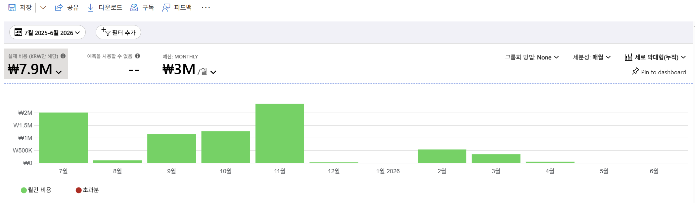

**관찰(월별 총비용, 근사):**
| 월 | 비용(근사) |
|---|---|
| 2025-07 | ≈ ₩2.0M (피크) |
| 2025-08 | ≈ ₩0.25M |
| 2025-09 | ≈ ₩1.2M |
| 2025-10 | ≈ ₩1.2M |
| 2025-11 | ≈ ₩2.0M (피크) |
| 2025-12 | ≈ ₩0.05M |
| 2026-01 | ≈ ₩0 |
| 2026-02 | ≈ ₩0.6M |
| 2026-03 | ≈ ₩0.55M |
| 2026-04 ~ 06 | ≈ ₩0 |
| **합계** | **₩7,891,230** |

**해설:**
- 소비가 **간헐적(bursty)** — 수업 일정에 연동된 것으로 보이는 켜짐/꺼짐 패턴. 피크(7월·11월)와 유휴월(8·12·1·4·5·6월)이 뚜렷함.
- 월 예산 ₩3M 대비 **초과 월 없음** → 예산 통제 자체는 양호.
- **예측 사용 불가**: 최근 월 소비가 거의 0이고 불규칙 → Azure 추세 예측 불가.
- **리포트 대비 결론 반전:** 리포트는 steady-state에 RI/약정 구매를 권장했으나, 이 환경은 간헐적이라
  약정은 낭비 위험이 크고 **auto-shutdown·유휴 리소스 정리**가 우선. → 프레임워크 전이 시 데이터에 맞게 결론을 재판단해야 함.

### 포인트 2 — 집중 비용원(서비스별)

**액션:** 그룹화=Service name · 세분성=없음 · 차트=테이블 (24행)

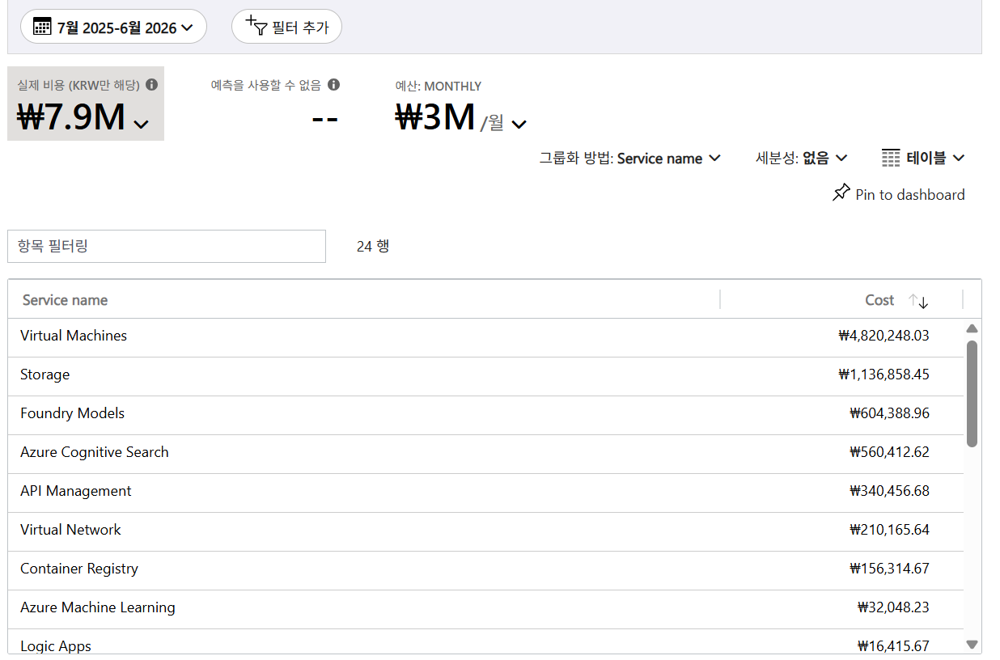

**관찰(서비스별 12개월 합계, 정렬):**
| 서비스 | 12개월 합계 | 비중(≈, 분모 ₩7.89M) |
|---|---|---|
| Virtual Machines | ₩4,820,248.03 | ~61% |
| Storage | ₩1,136,858.45 | ~14% |
| Foundry Models | ₩604,388.96 | ~8% |
| Azure Cognitive Search | ₩506,412.62 | ~6% |
| API Management | ₩340,456.68 | ~4% |
| Virtual Network | ₩210,165.64 | ~3% |
| Container Registry | ₩156,314.67 | ~2% |
| Azure Machine Learning | ₩32,048.23 | ~0.4% |
| Logic Apps | ₩16,415.67 | ~0.2% |
| (이하 15개 소액 서비스) | 합계 나머지 | — |

**해설:**
- **VM 단일 61%**, VM+Storage 두 개로 **약 75%** 집중 → 리포트의 "집중 비용원·집중 리스크"와 동일 패턴.
- 서비스 구성(VM·Storage·Foundry Models·Cognitive Search·ML)이 구독명 `RAG_KT_AI_Academy`와 정합 →
  **RAG/AI 학습용 GPU 컴퓨트 워크로드**로 해석됨.
- 최적화 1순위 타깃 = **Virtual Machines** (rightsizing·auto-shutdown·Spot 검토 대상).

### 포인트 3 — 배분: 리소스그룹

**액션:** 그룹화=Resource group name · 세분성=없음 · 테이블 (155행)

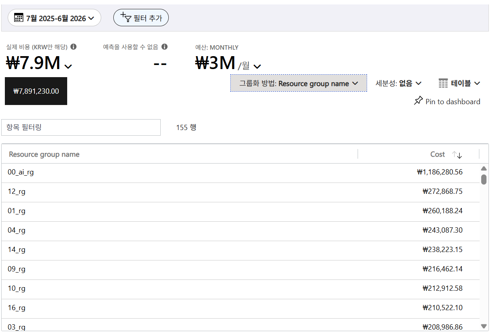

**관찰(RG별 12개월 합계, 상위):**
| RG | 12개월 합계 |
|---|---|
| 00_ai_rg | ₩1,186,280.56 (~15%, 최대) |
| 12_rg | ₩272,868.75 |
| 01_rg | ₩260,188.24 |
| 04_rg | ₩243,087.30 |
| 14_rg | ₩238,223.15 |
| 09_rg | ₩216,462.14 |
| 10_rg | ₩212,912.58 |
| 16_rg | ₩210,522.10 |
| 03_rg | ₩208,986.86 |

**해설:**
- 배분 구조 = **공용 `00_ai_rg`(AI 인프라) 1개 + 번호 팀별 RG(01~16…)**. 팀 RG가 ₩200~270K로 **균등 분산** →
  팀별 showback 경계가 명명 규칙으로 자연 확보됨(리포트의 대소문자 중복 RG 문제와 대비되는 **양호 사례**).
- 단, **RG 총 155개** → 하단에 유휴/잔여(0원 근접) RG 다수 존재 가능 → 정리·거버넌스 대상.

### 포인트 4 — 리소스 유형별 (원가동인 재확인)

**액션:** 그룹화=Resource type · 세분성=없음 · 테이블 (22행)

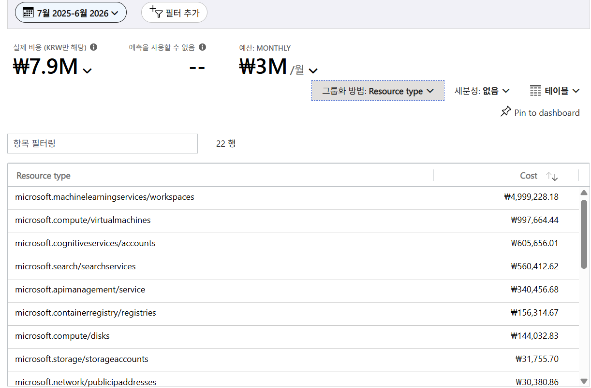
*(이 포털 버전은 개별 리소스명 그룹화가 `Resource guid`(GUID)뿐이라 `Resource type`으로 대체)*

**관찰(리소스 유형별 12개월 합계):**
| 리소스 유형 | 12개월 합계 | 비중(≈) |
|---|---|---|
| microsoft.machinelearningservices/workspaces | ₩4,999,228.18 | ~63% |
| microsoft.compute/virtualmachines | ₩997,664.44 | ~13% |
| microsoft.cognitiveservices/accounts | ₩605,656.01 | ~8% |
| microsoft.search/searchservices | ₩506,412.62 | ~6% |
| microsoft.apimanagement/service | ₩340,456.68 | ~4% |
| microsoft.containerregistry/registries | ₩156,314.67 | ~2% |
| microsoft.compute/disks | ₩144,032.83 | ~2% |
| microsoft.storage/storageaccounts | ₩31,755.70 | ~0.4% |
| microsoft.network/publicipaddresses | ₩30,380.86 | ~0.4% |

**해설 — 이 실습의 핵심 교훈(같은 비용, 두 렌즈):**
- 서비스명 축은 "Virtual Machines ₩4.8M"이 최대, 리소스 유형 축은 `machinelearningservices/workspaces` ₩5.0M이 최대.
  순수 IaaS VM(`compute/virtualmachines`)은 ₩998K.
- 이는 **모순이 아님**: **Azure ML 워크스페이스가 기동하는 학습/추론 컴퓨트가 VM 미터로 과금**되므로, 같은 지출을
  서비스명 축은 "VM"으로, 리소스유형 축은 "ML 워크스페이스"로 보여줄 뿐 — **동일 비용의 서로 다른 렌즈(정합)**.
- **의미:** 이 "VM 비용"의 관리 주체는 ML 팀·ML 컴퓨트이므로, 일반 IaaS VM rightsizing보다 **ML 컴퓨트 관리**
  (compute cluster min-node=0 자동 스케일·compute instance 스케줄 종료가 안전 1순위, **중단 허용성 확보 시 Low-priority/Spot**)가 실효적.
- 부수 낭비 후보: `compute/disks ₩144K`(고아 관리 디스크), `publicipaddresses ₩30K`(유휴 공인 IP).
- **교훈: 동일 비용도 Service name 축과 Resource type 축이 서로 다른 맥락을 보여줌 → 두 축을 반드시 교차 확인.**

### 포인트 5 — 리전 분포

**액션:** 그룹화=Location · 세분성=없음 · 테이블 (19행)
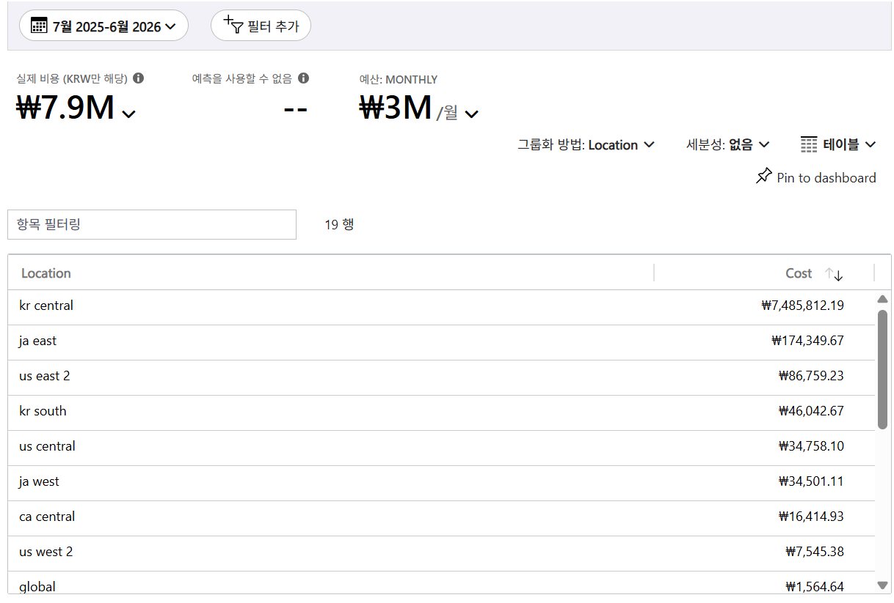  

**관찰(리전별 12개월 합계):**
| 리전 | 12개월 합계 | 비중(≈) |
|---|---|---|
| kr central | ₩7,485,812.19 | ~95% |
| ja east | ₩174,349.67 | ~2% |
| us east 2 | ₩86,759.23 | ~1% |
| kr south | ₩46,042.67 | — |
| us central | ₩34,758.10 | — |
| ja west | ₩34,501.11 | — |
| ca central | ₩16,414.93 | — |
| us west 2 | ₩7,545.38 | — |
| global / us west / us north central | ₩1,564.64 / ₩1,425.03 / ₩987.88 | — |

**해설:**
- **kr central 약 95% 집중** → 한국 소재 아카데미에 적합(지연·데이터 레지던시). 데이터 전송 최적화 이슈 낮음.
- 나머지 10여 개 리전에 소액 분산 → 특정 AI 모델 리전 제약·테스트 배포로 추정. **비용 영향 미미하나
  리전 스프롤(19개)** 은 관리·거버넌스 오버헤드로 기록.
- 리포트 리전 페이지(Azure Maps 미표시·상위 9개만 부분표시)보다 포털 표에서 **전체 리전 완전 확인** 가능.

### 포인트 6 — 태그 기반 배분·거버넌스

**액션:** 그룹화=Tag → 키 `project` 선택 · 세분성=없음 · 테이블 (13행)

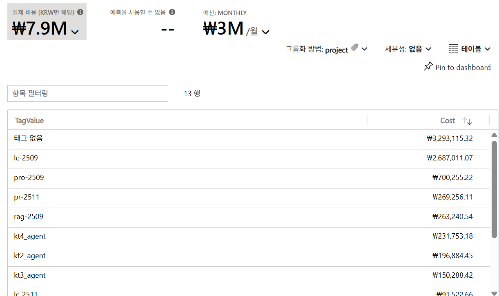

**태그 인벤토리 관찰:** 노출된 태그 키가 대부분 **시스템·플랫폼 자동생성**
(`aml*`·`computetype`·`ms.inv.v0.*`·`nrms.nsp-extension`·`platformsettings.*`·`skipasmazsecpackautoconfig`·`defaultexperience`).
조직 배분용(CostCenter·env·owner·team)은 사실상 없고 배분 가능한 키는 `project` 정도.

**관찰(project 값별 12개월 합계):**
| TagValue | 12개월 합계 | 비중(≈) |
|---|---|---|
| 태그 없음(미태깅) | ₩3,293,115.32 | ~42% |
| lc-2509 | ₩2,687,011.07 | ~34% |
| pro-2509 | ₩700,255.22 | ~9% |
| pr-2511 | ₩269,256.11 | ~3% |
| rag-2509 | ₩263,240.54 | ~3% |
| kt4_agent | ₩231,753.18 | ~3% |
| kt2_agent | ₩196,884.45 | ~2% |
| kt3_agent | ₩150,288.42 | ~2% |
| lc-2511 | ₩91,522.66 | ~1% |
| 01_agent / kt-new-foundry-resource | ₩6,483.24 / ₩952.87 | — |

**해설:**
- **미태깅 ₩3.29M ≈ 42%** → 비용 거의 절반이 `project`로 배분 불가(리포트 §05 "배분 사각지대"와 동일).
- (초기 가설) 미태깅 덩어리 상당수 = ML 워크스페이스 컴퓨트일 것으로 추정했으나,
  **아래 [필터 세부 분석] D1·D2에서 반증됨** — ML 컴퓨트는 89% 태깅되어 있고, 미태깅의 실제 최대 주범은
  **공유 인프라 RG `00_ai_rg`(₩1.18M)** 였음.
- 프로젝트 코드 체계(`lc-2509`·`rag-2509`·`kt*_agent`)는 존재하나 **enforcement 부재**.
- 권고: **Azure Policy로 `project` 필수화 + 태그 상속** → 미태깅 42% 축소.

### 포인트 7 — 커버리지: 온디맨드 vs 약정

**액션:** 그룹화=Pricing Model · 세분성=없음 · 테이블 (1행)
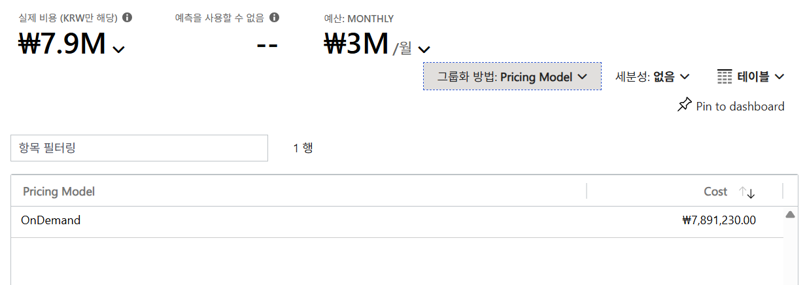

**관찰:**
| Pricing Model | 12개월 합계 |
|---|---|
| OnDemand | ₩7,891,230.00 (100%) |

*(총액 정확값 확정: **₩7,891,230** — 앞선 비중 분모)*

**해설:**
- **100% 온디맨드**. 약정(RI/SP) 0원, Spot 0원. 리포트(온디맨드 98%)보다 더 극단적.
- **처방은 리포트와 다름:** 리포트는 steady-state → RI/SP 권장. 이 환경은 간헐적(bursty, 포인트 1) →
  - RI/SP = 유휴월 낭비 위험 → 부적합
  - **auto-shutdown/scale-to-0 = 안전한 1순위**(간헐 소비에 가장 확실한 절감)
  - **Spot/Low-priority = 조건부 후보** — ML 학습은 eviction(축출) 시 **체크포인트 없으면 재학습 비용이 절감을 상쇄**할 수 있으므로, **중단 허용성 확보가 전제**
- 렌즈("미약정 지출 찾기")는 전이되나, 정답은 *약정 구매*가 아니라 **①유휴 정리·자동 종료 → ②(조건 충족 시) Spot 전환** 순서.

### 포인트 8 — 이상 신호(월별 급증 원인 attribution)

**액션:** 그룹화=Service name · 세분성=월별 · 차트=세로 막대형(그룹화)

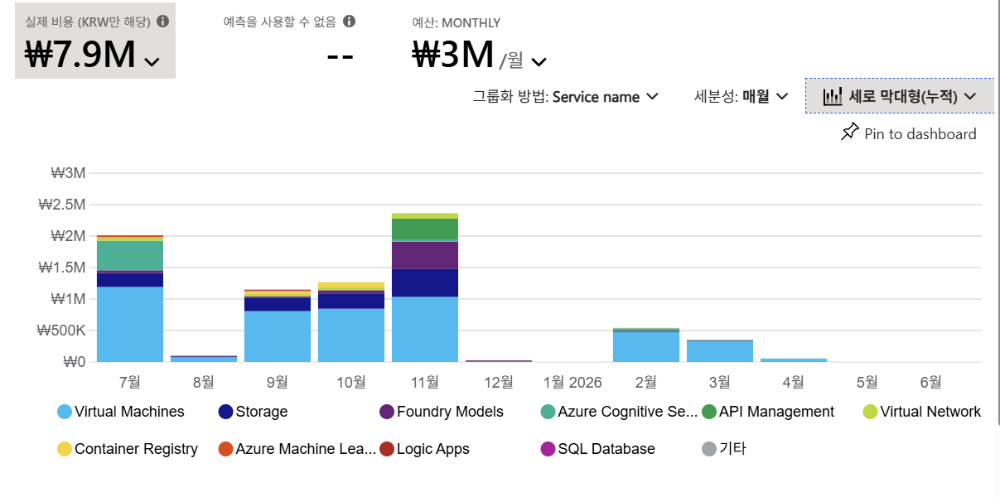
*(일별 세분성은 1년 범위에서 선택 불가 → 월별×서비스로 attribution. 필요 시 피크월로 기간을 좁히면 일별 가능)*

**관찰(월별×서비스 정확값, 캡처한 월별 표 기준):**
- VM(ML 컴퓨트)이 거의 모든 피크 주동인: 2025-07 ₩1,192,051.85 / 09 ₩807,980.48 / 10 ₩846,681.05 /
  11 ₩1,034,717.75 / 2026-02 ₩476,818.66 / 03 ₩330,705.33
- 2025-07 피크: VM + **Azure Cognitive Search ₩469,929.36** (연 총액 ₩506,413의 ~93%가 7월 단일월)
  → RAG 인덱스 초기 구축성 일회 비용
- 2025-11 피크(최다변): VM ₩1,034,717.75 + **Storage ₩441,419.62** + **Foundry ₩435,388.76** +
  **API Management ₩340,456.68**(연 총액 전액이 11월) → 11월 집중 배포
- **프로젝트 태그 상관**: `pr-2511`·`lc-2511`(=2025.11) 프로젝트가 11월 다변 피크와 정합 → 태그로 급증 추적 가능

**해설:**
- 이상 탐지 렌즈: 월별×서비스로 **"어느 달 어떤 서비스가 튀었나"**를 즉시 attribution → 리포트 "6월 하순 증가·급증" 관점의 라이브 대응.
- 발견: ① Search가 7월 일회성, ② APIM이 11월 일회성, ③ 11월 = 2511 프로젝트 집중월.
- 급증은 대부분 **프로젝트 착수/인덱싱 이벤트** → 예산 알림(월 예산 대비)·태그 기반 추적으로 조기 감지 권장.

### 포인트 9 — 최적화 권장(Advisor)

**액션:** 좌측 `최적화 > 관리자 권장 사항`
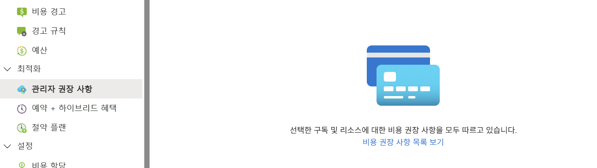  

**관찰(라이브):**
- 활성 비용 권장 **0건** — "선택한 구독 및 리소스에 대한 비용 권장을 모두 따르고 있습니다."
- 예약 추천 필터(약정 3 years / 30 days)에서도 결과 없음. (권장 출처 = Azure Advisor)

**해설 — 핵심 교훈(Advisor 맹점):**
- **사실:** 이 시점 활성 비용 권장 **0건**. → **"권장 0건"이 "이미 최적"을 뜻하지는 않음.**
- **가설(데이터로 미확정):** Advisor는 최근 7~30일 사용량 기반이라, 최근 3개월 소강이 빈 결과의 원인일 **가능성**이 있음.
  (정확 원인은 활동 재개 후 재확인 필요 — 현 시점 단정 금지)
- Advisor가 구조적으로 다루지 않는 영역: ① 태그 거버넌스(미태깅 42%), ② 고아 디스크 ₩144K·유휴 공인 IP ₩30K,
  ③ Spot 전환(Advisor는 Spot 권장을 거의 하지 않음).
- 예약 추천 없음 = 간헐적 워크로드엔 RI 부적합이라는 우리 결론과 **모순 없음**.
- **실질 절감 기회는 Advisor 단독이 아니라 포인트 1~8의 수동 분석과 함께 도출됨.**

#### 참고 — Advisor "최적화" 화면 읽는 법 (활성 권장이 있는 예시 환경 기준)
> 라이브 환경은 소강기라 0건이었으므로, 권장이 존재하는 **예시 환경 캡처**로 화면 구성을 설명함.

**(a) Advisor score 개요 — Well-Architected 5개 기둥별 점수**
| 카테고리 | 예시 점수 | 활성 권장 수 |
|---|---|---|
| Advisor score(종합) | 88% | — |
| **Cost(비용)** | 57% (save 146 USD) | **2** |
| Security(보안) | No data | - |
| Reliability(안정성) | 96% | 6 |
| Operational excellence(운영) | 87% | 1 |
| Performance(성능) | 100% | - |
- `Score history`(월별)로 추이, `Score by category`로 약한 기둥 식별. **FinOps 관점은 Cost 카드에 집중.**

**(b) Cost(비용) 권장 — FinOps 핵심 탭 (예시)**  
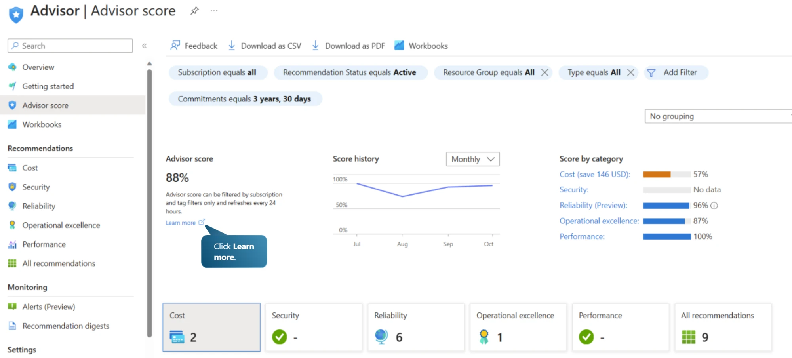   
  
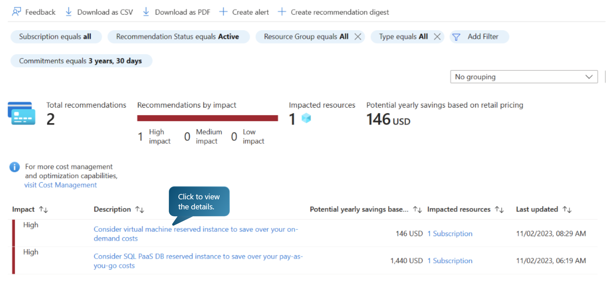  
  
| Impact | Description | Potential yearly savings | Impacted |
|---|---|---|---|
| High | Consider **virtual machine reserved instance** to save over your on-demand costs | 146 USD | 1 Subscription |
| High | Consider **SQL PaaS DB reserved instance** to save over your pay-as-you-go costs | 1,440 USD | 1 Subscription |
- 컬럼: **Impact(High/Med/Low) · Description · Potential yearly savings(정가 기준 연간 절감) · Impacted resources · Last updated**.
- 상단 필터 **Commitments=`3 years, 30 days`**(약정기간 / Lookback)를 `1 year`로 바꿔 term별 비교 가능
  → **리포트 §14(3년)·§15(1년) 예약 권장의 포털 네이티브 대응물**.
- 예시 권장은 전부 **RI(예약) 구매형**이며 절감액은 **정가(retail) 기준 추정** → 실제 계약가와 다를 수 있음.

**(c) 비용 외 기둥 탭 (참고)**
- Reliability(예시 6건): "Use Azure Disks with **ZRS**", "VM 이미지 지원종료 예정", "**Availability zones** 사용" 등 → 가용성.      
  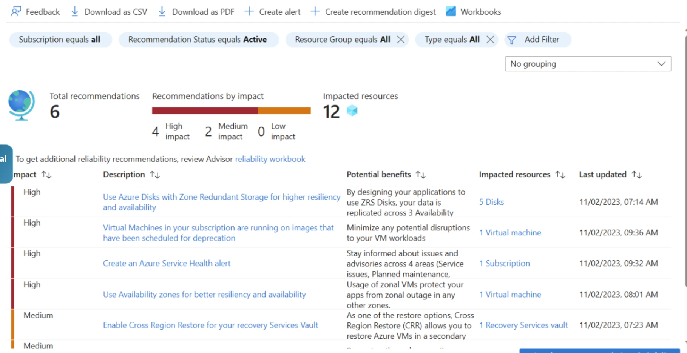    
    
- Operational excellence(예시 1건): "Switch to **Azure Monitor** based alerts for backup" → 운영 품질.
  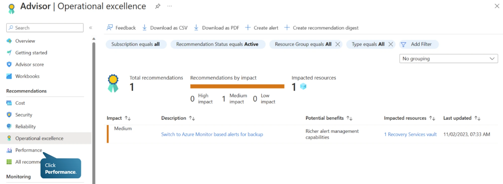   
    
- 주의: 이들은 절감이 아니라 **안정성·운영** 권장이며, ZRS·가용성 존은 **오히려 비용을 늘릴 수 있음**(이중화) → FinOps는 Cost 탭 우선, 타 기둥은 비용 영향까지 함께 판단.

**(d) 라이브 환경 적용 주의**
- 지금은 Cost 권장 0건이나 활동 재개 시 위 같은 **RI 구매 권장이 뜰 수 있음** → 그때도 포인트 1·7의
  **간헐적 소비** 판정을 근거로 **RI 수용 여부 재검토**(무비판 수용 금지).
- Advisor `Potential savings`는 **정가·steady-state 가정** → Spot·태그 거버넌스·고아 리소스는 **여전히 수동 분석 필요**.

---

## 방법론 노트 — 그룹화(Group by) vs 필터(Filter)

이번 실습은 **필터를 쓰지 않았음** — 이는 도움이 안 돼서가 아니라 **분석 단계가 달랐기 때문**임.

| 도구 | 하는 일 | 답하는 질문 | 방향 |
|---|---|---|---|
| **그룹화** | 전체를 한 축으로 분해 | "무엇이 얼마나?" | breadth-first(조망) |
| **필터** | 특정 부분집합으로 범위를 좁힘 | "이 대상 안에서는? 왜?" | depth-first(드릴다운) |

- 9개 포인트는 전부 **전체 범위를 축별로 분해한 top-down 1차 조망(survey)** — 정상적인 첫 단계.
- 필터는 그다음 **드릴다운(원인 규명)** 도구. 그룹화로 "어디에 비용이 있나"를 찾고 → 필터로 "그 대상만 격리해 원인"을 파는 순서.
- **그룹화 = 지도, 필터 = 확대경.** 상호보완이며 보통 그룹화 먼저 → 필터 나중.

**이 분석에서 필터가 유용한 후속 지점:**
- 이상신호: `Service=Virtual Machines` 필터 → ML 컴퓨트만 일별 추적 / 피크월+특정 RG로 11월 급증 주범 격리
- 미태깅 조사: `Tag(project)=태그 없음` 필터 → 미태깅 ₩3.29M의 실제 리소스 목록화(범인 식별)
- 원가동인 격리: `Resource type=ML 워크스페이스` 필터 후 RG/태그로 재그룹 → 어느 프로젝트 ML이 끄는지
- 고아 리소스: `Resource type=disks / publicIPaddresses` 필터 → 낭비 후보 점검
- 팀 심층: `RG=00_ai_rg` 필터 후 서비스/일자 그룹 → 팀 프로파일
- 팁: 필터는 다중 조합(Service=VM AND Tag=lc-2509) 가능, 차트 슬라이스 클릭으로도 드릴됨

---

## 필터 세부 분석 (드릴다운) — 그룹화로 찾고, 필터로 규명

> 9개 포인트(그룹화)로 "어디에 비용이 있나"를 조망한 뒤, **필터로 부분집합을 격리해 "누가·무엇을·왜"** 를 규명함.
> 아래 7개 드릴다운(D1~D7)은 그룹화 단계에서 나온 가설을 **검증·교정**함.

### D1 — 미태깅 ₩3.29M의 범인 식별
**액션:** 그룹화=Resource group name · 세분성=없음 · 테이블 · **필터: Tag `project` = 태그 없음** (154행, 필터 후 합 ₩3.3M)

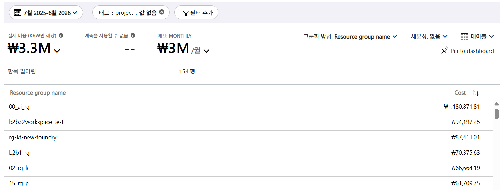  
  
| 미태깅 RG | 금액 | 성격 |
|---|---|---|
| **00_ai_rg** | ₩1,180,871.81 | 공유 AI 인프라 — 미태깅의 **36%** |
| b2b32workspace_test | ₩94,197.25 | 관리자(b2b32) 테스트 워크스페이스 |
| rg-kt-new-foundry | ₩87,411.01 | Foundry 신규 |
| b2b1-rg | ₩70,375.63 | — |
| 02_rg_lc / 15_rg_p / 16_rg_p / 06_rg_p / 04_rg_p | ₩56K~67K | 번호 팀RG 부분 미태깅 |

- **핵심:** `00_ai_rg` 단일 RG가 미태깅의 36%(₩1.18M). 포인트3의 00_ai_rg 총액(₩1,186,281)과 대조 →
  **이 RG는 사실상 99.5%가 미태깅** = 공유 인프라라 특정 프로젝트로 못 붙인 **공유비용(shared cost) 문제**.
- 나머지 ₩2.1M은 **154개 RG에 얇게 분산**(테스트 RG + 번호 팀RG 부분 미태깅) → Policy+태그 상속으로 잡을 롱테일.

### D2 — ML 원가동인(₩5.0M)의 프로젝트 귀속 *(← 포인트6 가설 교정)*
**액션:** **필터: Resource type = machinelearningservices/workspaces** · 그룹화=Tag `project` · 세분성=없음 (10행, 필터 후 합 ₩5.0M)

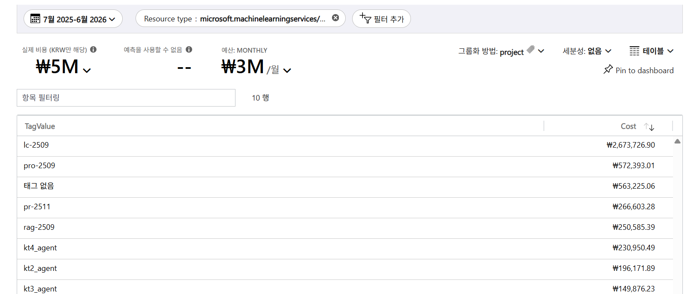

| project | ML 컴퓨트 | 비중(ML 내) |
|---|---|---|
| **lc-2509** | ₩2,673,726.90 | ~53% |
| pro-2509 | ₩572,393.01 | ~11% |
| 태그 없음 | ₩563,225.06 | ~11% |
| pr-2511 | ₩266,603.28 | ~5% |
| rag-2509 | ₩260,585.39 | ~5% |
| kt4_agent / kt2_agent / kt3_agent | ₩230,950.49 / ₩196,171.89 / ₩149,876.23 | — |
| lc-2511 | ₩90,494.93 | — |
| 01_agent | ₩5,200.99 | — |

- **가설 교정:** 포인트6에서 "미태깅 = ML 컴퓨트일 것"이라 추정했으나 **반증됨** — ML 컴퓨트는 **89% 태깅**되어 있고
  미태깅은 ₩563K(11%)뿐. 미태깅의 진짜 주범은 D1의 00_ai_rg 공유 인프라였음.
- **진짜 원가동인 = 단일 프로젝트 `lc-2509`**: ML 컴퓨트만 ₩2.67M(ML의 53%, **전체 지출의 ~34%**).
  포인트6의 lc-2509 총액(₩2,687,011)과 대조 → **lc-2509는 ~99.5%가 ML 학습 컴퓨트** → 최적화 1순위 타깃 확정.

### D3 — 11월 급증(APIM ₩340K) 격리
**액션:** **필터: Service name = API Management** · 그룹화=Resource group name (1행, 필터 후 합 ₩340.5K)  
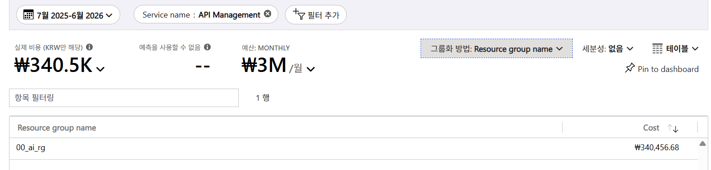

| RG | APIM 비용 |
|---|---|
| **00_ai_rg** | ₩340,456.68 (100%) |

- APIM 전액이 **`00_ai_rg`** 에 존재 → RAG/AI 서비스 앞단 **API Management 게이트웨이가 11월에만 가동된 일회성 배포**
  (포인트8의 "APIM 연 총액 전액이 11월"과 정합) → 11월 급증의 한 축.

### D4 — 공유 플랫폼 `00_ai_rg` 내부 구성
**액션:** **필터: Resource group name = 00_ai_rg** · 그룹화=Service name · 세분성=없음 (17행, 필터 후 합 ₩1.2M)

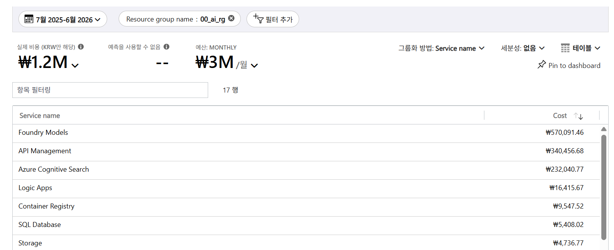

| 서비스 | 금액 | 비중(RG 내) |
|---|---|---|
| Foundry Models | ₩570,091.46 | ~48% |
| API Management | ₩340,456.68 | ~29% |
| Azure Cognitive Search | ₩232,040.77 | ~20% |
| Logic Apps / Container Registry / SQL Database | ₩16,415.67 / ₩9,547.52 / ₩5,408.02 | — |
| Storage / Virtual Machines / Foundry Tools | ₩4,736.77 / ₩3,951.12 / ₩1,157.62 | — |

- `00_ai_rg` = **공유 AI 플랫폼**: Foundry Models(48%) + APIM 게이트웨이(29%) + Cognitive Search(20%) = **97%**.
  전부 **모든 팀의 RAG 앱이 공통 호출**하는 서비스(LLM 추론·API 게이트웨이·벡터 검색).
- **왜 미태깅인지 규명됨:** 단일 프로젝트가 아니라 **다수 프로젝트 공유** 서비스 → project 태그 1개로 못 붙임 →
  **사용량 기반 chargeback(토큰·API 호출 수)** 또는 활성 프로젝트 균등 분할 같은 **공유비용 배분 모델**이 필요.

### D5 — `lc-2509` 프로파일 (타이밍: 이미 종료됨)
**액션:** **필터: Tag `project` = lc-2509** · 그룹화=None · 세분성=월별 (5행, 필터 후 합 ₩2.7M)

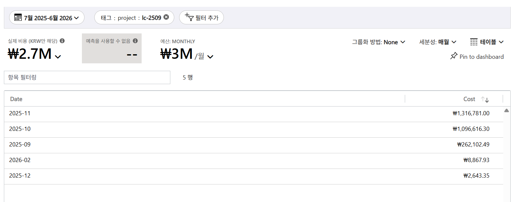  

| 월 | 비용 |
|---|---|
| 2025-11 | ₩1,316,781.00 (피크) |
| 2025-10 | ₩1,096,616.30 |
| 2025-09 | ₩262,102.49 |
| 2026-02 | ₩8,867.93 |
| 2025-12 | ₩2,643.35 |
| 2026-01 · 03~06 | ₩0 |

- lc-2509는 **2025-09~11 집중 가동**(₩262K→₩1.10M→₩1.32M, 피크 11월) 후 **12월부터 사실상 종료**(≈₩0).
  Oct-Nov 두 달에 ₩2.41M(90%) 소비.
- **추가 교정:** 이 프로젝트는 **이미 끝남** → 지금 auto-shutdown/Spot을 걸어도 **절감 0**(이미 꺼짐). ∴ "lc-2509를 지금 최적화"는 오독.
  **lc-2509 = 미최적화 온디맨드 버스트가 ₩2.67M 든다는 '사례(exemplar)'**, 실제 조치는 **동일 playbook을 다음/활성 코호트(예: 2511)에 선제 적용**.
- 아카데미 비용 = **코호트 기반 버스트**(2509 종료 → 2511 시작)의 반복 → 신규 코호트마다 Spot·auto-shutdown 선제 적용이 핵심.

### D6 — 고아 리소스 검증 (disks · public IP, 월별)
**액션:** 필터: Resource type = compute/disks → network/publicipaddresses · 그룹화=None · 세분성=월별 (각 1행)

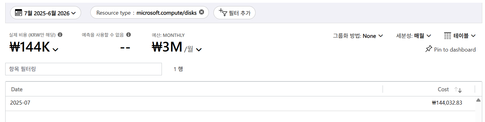
   
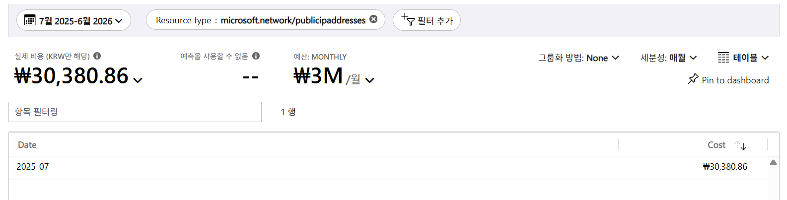  

| 리소스 유형 | 발생 월 | 금액 | 최근월(2026-04~06) |
|---|---|---|---|
| microsoft.compute/disks | 2025-07 단일월 | ₩144,032.83 | ₩0 |
| microsoft.network/publicipaddresses | 2025-07 단일월 | ₩30,380.86 | ₩0 |

- **둘 다 2025-07 단일월만 발생, 이후 전혀 없음** → **지속 과금되는 고아 리소스가 아님**(이미 사라진 7월 일회성).
- **권고3 교정:** 리포트식 "미연결 디스크·유휴 IP 회수"는 **이 환경에 현재 해당 없음** → 즉시 회수 대상 없음.
- 7월 코호트만 전통적 VM+디스크+공인IP 구성, 이후 코호트는 ML 워크스페이스 컴퓨트 중심 → 별도 disk/IP 라인 미발생.

### D7 — 차기 코호트 `pr-2511` 상태 (naming ≠ 실제 소비월)
**액션:** 필터: Tag `project` = pr-2511 · 그룹화=None · 세분성=월별 (3행, 필터 후 합 ₩269.3K)

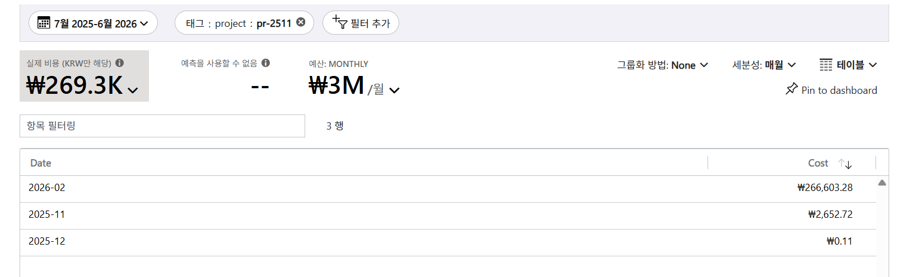   

| 월 | 비용 |
|---|---|
| 2026-02 | ₩266,603.28 (99%) |
| 2025-11 | ₩2,652.72 |
| 2025-12 | ₩0.11 |
| 그 외 | ₩0 |

- pr-2511은 이름의 "2511"(=2025.11)과 달리 **실제 소비 99%가 2026-02** — 이후(3~6월) ≈₩0 → **이 코호트도 이미 종료**.
- **모든 코호트(2509→9~11월, 2511→2월) 종료 확인 → 환경은 현재 완전 dormant.**
- **교훈:** **프로젝트명 날짜 ≠ 실제 과금월**(2511이 2월에 소비) → 타이밍은 이름으로 추정 말고 **필터+월별 드릴로 검증**.

### 드릴다운 종합 — 두 축으로 수렴
- **`00_ai_rg`(공유 AI 플랫폼)** = 거버넌스 축: 미태깅 최대 범인(₩1.18M) + Foundry/APIM/Search 공유 서비스 호스팅 →
  **다수 팀 공유라 태그 불가 = 사용량 기반 공유비용 배분 대상**.
- **`lc-2509`(단일 프로젝트)** = 최대 원가동인(ML 학습 ₩2.67M, 전체 ~34%)**이나 2025-09~11 소비 후 이미 종료** →
  지금 조치 대상이 아니라 **미최적화 버스트의 사례**. 조치 = 동일 playbook을 **활성·차기 코호트에 선제 적용**.
- **현재 상태 = 코호트 간 휴지기(dormant):** 최근 3개월 ≈₩0, 디스크·공인IP·lc-2509 모두 이미 종료 →
  **지금 잘라낼 현재 낭비는 거의 없음**. 최적화는 반응적 청소가 아니라 **차기 코호트 대상 선제 준비**(태그 enforcement·Spot 템플릿·예산 알림).
- **교훈:** 그룹화는 "ML이 크다·미태깅 42%"까지, 필터는 "**누가·무엇을·어디서·언제**"까지 규명.
  그리고 **틀린 가설 3건(미태깅=ML / lc-2509 현재 최적화 / 고아 디스크·IP 상존)을 데이터로 교정** — 필터 드릴다운의 핵심 가치이자 정직한 보고.

---

## 부록 — 실습 액션 시퀀스(재현용)

| # | 포인트 | 그룹화 방법 | 세분성 | 차트/뷰 |
|---|---|---|---|---|
| 1 | 총액·추이 | None | 월별 | 세로 막대형(누적) |
| 2 | 서비스 | Service name | 없음 | 테이블 |
| 3 | 리소스그룹 | Resource group name | 없음 | 테이블 |
| 4 | 리소스 유형 | Resource type | 없음 | 테이블 |
| 5 | 리전 | Location | 없음 | 테이블 |
| 6 | 태그 | Tag → `project` | 없음 | 테이블 |
| 7 | 커버리지 | Pricing Model | 없음 | 테이블 |
| 8 | 이상 신호 | Service name | 월별 | 세로 막대형(그룹화) |
| 9 | 최적화 | (좌측 메뉴) 최적화 > 관리자 권장 사항 | — | Advisor |

> 범위=`RAG_KT_AI_Academy_June_2025`, 기간=지난 12개월 고정. 캡처는 KRW 실데이터 기준.
