# CMDB 조인
## 비용 데이터 로딩  
데이터 가져오기 
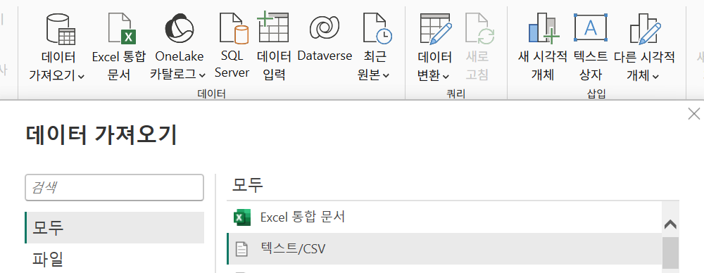   
  
~/workspace/finops-handson/toolkits/cost-focus.csv 선택  
로딩 시 에러는 무시  
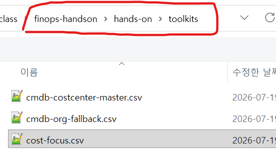  


## 데이터 변환 
### 데이터 변환 클릭 
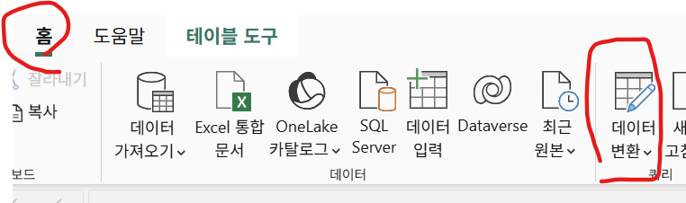

### CostCenter, org 값 추출 
Json값으로 여러개의 Tag가 있는 'Tags'열에서 CostCenter와 org 태그값 분리   
  
| 순서 | 새 열 이름 | 사용자 지정 열 수식 (Power Query M) |
|---|---|---|
| ① | TagsRecord | try Json.Document([Tags]) otherwise null |
| ② | CostCenter_raw | Record.FieldOrDefault([TagsRecord], "CostCenter", null) |
| ③ | org_raw | Record.FieldOrDefault([TagsRecord], "org", null) ?? Record.FieldOrDefault([TagsRecord], " org", null) |

- TagsRecord: JSON 분할 
  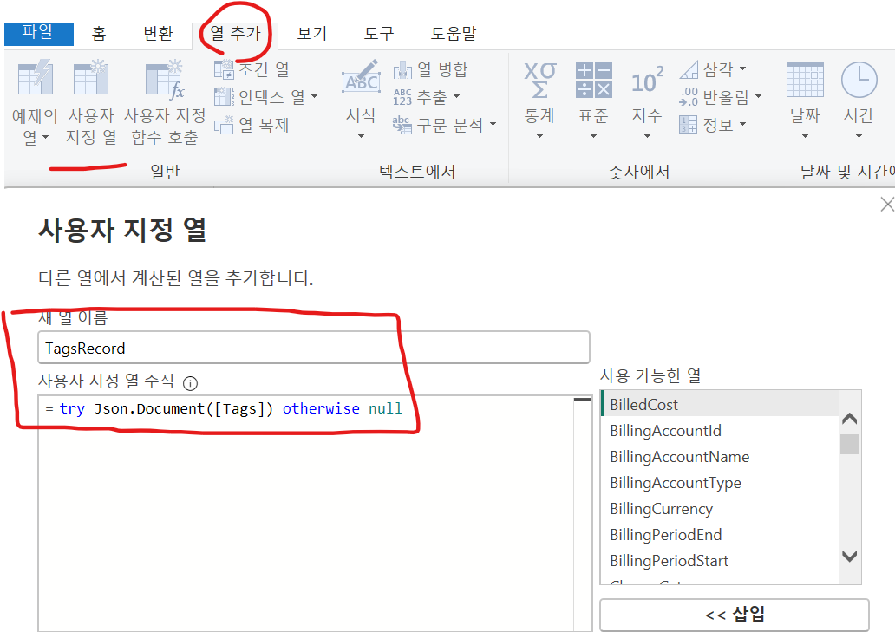
  - CostCenter 추출
  - org 추출: org 앞에 공백 있는 것 처리 추가   
  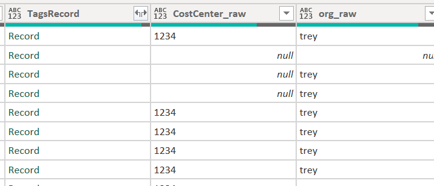    
  
---

### CMDB(Configuration Management DB) Join
#### CostCenter 합치기 
- CMDB 파일 'cmdb-costcenter-master.csv' 추가: 조직 코드와 조직명, BU명, 팀병, 담당자 정보 있음  
  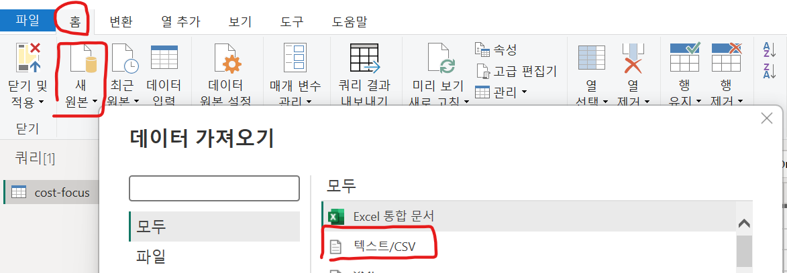

  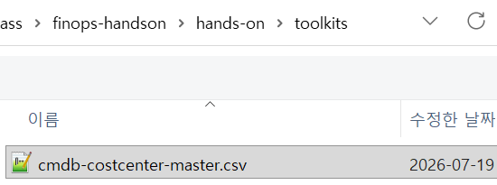  
    
  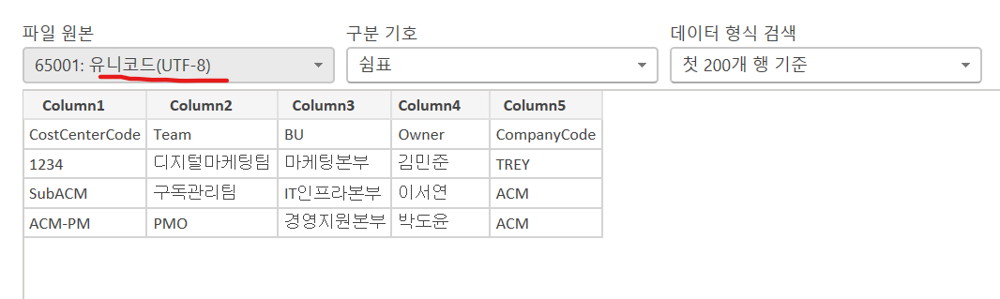   

- Column명 수정: 
  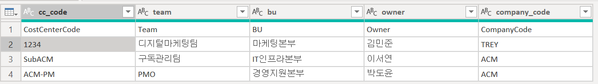   

- Query 병합 클릭 
  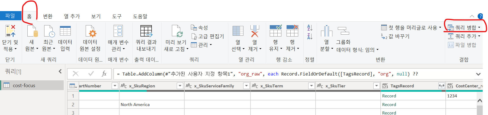   
- cmdb 추가  
  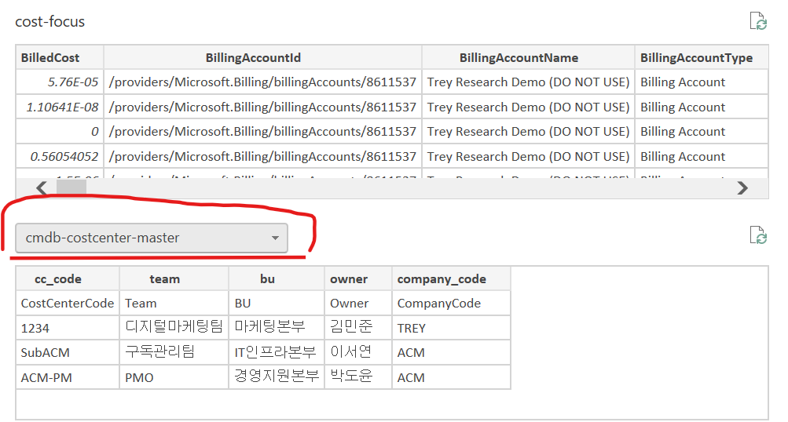  
  
- Join: join 할 컬럼 선택하고 Left join 수행  
  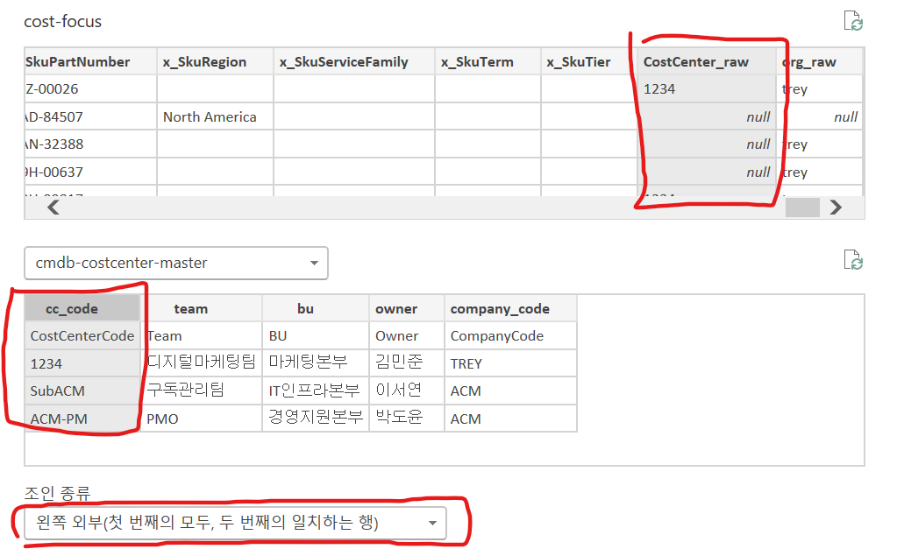    

- 테이블 열 분할   
  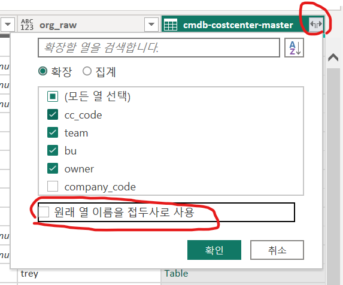   

  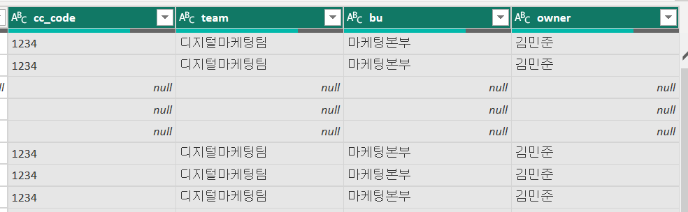   

####  공유리소스 조직명 합치기
공유 리소스는 CostCenter_raw가 아니라 org_raw에 값이 있음  
공유 리소스 CMDB 파일과 join 해야 함   

- 공유자원 CMDB 파일 'cmdb-org-fallback.csv' 추가: 조직 코드와 BU, Owner 값이 있음  
- 컬럼명 수정 
  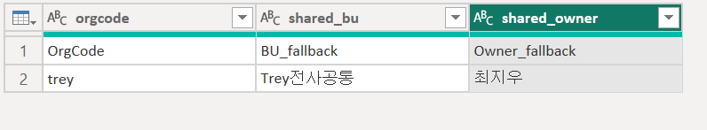  
- Query병합  
  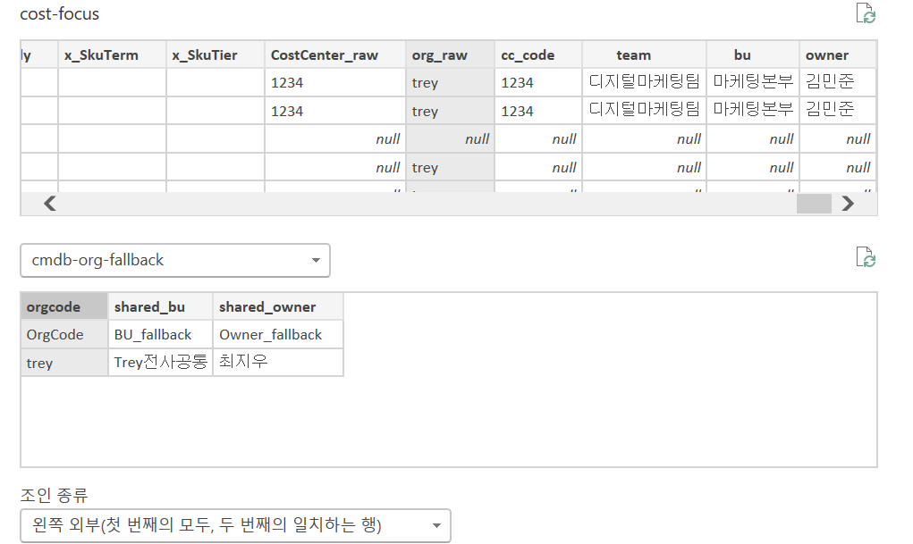  
- 테이블 열 분할  
  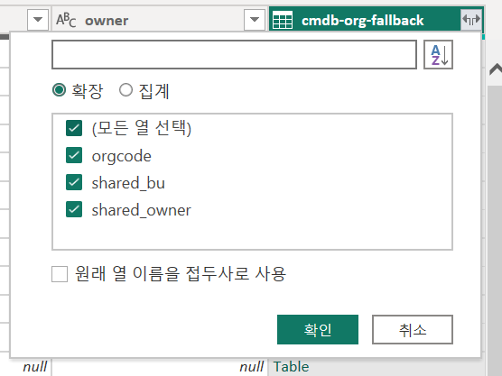  

## BU, Team, Owner 병합   
- BU 병합   
  열 추가 > 사용자 지정열 클릭하여 추가   
  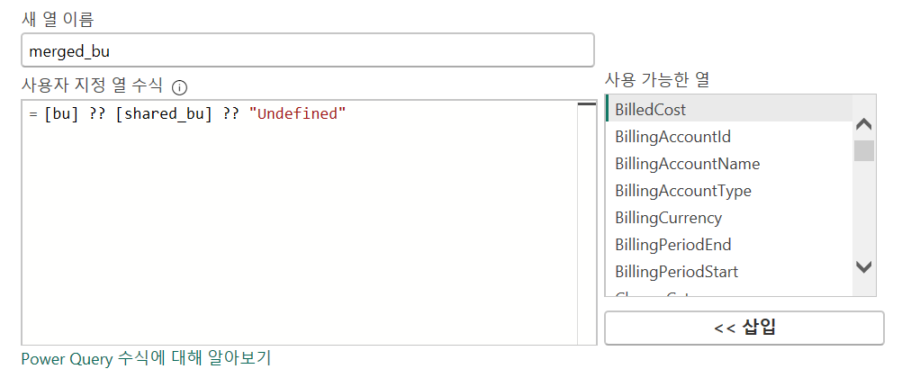   
- 동일 방법으로 Team, Owner도 병합열 생성  
  merged_bu   
  ```
  [bu] ?? [shared_bu] ?? "Undefined"
  ```
  merged_team  
  ```
  [team] ?? [shared_org] ?? "Undefined"
  ```

  merged_owner   
  ```
  [owner] ?? [shared_owner] ?? "Undefined"
  ```

### 닫기 및 변환된 데이터 적용  
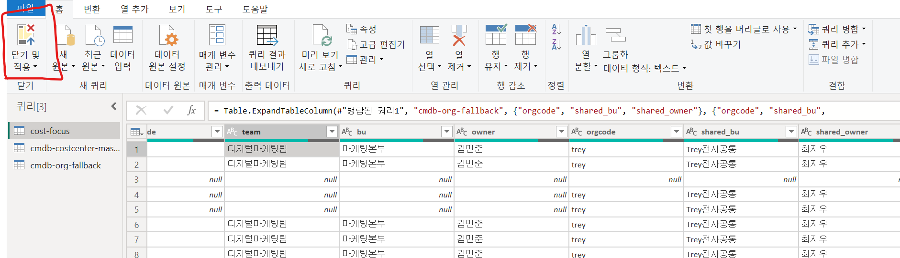  

오류 1개는 무시   
  
---

## 집계 측정값 생성 

데이터 모델에서 아래 DAX(Data Analysis eXpression) 측정값을 생성함   

cost-focus 선택 후 우측 마우스 메뉴에서 새 측정값 클릭  
- 청구비용 추가 
  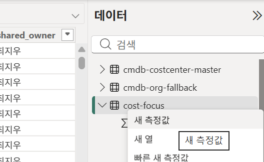  
    
  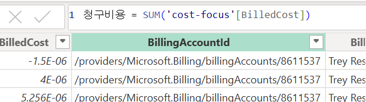  
- 청구비용 측정값과 동일한 방법으로 아래 추가  
  ```dax
  실질비용 = SUM('cost-focus'[EffectiveCost])
  총청구비용 = CALCULATE([청구비용], ALL('cost-focus'))
  비중 = DIVIDE([청구비용], [총청구비용])
  ```

## 보고서 작성  
시각화 판넬에서 '표' 추가    
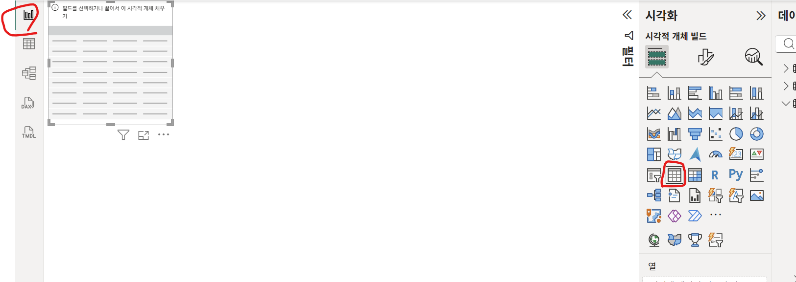   

데이터 판넬에서 merged_bu, 실질비용, 비중  추가    
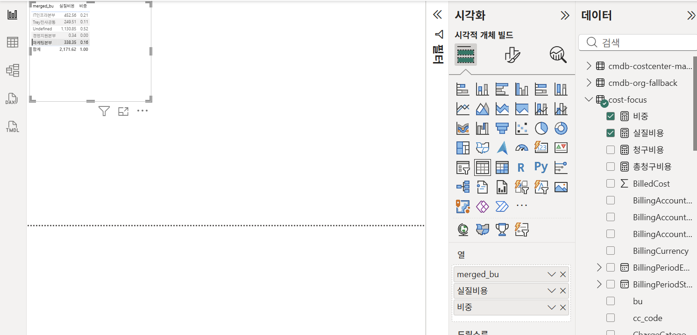  

데이터 판넬에서 ServiceName 추가   
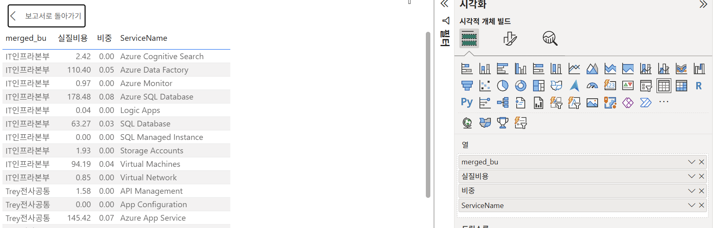   

열 이동은 시각화 판넬의 '열' 에서 수행  
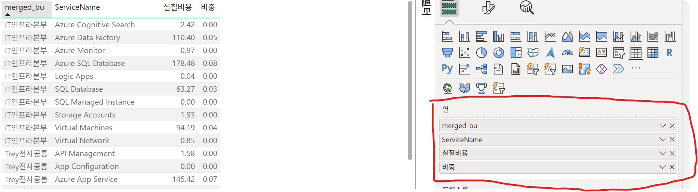   

