# VMSS Auto scaling

## VMSS 작성

- vmss를 찾아 메뉴 진입하고 '만들기' 클릭    
     

- 기본 탭  
  - 이미지와 동일하게 구독, 리소스그룹, 지역 선택. 가상 머신 확장 집합 이름: vmss-{본인ID}     
    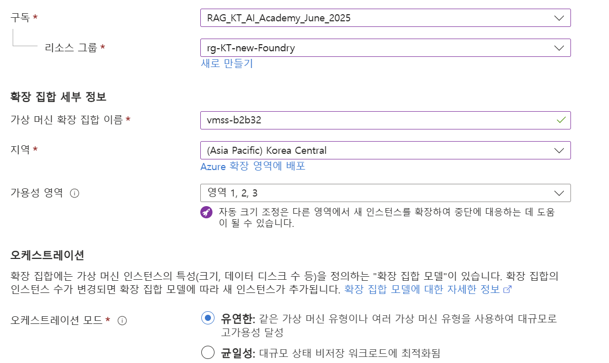  
    
  - 확장 중 > 크기 조정 모드: 자동 크기 조정 선택   

  - 크기 조정 구성:  
       
  
    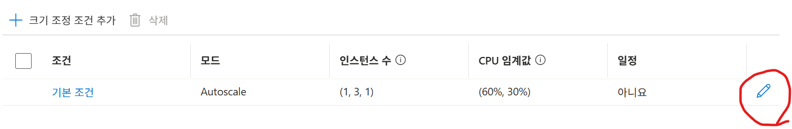   
  
    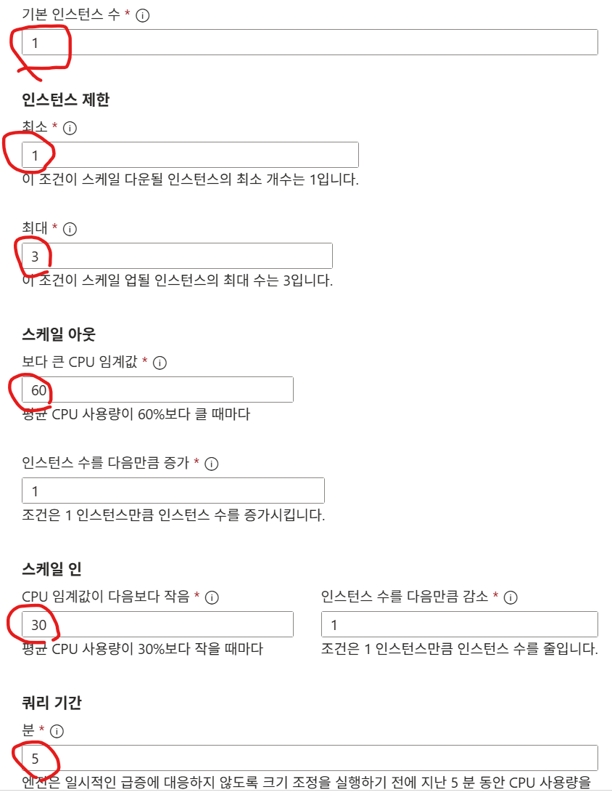   
  
  - 인스턴스 정보 > 크기: B시리즈의 B1s 선택    
    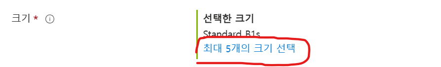    
    
    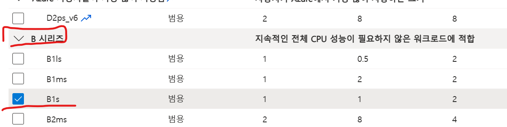   

  - 관리자 계정: 변경하진 말고 id가 azureuser이고 키 이름이 vmss_key인것 기억    
    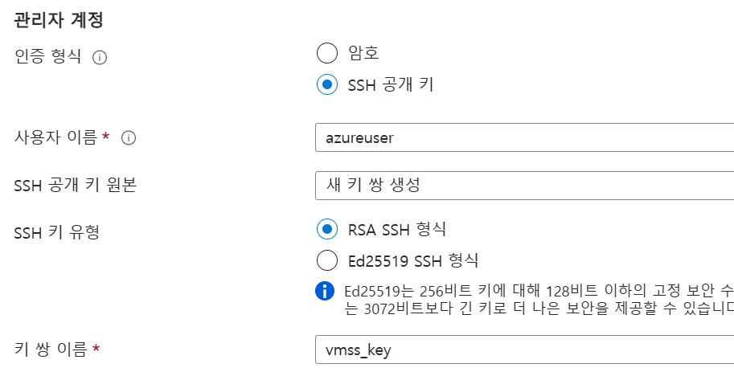   

- 네트워팅 탭 
  공용 IP 만들기 설정 
  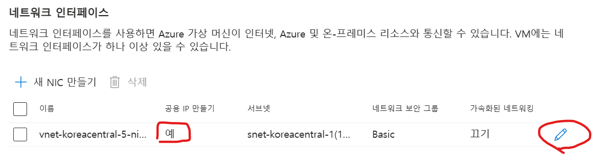  

  부하 분산 '없음'으로 선택  
  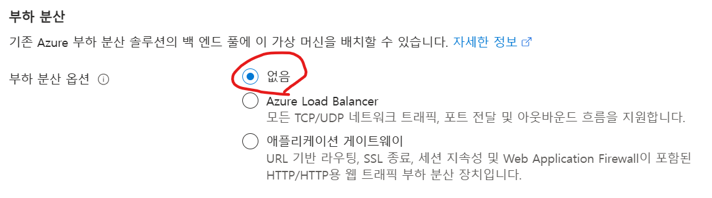    

- 검토 + 만들기 클릭 후 '만들기' 클릭하여 생성  
  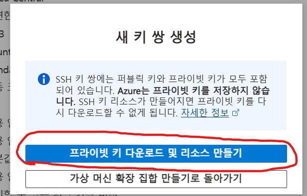   
  key파일을 '{사용자홈}/.ssh' 디렉토리에 다운로드 (.ssh 디렉토리 없으면 생성 후 다운로드) 


## 오토스케일링 테스트
### 강사 사전준비
- 네트워크 보안 그룹 서비스 진입하여 변경할 NSG 클릭   
- 설정 > 인바운드 보안 규칙 클릭 
- 22번 포트를 임시로 Any로 오픈 
  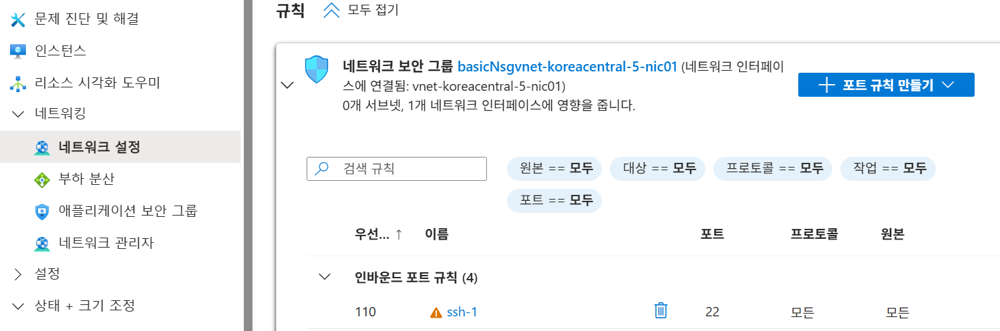   

### 사전 준비
- 인스턴스 접속 방법 확인    
  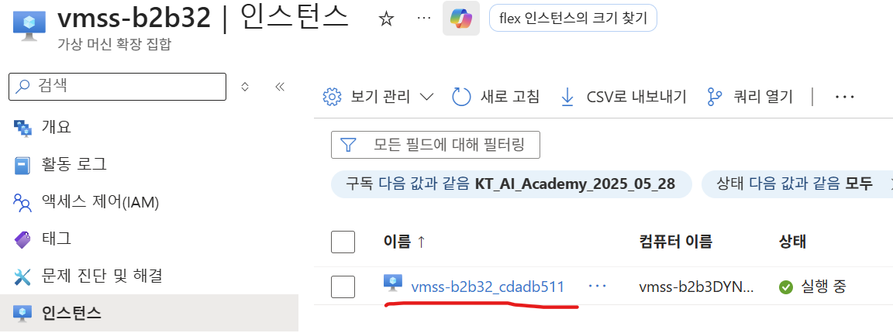  
  
  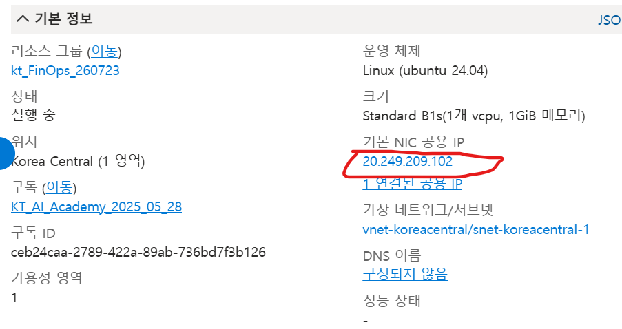   

- SSH 접속  
  ```
  ssh -i ~/.ssh/vmss_key.pem azureuser@<인스턴스 공용IP>
  ```
  만약 연결 안되면 22번 포트 열어야 합니다. 테스트 후 제거해야 합니다.     
     
     
- 부하 생성 도구(stress-ng) 설치  
```
sudo apt-get update && sudo apt-get install -y stress-ng
```

### 스케일아웃 확인
- 접속한 인스턴스에서 부하 생성  
  ```
  stress-ng --cpu 1 --cpu-load 90 --cpu-method matrixprod --timeout 600s
  ```

- 포털에서 VMSS > 모니터링 > 메트릭 진입 후 Percentage CPU 확인  
  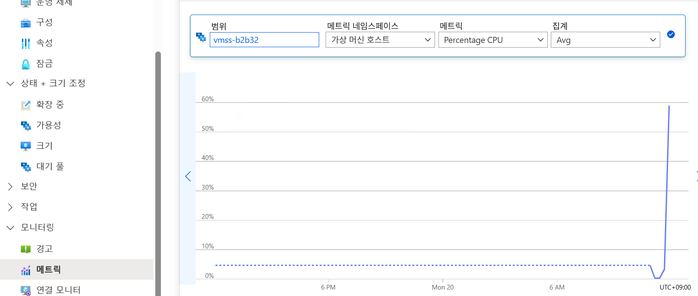   

- VMSS > 설정 > 상태 + 크기 조정 > 확장 중 클릭 후 실행 기록(Run history)에서 스케일아웃 이벤트 확인  
  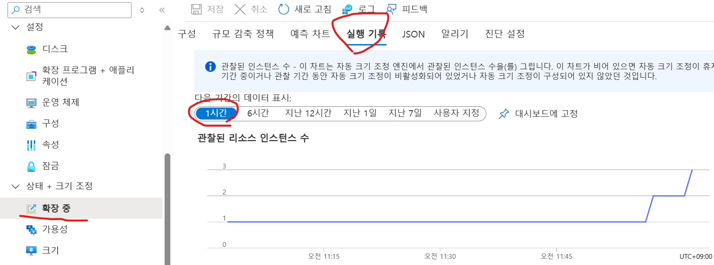 

- 인스턴스 수가 1대에서 2 ~ 3대로 증가하는지 확인  
- 체크 주기(5분)가 반영되므로 이벤트 발생까지 **5 ~ 10분 내외 소요됨**을 감안하고 대기  

### 스케일인 확인
- 부하 종료 (Ctrl+C 또는 timeout 만료 대기)  
- 메트릭에서 CPU 사용률이 30% 이하로 하락하는지 확인  
- 쿨다운이 적용되므로 체크 주기와 쿨다운을 합산해 10 ~ 20분 정도 여유를 두고 실행 기록에서 스케일인 이벤트 확인  
- 인스턴스 수가 원래 대수로 복귀하는지 확인  
- 정확한 쿨다운 값은 문서에서 단정하지 않으며, VMSS > 설정 > 크기 조정 > 규칙 편집 화면에서 실습 중 직접 확인  

### B1s 버스터블 인스턴스 주의사항
- B1s는 버스터블 인스턴스로 CPU 크레딧을 소진하면 스로틀링 발생 가능  
- 장시간 고부하 유지 대신 5 ~ 10분 내외로 짧게 부하를 주는 것을 권장  

### 다중 인스턴스 부하 주의사항
- ⚠️ 오토스케일 규칙은 인스턴스 전체 평균 CPU를 기준으로 판단  
- 스케일아웃 후 인스턴스가 2대 이상이면 모든 인스턴스에 각각 SSH로 접속해 동시에 부하를 줄 것  
- 1대에만 부하를 주면 평균 CPU가 임계값에 못 미쳐 추가 스케일아웃이 발생하지 않을 수 있음  

### 실습 정리
- 부하 종료와 스케일인 완료(인스턴스 수 원복)를 확인  
- 실습이 끝나면 과금 방지를 위해 VMSS 리소스 삭제  
- **강사 수행: 네트워크 보안 그룹에서 22번 포트 오픈 삭제** 
 