# VMSS Auto scaling

## VMSS 작성

- vmss를 찾아 메뉴 진입하고 '만들기' 클릭    
  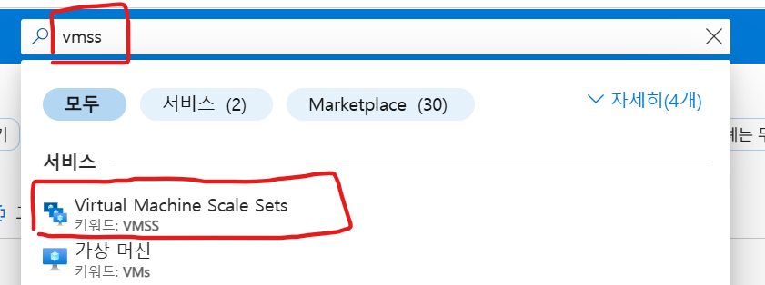   

- 기본 탭  
  - 이미지와 동일하게 구독, 리소스그룹, 지역 선택. 가상 머신 확장 집합 이름: vmss-{본인ID}     
    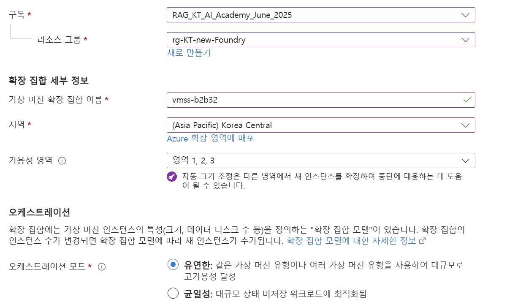  
    
  - 확장 중 > 크기 조정 모드: 자동 크기 조정 선택   
    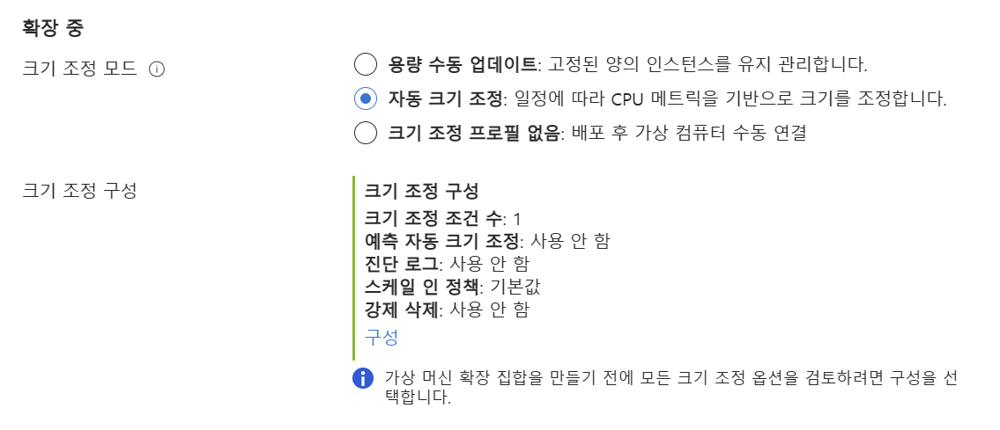  
    
  - 크기 조정 구성:  
       
  
    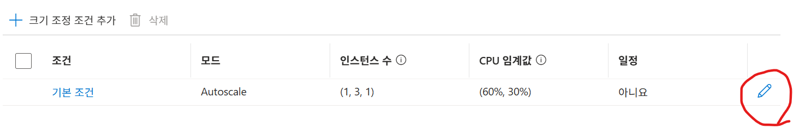   
  
    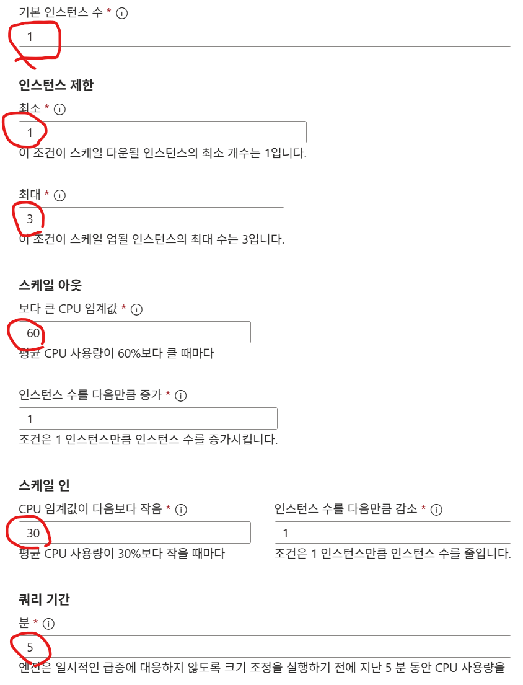   
  
  - 인스턴스 정보 > 크기: B시리즈의 B1s 선택    
    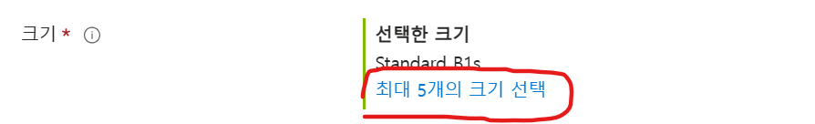    
    
    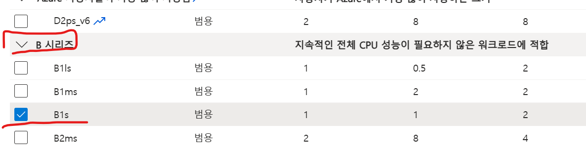   

  - 관리자 계정: 변경하진 말고 id가 azureuser이고 키 이름이 vmss_key인것 기억    
    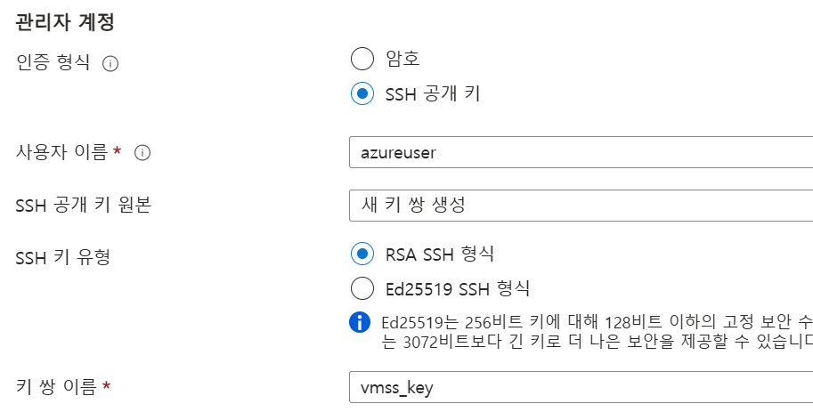   

- 네트워팅 탭 
  공용 IP 만들기 설정 
  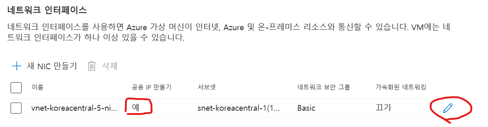  

  부하 분산 '없음'으로 선택  
  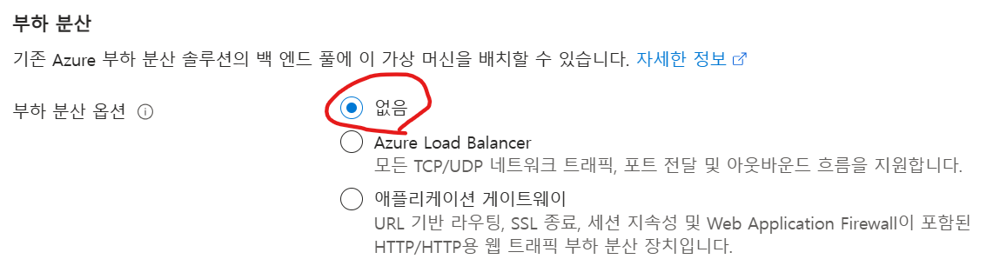    

- 검토 + 만들기 클릭 후 '만들기' 클릭하여 생성  
  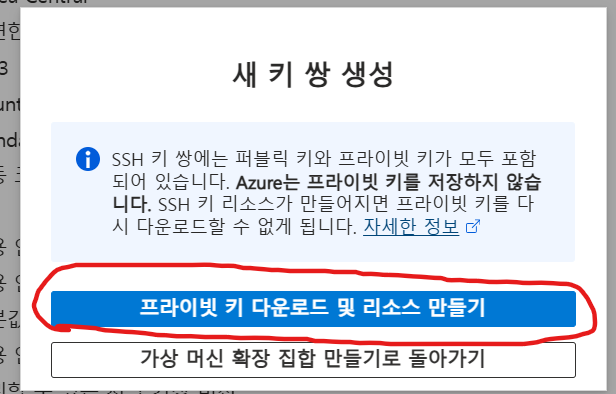   
  key파일은 사용하지 않습니다.  아무곳에 다운로드 하세요.   


## 오토스케일링 테스트

### 부하 주기 
- 인스턴스 확인     
  생성된 VMSS로 이동 후 '인스턴스' 클릭하여 확인  

- 생성된 VM 클릭하여 이동 

- 작업 > 실행 명령 클릭 후 'RunShellScript' 선택 

- 부하 프로그램 'stress-ng' 설치 후 10분간 실행 
  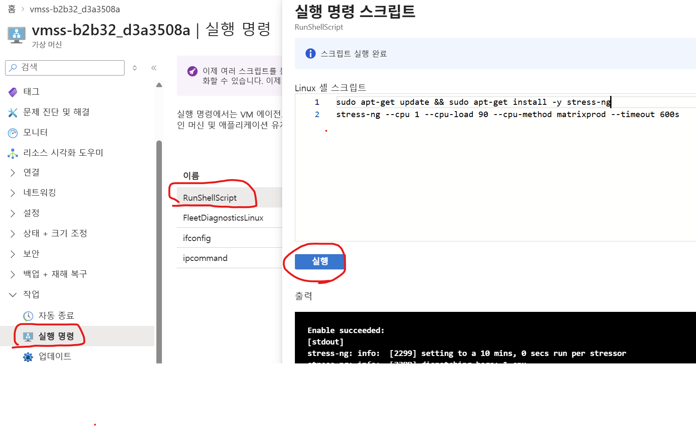  

  ```
  sudo apt-get update && sudo apt-get install -y stress-ng
  
  stress-ng --cpu 1 --cpu-load 90 --cpu-method matrixprod --timeout 600s 
  ```  

### 스케일아웃 확인
- 포털에서 VMSS > 모니터링 > 메트릭 진입 후 Percentage CPU 확인    
  약 5분 후 주기적으로 새로고침 수행하여 CPU 올라가는 것 확인   
  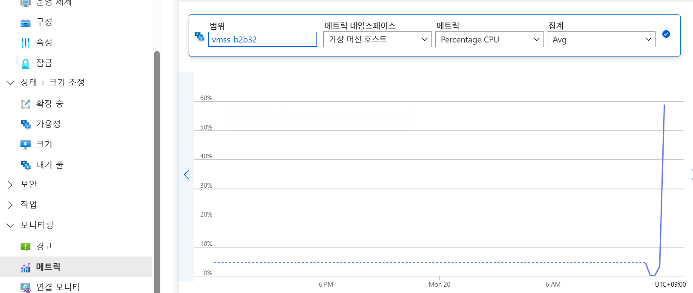   

- 새로운 탭에서 VMSS > 설정 > 상태 + 크기 조정 > 확장 중 클릭 후 실행 기록(Run history)에서 스케일아웃 이벤트 확인    
  CPU가 60% 이상 되고 약 5분 후 새로고침 수행    

  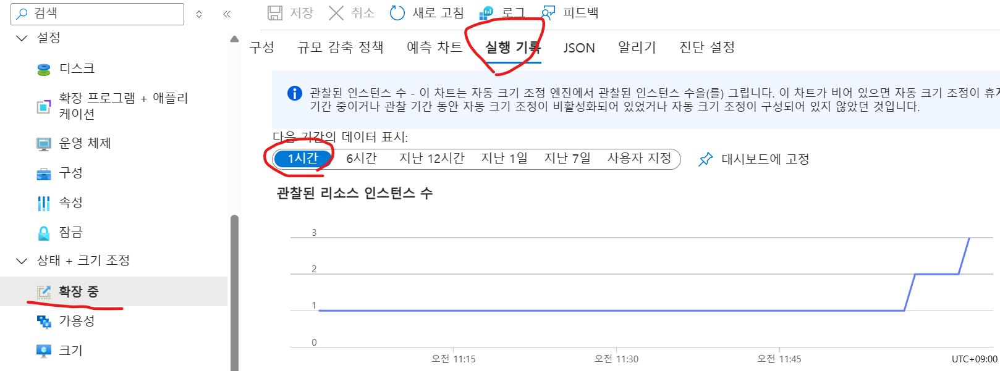 

- 인스턴스 수가 1대에서 2 ~ 3대로 증가하는지 확인  
- 체크 주기(5분)가 반영되므로 이벤트 발생까지 **5 ~ 10분 내외 소요됨**을 감안하고 대기  

### 스케일인 확인
- 부하 종료: 10분 timeout 만료 시 자동 종료 
- 메트릭에서 CPU 사용률이 30% 이하로 하락하는지 확인  
- 쿨다운이 적용되므로 체크 주기와 쿨다운을 합산해 10 ~ 20분 정도 여유를 두고 실행 기록에서 스케일인 이벤트 확인  
- 인스턴스 수가 원래 대수로 복귀하는지 확인  
- 정확한 쿨다운 값은 문서에서 단정하지 않으며, VMSS > 설정 > 크기 조정 > 규칙 편집 화면에서 실습 중 직접 확인  


### 실습 정리
- 부하 종료와 스케일인 완료(인스턴스 수 원복)를 확인  
- 실습이 끝나면 과금 방지를 위해 VMSS 리소스 삭제  
 