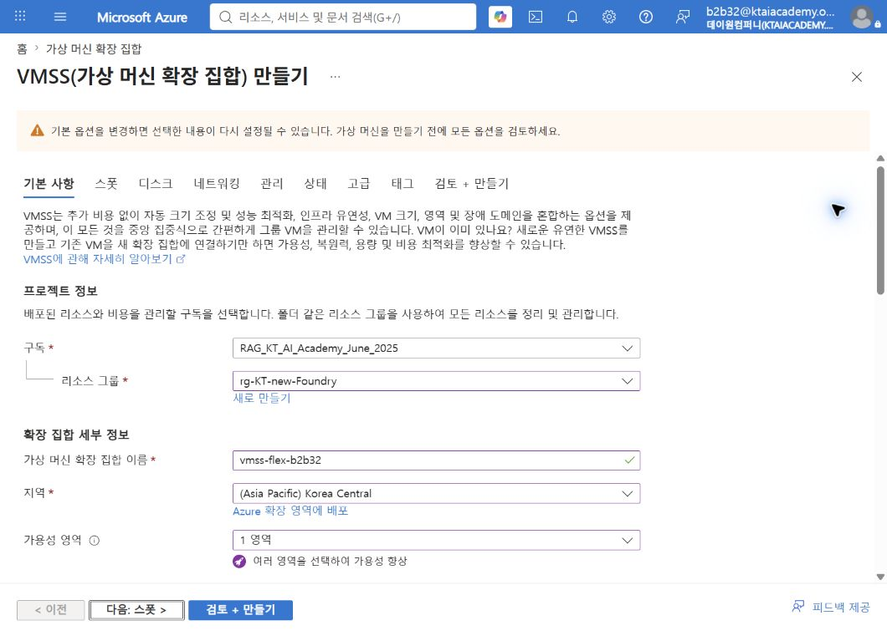
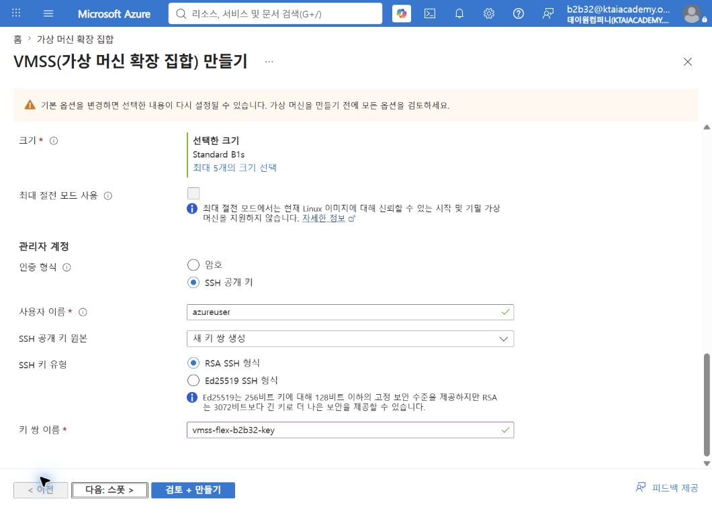
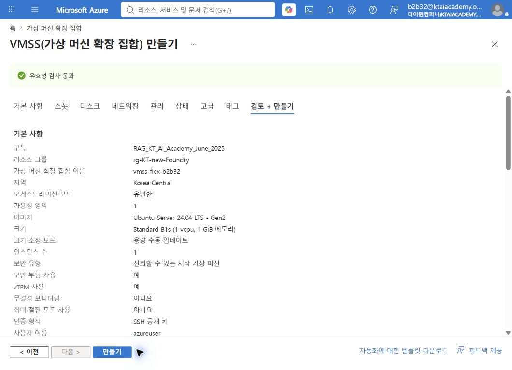
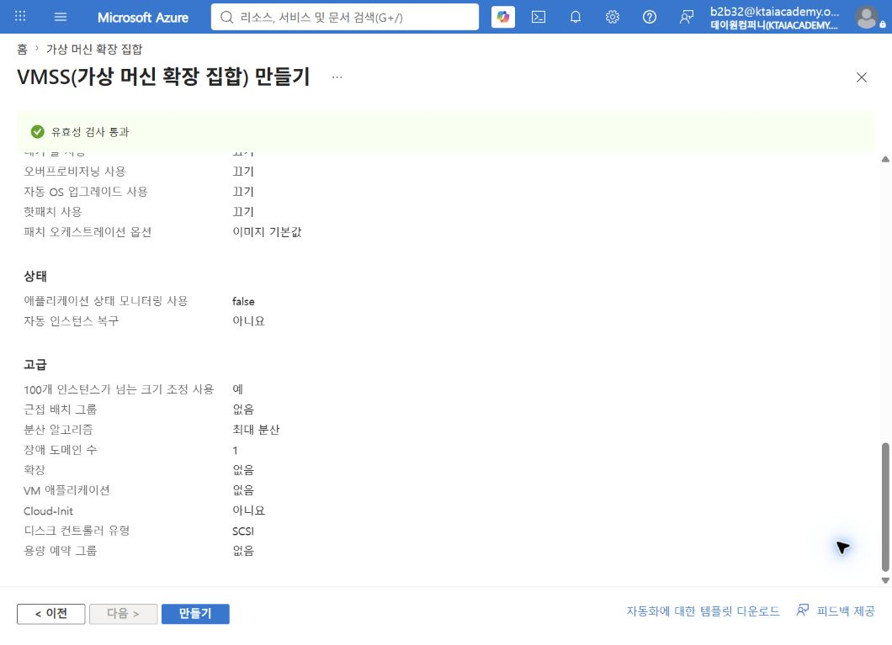
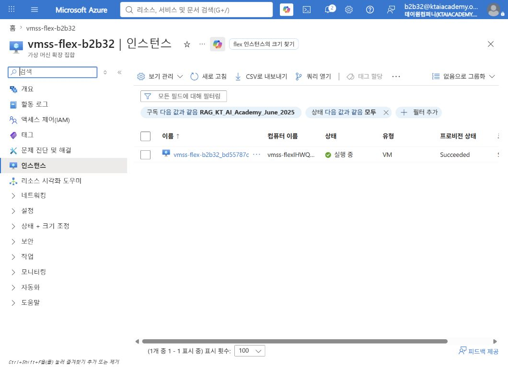
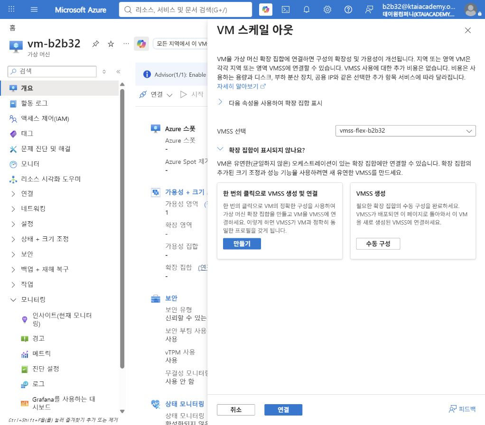
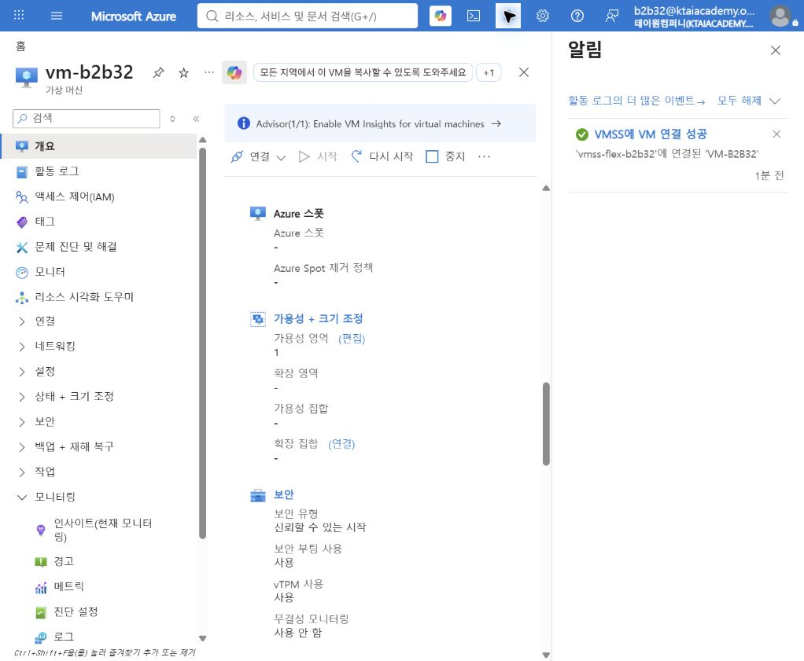
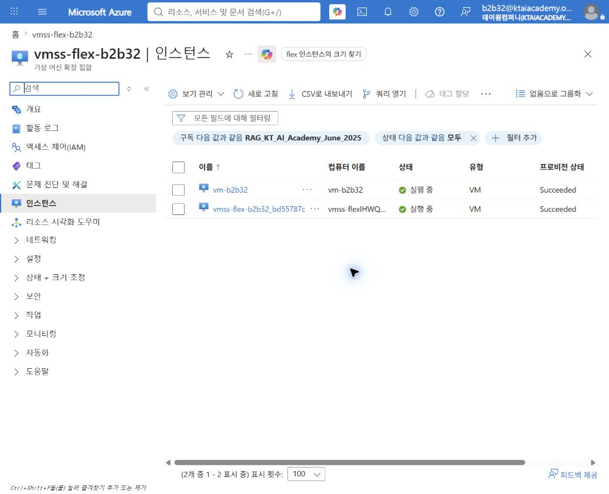

# 기존 VM을 Flexible VMSS에 연결

## 1. 실습 개요

기존 독립 VM을 Azure Portal UI에서 Flexible 오케스트레이션 방식의 VMSS에 연결하는 실습임.  
CLI를 사용하지 않고 VMSS 생성, VM 연결, 결과 검증까지 포털에서 수행함.  

### 학습 목표

- 기존 VM 연결을 지원하는 Flexible VMSS 구성 조건 이해
- Azure Portal에서 기존 VM을 VMSS에 연결
- 서로 다른 VM 크기를 사용하는 인스턴스가 하나의 Flexible VMSS에 포함되는 결과 확인
- 연결 시 네트워크와 비용에 미치는 영향 이해

### 실습 결과

| 구분 | 실습 값 |
|---|---|
| 리소스 그룹 | `RG-KT-NEW-FOUNDRY` |
| 기존 VM | `vm-b2b32` |
| 기존 VM 크기 | `Standard_D2alds_v6` |
| VMSS | `vmss-flex-b2b32` |
| VMSS 생성 인스턴스 크기 | `Standard_B1s` |
| 지역 / 가용성 영역 | Korea Central / 1 |
| 오케스트레이션 | Flexible |

> 이름은 실습 환경에 맞게 변경 가능함. 기존 VM과 VMSS는 동일한 리소스 그룹에 배치해야 함.

## 2. 기존 VM 연결 조건

Azure Portal의 VMSS 선택 목록에는 다음 조건을 충족하는 VMSS만 표시됨.

| 조건 | 설정 또는 확인 값 |
|---|---|
| 오케스트레이션 모드 | Flexible |
| 장애 도메인 수 | 1 |
| 단일 배치 그룹 | `false` |
| 리소스 그룹 | 기존 VM과 동일 |
| 가용성 영역 | VM의 영역이 VMSS 영역에 포함됨 |
| 디스크 | 관리 디스크 사용 |
| 배치 제약 | 가용성 집합, 근접 배치 그룹, 전용 호스트에 포함되지 않음 |
| VM 크기 | RDMA 또는 단일 배치 그룹 필수 크기가 아님 |

기존 VM은 VMSS의 크기 조정 프로필과 운영 체제, VM 크기, 네트워크 구성이 같지 않아도 연결 가능함.  
본 실습에서도 `Standard_D2alds_v6` VM과 `Standard_B1s` 인스턴스가 하나의 VMSS에 포함됨.

## 3. Flexible VMSS 생성

### 3.1 기본 정보 입력

1. Azure Portal에서 **가상 머신 확장 집합** 검색 후 **만들기** 선택
2. 다음 값 입력

   - 구독: 기존 VM과 동일한 구독
   - 리소스 그룹: `RG-KT-NEW-FOUNDRY`
   - 가상 머신 확장 집합 이름: `vmss-flex-b2b32`
   - 오케스트레이션 모드: **유연한(Flexible)**
   - 지역: **Korea Central**
   - 가용성 영역: **영역 1**만 선택

### 3.2 이미지, 크기, 관리자 계정 설정

1. 이미지에서 **Ubuntu Server 24.04 LTS** 선택
2. 보안 유형에서 **신뢰할 수 있는 시작** 선택
3. VM 크기에서 **Standard B1s** 선택
4. 인증 형식에서 **SSH 공개 키** 선택
5. 새 키 쌍 이름에 `vmss-flex-b2b32-key` 입력

> VMSS가 생성되면 용량 1에 해당하는 B1s 인스턴스도 생성됨. 실습 중 컴퓨팅과 디스크 비용 발생 가능함.

### 3.3 크기 조정과 고급 설정

1. 크기 조정 모드에서 **수동 크기 조정** 선택
2. 초기 인스턴스 수에 `1` 입력
3. 고급 설정에서 장애 도메인 수가 `1`인지 확인
4. **검토 + 만들기** 선택

### 3.4 연결 필수 속성 검증

유효성 검사 통과 후 기본 정보에서 다음 항목 확인

- 오케스트레이션: 유연한
- 가용성 영역: 1
- 크기: Standard B1s
- 용량: 1

고급 항목에서 다음 값 확인

- **100개 인스턴스가 넘는 크기 조정 사용: 예**
- 분산 알고리즘: 최대 분산
- 장애 도메인 수: 1

> 포털의 **100개 인스턴스가 넘는 크기 조정 사용: 예**는 단일 배치 그룹에 제한하지 않는 구성을 의미함.  
> 기존 VM 연결에 필요한 `singlePlacementGroup=false` 조건과 대응됨.

### 3.5 VMSS 생성 결과 확인

1. **만들기** 선택
2. SSH 개인 키 다운로드 후 안전한 위치에 보관
3. 배포 완료 후 VMSS에서 **인스턴스** 선택
4. 자동 생성된 B1s 인스턴스의 상태가 **실행 중**, 프로비전 상태가 **Succeeded**인지 확인

## 4. 기존 VM을 VMSS에 연결

### 4.1 VM 연결 화면 진입

1. Azure Portal에서 **가상 머신** 선택
2. 기존 VM `vm-b2b32` 선택
3. **개요 > 속성 > 가용성 + 크기 조정** 확인
4. **확장 집합** 항목의 **연결** 선택

### 4.2 대상 VMSS 선택

1. **VM 스케일 아웃** 창의 **VMSS 선택**에서 `vmss-flex-b2b32` 선택
2. 화면 아래의 **연결** 선택

장애 도메인 수가 1인 VMSS에 기존 VM을 연결하는 작업은 VM 재부팅 없이 수행 가능함.  
연결 작업이 끝날 때까지 Azure 알림 상태 확인 필요함.

### 4.3 연결 성공 확인

Azure Portal 알림에서 다음 메시지 확인

- **VMSS에 VM 연결 성공**
- `'vmss-flex-b2b32'에 연결된 'VM-B2B32'`

## 5. VMSS 인스턴스 검증

1. `vmss-flex-b2b32` 선택
2. **인스턴스** 선택
3. 다음 두 인스턴스 확인

| 인스턴스 | 크기 | 상태 | 프로비전 상태 |
|---|---|---|---|
| `vm-b2b32` | `Standard_D2alds_v6` | 실행 중 | Succeeded |
| `vmss-flex-b2b32_bd55787c` | `Standard_B1s` | 실행 중 | Succeeded |

서로 다른 크기의 VM이 하나의 Flexible VMSS에 포함되는 것이 정상 결과임.  
연결된 기존 VM은 VMSS 인스턴스 목록에서 유형 **VM**으로 표시됨.

## 6. 연결 후 운영 시 주의 사항

### 6.1 네트워크

VM을 VMSS에 연결해도 VM의 NIC, 부하 분산 장치, 백엔드 풀 구성이 자동으로 변경되지 않음.  
연결한 VM에 동일한 트래픽을 전달하려면 대상 부하 분산 장치의 백엔드 풀과 상태 프로브를 별도 구성해야 함.

### 6.2 크기 조정

기존 VM 연결은 VMSS 구성원 등록 작업임. VMSS 크기 조정 프로필을 기존 VM에 자동 적용하는 작업이 아님.  
자동 크기 조정 정책 적용 전 인스턴스별 크기, 이미지, 네트워크 차이와 애플리케이션 동작 검증 필요함.

### 6.3 비용

VMSS 관리 기능 자체에는 별도 요금이 없지만 다음 리소스 사용료는 계속 발생함.

- `vm-b2b32` 컴퓨팅 및 디스크
- VMSS 생성 시 추가된 `Standard_B1s` 컴퓨팅 및 디스크
- 공용 IP, 부하 분산 장치 등 선택 리소스

## 7. 문제 해결

### 7.1 VMSS 선택 목록에 대상이 표시되지 않는 경우

1. VMSS 생성 완료 후 수 분 대기
2. **VM 스케일 아웃** 창을 닫고 다시 열기
3. VMSS가 Flexible 모드인지 확인
4. 장애 도메인 수가 1인지 확인
5. **100개 인스턴스가 넘는 크기 조정 사용**이 **예**인지 확인
6. VM과 VMSS가 동일한 리소스 그룹인지 확인
7. VM 영역이 VMSS 영역에 포함되는지 확인
8. VM이 관리 디스크를 사용하는지 확인
9. VM이 가용성 집합, 근접 배치 그룹, 전용 호스트에 포함되지 않았는지 확인

### 7.2 `singlePlacementGroup` 조건

크기 조정 프로필 없이 만든 VMSS는 `singlePlacementGroup` 값이 `null`일 수 있음.  
이 값은 생성 후 `false`로 바꿀 수 없으므로 연결용 VMSS 생성 단계에서 올바른 UI 옵션 선택이 필요함.

## 8. 실습 정리와 정리 작업

기존 VM을 유지하면서 VMSS만 제거하려면 먼저 VM을 VMSS에서 분리해야 함.

1. Azure Portal에서 **가상 머신 > vm-b2b32** 선택
2. **설정 > 가용성 + 크기 조정** 선택
3. **VMSS에서 분리** 선택
4. 확인 창에서 **분리** 선택
5. 분리 성공 알림과 VMSS 인스턴스 목록에서 제거 여부 확인
6. 불필요한 B1s 인스턴스와 VMSS 삭제

> VMSS를 먼저 삭제하면 구성원 VM에 영향을 줄 수 있으므로 기존 VM 분리와 상태 확인을 먼저 수행해야 함.

## 9. 참고 자료

- [기존 VM을 VMSS에 연결 또는 분리][a]
- [VMSS Flexible 오케스트레이션][o]

[a]: https://learn.microsoft.com/azure/virtual-machine-scale-sets/virtual-machine-scale-sets-attach-detach-vm
[o]: https://learn.microsoft.com/azure/virtual-machine-scale-sets/virtual-machine-scale-sets-orchestration-modes
