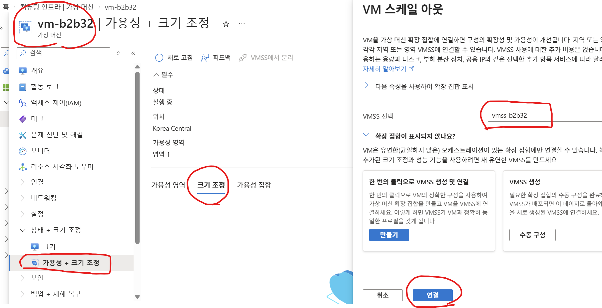
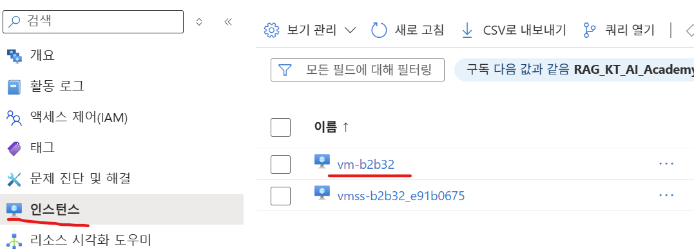
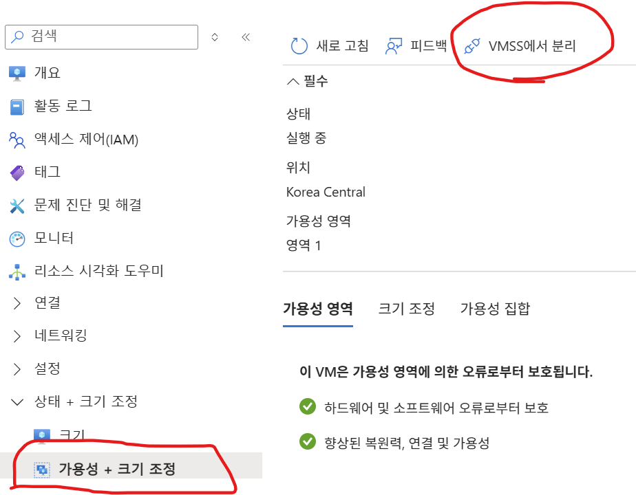

# 기존 VM을 VMSS에 연결

## 1. 실습 개요

기존 독립 VM을 Azure Portal UI에서 Flexible 오케스트레이션 방식의 VMSS에 연결하는 실습임.  
CLI를 사용하지 않고 VMSS 생성, VM 연결, 결과 검증까지 포털에서 수행함.  

### 학습 목표

- 기존 VM 연결을 지원하는 Flexible VMSS 구성 조건 이해
- Azure Portal에서 기존 VM을 VMSS에 연결
- 서로 다른 VM 크기를 사용하는 인스턴스가 하나의 Flexible VMSS에 포함되는 결과 확인
- 연결 시 네트워크와 비용에 미치는 영향 이해

### 실습 결과

| 구분 | 실습 값 |
|---|---|
| 리소스 그룹 | `RG-KT-NEW-FOUNDRY` |
| 기존 VM | `vm-{본인ID}` |
| VMSS | `vmss-{본인ID}` |
| VMSS 생성 인스턴스 크기 | `Standard_B1s` |
| 지역 / 가용성 영역 | Korea Central / 1 |

> 이름은 실습 환경에 맞게 변경 가능함. 기존 VM과 VMSS는 동일한 리소스 그룹에 배치해야 함.

## 2. 기존 VM 연결 조건

Azure Portal의 VMSS 선택 목록에는 다음 조건을 충족하는 VMSS만 표시됨.

| 조건 | 설정 또는 확인 값 |
|---|---|
| 오케스트레이션 모드 | Flexible |
| 장애 도메인 수 | 1 |
| 단일 배치 그룹 | `false` |
| 리소스 그룹 | 기존 VM과 동일 |
| 가용성 영역 | VM의 영역이 VMSS 영역에 포함됨 |
| 디스크 | 관리 디스크 사용 |
| 배치 제약 | 가용성 집합, 근접 배치 그룹, 전용 호스트에 포함되지 않음 |
| VM 크기 | RDMA 또는 단일 배치 그룹 필수 크기가 아님 |

### 2.1 장애 도메인이란

장애 도메인(Fault Domain)은 동일한 전원, 네트워크 또는 물리 하드웨어 장애의 영향을 함께 받을 수 있는  
VM의 물리적 배치 단위임. 여러 장애 도메인에 VM을 분산하면 하나의 랙이나 전원 장치에 장애가 발생해도  
전체 VM이 동시에 중단될 가능성을 줄일 수 있음. 가용성 영역이 데이터센터 수준의 장애를 분리한다면,  
장애 도메인은 같은 지역 또는 영역 내부의 하드웨어 장애를 분리하는 개념임.

Flexible VMSS에서 장애 도메인 수 `1`은 모든 VM을 하나의 랙에 모으는 의미가 아님. Azure가 가능한 범위에서  
인스턴스를 최대한 분산하는 **최대 분산 방식**을 의미함.

기존 VM은 이미 특정 물리 위치에 배치되어 있음. 장애 도메인 수가 `1`인 최대 분산 방식에서는 Azure가 기존  
배치를 유지하면서 VMSS 구성원으로 등록할 수 있음. 공식 문서에서도 이 경우 기존 VM 연결에 다운타임이  
필요하지 않다고 명시함.

반면 장애 도메인 수가 2개 이상이면 VM을 정해진 장애 도메인에 맞춰 배치해야 함. 이미 실행 중인 VM을  
옮기지 않고 이 규칙을 맞추기 어려우므로 Azure는 해당 VMSS에 기존 VM을 연결하거나 분리하는 작업을  
허용하지 않음.

기존 VM은 VMSS의 크기 조정 프로필과 운영 체제, VM 크기, 네트워크 구성이 같지 않아도 연결 가능함.  
본 실습에서도 `Standard_D2alds_v6` VM과 `Standard_B1s` 인스턴스가 하나의 VMSS에 포함됨.

## 3. 기존 VM을 VMSS에 연결

### 3.1 VM 연결 화면 진입

- Azure Portal에서 **가상 머신** 선택
- 기존 VM `vm-{본인ID}` 선택
- '상태 + 크기 조정 > 가용성 + 크기 조정' 선택  
- '크기 조정' 탭 선택 후 '연결' 클릭   
- VMSS 선택 후 '연결' 클릭   
     

### 3.2 VMSS 인스턴스 검증

1. `vmss-{본인ID}` 선택
2. **인스턴스** 선택
3. 추가된 VM 확인
    

서로 다른 크기의 VM이 하나의 Flexible VMSS에 포함되는 것이 정상 결과임.  
연결된 기존 VM은 VMSS 인스턴스 목록에서 유형 **VM**으로 표시됨.

## 4. VMSS에서 분리 

### 4.1 VM 분리
- 분리할 VM `vm-{본인ID}` 선택
- '상태 + 크기 조정 > 가용성 + 크기 조정' 선택  
- 'VMSS'에서 분리 선택  
    

분리 작업은 VM 리소스를 삭제하지 않고 VMSS 구성원 관계만 해제함. 분리된 VM은 독립 VM으로 계속 유지됨.

### 4.2 VMSS 인스턴스 검증
1. `vmss-{본인ID}` 선택
2. **인스턴스** 선택
3. VM 분리 확인  
  
## 5. 참고 자료

- [기존 VM을 VMSS에 연결 또는 분리][a]
- [VMSS Flexible 오케스트레이션][o]

[a]: https://learn.microsoft.com/azure/virtual-machine-scale-sets/virtual-machine-scale-sets-attach-detach-vm
[o]: https://learn.microsoft.com/azure/virtual-machine-scale-sets/virtual-machine-scale-sets-orchestration-modes
