# SKU 변경

## SKU 변경 전 메트릭 관찰과 후보 평가

### 실습 목표

감이 아닌 측정값을 근거로 현재 VM과 세 가지 후보 SKU를 비교함.  
1 ~ 2주 동안 CPU·메모리·디스크 I/O·네트워크를 함께 관찰하고 P95와 피크를 산출함.  
월비용·헤드룸·리스크·다운타임을 동일 기준으로 평가한 뒤 저위험 시간대에 SKU 변경 여부를 판단함.

> [!IMPORTANT]  
> 일반 **메트릭** 화면은 제공되는 Avg·Min·Max 등의 집계 확인에 적합함.  
> 본 실습의 일관된 P95 산출에는 VM Insights의 **로그 기반 메트릭**과 Log Analytics 사용 필요함.  
> VM Insights 화면의 `95th` 선택과 `InsightsMetrics`의 `percentile(Val, 95)` 결과를 함께 확인함.

### WHY: 왜 변경 전에 관찰하는가

- 과대 프로비저닝은 불필요한 월비용 발생 원인임.  
- 과소 프로비저닝은 지연, 스로틀링 및 장애 위험 증가 원인임.  
- 평균값만 사용하면 짧은 피크와 업무 마감·배치 시간의 부하 누락 가능함.  
- P95는 전체 관측값의 95%가 해당 값 이하라는 의미이며, 지속적인 고부하 수준 판단에 유용함.  
- P95는 최대값이 아니므로 `Max` 또는 피크값을 함께 기록해야 함.

### 전체 수행 흐름

1. **관찰**: 1 ~ 2주 동안 CPU·메모리·디스크 I/O·네트워크 수집 및 P95·피크 확인함.  
2. **Advisor 참고**: Azure Advisor의 Right-size 권고와 CPU·네트워크 근거 확인함.  
3. **세 가지 후보 비교**: 월비용·헤드룸·리스크·다운타임을 동일 표에서 비교함.  
4. **적용·재검증**: 저위험 시간대에 변경하고 1 ~ 2주 재관찰하며 단계적으로 축소함.

### 실습 환경과 완료 기준

| 항목 | 실제 실습 값 |  
|---|---|  
| VM | `vm-b2b32` |  
| 지역 | Korea Central |  
| Azure Monitor 작업 영역 | `defaultazuremonitorworkspace-se` |  
| 메트릭 DCR | `msvmi-koreacentral-vm-b2b32` |  
| Log Analytics 작업 영역 | `law-vm-b2b32-p95` |  
| 관찰 기간 | 최소 7일, 권장 14일 |  
| 완료 기준 | P95·피크 산출, 세 후보 평가표 작성, 변경·롤백 기준 합의 |  

본 실습에서는 수집 구성을 실제 Azure에 적용함.  
1 ~ 2주 P95 결과는 시간이 필요하므로 교재의 결과 화면은 `교육용 예시 데이터`로 명확히 구분함.

### 1. 기본 모니터링 화면 확인

1. Azure Portal에서 **가상 머신** > `vm-b2b32` 선택함.  
2. **모니터링** > **인사이트(현재 모니터링)** 선택함.  
3. VM 가용성, Azure 중단, 상태 이벤트와 향상된 모니터링 안내 확인함.

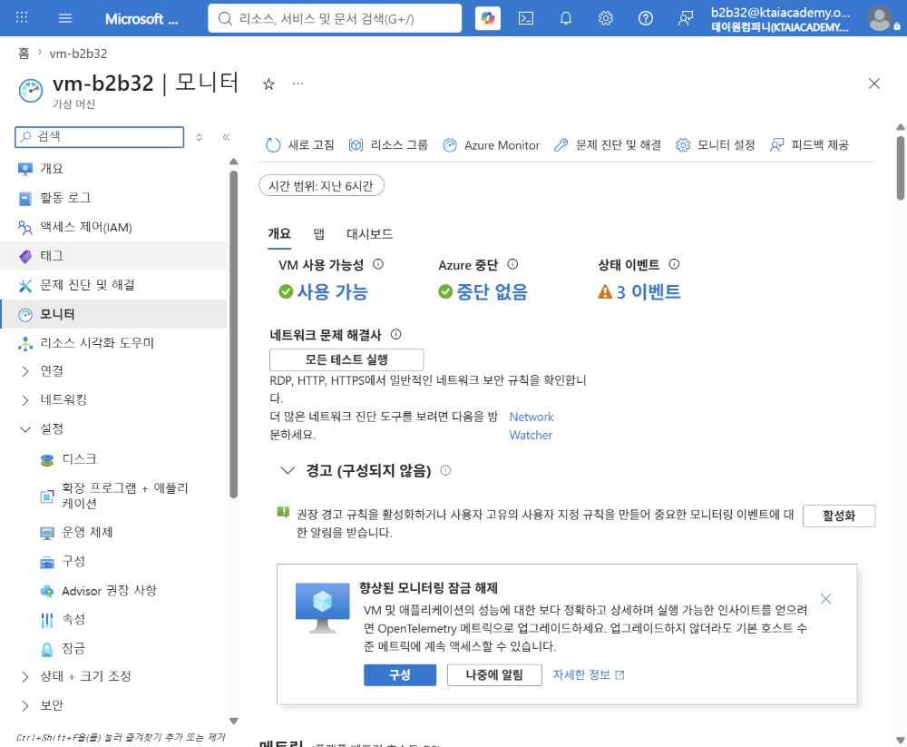

기본 호스트 메트릭은 별도 에이전트 없이 수집되지만 게스트 메모리와 재현 가능한 P95 분석에는 부족함.

### 2. 향상된 모니터링과 VM Insights 구성

1. 향상된 모니터링 안내에서 **구성** 선택함.  
2. `OpenTelemetry 메트릭` 선택 상태 확인함.  
3. Azure Monitor 작업 영역과 DCR 이름 확인함.  
4. 본 실습에서는 알림용 사용자 할당 관리 ID가 없으므로 **권장 경고 활성화** 선택 해제함.  
5. **검토 + 사용** 선택 후 수집 대상 확인함.

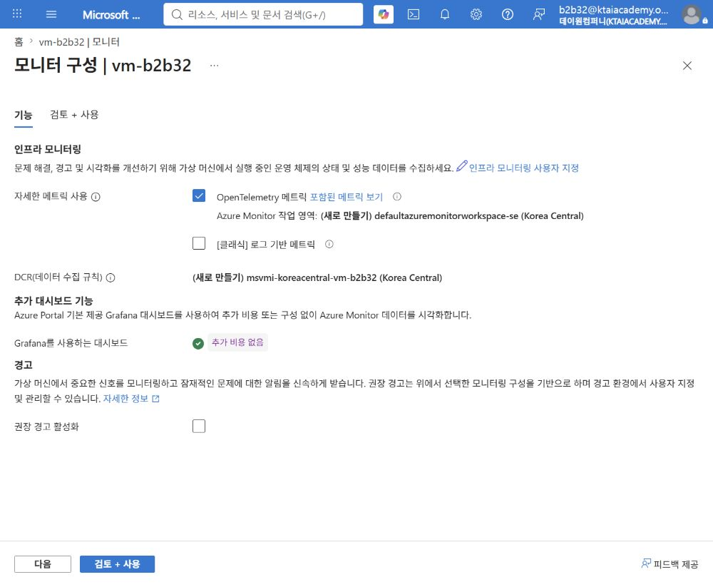

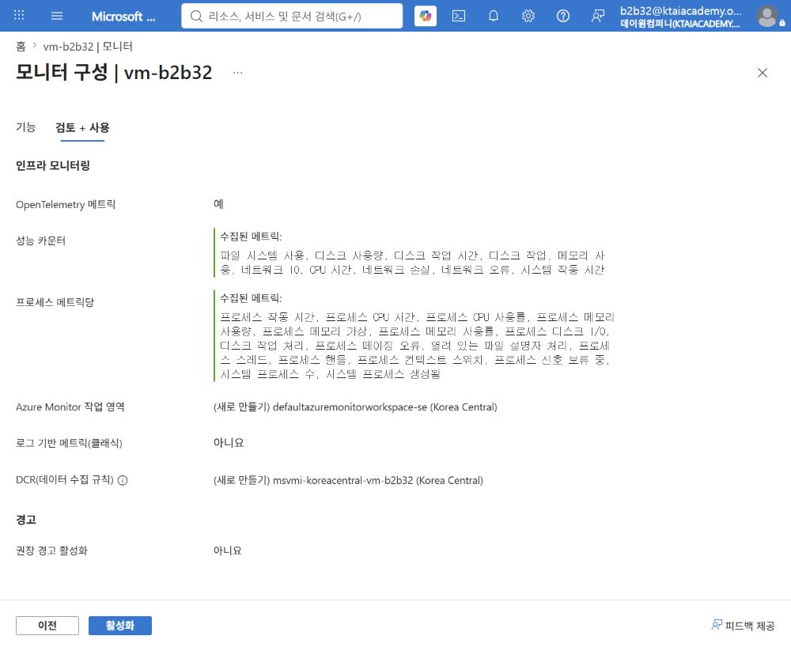

6. **활성화** 선택함.  
7. 온보딩 완료 메시지가 표시될 때까지 대기함.

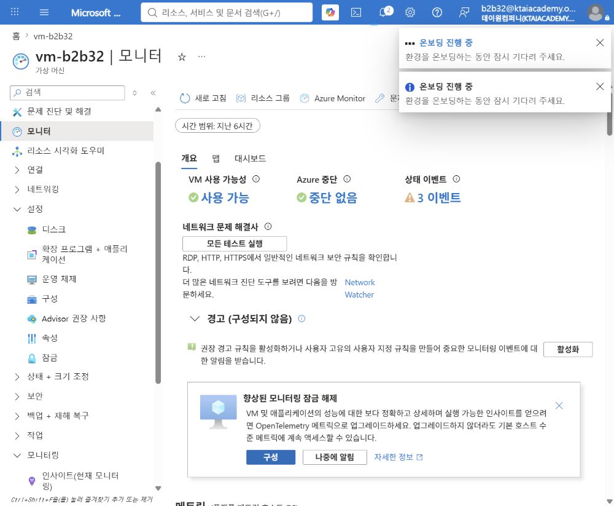

> [!NOTE]  
> OpenTelemetry 메트릭은 실제 메트릭 차트와 기본 Grafana 대시보드에 유용함.  
> 본 실습의 P95 검증과 장기 분석을 위해 다음 단계에서 로그 기반 메트릭도 추가함.

### 3. P95용 로그 기반 메트릭 구성

1. 다시 **모니터링 구성**으로 이동함.  
2. `[클래식] 로그 기반 메트릭` 선택함.  
3. Log Analytics 작업 영역과 `MSVMI-` 계열 DCR 확인함.  
4. 프로세스·종속성 Map 수집은 선택하지 않음.  
5. 권장 경고는 별도 경고 실습에서 구성하므로 선택 해제함.

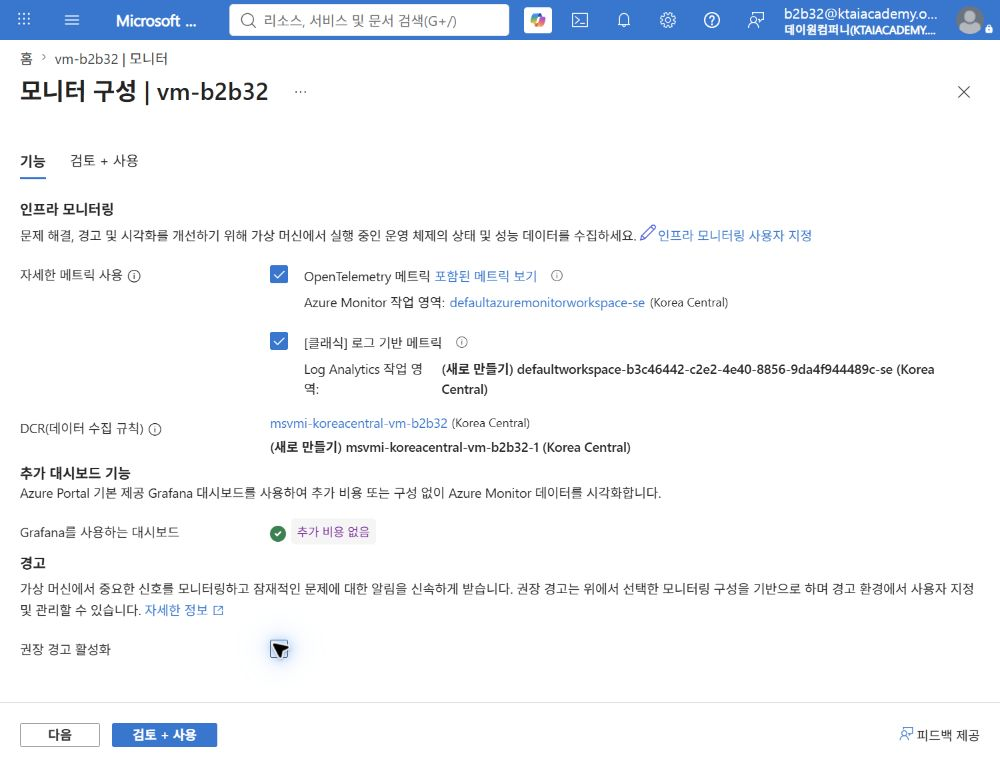

Log Analytics 작업 영역이 없으면 다음 값으로 생성함.

| 항목 | 값 |  
|---|---|  
| 리소스 그룹 | `rg-KT-new-Foundry` |  
| 작업 영역 이름 | `law-vm-b2b32-p95` |  
| 지역 | Korea Central |  
| 가격 책정 계층 | 종량제 |  

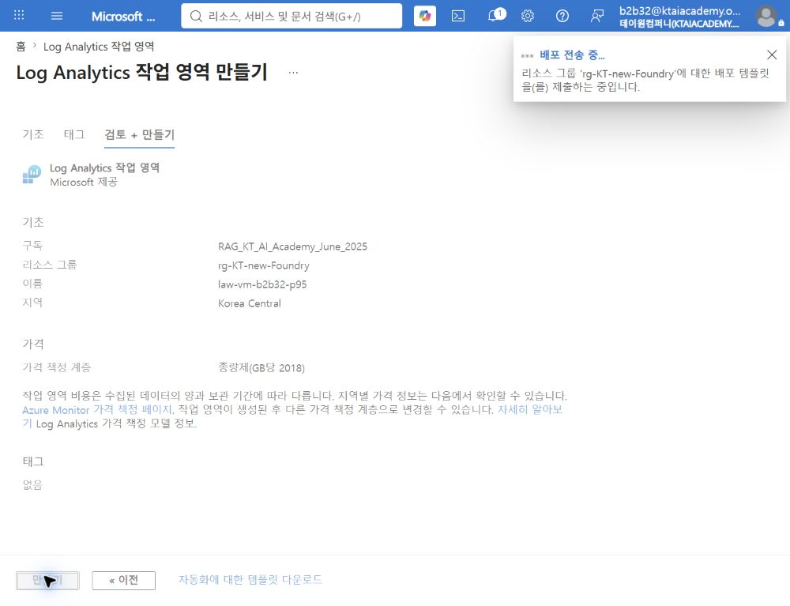

6. **검토 + 사용** > **활성화** 선택함.  
7. Azure Monitor Agent, Log Analytics 작업 영역 및 VM Insights DCR 연결 완료까지 대기함.  
8. 새 데이터가 `InsightsMetrics`에 표시되기까지 수 분 정도 대기함.

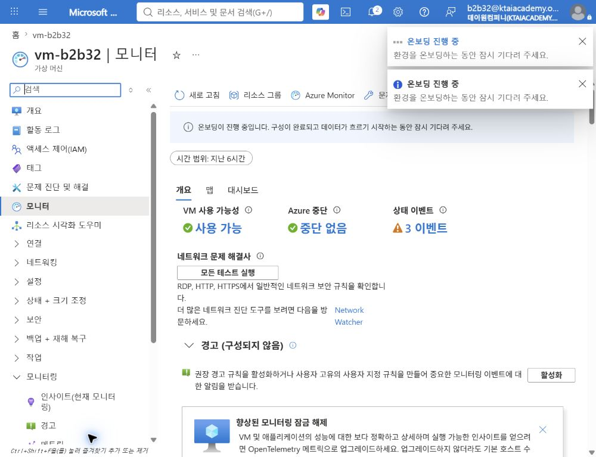

> [!WARNING]  
> Log Analytics는 수집량과 보존 기간에 따라 비용 발생 가능함.  
> 대표 VM에서 먼저 수집량을 확인하고 불필요한 프로세스·종속성·이벤트 로그 수집 제외 필요함.

### 4. 실제 모니터링 화면에서 P95 확인

#### 4.1 일반 메트릭 화면 확인

1. VM 메뉴에서 **모니터링** > **메트릭** 선택함.  
2. 메트릭 네임스페이스를 `가상 머신 호스트`로 설정함.  
3. 메트릭 목록에서 CPU, Available Memory, Data Disk, Network 항목 확인함.

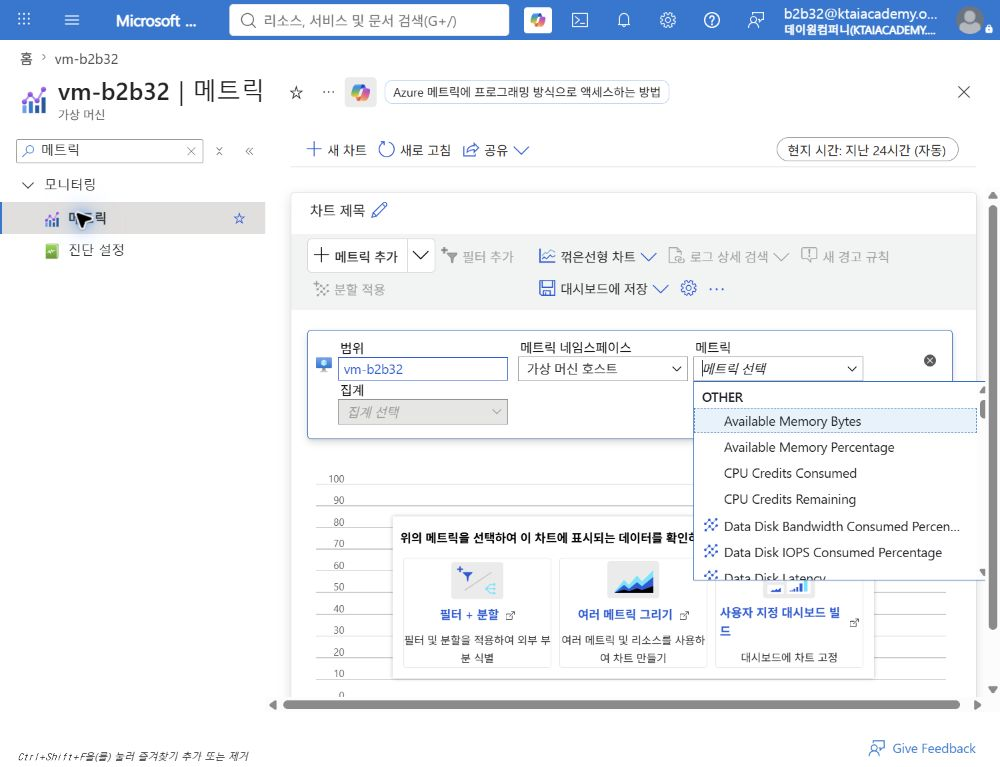

4. `Available Memory Percentage`를 선택하여 게스트 메모리 데이터 수집 여부 확인함.

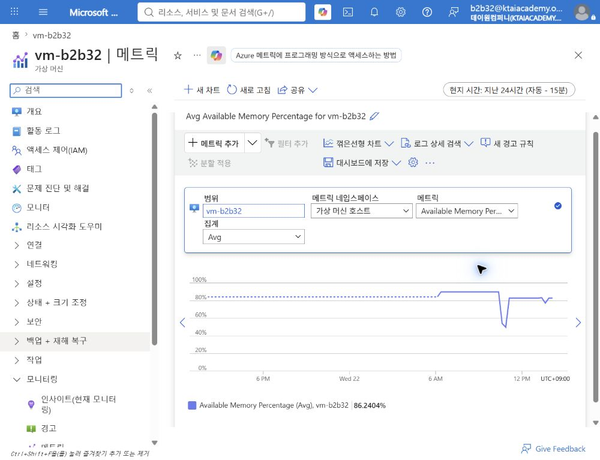

일반 메트릭 화면은 최신 데이터 유입 확인용으로 사용함. 최종 P95 판단은 VM Insights 또는 KQL 결과 사용함.

#### 4.2 VM Insights의 95th 화면 확인

1. VM 메뉴에서 **모니터링** > **인사이트(현재 모니터링)** 선택함.  
2. 상단 시각화에서 `로그 기반 시각화(클래식)` 선택함.  
3. **성능** 탭 선택함.  
4. 시간 범위를 `지난 7일`로 설정함.  
5. 14일 관찰 시 **사용자 지정**으로 시작일과 종료일 지정함.  
6. CPU·메모리·디스크·네트워크 차트마다 `95th` 선택함.  
7. Logical Disk Performance 표의 `P95 IOPs READ`, `P95 IOPs WRITE`, `P95 IOPs TOTAL` 확인함.  
8. 같은 차트에서 `Max`도 확인하여 짧은 피크 기록함.

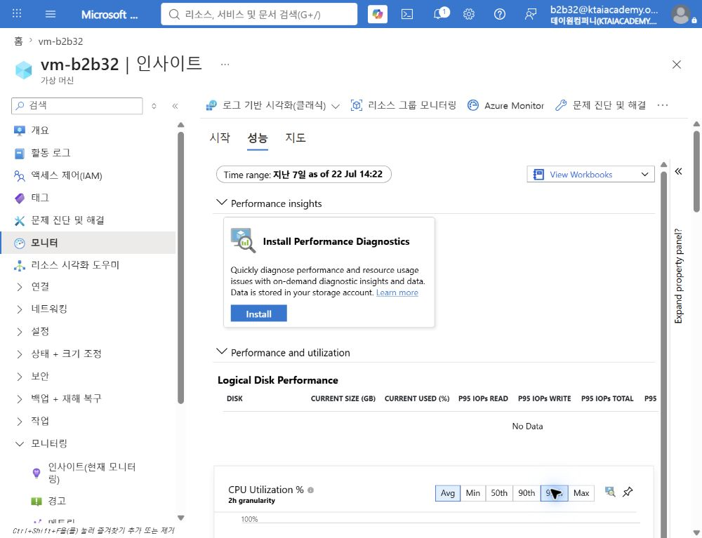

캡처 시점은 수집 직후이므로 `No Data`가 정상임. 1 ~ 2주 뒤 동일 화면에서 실제 값 확인 필요함.

### 5. Log Analytics에서 P95 검증

VM 또는 Log Analytics 작업 영역의 **로그**에서 다음 쿼리를 실행함.  
관찰 중 VM 이름이나 리소스 ID가 다르면 `vm-b2b32` 조건 수정 필요함.

#### CPU 사용률 P95와 피크

```kusto
InsightsMetrics
| where TimeGenerated >= ago(14d)
| where Origin == "vm.azm.ms"
| where Computer =~ "vm-b2b32"
| where Namespace == "Processor" and Name == "UtilizationPercentage"
| summarize CPU_P95 = percentile(Val, 95), CPU_Peak = max(Val) by Computer
```

#### 메모리 사용률 P95와 피크

```kusto
InsightsMetrics
| where TimeGenerated >= ago(14d)
| where Origin == "vm.azm.ms"
| where Computer =~ "vm-b2b32"
| where Namespace == "Memory" and Name == "AvailableMB"
| extend TotalMB = toreal(todynamic(Tags)["vm.azm.ms/memorySizeMB"])
| extend UsedPct = 100.0 - (Val / TotalMB * 100.0)
| summarize Memory_P95 = percentile(UsedPct, 95), Memory_Peak = max(UsedPct) by Computer
```

#### 전체 논리 디스크 IOPS P95와 피크

```kusto
InsightsMetrics
| where TimeGenerated >= ago(14d)
| where Origin == "vm.azm.ms"
| where Computer =~ "vm-b2b32"
| where Namespace == "LogicalDisk" and Name == "TransfersPerSecond"
| summarize TotalIOPS = sum(Val) by bin(TimeGenerated, 1m), Computer
| summarize DiskIOPS_P95 = percentile(TotalIOPS, 95),
    DiskIOPS_Peak = max(TotalIOPS) by Computer
```

#### 전체 네트워크 처리량 P95와 피크

```kusto
InsightsMetrics
| where TimeGenerated >= ago(14d)
| where Origin == "vm.azm.ms"
| where Computer =~ "vm-b2b32"
| where Namespace == "Network"
| where Name in ("ReadBytesPerSecond", "WriteBytesPerSecond")
| summarize BytesPerSec = sum(Val) by bin(TimeGenerated, 1m), Computer
| extend Mbps = BytesPerSec * 8.0 / 1000000.0
| summarize Network_P95_Mbps = percentile(Mbps, 95),
    Network_Peak_Mbps = max(Mbps) by Computer
```

> [!TIP]  
> 여러 디스크나 네트워크 인터페이스는 1분 단위로 먼저 합산한 뒤 P95 계산 필요함.  
> 디바이스별 P95를 더하면 동일 시점의 부하가 아니므로 전체 사용량 과대평가 가능함.

### 6. 교육용 P95 결과 화면

다음 이미지는 실제 포털과 유사하게 만든 **교육용 예시**이며 실제 측정값이 아님.

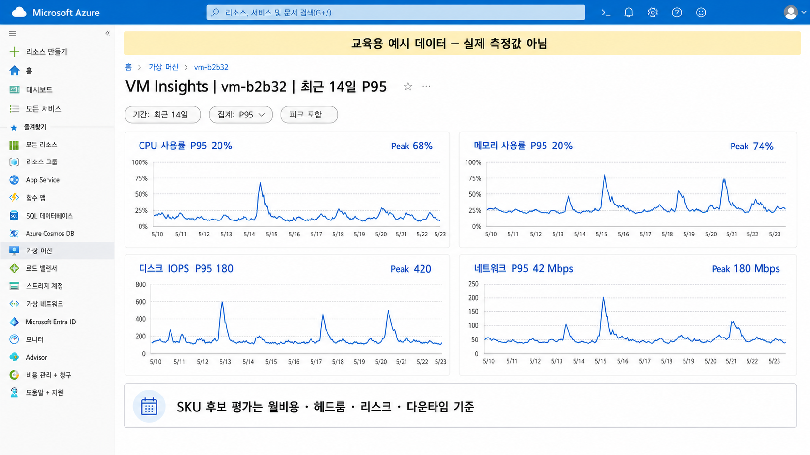

| 관찰 항목 | 예시 P95 | 예시 피크 | 판단 시 확인점 |  
|---|---:|---:|---|  
| CPU 사용률 | 20% | 68% | 지속 사용률과 순간 피크, B 시리즈 CPU 크레딧 |  
| 메모리 사용률 | 20% | 74% | 스왑·OOM 위험과 최소 20 ~ 30% 여유 |  
| 디스크 IOPS | 180 | 420 | 디스크 계층과 VM 양쪽의 IOPS 한도 |  
| 네트워크 | 42Mbps | 180Mbps | VM 크기별 네트워크 한도와 업무 피크 |  

### 7. Azure Advisor 권고 확인

1. VM 메뉴에서 **Advisor 권장 사항** 선택함.  
2. 비용 또는 성능 범주의 VM Right-size 권고 확인함.  
3. 권고 근거 기간, 예상 절감액 및 추천 SKU 기록함.  
4. Advisor 권고를 자동 적용하지 않고 후보 중 하나로만 사용함.

> [!CAUTION]  
> Advisor의 VM 크기 조정 권고는 CPU·아웃바운드 네트워크 중심일 수 있음.  
> 게스트 메모리, 디스크 I/O, 애플리케이션 지연 및 업무 일정은 별도 검증 필요함.

### 8. 세 가지 후보 선정

현재 SKU와 다음 관점의 후보 세 가지 선정함.

- **후보 A**: 동일 계열의 한 단계 축소 SKU로 안정적인 비용 절감 후보임.  
- **후보 B**: B 시리즈 등 버스트형 SKU로 낮은 평균 부하에서 절감 폭이 큰 후보임.  
- **후보 C**: 더 작은 메모리 또는 다른 계열 SKU로 최대 절감 가능하지만 위험이 큰 후보임.

후보는 현재 VM과 같은 지역·가용 영역에서 생성 가능한 SKU로 한정함.  
각 후보의 월비용은 Azure 가격 계산기 또는 Portal의 크기 선택 화면에서 같은 OS·시간 조건으로 확인함.

### 9. 헤드룸 계산

헤드룸은 후보의 할당 한도와 관찰 P95 사이의 여유 비율임.

```text
CPU·메모리 헤드룸(%) = 100 - P95 사용률
디스크 헤드룸(%) = (후보 IOPS 한도 - P95 IOPS) / 후보 IOPS 한도 × 100
네트워크 헤드룸(%) = (후보 네트워크 한도 - P95 처리량) / 후보 네트워크 한도 × 100
```

- 정상 후보: CPU·메모리·디스크·네트워크 헤드룸이 모두 20 ~ 30% 이상인 후보임.  
- 조건부 후보: 한 항목이 20% 미만이지만 업무적으로 완화 가능한 후보임.  
- 제외 후보: P95가 한도를 넘거나 피크 시 스로틀링·메모리 부족 위험이 큰 후보임.

### 10. 후보 평가표 작성

| 구분 | SKU | 월비용 | vCPU/메모리 | 헤드룸 | 리스크 | 다운타임 | 판정 |  
|---|---|---:|---|---|---|---|---|  
| 현재 | `{현재 SKU}` | `{금액}` | `{값}` | 기준 | 없음 | 없음 | 기준선 |  
| 후보 A | `{안정적 축소}` | `{금액}` | `{값}` | CPU·메모리·Disk·NIC | 재부팅 1회 | SLA 내 | 우선 검토 |  
| 후보 B | `{버스트형}` | `{금액}` | `{값}` | CPU 크레딧 포함 | 크레딧 소진 | 재부팅 | 조건부 |  
| 후보 C | `{최대 축소}` | `{금액}` | `{값}` | 최소 헤드룸 | 메모리·I/O 부족 | 할당 취소 가능 | 제외 검토 |  

리스크에는 다음 항목을 기록함.

- B 시리즈 CPU 크레딧 소진 시 성능 저하 가능성  
- 후보 메모리 용량이 P95와 피크를 수용하지 못하는 위험  
- VM 및 디스크 IOPS·처리량 한도 중 더 낮은 한도에 의한 스로틀링 위험  
- 대상 지역·가용 영역에서 후보 SKU 용량 부족 가능성  
- VM 재시작 또는 할당 취소로 인한 계획 다운타임

### 11. 최종 선택 규칙

1. 모든 핵심 메트릭의 헤드룸 20 ~ 30% 이상인 후보만 통과함.  
2. 변경 다운타임이 서비스 SLA와 유지보수 창 안에 있는지 확인함.  
3. 버스트·메모리·디스크·가용 영역 위험을 완화할 수 있는지 확인함.  
4. 통과한 후보 중 월비용이 가장 낮은 SKU 선택함.  
5. 한 번에 여러 단계 축소하지 않고 한 단계씩 적용함.

### 12. 적용과 재검증

1. 저위험 시간대와 롤백 담당자 지정함.  
2. 변경 전 현재 SKU, 디스크, 네트워크 및 애플리케이션 상태 기록함.  
3. 후보 SKU로 변경하고 재부팅 또는 할당 취소 시간 측정함.  
4. 애플리케이션 상태와 오류율 확인함.  
5. 동일한 방법으로 1 ~ 2주 P95와 피크를 다시 관찰함.  
6. 헤드룸 부족, 지연 증가 또는 오류 발생 시 즉시 이전 SKU로 롤백함.

### 참고 자료

- [Azure VM 모니터링 데이터 수집](https://learn.microsoft.com/azure/azure-monitor/vm/monitor-virtual-machine-data-collection)  
- [InsightsMetrics 예제 쿼리](https://learn.microsoft.com/azure/azure-monitor/reference/queries/insightsmetrics)  
- [KQL percentile 함수](https://learn.microsoft.com/kusto/query/percentiles-aggregation-function)  
- [Azure Managed Disk 성능 메트릭](https://learn.microsoft.com/azure/virtual-machines/disks-metrics)  
- [Azure 가격 계산기](https://azure.microsoft.com/pricing/calculator/)

## VM

### VM 생성

- 가상 머신 이름: `vm-{본인ID}`  
  

- 크기: `D2s_v6`  
  

- SSH 키: `vm_key`  
  

### SKU 변경


화면 맨 오른쪽의 월별 예상 비용 확인 필요  


## Disk

### 실습 목표

Azure Managed Disk의 SKU를 `Standard SSD LRS`에서 `Premium SSD LRS`로 변경한 뒤 원래 SKU로 복원함.  
운영체제 디스크 대신 비어 있는 데이터 디스크를 사용하여 실습 위험 최소화 및 SKU별 비용·성능 차이 확인함.

> [!NOTE]  
> 이 실습은 Azure Files의 파일 공유가 아닌 VM에 연결하는 Azure Managed Disk 대상임.  
> 디스크 SKU 변경은 디스크 용량이나 게스트 운영체제의 파일 시스템 크기 변경과 별개임.

### Disk SKU 이해

Disk SKU는 관리 디스크의 저장 매체, 성능 특성, 가용 기능 및 과금 수준을 구분하는 유형임.  
워크로드의 IOPS, 처리량, 지연 시간, 가용성 및 비용 요구사항에 맞춰 선택함.

| SKU | 핵심 차이 | 운영 환경 유즈케이스 |  
|---|---|---|  
| Standard HDD | 자기 디스크 기반의 가장 낮은 비용, 높은 지연 시간 | 백업·아카이브, 액세스 빈도가 낮은 비핵심 데이터 |  
| Standard SSD | SSD 기반의 비용·성능 균형 | 개발·테스트, 웹 서버, 사용량이 적은 업무 시스템 |  
| Premium SSD | 크기별 P 계층으로 성능 제공, 낮은 지연 시간 | 운영 DB, 업무 핵심 애플리케이션, 성능 민감 워크로드 |  
| Premium SSD v2 | 용량·IOPS·처리량의 독립 조정, OS 디스크 미지원 | 데이터 디스크 성능을 세밀하게 조정하는 운영 DB |  
| Ultra Disk | 가장 높은 IOPS·처리량과 세밀한 성능 조정, OS 디스크 미지원 | SAP HANA, 고성능 DB, 초저지연 데이터 디스크 |

Standard HDD, Standard SSD 및 Premium SSD는 관리 디스크에서 SKU 간 직접 변경 가능함.  
Premium SSD v2와 Ultra Disk는 지원 지역, VM 크기, 연결 방식 및 변환 절차가 다르므로 별도 확인 필요함.

### Disk SKU 현재 비용 비교

> [!NOTE]  
> **디스크 계층(Disk tier)**은 미리 정의된 용량과 기본 성능을 묶어 구분한 단계임.  
> Standard HDD는 `S`, Standard SSD는 `E`, Premium SSD는 `P`와 숫자로 표시함.  
> 예를 들어 32GiB 디스크는 S4, E4 또는 P4이며, 같은 용량이어도 SKU에 따라 IOPS·처리량·가격이 다름.  
> 고정 계층형 디스크는 실제 데이터 사용량이 아니라 프로비전된 계층을 기준으로 과금됨.  
> 디스크 계층은 Blob의 핫·쿨·보관 액세스 계층이나 LRS·ZRS 같은 중복성 옵션과 다른 개념임.

2026년 7월 22일 Azure Retail Prices API 조회값이며, `Korea Central`, LRS, USD 소매가 기준임.  
계약 할인, Azure 크레딧, 세금, 환율 및 디스크 작업·스냅샷·공유 디스크 추가 요금은 포함하지 않음.

#### 고정 계층형 SKU의 32GiB 비교

| Disk SKU | 32GiB 계층 | 월 소매가 | 과금 특징 |  
|---|---|---|---|  
| Standard HDD LRS | S4 | `$1.536` | 디스크 작업 10,000건당 `$0.0005` 별도 |  
| Standard SSD LRS | E4 | `$2.40` | 트랜잭션 비용 별도 |  
| Premium SSD LRS | P4 | `$5.2795` | 계층에 포함된 성능 제공 |  

S4, E4 및 P4는 모두 32GiB이지만 IOPS·처리량·지연 시간과 트랜잭션 과금 구조가 다름.

#### 구성형 SKU의 32GiB 용량 비용

| Disk SKU | 730시간 기준 월 환산액 | 별도 과금 |  
|---|---:|---|  
| Premium SSD v2 LRS | 약 `$2.92` | 기본 3,000 IOPS·125MB/s 초과 성능 |  
| Ultra Disk LRS | 약 `$5.1626` | 프로비전된 IOPS 및 처리량 |  

Premium SSD v2와 Ultra Disk는 용량·IOPS·처리량을 독립 설정하므로 고정 계층형 SKU와 직접 비교하기 어려움.  
Ultra Disk의 월 환산액은 용량 비용만 포함하므로 실제 총액 계산 시 IOPS와 처리량 비용을 반드시 더해야 함.

Premium SSD v2는 3,000 IOPS 초과분에 IOPS당 시간당 `$0.000008`, 125MB/s 초과분에  
MB/s당 시간당 `$0.000063` 추가 과금됨. Ultra Disk는 GiB당 시간당 `$0.000221`, 프로비전된 IOPS당  
시간당 `$0.000092`, 프로비전된 MB/s당 시간당 `$0.00049`를 합산함.

#### 본 실습의 비용 차이

| 상태 | 월 소매가 | E1 대비 차이 |  
|---|---:|---:|  
| Standard SSD E1 | `$0.30` | 기준 |  
| Premium SSD P1 | `$0.81` | `+$0.51`, 약 `+170%` |  

관리 디스크는 선택한 계층의 월 가격을 시간 단위로 비례 계산하여 청구함.  
따라서 짧은 실습에서 SKU를 P1으로 변경한 시간만큼만 P1 요율이 적용되며, 표시된 월 전체 금액이 청구되지 않음.

### 실습 환경

| 항목 | 실제 실습 값 |  
|---|---|  
| 가상 머신 | `vm-b2b32` |  
| 리소스 그룹 | `RG-KT-NEW-FOUNDRY` |  
| VM 크기 | `Standard_D2alds_v6` |  
| 실습 디스크 | `disk-vm-b2b32-sku-lab` |  
| 디스크 용량 | 4GiB |  
| 변경 경로 | Standard SSD LRS E1 → Premium SSD LRS P1 → Standard SSD LRS E1 |

### 1. 실습용 데이터 디스크 만들기

1. Azure Portal에서 **가상 머신** > `vm-b2b32` > **설정** > **디스크**로 이동함.  
2. **새 디스크 만들기 및 연결** 선택함.  
3. 다음 값을 입력함.

   | 항목 | 값 |  
   |---|---|  
   | 디스크 이름 | `disk-vm-b2b32-sku-lab` |  
   | 스토리지 유형 | `표준 SSD LRS` |  
   | 크기 | `4GiB` |  
   | 호스트 캐싱 | `없음` |

4. **적용** 선택함.  
   

5. 데이터 디스크가 `Standard SSD LRS`, 4GiB로 연결되었는지 확인함.  
   

### 2. VM 중지 및 할당 취소

1. VM **개요**에서 **중지** 선택함.  
2. 상태가 `중지됨(할당 취소됨)`으로 바뀔 때까지 대기함.


> [!IMPORTANT]  
> Standard HDD, Standard SSD 및 Premium SSD 간 변환 시 VM 중지 및 할당 취소 권장됨.  
> OS 디스크는 변환 과정에서 VM 재시작이 필요하며, 변경 전 백업 또는 스냅샷 생성 권장됨.

### 3. Premium SSD로 변경

1. **설정** > **디스크**에서 `disk-vm-b2b32-sku-lab` 선택함.  
2. 디스크 메뉴에서 **크기 + 성능** 선택함.  
3. **스토리지 유형**을 `프리미엄 SSD(로컬 중복 스토리지)`로 변경함.  
4. 4GiB 행의 `P1` 계층 선택 상태 확인함.


5. **저장** 선택함.  
6. `디스크 업데이트됨` 알림과 `Premium SSD LRS`, `P1` 표시 확인함.


### 4. Standard SSD로 복원

실습 후 불필요한 Premium SSD 비용 방지를 위해 원래 SKU로 복원함.

1. **스토리지 유형**을 `표준 SSD(로컬 중복 스토리지)`로 변경함.  
2. 4GiB 행의 `E1` 계층 선택 상태 확인함.


3. **저장** 선택함.  
4. `디스크 업데이트됨` 알림과 `Standard SSD LRS`, `E1` 표시 확인함.


### 5. VM 다시 시작

1. VM **개요**로 이동함.  
2. **시작** 선택함.  
3. 상태가 `실행 중`인지 확인함.


### 결과 확인

| 확인 항목 | 결과 |  
|---|---|  
| Premium SSD 적용 | `P1`, 4GiB 적용 및 성공 알림 확인 |  
| Standard SSD 복원 | `E1`, 4GiB 적용 및 성공 알림 확인 |  
| 디스크 용량 | 변경 전후 4GiB 유지 |  
| 최종 VM 상태 | 실행 중 |

### 운영 시 주의사항

- 디스크 유형 변경은 디스크당 하루 최대 두 번 가능함. 본 왕복 실습은 당일 변경 한도 두 회를 모두 사용함.  
- Premium SSD 사용 전 VM 크기의 Premium Storage 지원 여부 확인 필요함.  
- SKU를 높이면 저장 용량이 같아도 비용이 증가하며, 변경된 SKU 기준으로 과금됨.  
- VM을 할당 취소해도 관리 디스크에는 계속 비용이 발생함.  
- Premium SSD의 성능 계층 변경과 디스크 SKU 변경은 서로 다른 작업임.  
- Premium SSD v2와 Ultra Disk는 본 실습의 직접 변환 절차를 그대로 적용하지 않음.  
- 실습이 끝나고 데이터가 필요 없으면 데이터 디스크 분리 후 디스크 리소스 삭제 필요함.

### 참고 자료

- [Azure Managed Disk 유형](https://learn.microsoft.com/azure/virtual-machines/disks-types)  
- [Azure Managed Disk 유형 변환](https://learn.microsoft.com/azure/virtual-machines/disks-convert-types)  
- [Premium SSD 성능 계층 변경](https://learn.microsoft.com/azure/virtual-machines/disks-change-performance)  
- [Azure Managed Disks 가격](https://azure.microsoft.com/pricing/details/managed-disks/)  
- [Azure Retail Prices API](https://learn.microsoft.com/rest/api/cost-management/retail-prices/azure-retail-prices)
