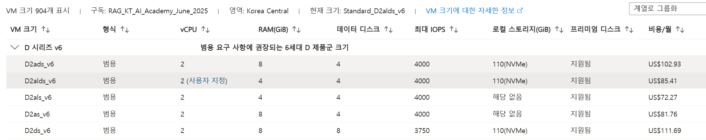
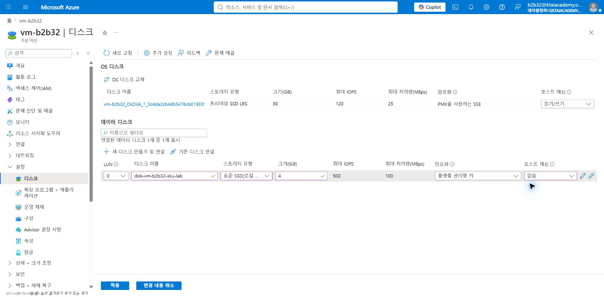
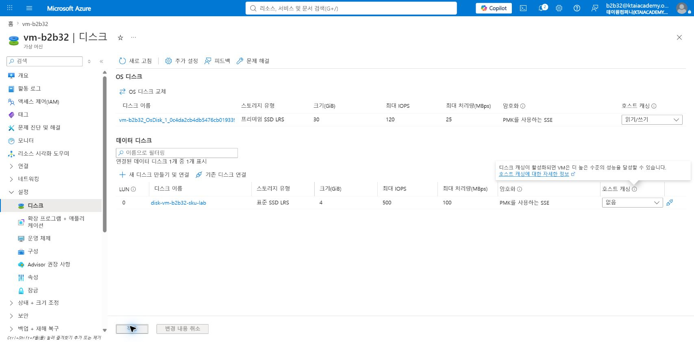
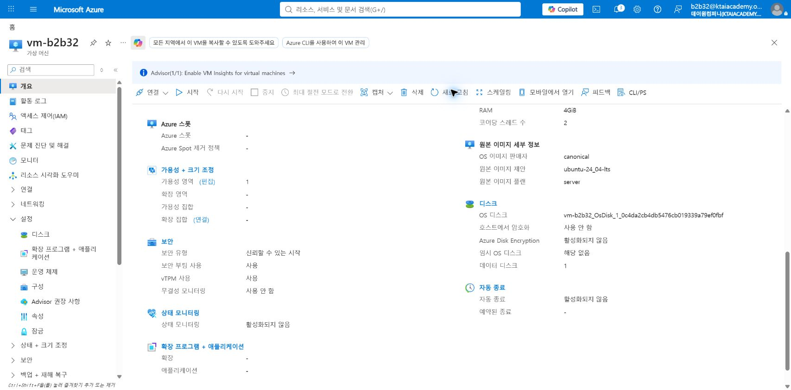
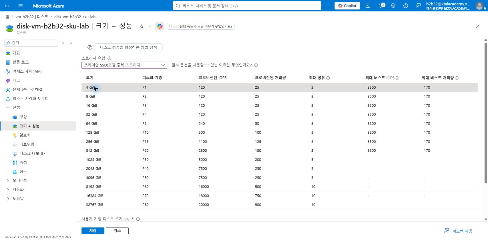
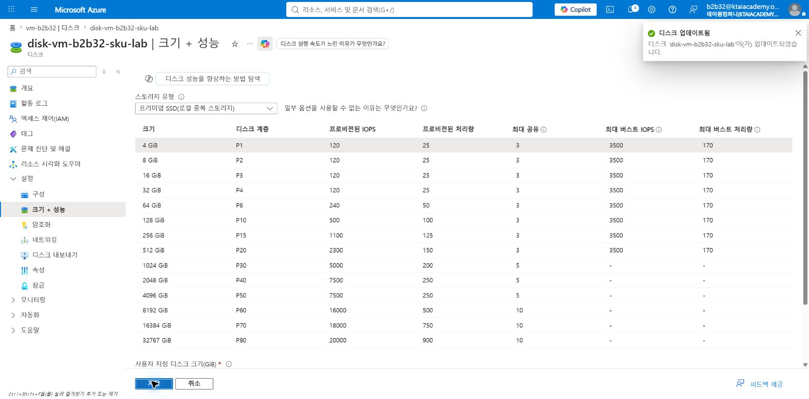
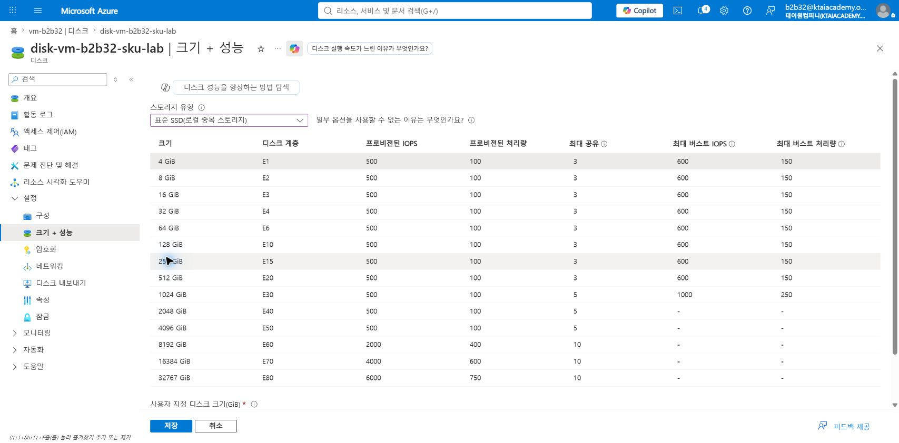
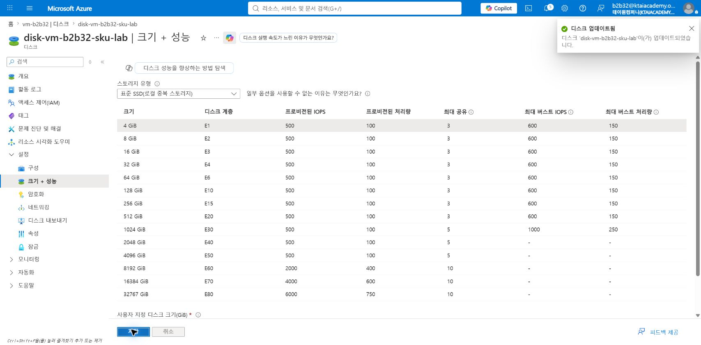
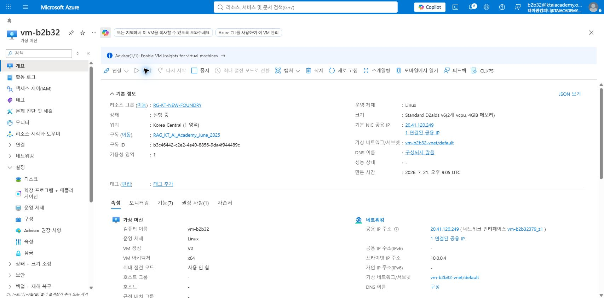

# SKU 변경

## VM

### VM 생성

- 가상 머신 이름: `vm-{본인ID}`  
  

- 크기: `D2s_v6`  
  

- SSH 키: `vm_key`  
  

### SKU 변경

화면 맨 오른쪽의 월별 예상 비용 확인 필요  

## Disk

### 실습 목표

Azure Managed Disk의 SKU를 `Standard SSD LRS`에서 `Premium SSD LRS`로 변경한 뒤 원래 SKU로 복원함.  
운영체제 디스크 대신 비어 있는 데이터 디스크를 사용하여 실습 위험 최소화 및 SKU별 비용·성능 차이 확인함.

> [!NOTE]  
> 이 실습은 Azure Files의 파일 공유가 아닌 VM에 연결하는 Azure Managed Disk 대상임.  
> 디스크 SKU 변경은 디스크 용량이나 게스트 운영체제의 파일 시스템 크기 변경과 별개임.

### Disk SKU 이해

Disk SKU는 관리 디스크의 저장 매체, 성능 특성, 가용 기능 및 과금 수준을 구분하는 유형임.  
워크로드의 IOPS, 처리량, 지연 시간, 가용성 및 비용 요구사항에 맞춰 선택함.

| SKU | 핵심 차이 | 운영 환경 유즈케이스 |  
|---|---|---|  
| Standard HDD | 자기 디스크 기반의 가장 낮은 비용, 높은 지연 시간 | 백업·아카이브, 액세스 빈도가 낮은 비핵심 데이터 |  
| Standard SSD | SSD 기반의 비용·성능 균형 | 개발·테스트, 웹 서버, 사용량이 적은 업무 시스템 |  
| Premium SSD | 크기별 P 계층으로 성능 제공, 낮은 지연 시간 | 운영 DB, 업무 핵심 애플리케이션, 성능 민감 워크로드 |  
| Premium SSD v2 | 용량·IOPS·처리량의 독립 조정, OS 디스크 미지원 | 데이터 디스크 성능을 세밀하게 조정하는 운영 DB |  
| Ultra Disk | 가장 높은 IOPS·처리량과 세밀한 성능 조정, OS 디스크 미지원 | SAP HANA, 고성능 DB, 초저지연 데이터 디스크 |

Standard HDD, Standard SSD 및 Premium SSD는 관리 디스크에서 SKU 간 직접 변경 가능함.  
Premium SSD v2와 Ultra Disk는 지원 지역, VM 크기, 연결 방식 및 변환 절차가 다르므로 별도 확인 필요함.

### 실습 환경

| 항목 | 실제 실습 값 |  
|---|---|  
| 가상 머신 | `vm-b2b32` |  
| 리소스 그룹 | `RG-KT-NEW-FOUNDRY` |  
| VM 크기 | `Standard_D2alds_v6` |  
| 실습 디스크 | `disk-vm-b2b32-sku-lab` |  
| 디스크 용량 | 4GiB |  
| 변경 경로 | Standard SSD LRS E1 → Premium SSD LRS P1 → Standard SSD LRS E1 |

### 1. 실습용 데이터 디스크 만들기

1. Azure Portal에서 **가상 머신** > `vm-b2b32` > **설정** > **디스크**로 이동함.  
2. **새 디스크 만들기 및 연결** 선택함.  
3. 다음 값을 입력함.

   | 항목 | 값 |  
   |---|---|  
   | 디스크 이름 | `disk-vm-b2b32-sku-lab` |  
   | 스토리지 유형 | `표준 SSD LRS` |  
   | 크기 | `4GiB` |  
   | 호스트 캐싱 | `없음` |

4. **적용** 선택함.  
   

5. 데이터 디스크가 `Standard SSD LRS`, 4GiB로 연결되었는지 확인함.  
   

### 2. VM 중지 및 할당 취소

1. VM **개요**에서 **중지** 선택함.  
2. 상태가 `중지됨(할당 취소됨)`으로 바뀔 때까지 대기함.

> [!IMPORTANT]  
> Standard HDD, Standard SSD 및 Premium SSD 간 변환 시 VM 중지 및 할당 취소 권장됨.  
> OS 디스크는 변환 과정에서 VM 재시작이 필요하며, 변경 전 백업 또는 스냅샷 생성 권장됨.

### 3. Premium SSD로 변경

1. **설정** > **디스크**에서 `disk-vm-b2b32-sku-lab` 선택함.  
2. 디스크 메뉴에서 **크기 + 성능** 선택함.  
3. **스토리지 유형**을 `프리미엄 SSD(로컬 중복 스토리지)`로 변경함.  
4. 4GiB 행의 `P1` 계층 선택 상태 확인함.

5. **저장** 선택함.  
6. `디스크 업데이트됨` 알림과 `Premium SSD LRS`, `P1` 표시 확인함.

### 4. Standard SSD로 복원

실습 후 불필요한 Premium SSD 비용 방지를 위해 원래 SKU로 복원함.

1. **스토리지 유형**을 `표준 SSD(로컬 중복 스토리지)`로 변경함.  
2. 4GiB 행의 `E1` 계층 선택 상태 확인함.

3. **저장** 선택함.  
4. `디스크 업데이트됨` 알림과 `Standard SSD LRS`, `E1` 표시 확인함.

### 5. VM 다시 시작

1. VM **개요**로 이동함.  
2. **시작** 선택함.  
3. 상태가 `실행 중`인지 확인함.

### 결과 확인

| 확인 항목 | 결과 |  
|---|---|  
| Premium SSD 적용 | `P1`, 4GiB 적용 및 성공 알림 확인 |  
| Standard SSD 복원 | `E1`, 4GiB 적용 및 성공 알림 확인 |  
| 디스크 용량 | 변경 전후 4GiB 유지 |  
| 최종 VM 상태 | 실행 중 |

### 운영 시 주의사항

- 디스크 유형 변경은 디스크당 하루 최대 두 번 가능함. 본 왕복 실습은 당일 변경 한도 두 회를 모두 사용함.  
- Premium SSD 사용 전 VM 크기의 Premium Storage 지원 여부 확인 필요함.  
- SKU를 높이면 저장 용량이 같아도 비용이 증가하며, 변경된 SKU 기준으로 과금됨.  
- VM을 할당 취소해도 관리 디스크에는 계속 비용이 발생함.  
- Premium SSD의 성능 계층 변경과 디스크 SKU 변경은 서로 다른 작업임.  
- Premium SSD v2와 Ultra Disk는 본 실습의 직접 변환 절차를 그대로 적용하지 않음.  
- 실습이 끝나고 데이터가 필요 없으면 데이터 디스크 분리 후 디스크 리소스 삭제 필요함.

### 참고 자료

- [Azure Managed Disk 유형](https://learn.microsoft.com/azure/virtual-machines/disks-types)  
- [Azure Managed Disk 유형 변환](https://learn.microsoft.com/azure/virtual-machines/disks-convert-types)  
- [Premium SSD 성능 계층 변경](https://learn.microsoft.com/azure/virtual-machines/disks-change-performance)
