# SKU 변경

## SKU 변경 전 메트릭 관찰과 후보 평가

### 실습 목표

감이 아닌 측정값을 근거로 현재 VM과 세 가지 후보 SKU를 비교함.  
1 ~ 2주 동안 CPU·메모리·디스크 I/O·네트워크를 함께 관찰하고 P95와 피크를 산출함.  
월비용·헤드룸·리스크·다운타임을 동일 기준으로 평가한 뒤 저위험 시간대에 SKU 변경 여부를 판단함.

> [!IMPORTANT]  
> 일반 **메트릭** 화면은 제공되는 Avg·Min·Max 등의 집계 확인에 적합함.  
> 본 실습의 일관된 P95 산출에는 VM Insights의 **로그 기반 메트릭**과 Log Analytics 사용 필요함.  
> VM Insights에서 사용량 지표는 `95th`, 가용 메모리는 `5th`를 선택함.  
> `InsightsMetrics`에서는 메모리를 사용률로 변환한 뒤 `percentile(UsedPct, 95)` 결과를 확인함.

### WHY: 왜 변경 전에 관찰하는가

- 과대 프로비저닝은 불필요한 월비용 발생 원인임.  
- 과소 프로비저닝은 지연, 스로틀링 및 장애 위험 증가 원인임.  
- 평균값만 사용하면 짧은 피크와 업무 마감·배치 시간의 부하 누락 가능함.  
- P95는 전체 관측값의 95%가 해당 값 이하라는 의미이며, 지속적인 고부하 수준 판단에 유용함.  
- P95는 최대값이 아니므로 `Max` 또는 피크값을 함께 기록해야 함.

### 전체 수행 흐름

1. **관찰**: 1 ~ 2주 동안 CPU·메모리·디스크 I/O·네트워크 수집 및 P95·피크 확인함.  
2. **Advisor 참고**: Azure Advisor의 Right-size 권고와 CPU·네트워크 근거 확인함.  
3. **세 가지 후보 비교**: 월비용·헤드룸·리스크·다운타임을 동일 표에서 비교함.  
4. **적용·재검증**: 저위험 시간대에 변경하고 1 ~ 2주 재관찰하며 단계적으로 축소함.

### 사전작업: VM 생성
https://github.com/unicorn-campus/finops-handson/blob/main/hands-on/10.vm-automation.md#4-vm-%EC%83%9D%EC%84%B1


### 1. 기본 모니터링 화면 확인

1. Azure Portal에서 **가상 머신** > `vm-{id}` 선택함.  
2. **모니터링** > **인사이트(현재 모니터링)** 선택함.  
   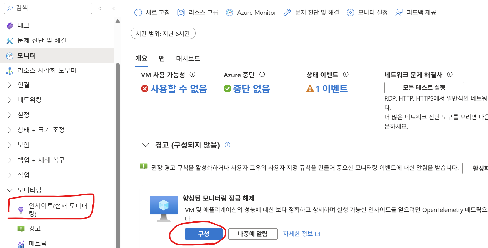   
3. 향상된 모니터링 잠금 해제 박스에서 '구성' 클릭  

※ 기본 호스트 메트릭은 별도 에이전트 없이 수집되지만 게스트 메모리와 재현 가능한 P95 분석에는 부족함.
  
### 2. 향상된 모니터링과 VM Insights 구성

- '[클래식] 로그 기반 메트릭' 체크   
- **검토 + 사용** 선택 후 수집 대상 확인함.
  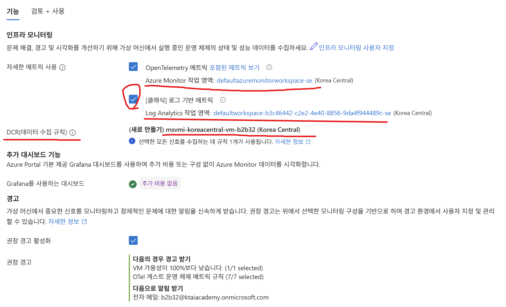  

- **활성화** 선택함.  
- 온보딩 완료 메시지가 표시될 때까지 대기함.

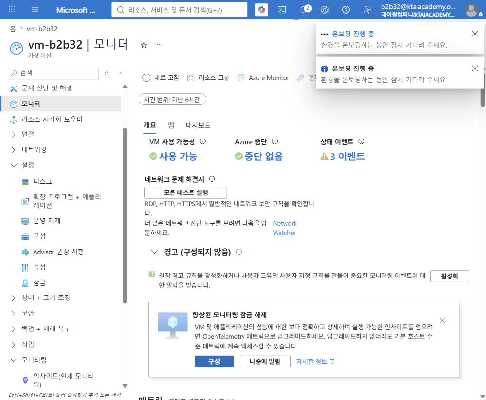

> [!NOTE]  
> OpenTelemetry 메트릭은 실제 메트릭 차트와 기본 Grafana 대시보드에 유용함.  
> 본 실습의 P95 검증과 장기 분석을 위해 로그 기반 메트릭도 추가함.

> [!WARNING]  
> Log Analytics는 수집량과 보존 기간에 따라 비용 발생 가능함.  
> 대표 VM에서 먼저 수집량을 확인하고 불필요한 프로세스·종속성·이벤트 로그 수집 제외 필요함.

### 3. 실제 모니터링 화면에서 P95 확인

#### 3.1 일반 메트릭 화면 확인

1. VM 메뉴에서 **모니터링** > **메트릭** 선택함.  
2. 메트릭 네임스페이스를 `가상 머신 호스트`로 설정함.  
3. 메트릭 목록에서 CPU, Available Memory, Data Disk, Network 항목 확인함.

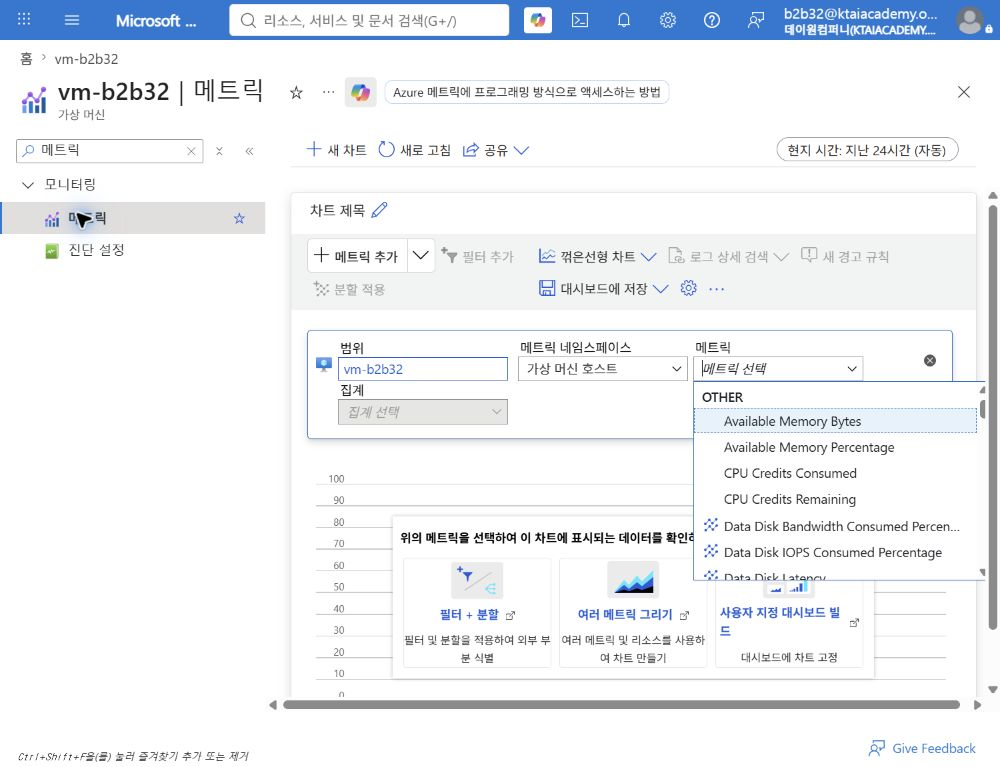

4. `Available Memory Percentage`를 선택하여 게스트 메모리 데이터 수집 여부 확인함.

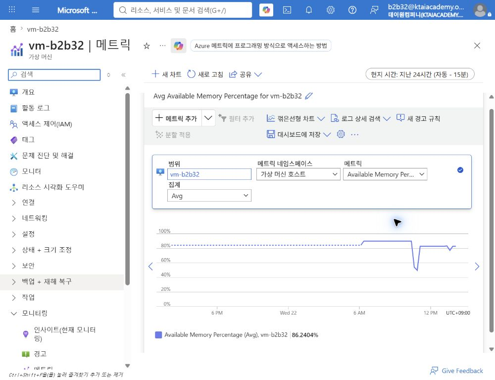

일반 메트릭 화면은 최신 데이터 유입 확인용으로 사용함.   
최종 P95 판단은 **VM Insights** 또는 **KQL(Kusto Query Language) 결과** 사용함.
※ Kusto: 프랑스의 해양 탐험가 자크 쿠스토(Jacques Cousteau)에서 따옴. 데이터의 바다를 탐험한다는 의미    
  
#### 3.2 VM Insights의 P95 화면 확인

- VM 메뉴에서 **모니터링** > **인사이트(현재 모니터링)** 선택함.  
- 상단 시각화에서 `로그 기반 시각화(클래식)` 선택함.  
    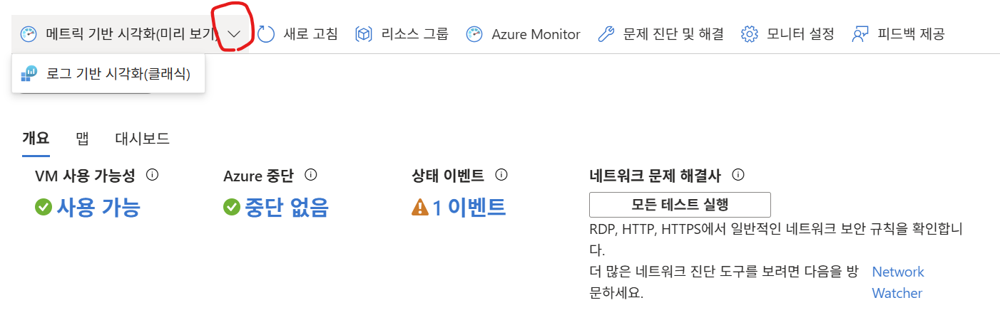  

- **성능** 탭 선택함.  
- 시간 범위를 `지난 7일`로 설정함.  사용자 지정으로 기간 설정 가능함.   

※ 캡처 시점은 수집 직후이므로 `No Data`가 정상임. 1 ~ 2주 뒤 동일 화면에서 실제 값 확인 필요함.

> [!IMPORTANT]  
> `Available Memory`는 값이 작을수록 메모리 사용량이 큰 역방향 지표임.  
> 따라서 메모리 사용량 P95는 가용 메모리 P5에 대응하며 다음 식으로 변환함.

```text
메모리 사용량 P95 = 전체 메모리 - 가용 메모리 P5
메모리 사용률 P95(%) = (전체 메모리 - 가용 메모리 P5) / 전체 메모리 × 100
```

| 화면 지표 | 설명 | 지속적인 고사용량 판단 | 순간 최악값 |
|---|---|---|---|
| CPU Utilization | VM CPU 사용률 | `95th` | `Max` |
| Available Memory | 사용 가능한 물리 메모리 양 | `5th` | `Min` |
| Logical Disk IOPS | 디스크 입출력 활동량(오퍼레이션 수) | `95th` | `Max` |
| Logical Disk Byte/s | 디스크 읽기·쓰기 처리량(초당 데이터 전송량) | `95th` | `Max` |
| Max Logical Disk Used % | 파티션별(`\boot\efi`·`\boot`·`\` 등) 디스크 공간 사용률 | `95th` | `Max` |

### 3.3 Log Analytics에서 P95 검증: KQL 사용

- "모니터링 > 로그" 클릭  
- 쿼리 편집기 우측 상단의 `단순 모드`를 선택하고 `KQL 모드`로 변경함.  
- 아래 쿼리 중 하나를 편집기에 붙여넣고 **실행** 또는 `Shift+Enter` 선택함.
  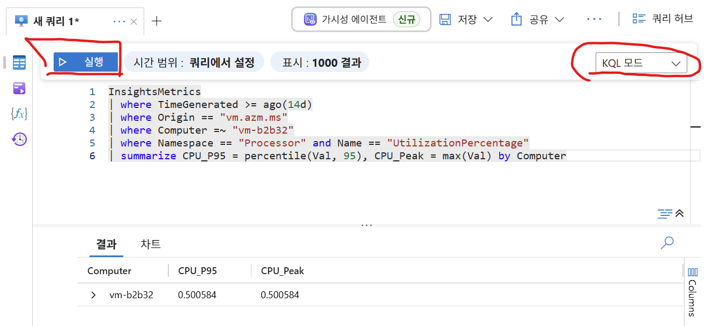  

> [!NOTE]  
> VM의 **모니터링** > **로그**에서도 실행 가능하지만 VM과 작업 영역 연결이 완료되어야 함.  
> 온보딩 안내가 표시되면 Log Analytics 작업 영역의 **로그** 메뉴에서 실행함.

다음 쿼리는 `TimeGenerated >= ago(14d)` 조건으로 최근 14일을 조회함.  
관찰 중 VM 이름이나 리소스 ID가 다르면 **`vm-b2b32` 조건 수정 필요**함.

#### CPU 사용률 P95와 피크

```kusto
InsightsMetrics
| where TimeGenerated >= ago(14d)
| where Origin == "vm.azm.ms"
| where Computer =~ "vm-b2b32"
| where Namespace == "Processor" and Name == "UtilizationPercentage"
| summarize CPU_P95 = percentile(Val, 95), CPU_Peak = max(Val) by Computer
```

#### 메모리 사용률 P95와 피크

```kusto
InsightsMetrics
| where TimeGenerated >= ago(14d)
| where Origin == "vm.azm.ms"
| where Computer =~ "vm-b2b32"
| where Namespace == "Memory" and Name == "AvailableMB"
| extend TotalMB = toreal(todynamic(Tags)["vm.azm.ms/memorySizeMB"])
| extend UsedPct = 100.0 - (Val / TotalMB * 100.0)
| summarize Memory_P95 = percentile(UsedPct, 95), Memory_Peak = max(UsedPct) by Computer
```

#### 전체 논리 디스크 IOPS P95와 피크

```kusto
InsightsMetrics
| where TimeGenerated >= ago(14d)
| where Origin == "vm.azm.ms"
| where Computer =~ "vm-b2b32"
| where Namespace == "LogicalDisk" and Name == "TransfersPerSecond"
| summarize TotalIOPS = sum(Val) by bin(TimeGenerated, 1m), Computer
| summarize DiskIOPS_P95 = percentile(TotalIOPS, 95),
    DiskIOPS_Peak = max(TotalIOPS) by Computer
```

#### 전체 네트워크 처리량 P95와 피크

```kusto
InsightsMetrics
| where TimeGenerated >= ago(14d)
| where Origin == "vm.azm.ms"
| where Computer =~ "vm-b2b32"
| where Namespace == "Network"
| where Name in ("ReadBytesPerSecond", "WriteBytesPerSecond")
| summarize BytesPerSec = sum(Val) by bin(TimeGenerated, 1m), Computer
| extend Mbps = BytesPerSec * 8.0 / 1000000.0
| summarize Network_P95_Mbps = percentile(Mbps, 95),
    Network_Peak_Mbps = max(Mbps) by Computer
```

> [!TIP]  
> 여러 디스크나 네트워크 인터페이스는 1분 단위로 먼저 합산한 뒤 P95 계산 필요함.  
> 디바이스별 P95를 더하면 동일 시점의 부하가 아니므로 전체 사용량 과대평가 가능함.

### 4. 교육용 P95 결과 화면

다음 이미지는 실제 포털과 유사하게 만든 **교육용 예시**이며 실제 측정값이 아님.

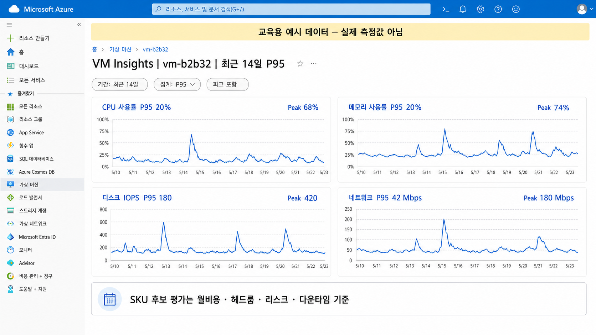

| 관찰 항목 | 예시 P95 | 예시 피크 | 판단 시 확인점 |  
|---|---:|---:|---|  
| CPU 사용률 | 20% | 68% | 지속 사용률과 순간 피크, B 시리즈 CPU 크레딧 |  
| 메모리 사용률 | 20% | 74% | 스왑·OOM 위험과 최소 20 ~ 30% 여유 |  
| 디스크 IOPS | 180 | 420 | 디스크 계층과 VM 양쪽의 IOPS 한도 |  
| 네트워크 | 42Mbps | 180Mbps | VM 크기별 네트워크 한도와 업무 피크 |  

---

## VM과 Disk SKU 변경 실습

### SKU 변경

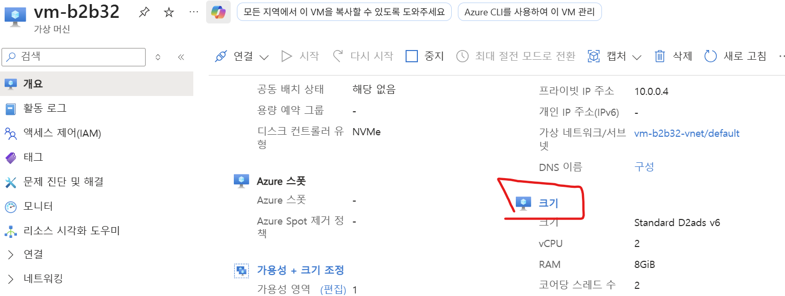

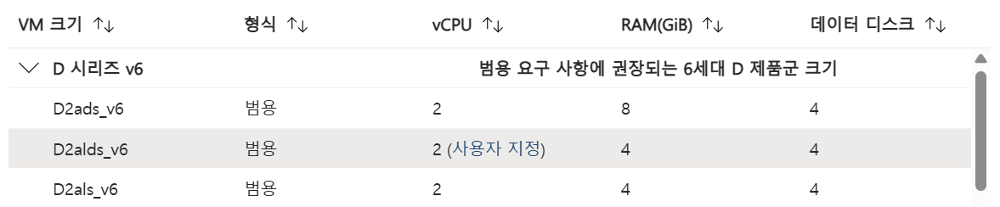

화면 맨 오른쪽의 월별 예상 비용 확인 필요  
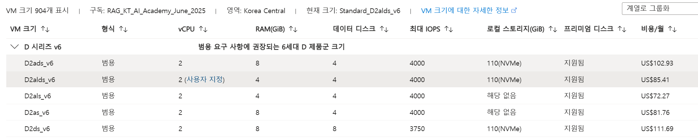

## Disk

### 실습 목표

Azure Managed Disk의 SKU를 `Standard SSD LRS`에서 `Premium SSD LRS`로 변경한 뒤 원래 SKU로 복원함.  
운영체제 디스크 대신 비어 있는 데이터 디스크를 사용하여 실습 위험 최소화 및 SKU별 비용·성능 차이 확인함.

> [!NOTE]  
> 이 실습은 Azure Files의 파일 공유가 아닌 VM에 연결하는 Azure Managed Disk 대상임.  
> 디스크 SKU 변경은 디스크 용량이나 게스트 운영체제의 파일 시스템 크기 변경과 별개임.

### Disk SKU 이해

Disk SKU는 관리 디스크의 저장 매체, 성능 특성, 가용 기능 및 과금 수준을 구분하는 유형임.  
워크로드의 IOPS, 처리량, 지연 시간, 가용성 및 비용 요구사항에 맞춰 선택함.

| SKU | 핵심 차이 | 운영 환경 유즈케이스 |  
|---|---|---|  
| Standard HDD | 자기 디스크 기반의 가장 낮은 비용, 높은 지연 시간 | 백업·아카이브, 액세스 빈도가 낮은 비핵심 데이터 |  
| Standard SSD | SSD 기반의 비용·성능 균형 | 개발·테스트, 웹 서버, 사용량이 적은 업무 시스템 |  
| Premium SSD | 크기별 P 계층으로 성능 제공, 낮은 지연 시간 | 운영 DB, 업무 핵심 애플리케이션, 성능 민감 워크로드 |  
| Premium SSD v2 | 용량·IOPS·처리량의 독립 조정, OS 디스크 미지원 | 데이터 디스크 성능을 세밀하게 조정하는 운영 DB |  
| Ultra Disk | 가장 높은 IOPS·처리량과 세밀한 성능 조정, OS 디스크 미지원 | SAP HANA, 고성능 DB, 초저지연 데이터 디스크 |

Standard HDD, Standard SSD 및 Premium SSD는 관리 디스크에서 SKU 간 직접 변경 가능함.  
Premium SSD v2와 Ultra Disk는 지원 지역, VM 크기, 연결 방식 및 변환 절차가 다르므로 별도 확인 필요함.

### Disk SKU 현재 비용 비교

> [!NOTE]  
> **디스크 계층(Disk tier)**은 미리 정의된 용량과 기본 성능을 묶어 구분한 단계임.  
> Standard HDD는 `S`, Standard SSD는 `E`, Premium SSD는 `P`와 숫자로 표시함.  
> 예를 들어 32GiB 디스크는 S4, E4 또는 P4이며, 같은 용량이어도 SKU에 따라 IOPS·처리량·가격이 다름.  
> 고정 계층형 디스크는 실제 데이터 사용량이 아니라 프로비전된 계층을 기준으로 과금됨.  
> 디스크 계층은 Blob의 핫·쿨·보관 액세스 계층이나 LRS·ZRS 같은 중복성 옵션과 다른 개념임.

2026년 7월 22일 Azure Retail Prices API 조회값이며, `Korea Central`, LRS, USD 소매가 기준임.  
계약 할인, Azure 크레딧, 세금, 환율 및 디스크 작업·스냅샷·공유 디스크 추가 요금은 포함하지 않음.

#### 고정 계층형 SKU의 32GiB 비교

| Disk SKU | 32GiB 계층 | 월 소매가 | 과금 특징 |  
|---|---|---|---|  
| Standard HDD LRS | S4 | `$1.536` | 디스크 작업 10,000건당 `$0.0005` 별도 |  
| Standard SSD LRS | E4 | `$2.40` | 트랜잭션 비용 별도 |  
| Premium SSD LRS | P4 | `$5.2795` | 계층에 포함된 성능 제공 |  

S4, E4 및 P4는 모두 32GiB이지만 IOPS·처리량·지연 시간과 트랜잭션 과금 구조가 다름.

#### 구성형 SKU의 32GiB 용량 비용

| Disk SKU | 730시간 기준 월 환산액 | 별도 과금 |  
|---|---:|---|  
| Premium SSD v2 LRS | 약 `$2.92` | 기본 3,000 IOPS·125MB/s 초과 성능 |  
| Ultra Disk LRS | 약 `$5.1626` | 프로비전된 IOPS 및 처리량 |  

Premium SSD v2와 Ultra Disk는 용량·IOPS·처리량을 독립 설정하므로 고정 계층형 SKU와 직접 비교하기 어려움.  
Ultra Disk의 월 환산액은 용량 비용만 포함하므로 실제 총액 계산 시 IOPS와 처리량 비용을 반드시 더해야 함.

Premium SSD v2는 3,000 IOPS 초과분에 IOPS당 시간당 `$0.000008`, 125MB/s 초과분에  
MB/s당 시간당 `$0.000063` 추가 과금됨. Ultra Disk는 GiB당 시간당 `$0.000221`, 프로비전된 IOPS당  
시간당 `$0.000092`, 프로비전된 MB/s당 시간당 `$0.00049`를 합산함.

#### 본 실습의 비용 차이

| 상태 | 월 소매가 | E1 대비 차이 |  
|---|---:|---:|  
| Standard SSD E1 | `$0.30` | 기준 |  
| Premium SSD P1 | `$0.81` | `+$0.51`, 약 `+170%` |  

관리 디스크는 선택한 계층의 월 가격을 시간 단위로 비례 계산하여 청구함.  
따라서 짧은 실습에서 SKU를 P1으로 변경한 시간만큼만 P1 요율이 적용되며, 표시된 월 전체 금액이 청구되지 않음.

### 실습 환경

| 항목 | 실제 실습 값 |  
|---|---|  
| 가상 머신 | `vm-b2b32` |  
| 리소스 그룹 | `RG-KT-NEW-FOUNDRY` |  
| VM 크기 | `Standard_D2alds_v6` |  
| 실습 디스크 | `disk-vm-b2b32-sku-lab` |  
| 디스크 용량 | 4GiB |  
| 변경 경로 | Standard SSD LRS E1 → Premium SSD LRS P1 → Standard SSD LRS E1 |

### 1. 실습용 데이터 디스크 만들기

1. Azure Portal에서 **가상 머신** > `vm-b2b32` > **설정** > **디스크**로 이동함.  
2. **새 디스크 만들기 및 연결** 선택함.  
3. 다음 값을 입력함.

   | 항목 | 값 |  
   |---|---|  
   | 디스크 이름 | `disk-vm-b2b32-sku-lab` |  
   | 스토리지 유형 | `표준 SSD LRS` |  
   | 크기 | `4GiB` |  
   | 호스트 캐싱 | `없음` |

4. **적용** 선택함.  
   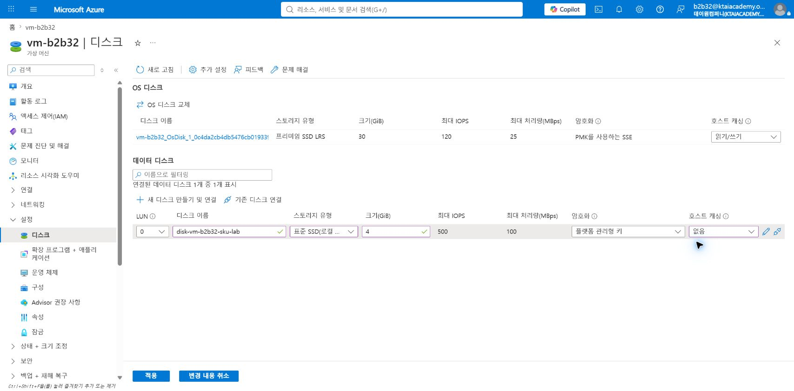

5. 데이터 디스크가 `Standard SSD LRS`, 4GiB로 연결되었는지 확인함.  
   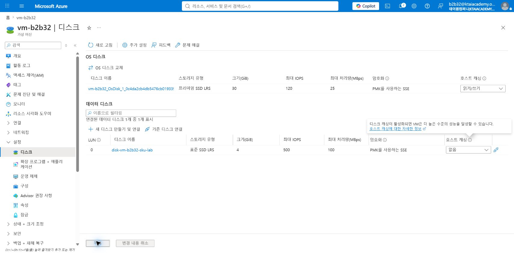

### 2. VM 중지 및 할당 취소

1. VM **개요**에서 **중지** 선택함.  
2. 상태가 `중지됨(할당 취소됨)`으로 바뀔 때까지 대기함.

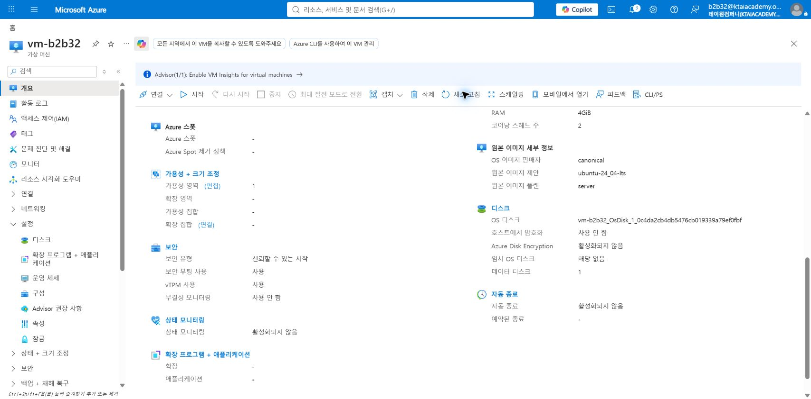

> [!IMPORTANT]  
> Standard HDD, Standard SSD 및 Premium SSD 간 변환 시 VM 중지 및 할당 취소 권장됨.  
> OS 디스크는 변환 과정에서 VM 재시작이 필요하며, 변경 전 백업 또는 스냅샷 생성 권장됨.

### 3. Premium SSD로 변경

1. **설정** > **디스크**에서 `disk-vm-b2b32-sku-lab` 선택함.  
2. 디스크 메뉴에서 **크기 + 성능** 선택함.  
3. **스토리지 유형**을 `프리미엄 SSD(로컬 중복 스토리지)`로 변경함.  
4. 4GiB 행의 `P1` 계층 선택 상태 확인함.

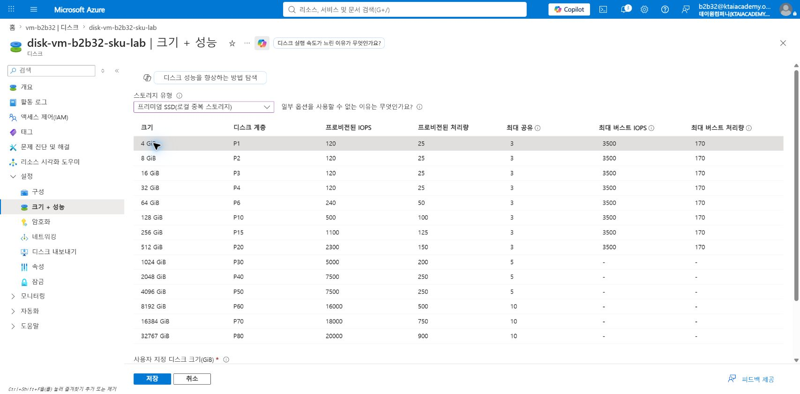

5. **저장** 선택함.  
6. `디스크 업데이트됨` 알림과 `Premium SSD LRS`, `P1` 표시 확인함.

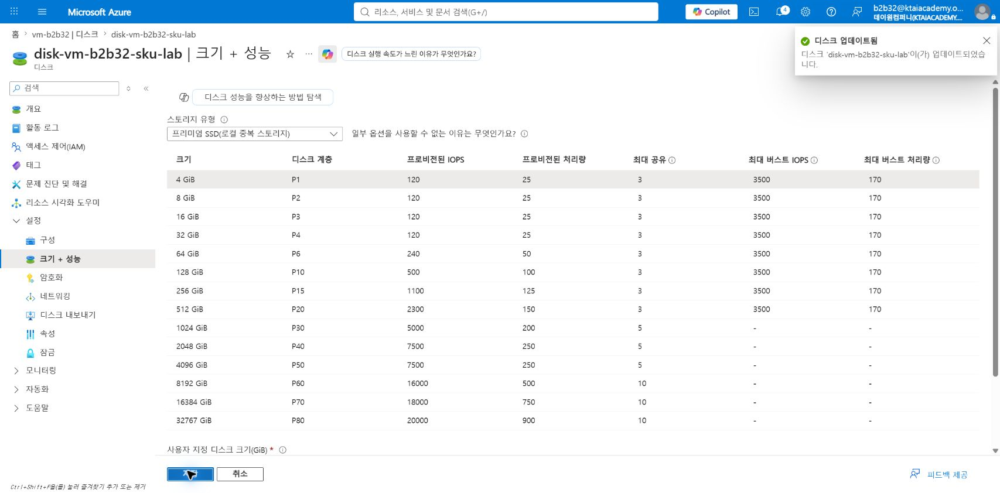

### 4. Standard SSD로 복원

실습 후 불필요한 Premium SSD 비용 방지를 위해 원래 SKU로 복원함.

1. **스토리지 유형**을 `표준 SSD(로컬 중복 스토리지)`로 변경함.  
2. 4GiB 행의 `E1` 계층 선택 상태 확인함.

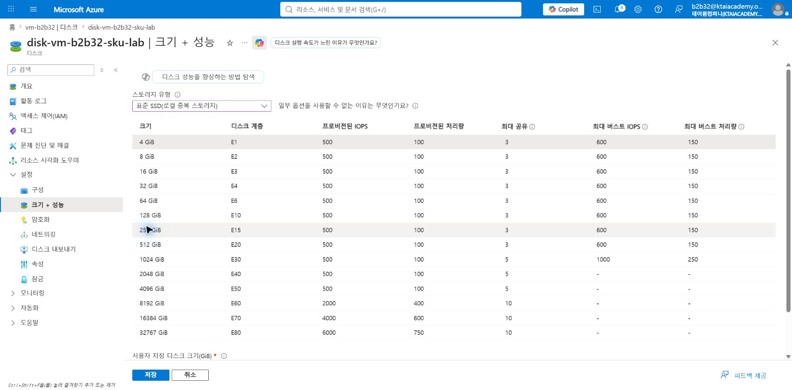

3. **저장** 선택함.  
4. `디스크 업데이트됨` 알림과 `Standard SSD LRS`, `E1` 표시 확인함.

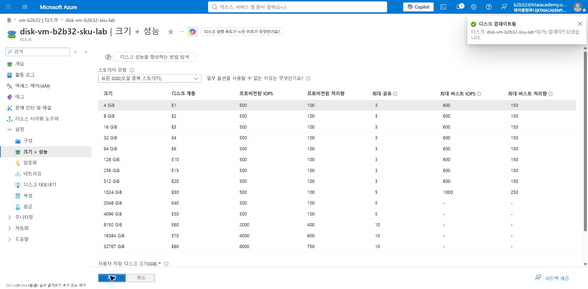

### 5. VM 다시 시작

1. VM **개요**로 이동함.  
2. **시작** 선택함.  
3. 상태가 `실행 중`인지 확인함.

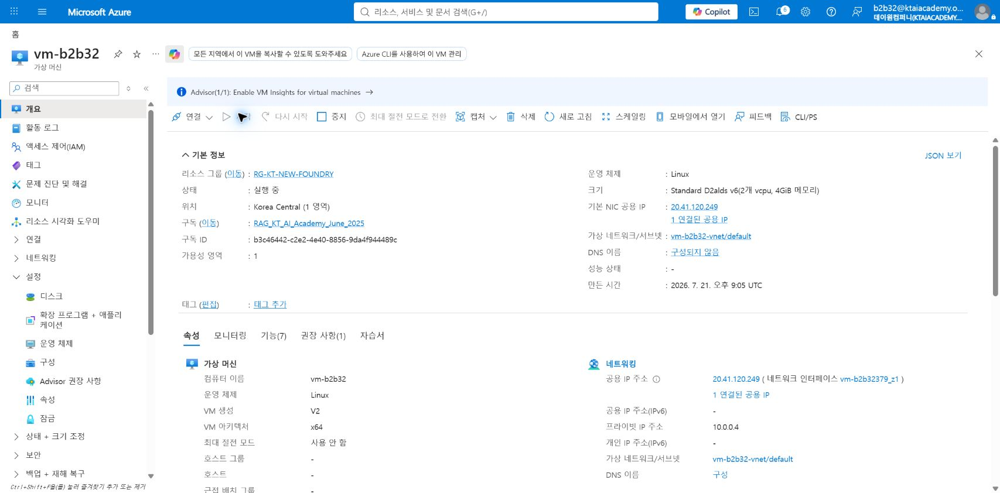

### 결과 확인

| 확인 항목 | 결과 |  
|---|---|  
| Premium SSD 적용 | `P1`, 4GiB 적용 및 성공 알림 확인 |  
| Standard SSD 복원 | `E1`, 4GiB 적용 및 성공 알림 확인 |  
| 디스크 용량 | 변경 전후 4GiB 유지 |  
| 최종 VM 상태 | 실행 중 |

### 운영 시 주의사항

- 디스크 유형 변경은 디스크당 하루 최대 두 번 가능함. 본 왕복 실습은 당일 변경 한도 두 회를 모두 사용함.  
- Premium SSD 사용 전 VM 크기의 Premium Storage 지원 여부 확인 필요함.  
- SKU를 높이면 저장 용량이 같아도 비용이 증가하며, 변경된 SKU 기준으로 과금됨.  
- VM을 할당 취소해도 관리 디스크에는 계속 비용이 발생함.  
- Premium SSD의 성능 계층 변경과 디스크 SKU 변경은 서로 다른 작업임.  
- Premium SSD v2와 Ultra Disk는 본 실습의 직접 변환 절차를 그대로 적용하지 않음.  
- 실습이 끝나고 데이터가 필요 없으면 데이터 디스크 분리 후 디스크 리소스 삭제 필요함.

### 참고 자료

- [Azure Managed Disk 유형](https://learn.microsoft.com/azure/virtual-machines/disks-types)  
- [Azure Managed Disk 유형 변환](https://learn.microsoft.com/azure/virtual-machines/disks-convert-types)  
- [Premium SSD 성능 계층 변경](https://learn.microsoft.com/azure/virtual-machines/disks-change-performance)  
- [Azure Managed Disks 가격](https://azure.microsoft.com/pricing/details/managed-disks/)  
- [Azure Retail Prices API](https://learn.microsoft.com/rest/api/cost-management/retail-prices/azure-retail-prices)
