# 비용 할당

조직 내에서 비용이 어떻게 할당되는지 설정함

## 관리그룹과 구독 

### 관리그룹 작성
관리 그룹은 여러 구독을 계층으로 묶어 정책(Policy), RBAC(액세스 제어), 비용 예산 및 알림을 그룹별로 관리할 수 있도록 함    
관리 그룹별 비용 가시화는 EA계약에서만 지원됨   

예시 구조는 아래와 같음 (최대 6단계)  
```
Tenant Root Group (루트 — 직접 구독 배치 금지)
└─ {회사명} (조직 최상위 관리 그룹)
   ├─ Platform          ← 공유 인프라 (네트워크·보안·로깅)
   │   ├─ Identity
   │   ├─ Management
   │   └─ Connectivity
   ├─ Landing Zones     ← 실제 워크로드
   │   ├─ Corp          (내부용, 인터넷 미노출)
   │   └─ Online        (외부 서비스용)
   ├─ Sandbox           ← 실험/PoC (프로덕션 정책 격리)
   └─ Decommissioned    ← 폐기 예정 구독 격리
```
**작성 가이드**      
- 깊이는 3~4단계 이내 — 최대 6단계까지 가능하나, 깊어질수록 정책 상속 추적이 어려워짐
- 'Tenant Root Group'에 구독 직접 배치 금지 — 루트 정책은 모든 것에 영향, 사고 시 전사 마비
- 환경(Prod/Dev)이 아니라 "관리 주체·정책 요구"로 분리 — 같은 정책·같은 팀이 관리하는 것끼리 묶기
- 비용 배분(FinOps) 관점 태그와 정렬 — 관리 그룹은 정책 경계, 태그는 세밀 배분. 둘을 혼동하지 말 것
- Sandbox는 반드시 격리 — 실습·실험 구독은 프로덕션 가드레일에서 분리하되, 예산 알림은 필수

- '구독' 클릭 후 '관리그룹' 선택
  

- 관리 그룹 작성 및 구독 배치 
  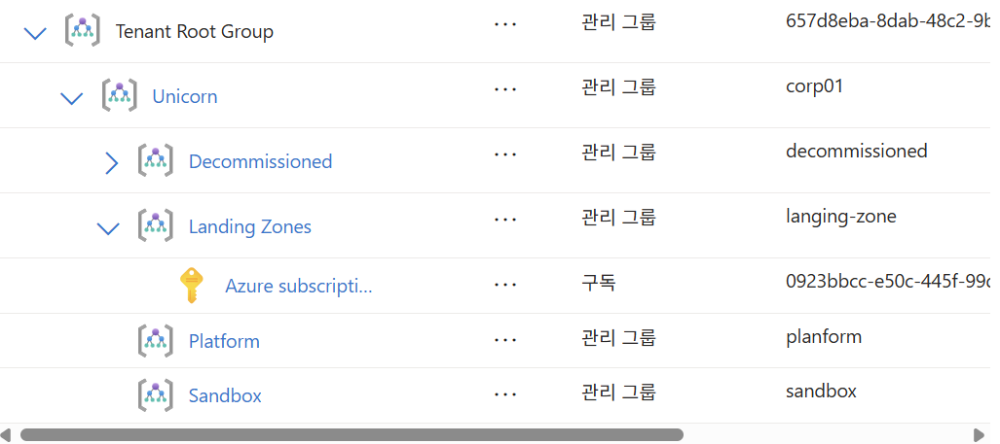

### 구독 배치
구독은 각 관리그룹의 말단(Leaf)그룹에만 배치하는 것이 권고사항임   
```
Landing Zones          ← 여기 구독을 직접 두면 ✗
├─ [구독 A]            ← Corp/Online 정책과 별개로 붕 뜸
├─ Corp
│   └─ [구독 B] ✓      ← 리프에 배치 (권장)
└─ Online
    └─ [구독 C] ✓
```


### 관리그룹에 정책 설정  
설정할 관리 그룹 클릭하여 설정합니다. 

- 거버넌스 > 정책 클릭  
  
- 정책 할당 클릭
  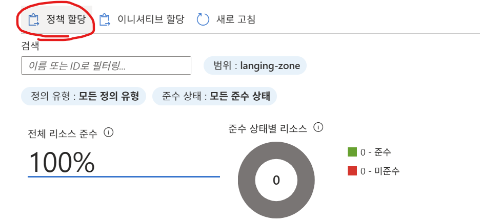  
- 정책 할당 
  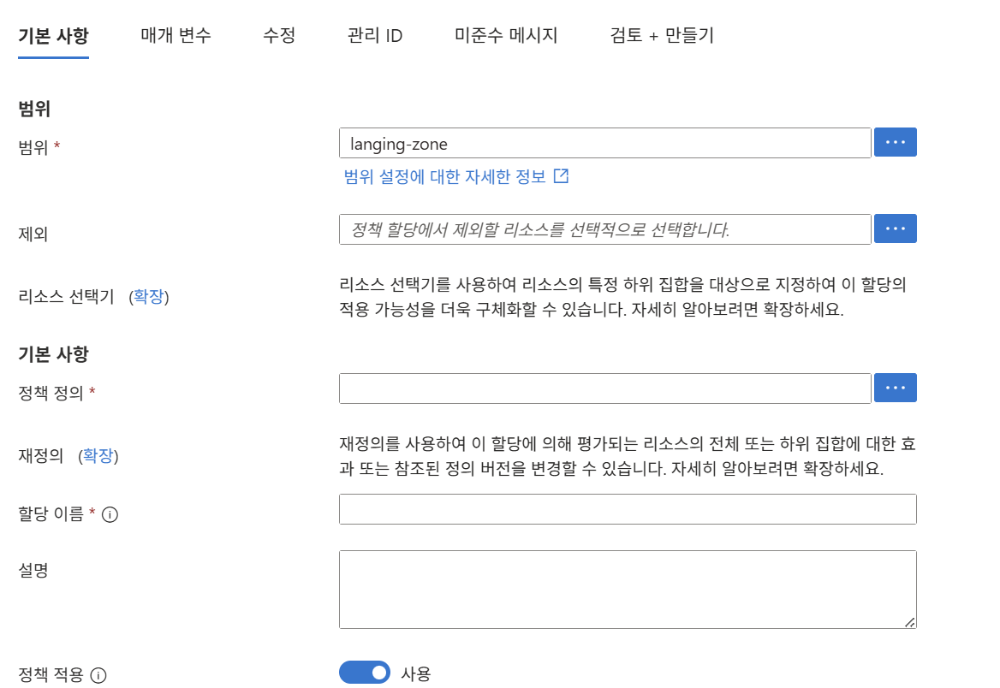  
    
    
    
     

※ Tag 값 체크 정책 적용 
'Require a tag and its value on resources' 정책 적용 

  
  
  
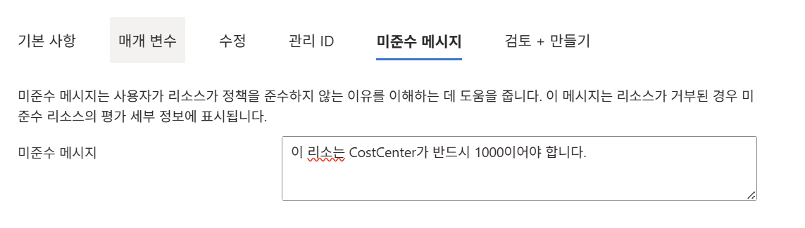  
  
※ 정책 준수 확인  
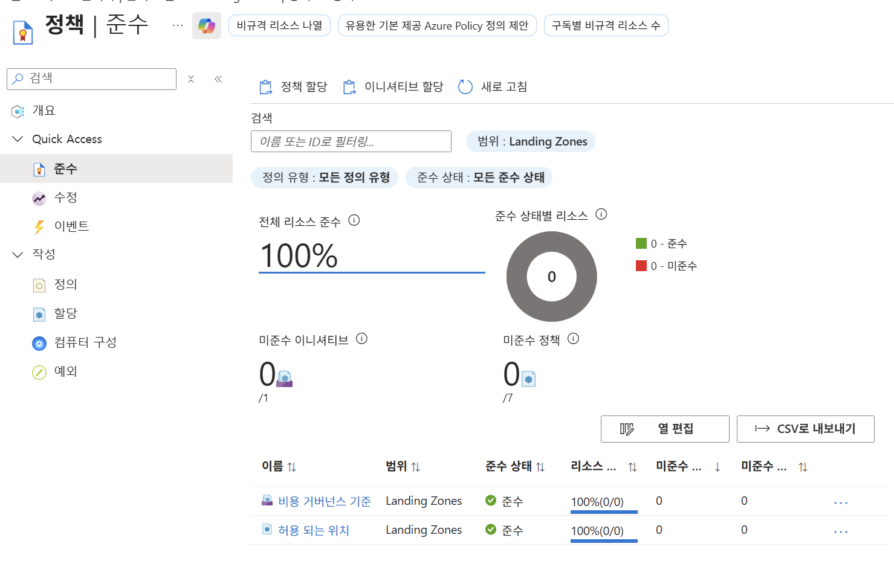   

### 관리그룹에 이니셔티브 할당
이니셔티브는 "규칙 여러 개를 담은 정책 세트"입니다.   

- 이니셔티브 생성 
    

- 기본사항    
     
  
- 정책       
  4가지 Tag 정책 추가 위해 'Require a tag on resource' 4번 추가   
    
  Allowed locations와 Allowed virtual machine size SKUs 정책 추가    

- 정책 매개변수  
  TagName: CostCenter, Environment, Owner, Project   
  허용된 위치: Korea Central, Korea South
  허용된 VM SKU: Standard_B2s, Standard_B2ms, Standard_D2s_v5, Standard_D4s_v5

    
  
- 이니셔티브 할당    
     

### 관리그룹에 RBAC(권한제어) 적용   
- Entra ID 진입: 아이콘 없으면 검색바에서 서치   
  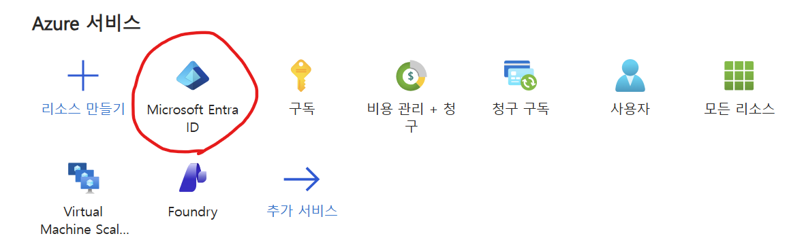   
- 좌측에서 그룹 선택 
  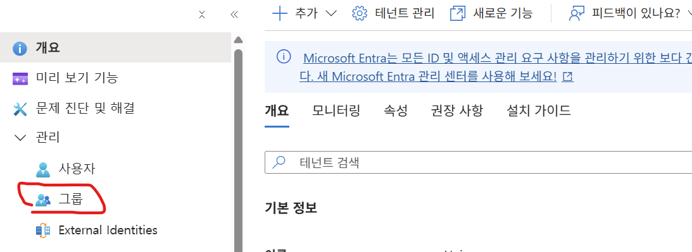   
- 새로운 그룹 작성: 보안 그룹으로 작성   
    

- 관리그룹에 보안그룹을 '기여자' 권한으로 추가     
  관리그룹에서 권한 부여할 그룹 선택(예: Langing Zones) 후 '액세스 제어' 클릭   
    
  
  기여자 권한 선택   
    
  
  구성원으로 보안 그룹 지정   
    

### 관리그룹별 비용 가시화
관리 그룹을 조직 단위 비용 배분 도구로 쓰는 것은 EA에서만 제대로 됨      
MCA에서는 하위 MG별 비용 조회 불가 → 태그·청구 프로필로 배분해야 함   

### 관리그룹별 예산 수립 및 알림  
관리그룹별 예산 만들기   
   

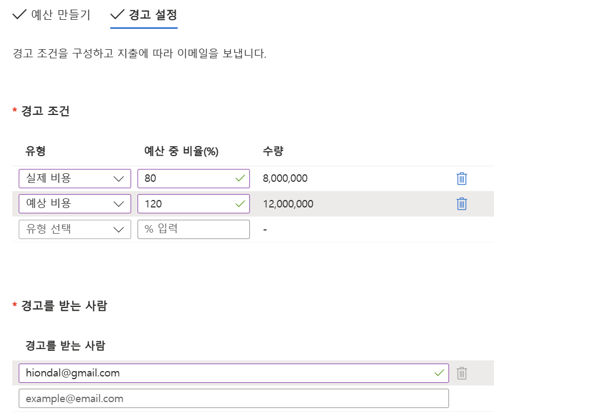   

※ 주의: EA 계약에서만 정상 동작함
MCA(MS Customer Agreement)계약에서는 관리그룹별 비용 추적이 잘 되지 않아 예산 초과에 대한 알림이 오지 않을 수 있음   
단, MCA도 최상위 루트그룹(Tenant Root Group)별로는 비용 집계가 되지만 예약(RI)·Savings Plan·Marketplace 구매는 제외되고   
사용량 베이스의 비용만 집계됨   

※ Marketplace 구매
Azure 장터에서 산 "제3자 소프트웨어·솔루션" 비용.   
Azure 기본 사용료(usage)와 달리 "구매" 항목이라 **관리 그룹 비용 집계에서 빠지고**, **청구 계정/프로필에서만 보임**   

---

### 정보 조회 시 관리그룹 변경 방법   
- 비용관리 + 청구로 이동 후 Cost Management 클릭  
  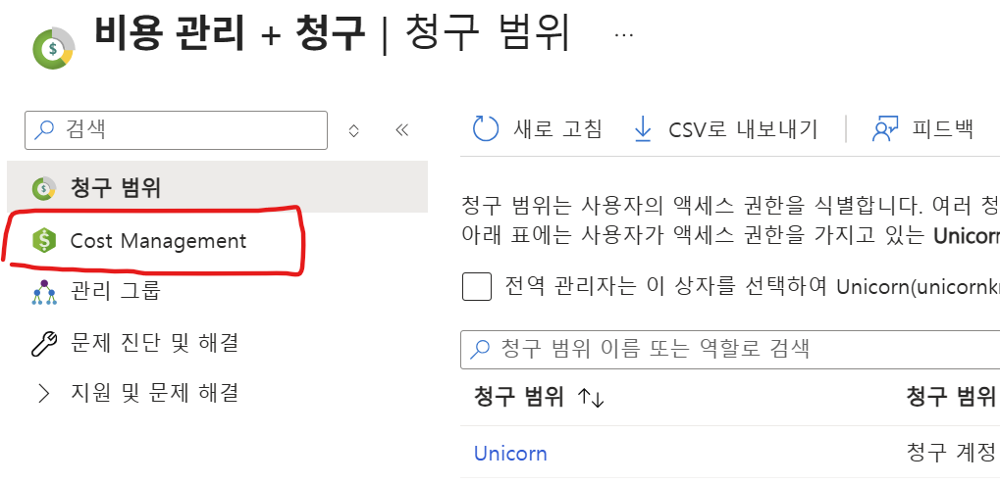   

- 좌측에서 설정 > 구성 클릭  
  

- 상단의 '변경' 클릭
  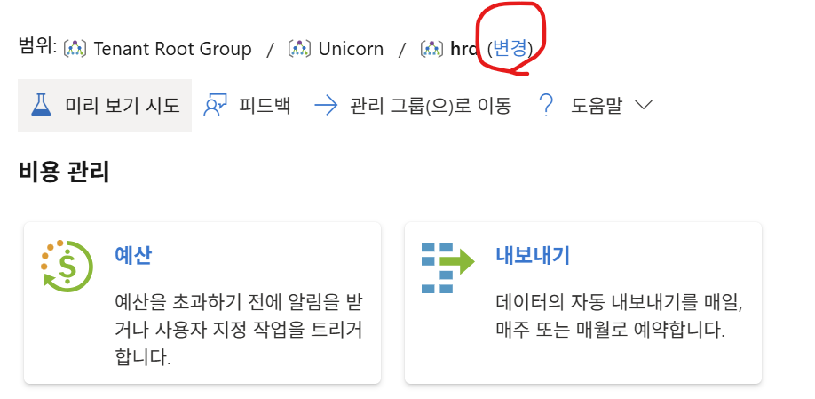  

- '루트 관리 그룹' 클릭
      

- 조회하고자 하는 관리그룹 선택   
  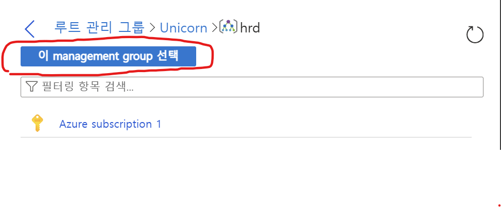  

- 다른 메뉴에서도 관리그룹을 변경하면서 정보 조회 가능
     

---

## 청구 프로파일 작성
디폴트로 Azure 가입 시 이름으로 생성되어 있고 추가 생성할 수 있음
EA계약이 아닌 경우 청구 프로파일과 청구서 섹션을 이용하여 관리 그룹의 "조직 단위" 역할을 대체할 수 있음
  
- 새로운 청구 프로파일(Billing profile) 작성 
  
  
  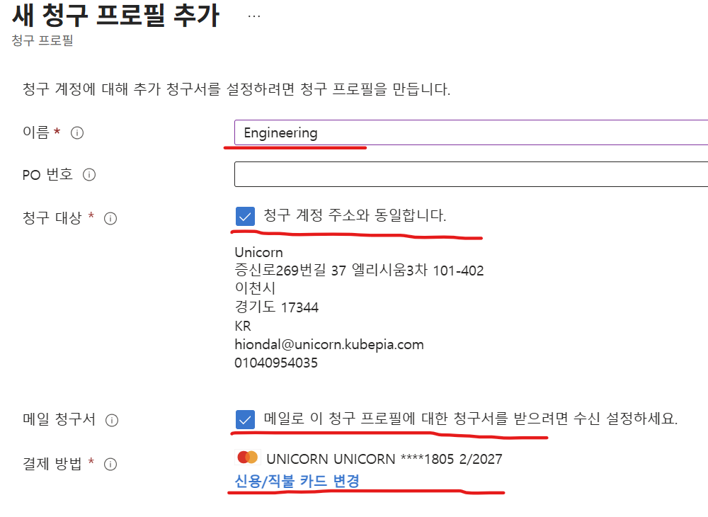

- Billing profile 하위에 여러개의 청구서 섹션(Invoice section) 구성   
  동일한 청구 프로파일을 프로젝트, 부서 또는 개발 환경 별로 필요에 따라 쉽게 비용을 추적하고 할당하는 하기 위해 청구서 섹션을 만듦   
  기본 청구서 섹션은 청구 프로파일과 동일한 이름으로 생성되어 있음  

  - 청구 프로파일 클릭 후 '청구서 섹션' 클릭. 상단에서 '추가' 클릭 
    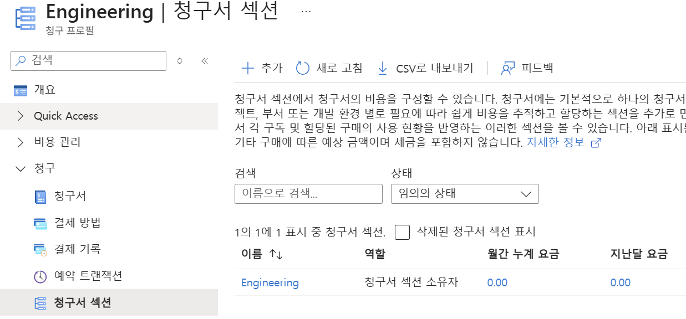    
  - 새로운 청구서 섹션 생성: 예제에서는 환경별로 dev, prod로 작성 
    

- 구독에 청구 프로프일과 청구서 섹션 매핑
  - 구독 작성 시 지정   
      

  - 기존 구독 변경   
    비용관리+청구 -> 제품 + 서비스 > 모든 청구 구독에서 변경할 구독을 클릭  
      
    변경할 청구프로파일과 청구서 섹션 지정     
        


---

## Tag별로 비용 조회
비용관리 + 청구로 이동 후 Cost Management 클릭 -> 보고+분석 > 비용 분석 클릭 

- 필터를 이용한 Tag별 비용 조회 
  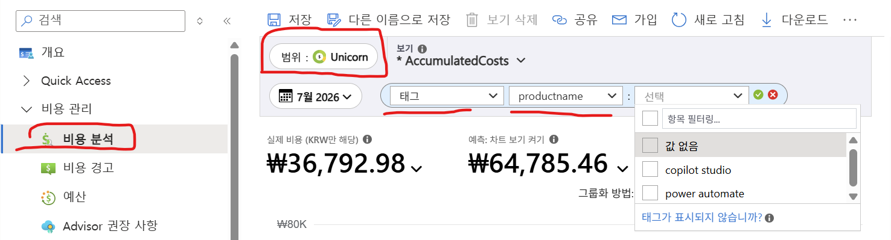


- 그룹화 방법 옵션 이용   
  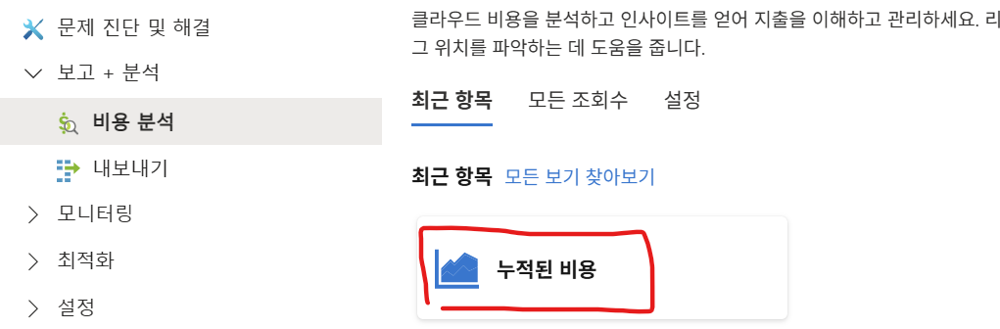     
  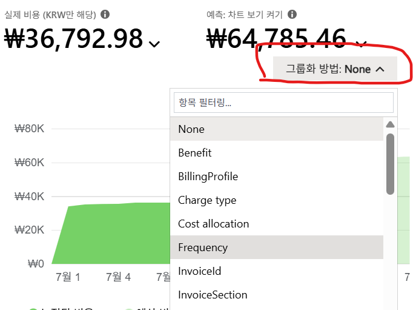    
    
  | 옵션 | 설명 |
  |---|---|
  | **태그 (Tags)** | 커스텀 태그(`Environment`, `CostCenter` 등) 기준. FinOps 비용 배분(chargeback)의 핵심 |
  | **Benefit** | RI/Savings Plan 등 약정 혜택(Benefit) 적용 여부·종류별 구분 |
  | **Charge type** | 사용료(Usage), 구매(Purchase), 환불(Refund) 등 청구 유형 |
  | **Cost allocation** | 비용 배분 규칙(예: 공유 비용을 특정 리소스 그룹에 재배분) 적용 결과 |
  | **Frequency** | 일회성(One-time) vs 반복(Recurring) 청구 여부 |
  | **InvoiceId** | 청구서(인보이스) 단위 — 특정 청구 사이클 비용 확인 |
  | **Meter** | 과금 단위(미터)의 최소 단위. 매우 세분화된 레벨 |
  | **Meter category** | 미터의 상위 카테고리 (예: Virtual Machines, Storage) |
  | **Meter subcategory** | 미터 하위 카테고리 (예: VM 시리즈별 구분) |
  | **Part Number** | Microsoft 내부 SKU 파트 번호 |
  | **Pricing Model** | 정가(On-Demand), 예약(Reservation), Spot 등 가격 모델 |
  | **Product** | 구체적인 제품명 (Meter보다 상위, Service보다 하위 레벨) |
  | **ProductOrder** | 제품 주문 단위 (마켓플레이스 등 주문 건별) |
  | **Provider** | 리소스 프로바이더 (예: Microsoft.Compute) |
  | **Publisher type** | 게시자 유형 — Microsoft 자체 서비스 vs 3rd-party 마켓플레이스 |
  | **Reservation** | 적용된 예약 인스턴스(RI) 이름/ID별 구분 |
  | **Resource guid** | 리소스의 고유 GUID 단위 (가장 세분화) |
  | **Resource type** | 리소스 유형 (예: Microsoft.Compute/virtualMachines) |
  | **Service Family** | 서비스 대분류 (Compute, Storage, Networking 등) |
  | **Service name** | 서비스명 (VM, SQL Database 등) — 기본값 |
  | **Unit Of Measure** | 과금 단위 (시간, GB, 요청 수 등) |

  **실무 활용 팁**
  - **큰 그림 파악**: Service Family → Service name 순으로 드릴다운
  - **차지백/배분**: 태그, Cost allocation
  - **약정 할인 검증**: Benefit, Reservation, Pricing Model
  - **세부 원인 분석**: Meter, Meter category/subcategory, Resource guid

---

## 리소스 태그가 아닌 비용 데이터에 태깅하는 방법 -> 태그 상속 기능 
리소스에 태그가 없어도, 상위(구독/RG) 태그를 "비용 데이터"에 자동으로 입혀 비용 배분 누락을 막는 기능.   
태그 강제 정책과 짝으로 쓰면 배분 정확도가 크게 올라감.   

예시)
```
[문제] 개발자가 VM 만들 때 CostCenter 태그를 안 달았음
   → 그 VM 비용이 "미분류"로 빠져 부서 배분 불가

[해결: 태그 상속]
   → 리소스 그룹/구독에 CostCenter=Eng 태그만 있으면
   → 그 안의 모든 리소스 "비용 데이터"에 CostCenter=Eng 자동 상속
   → 개별 리소스에 태그 없어도 배분됨
```

- EA 계약: 빌링 계정 관리에서 지정
     
   
    

- MCA 계약: 청구 프로파일에서 지정
  '비용관리+청구' 메뉴가 아닌 'Cost Management'라는 별도 메뉴를 클릭    
      
    
     
    
    

---

## 비용 할당
비용할당은 구독 또는 리소스그룹 또는 태그에 공유 비용을 분배하는 기능    
이 기능을 이용하여 공유 비용(예: 공유 네트워크·중앙 로깅·방화벽)을 조직별로 할당하여 Showback과 Chargeback을 할 수 있음        
※ Showback과 Chargeback 
- 쇼백 = "얼마 썼는지 보여주기"(돈은 중앙 부담)  
- 차지백 = "쓴 만큼 실제로 청구"(팀 예산 차감)  
- 쇼백으로 시작해 신뢰를 쌓은 뒤 차지백으로 발전하는 것이 정석  
  
| 보고 싶은 것 | 필요한 것 |
|---|---|
| 각 팀이 **자기 리소스**에 쓴 비용 분리 | **태그/구독/RG로 그룹화**만 하면 됨 (할당 불필요) |
| 태그 안 단 리소스까지 누락 없이 분리 | **태그 상속** (할당 아님) |
| **공유 비용**을 팀별로 쪼개서 표시 | **비용 할당(Cost allocation) 규칙 필요** |
   
즉, showback 리포트에서
```
[비용 할당 없이 — 그룹화만]
  A팀 ₩1,000만   ← 자기 리소스만
  B팀 ₩800만
  platform ₩500만  ← 공유비용이 여기 통째로 남음 (분리 안 됨)

[비용 할당 적용 후]
  A팀 ₩1,250만   ← 자기 것 + 공유비용 분담분
  B팀 ₩1,050만
  platform ₩0     ← 공유비용이 각 팀으로 재분배됨
```
  
**한 줄 요약**    
> **팀별 "직접 비용" 분리 = 태그/그룹화로 충분(할당 불필요).** **공유 비용을 팀별로 쪼개 보이게 하려면 = 비용 할당 규칙 필요.**   
> 즉 비용 할당은 "showback을 위한 것"이 아니라 "공유 비용 분배를 위한 것"입니다.

**보완 팁**:   
완성도 높은 showback = **태그 강제(정책)** + **태그 상속(누락 보완)** + **비용 할당(공유비용 분배)** 3종 세트    

Cost Management나 비용관리+청구 메뉴에서 수행할 수 있음    
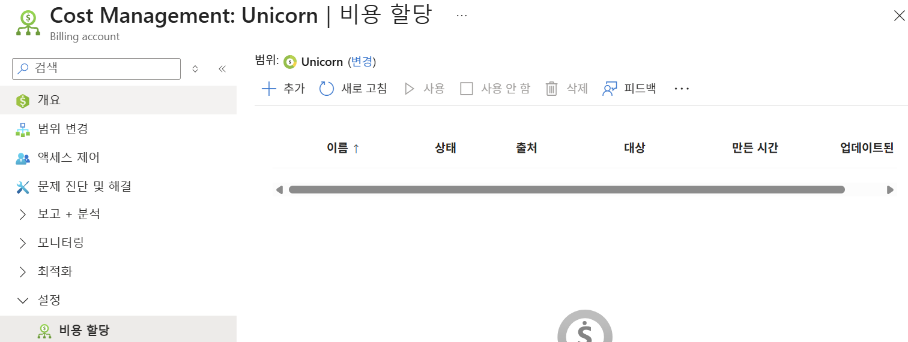    

### 예제 시나리오 
````
## 상황 설정

HBT 클라우드에 3개 팀 + 공유 인프라가 있습니다.

| 구독/리소스 | 태그 | 이번 달 직접 비용 |
|---|---|---|
| 커머스팀 리소스 | `Team=Commerce` | ₩1,000만 |
| 미디어팀 리소스 | `Team=Media` | ₩600만 |
| AI팀 리소스 | `Team=AI` | ₩400만 |
| **공유 인프라** (공유 네트워크·중앙 로깅·방화벽) | `Team=Platform` | **₩300만** |
| **합계** | | **₩2,300만** |

문제: 공유 인프라 **₩300만**은 세 팀이 함께 쓰는데 platform 한 곳에 몰려 있음. showback에 이걸 어떻게 나눌까?

---

## STEP 1 — 비용 할당 없이 (그룹화만)

비용 분석에서 `그룹화: Team 태그`

```
Commerce   ₩1,000만
Media        ₩600만
AI           ₩400만
Platform     ₩300만   ← 공유비용이 여기 통째로 남음 ❌
```
→ 각 팀 "직접 비용"은 잘 분리됨. 하지만 공유 ₩300만이 팀에 안 붙음.

---

## STEP 2 — 비용 할당 규칙 생성

```
규칙 이름: Shared-Infra-Allocation
├─ 원천(Source):  Team = Platform  (₩300만)
├─ 대상(Target):  Team = Commerce, Media, AI
└─ 배분 방식:     직접 비용에 비례 (proportional)
```

**비례 배분 계산** (각 팀 직접비용 ÷ 팀 직접비용 합 ₩2,000만):

| 팀 | 직접비용 | 비중 | 공유비 분담 (₩300만 ×비중) |
|---|---|---|---|
| Commerce | ₩1,000만 | 50% | **₩150만** |
| Media | ₩600만 | 30% | **₩90만** |
| AI | ₩400만 | 20% | **₩60만** |

---

## STEP 3 — 비용 할당 적용 후 showback

```
Commerce   ₩1,150만   (직접 1,000 + 공유 150)
Media        ₩690만   (직접 600 + 공유 90)
AI           ₩460만   (직접 400 + 공유 60)
Platform       ₩0     ← 공유비용이 세 팀으로 재분배됨 ✅
─────────────────────
합계        ₩2,300만   (총액 불변)
```

→ 이제 각 팀의 **진짜 총소유비용(TCO)** 이 showback에 나타남. Platform은 0으로 비워짐.

---

## 배분 방식을 바꾸면?

같은 ₩300만이라도 방식에 따라 결과가 달라집니다.

| 방식 | Commerce | Media | AI | 언제 쓰나 |
|---|---|---|---|---|
| **비례**(직접비용) | 150 | 90 | 60 | 큰 팀이 더 부담 (기본 권장) |
| **균등** | 100 | 100 | 100 | 팀 수로 N등분 (단순) |
| **사용자 지정%** | 예: 60/30/10 | 180 | 90 | 30 | 실제 사용 계약·합의 반영 |

---

## 이 예시가 보여주는 3종 세트

```
① 태그 강제(Policy)   → Team 태그가 반드시 붙음 (분류 기반)
② 태그 상속           → 태그 빠진 리소스도 상위 태그로 분류 (누락 방지)
③ 비용 할당           → 공유 ₩300만을 세 팀에 재분배 (공유비 배분)
= 완성된 팀별 showback → (예산 차감까지 하면) chargeback
```

**차지백 시나리오**라면: 위 최종 금액(Commerce ₩1,150만 등)이 각 팀 예산에서 실제 차감됩니다. **쇼백**이라면: 보고만 되고 비용은 중앙이 부담합니다.
````

### 공유 비용 할당 방법
- 이름, 소스 구독/리소스그룹/태그, 타겟 구독/리소스그룹/태그 지정. 소스와 타겟은 복수로 지정 가능   
    
- 비용 배분 방식에 따라 배분   
    
 
- 할당된 비용 보기
  비용분석에서 'Cost allocation'별로 볼 수 있음    
     

