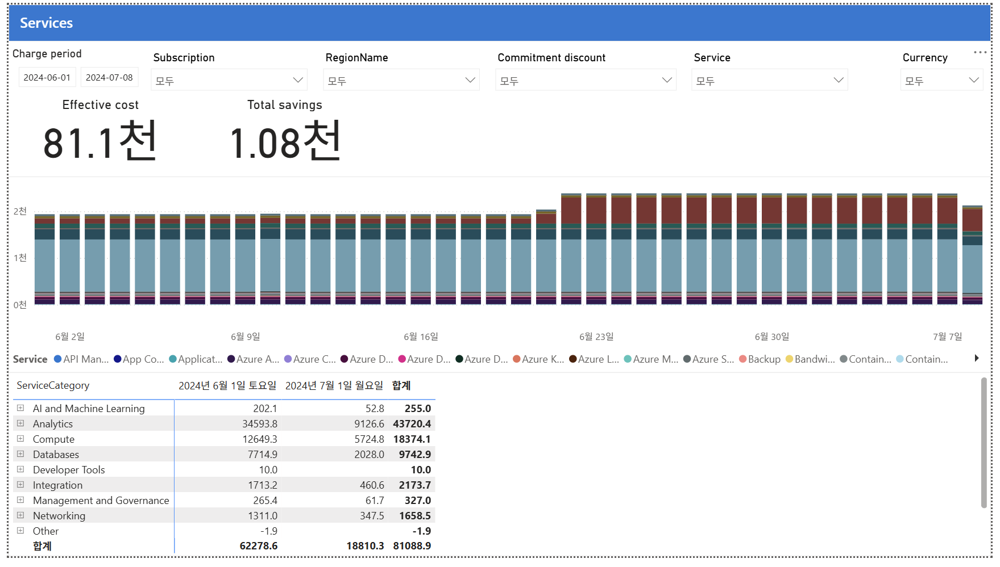

# 02. Services — 서비스 종류별 비용 분해(어디에 돈이 쓰이는가)

> 페이지: Services · 데이터 범위: 청구기간 2024-06-01 ~ 2024-07-08 · 필터 전체(All) · 통화 USD(샘플)  
> 원본: CostManagementConnector.pbix (FinOps Toolkit) · Inform 단계 비용 가시화  
> 📌 한 줄 요약(TL;DR): Analytics(Fabric)가 비용의 절반, Compute가 2위이며 6/23부터 Analytics가 급증함.

## 1. 개요
- "어떤 Azure 서비스에 돈을 쓰는가"를 서비스 종류별로 쪼개 보는 화면임  
- 데이터 범위: 청구기간 `2024-06-01 ~ 2024-07-08` / 필터 모두 All / 통화 USD(샘플)

## 2. 화면 구조·차트 읽는 법
- 상단: 01번과 동일한 필터 + Effective cost **81.1천** / Total savings **1.08천**  
- 가운데: **일자별 누적 막대(stacked bar)** — 하루치 비용을 서비스별 색깔로 층층이 쌓음  
  - 막대 높이 = 그날의 총비용, 색층 = 서비스별 기여분  
- 범례: Service별 색상 (API Management, App Config, Analytics 계열 등 다수)  
- 하단 표: **ServiceCategory(서비스 대분류)별** 6월/7월/합계

### 막대 차트에서 꼭 볼 것 — 6월 23일 급등
- 6/2 ~ 6/22: 하루 약 2천 수준으로 일정  
- **6월 23일부터 짙은 빨강 띠가 추가**되며 막대가 더 높아짐 → 그 시점에 새 서비스가 크게 돌기 시작  
- 이런 계단식 증가는 **이상 탐지 신호** — "6/23에 뭘 배포했나?"를 조사해야 함

## 3. 분석 요약
> What · 데이터가 보여준 사실(해석 배제)

하단 표(ServiceCategory별) 수치.

| 대분류 | 합계 | 비중 |
|---|---|---|
| **Analytics** | **43,720.4** | ~54% (압도적 1위) |
| **Compute** | **18,374.1** | ~23% |
| Databases | 9,742.9 | ~12% |
| Integration | 2,173.7 | |
| Networking | 1,658.5 | |
| Management and Governance | 327.0 | |
| AI and Machine Learning | 255.0 | |
| Developer Tools | 10.0 | |
| **Other** | **-1.9** | 음수 = 크레딧/환불/조정 |
| **합계** | **81,088.9** | (01번 총액과 일치) |

- **Analytics 43,720.4**로 전체의 약 54%, 단일 대분류 1위  
- **Compute 18,374.1**로 약 23%, 2위  
- Databases 9,742.9(~12%), 이하 Integration·Networking·관리·AI/ML 순으로 소액  
- **Other -1.9** 음수 — 크레딧/환불/조정 항목  
- 막대 차트는 6/2 ~ 6/22 하루 약 2천으로 일정하다가 **6/23부터 짙은 빨강(Analytics) 띠가 추가**되며 급증

## 4. 시사점
> So what · 사실의 의미·비용 리스크

- **Analytics가 절반 이상(43.7천)** — 01번의 최대 구독 "FTK Fabric"과 연결됨(Fabric=분석 서비스) → 최우선 최적화 대상  
- **Compute 2위(18.4천)** — VM 계열로 추정 → Right-sizing·약정(RI/SP) 적용 후보  
- **6/23 급등 구간** — Analytics 짙은 빨강 띠 급증 → 원가 급증 원인을 조사할 비용 리스크  
- **Other 음수(-1.9)** — 환불/조정 항목으로 오탐 아님, 정상적 회계 조정임  
- **AI/ML 255로 아직 소액** — FinOps for AI 관점에서 향후 증가 모니터링 대상

## 5. 권고사항
> Now what · Inform 단계 실행 행동(실행은 Optimize 이관 명시)

- **Analytics·Compute 두 대분류에 최적화 집중** — 전체의 약 77%를 차지하므로 여기서 절감 효과 최대  
- **Analytics(Fabric)** — SKU·용량(capacity) 재검토 후 약정 적용 여지 판단 → Optimize 이관  
- **Compute** — VM Right-sizing 및 RI/Savings Plan 적용 후보 선별 → Optimize 이관  
- **6/23 급증 원인 규명** — 배포 이력·리소스(05번)까지 드릴다운해 급증 서비스 특정  
- **AI/ML 모니터링 룰 설정** — 현재는 소액이나 증가 추세 감시 대상으로 등록

## 6. 용어·출처

### 용어
- **Service**: 개별 Azure 서비스 (VM, Storage, SQL Database 등) — 차트 색상 단위  
- **ServiceCategory**: 서비스 상위 대분류 (Compute, Analytics, Databases 등) — 하단 표 단위  
- **누적 막대(stacked bar)**: 하루 총비용을 서비스별로 나눠 쌓은 막대. 높이 = 일 총비용, 색층 = 서비스별 기여
