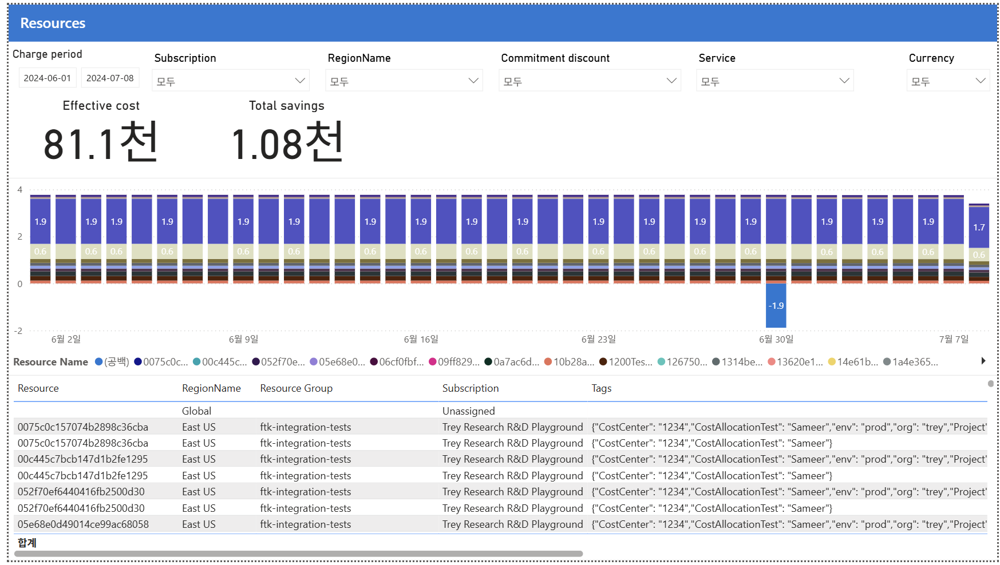

# 05. Resources — 개별 리소스 최세밀 뷰 + Tags 원본(이상 비용의 범인 리소스 특정)

> 페이지: Resources · 데이터 범위: 청구기간 2024-06-01 ~ 2024-07-08 · 필터 전체(All) · 통화 USD(샘플)  
> 원본: CostManagementConnector.pbix (FinOps Toolkit) · Inform 단계 비용 가시화  
> 📌 한 줄 요약(TL;DR): 개별 리소스 최세밀 뷰와 Tags 원본을 노출해 이상 비용의 범인 리소스 특정·태그 기반 배분의 원천 데이터를 제공함.



## 1. 개요
- 가장 세밀한 레벨 — 개별 리소스 단위로 비용을 보는 화면이며, 앞서 논의한 **Tags(태그) 열**이 여기서 등장함  
- 데이터 범위: 청구기간 `2024-06-01 ~ 2024-07-08` / 필터 모두 All / 통화 USD(샘플)

## 2. 화면 구조·차트 읽는 법
- 상단: 동일 필터 + Effective cost **81.1천** / Total savings **1.08천**  
- 가운데: **일자별 누적 막대** — 개별 리소스별. Y축이 **0~4의 작은 값**(앞 페이지의 "천"과 다름!)  
- 하단 표: **Resource · RegionName · Resource Group · Subscription · Tags**

### 눈여겨볼 3가지

**① Y축이 아주 작음 (개별 리소스라 단가가 작음)**
- 앞 페이지는 하루 ~2천이었지만, 여기 라벨은 `1.9`, `0.6` 같은 한 자리 숫자  
- 개별 리소스 하나하나는 소액이고, 대형 용량성 비용(Fabric capacity 등)은 리소스명이 없어 `(공백)/Unassigned/Global`로 빠짐  
- → 리소스 차트만으로는 총액이 안 보임. 총액은 상단 카드(81.1천)로 확인

**② 음수 막대 (-1.9, 6/30)**
- 6월 30일에 **-1.9 (0선 아래)** — 특정 리소스의 환불/크레딧/요금 조정  
- 오류 아님. 리소스 단위에선 조정이 눈에 띄게 보임

**③ Tags 열 = 앞서 논의한 그 원본 JSON**
- 표 맨 오른쪽 **Tags**에 `{"CostCenter":"1234","CostAllocationTest":"Sameer","env":"prod","org":"trey","Project":...}` 형태  
- 이게 바로 Power BI에서 파싱·확장이 필요했던 그 태그 문자열 (앞 대화의 TagsDictionary 파싱 주제)  
- 리소스마다 태그 집합이 제각각(어떤 행은 Project 포함, 어떤 행은 CostCenter만) → 파싱 후 태그별 분석 가능

## 3. 분석 요약
> What · 데이터가 보여준 사실(해석 배제)

- 일자별 누적 막대의 Y축이 **0~4의 작은 값**(라벨 예: `1.9`, `0.6`)으로, 앞 페이지의 "천" 단위와 다름  
- 대형 용량성 비용(Fabric capacity 등)은 리소스명이 없어 `(공백)/Unassigned/Global`로 빠짐 → 리소스 차트만으론 총액이 안 보임  
- **6월 30일 -1.9(0선 아래)** 음수 막대 — 특정 리소스의 환불/크레딧/요금 조정  
- 하단 표에 **Resource·RegionName·Resource Group·Subscription·Tags** 열 존재  
- Tags 열에 `{"CostCenter":"1234","CostAllocationTest":"Sameer","env":"prod","org":"trey","Project":...}` 형태의 원본 JSON 노출  
- 리소스마다 태그 집합이 제각각이며, 표의 리전이 대부분 **East US**에 집중

## 4. 시사점
> So what · 사실의 의미·비용 리스크

- **최종 원인 추적 지점** — 급증·이상 비용의 "범인 리소스"를 여기서 특정(Resource 이름·RG·구독·리전까지)  
- **태그 기반 배분의 원천 데이터** — CostCenter/env/org 태그가 리소스에 붙어 있어야 부서·환경별 배분 가능 → 태그 강제 정책의 중요성 재확인  
- **`(공백)/Unassigned` 다수** — 태그·RG 없는 리소스 = 배분 사각지대 → 정리 대상  
- **East US 집중** — 표의 리전이 대부분 East US → 리전 전략·데이터 위치 검토 단서

## 5. 권고사항
> Now what · Inform 단계 실행 행동(실행은 Optimize 이관 명시)

- **범인 리소스 특정 후 조치** — 6/23 급증·6/30 조정 등 이상 비용을 리소스명·RG·구독까지 좁혀 원인 규명 → Optimize 이관  
- **태그 강제 정책 적용** — CostCenter/env/org 필수 태그를 Azure Policy로 강제해 배분 사각지대 축소  
- **`(공백)/Unassigned` 정리** — 태그·RG 없는 리소스를 식별·태깅하거나 정리해 배분 누락 해소  
- **리전 전략 검토** — East US 집중에 대해 데이터 위치·재해 복구·비용 관점의 리전 배치 적정성 점검(실제 리전 이전 실행은 Optimize 단계로 이관)

## 6. 용어·출처

### 용어
- **Resource(리소스)**: VM·SQL·Storage 등 개별 자원. 비용의 최세밀 단위  
- **Tags(태그)**: 리소스에 붙는 key-value 메타데이터(예: CostCenter, env, org). 부서·환경별 배분의 원천  
- **`(공백)/Unassigned/Global`**: 리소스명·태그·RG가 없어 세밀 배분에서 빠지는 항목(용량성 비용 등)

### 보충 — 배분 계층 최하단
```
구독(03) → 리소스그룹(04) → 리소스(05, 이 페이지) + Tags
                                     ↑ 가장 세밀, 원인 추적·태그 배분의 원천
```
아래로 갈수록 세밀 → 원인 추적·태그 배분의 원천은 리소스 단위이나,  
용량성·무태그 비용은 `(공백)`으로 빠지므로 총액은 상단 카드(81.1천)로 확인함.
