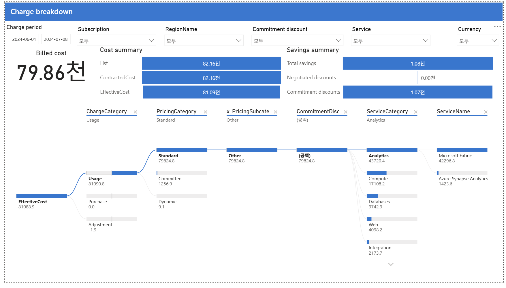

# 07. Charge breakdown — 요금 분해

> 페이지: Charge breakdown · 데이터 범위: 2024-06-01 ~ 2024-07-08(앞 페이지 공통) / 앞 페이지와 동일 필터 / 통화 원본 미표기(천 단위 표시)  
> 원본: CostManagementConnector.pbix (FinOps Toolkit) · Inform 단계 비용 가시화  
> 📌 한 줄 요약(TL;DR): 4대 비용 지표와 Sankey 분해로 최종 최대 비용원 = Microsoft Fabric(42.3천, 전체 52%)을 확정하고, 절감은 전부 약정·협상할인 0인 심층 분해 화면임.



## 1. 개요
- 목적: 가장 정보 밀도가 높은 화면으로, 비용을 4가지 비용 지표로 나누고  
  Sankey(흐름) 다이어그램으로 최종 원인(서비스명)까지 분해함.
- 데이터 범위: 청구기간 2024-06-01 ~ 2024-07-08(앞 페이지 공통) / 앞 페이지와 동일 필터 /  
  통화 단위는 원본 미표기(값은 천 단위 표시).

## 2. 화면 구조·차트 읽는 법
- 상단 좌측: Cost summary(비용 요약) 카드 — Billed / List / Contracted / Effective 4대 지표.
- 상단 우측: Savings summary(절감 요약) 카드 — Total / Negotiated / Commitment.
- 가운데: Sankey 분해 트리 — EffectiveCost가 좌→우로 어떻게 쪼개지는지 흐름으로 표시.  
  상단 브레드크럼(ChargeCategory → PricingCategory → … → ServiceName)으로 단계별 필터됨.
- 읽는 법: Sankey에서 흐름(띠)의 굵기 = 비용 크기. 좌측이 상위 분류, 우측으로 갈수록 세부(서비스명)임.
- 비용 지표 흐름: `List(정가) → Contracted(−협상) → Effective(−약정) → Billed(청구서)`.

## 3. 분석 요약
> What · 데이터가 보여준 사실(해석 배제)

- Cost summary (비용 요약)

| 지표 | 값 | 의미 |
|---|---|---|
| Billed cost (청구 비용) | 79.86천 | 실제 청구서 금액 (amortization·시점 반영) |
| List | 82.16천 | 정가(PAYG 공개가) — 할인 전 |
| ContractedCost | 82.16천 | 협상 단가 적용 후 |
| EffectiveCost | 81.09천 | 약정 할인까지 적용한 실질 비용 (분석·showback 기준) |

- Savings summary (절감 요약)

| 지표 | 값 | 의미 |
|---|---|---|
| Total savings | 1.08천 | 총 절감 |
| Negotiated discounts | 0.00천 | 협상 할인 = 없음 (List=Contracted) |
| Commitment discounts | 1.07천 | 절감 전부가 약정에서 발생 |

- Sankey 분해(좌→우 드릴다운, EffectiveCost 81,088.9 기준):

```
EffectiveCost 81,088.9
├ [ChargeCategory]      Usage 81,090.8 · Purchase 0.0 · Adjustment -1.9
├ [PricingCategory]     Standard 79,824.8 · Committed 1,256.9 · Dynamic 9.1
├ [CommitmentDiscount]  (공백) 79,824.8   ← 약정 미적용분
└ [ServiceCategory]     Analytics 43,720 · Compute 17,108 · Databases 9,742 · Web 4,098 · Integration 2,173
      └ [ServiceName]   Microsoft Fabric 42,296.8 · Azure Synapse Analytics 1,423.6
```

- 최종 최대 비용원 확정: Microsoft Fabric = 42,296.8. 01→02→03→07로 오며  
  총액 → 구독 → 서비스대분류 → 서비스명까지 좁혀진 결과임.

## 4. 시사점
> So what · 사실의 의미·비용 리스크

- 절감의 100%가 약정: 협상 할인 0 → 볼륨 협상 여지가 남아 있음(계정팀 협상 시 추가 절감 가능).
- 약정 적용률 낮음: Committed 1,256.9 vs Standard 79,824.8 → 대부분이 정가(Standard) →  
  RI/SP 커버리지 확대 여지가 큼.
- Microsoft Fabric 단일 42.3천 = 전체의 약 52%: Fabric 용량(SKU) 최적화가 최대 절감 레버임.
- Billed(79.86천) ≠ Effective(81.09천): amortization·시점 차이. 회계는 Billed, 최적화 분석은 Effective 사용.

## 5. 권고사항
> Now what · Inform 단계 실행 행동(실행은 Optimize 이관 명시)

- (우선순위 1) Fabric 용량(SKU) 최적화 준비: 전체의 절반을 차지하므로 최대 절감 레버로 지목·추적함.
- (우선순위 2) 약정 커버리지 확대 후보 도출: 대부분이 Standard(정가)이므로 RI/SP 대상 워크로드를 선별함.
- (우선순위 3) 계정팀 볼륨 협상: 협상 할인 0이므로 협상으로 추가 절감 가능 여부를 타진함.
- (분석 원칙) 지표 용도 구분: 회계·청구 대사는 Billed, 최적화·showback 분석은 Effective를 기준으로 사용함.
- Inform → Optimize 이관 포인트: Fabric SKU 최적화·약정 확대·협상 할인은 Optimize 단계의 실행 과제로 넘김.

## 6. 용어·출처
- Billed cost: 실제 청구서 금액(상각·시점 반영).
- List / Contracted / Effective: 정가 / 협상 단가 적용 / 약정까지 적용한 실질 비용.
- Commitment discount(약정 할인): RI(예약)·Savings Plan 등 선약정으로 발생하는 할인.
- Negotiated discount(협상 할인): 계약 단가 협상으로 발생하는 할인(여기선 0).
- 출처(공식 문서):
  - FOCUS(FinOps Open Cost & Usage Spec) 비용 지표 정의: https://focus.finops.org/
  - Azure 예약(Reservations) 비용 절감: https://learn.microsoft.com/azure/cost-management-billing/reservations/save-compute-costs-reservations
  - Azure Savings Plan for compute: https://learn.microsoft.com/azure/cost-management-billing/savings-plan/savings-plan-compute-overview
  - FinOps Toolkit Power BI 리포트: https://learn.microsoft.com/cloud-computing/finops/toolkit/power-bi/reports

### 보충 — 새 분류 축(Sankey 브레드크럼)
| 축 | 값 | 뜻 |
|---|---|---|
| ChargeCategory | Usage / Purchase / Adjustment | 사용료 / 구매 / 조정(환불 등) |
| PricingCategory | Standard / Committed / Dynamic | 정가 / 약정적용 / 스팟·변동 |
| CommitmentDiscount | (공백) 등 | 어떤 약정이 적용됐나 (공백=미적용) |
