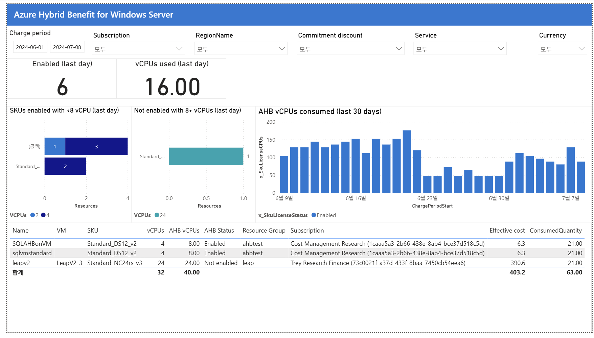

# 08. Azure Hybrid Benefit for Windows Server — 라이선스 혜택 최적화

> 페이지: Azure Hybrid Benefit for Windows Server · 데이터 범위: 2024-06-01 ~ 2024-07-08(앞 페이지 공통) / 앞 페이지와 동일 필터 / 통화 원본 미표기  
> 원본: CostManagementConnector.pbix (FinOps Toolkit) · Inform 단계 비용 가시화  
> 📌 한 줄 요약(TL;DR): leapv2(24 vCPU)는 AHB 미적용으로 즉시 절감 기회, 작은 VM들은 라이선스 낭비 — "8+ vCPU에 우선 배치"가 핵심인 라이선스 최적화 화면임.

## 1. 개요
- 목적: AHB(Azure Hybrid Benefit)는 라이선스 비용 최적화 기법으로,  
  보유 중인 온프레미스 Windows Server 라이선스(SA 포함)를 Azure VM에 재활용해 OS 라이선스 비용을 절감하는 현황을 봄.
- AHB는 약정(RI/SP)과는 별개 축의 절감 레버임.
- 데이터 범위: 청구기간 2024-06-01 ~ 2024-07-08(앞 페이지 공통) / 앞 페이지와 동일 필터 / 통화 원본 미표기.

## 2. 화면 구조·차트 읽는 법
- 상단 지표: Enabled(last day) = 6(AHB 켜진 리소스 수), vCPUs used(last day) = 16.00(AHB로 커버 중인 vCPU).
- 3개 차트 + 하단 표로 "낭비 vs 기회"를 대조함.
  - ① SKUs enabled with <8 vCPU: AHB를 켰지만 vCPU가 8 미만인 VM(낭비 경고).
  - ② Not enabled with 8+ vCPUs: vCPU 8 이상인데 AHB가 꺼진 VM(놓친 기회).
  - ③ AHB vCPUs consumed(최근 30일): 라이선스로 커버한 vCPU 추이.
- 읽는 법: AHB 라이선스는 1 VM당 최소 8코어(vCPU) 단위로 소모됨 →  
  8코어 미만 VM에 쓰면 낭비, 8코어 이상 VM에 쓰면 라이선스당 절감이 극대화됨.

## 3. 분석 요약
> What · 데이터가 보여준 사실(해석 배제)

- 상단 지표: Enabled(last day) 6, vCPUs used(last day) 16.00.
- ① <8 vCPU에 AHB 켜짐: (공백)=1개(4 vCPU 3개), Standard_…=2개(2 vCPU).
- ② 8+ vCPU인데 AHB 꺼짐: Standard_…=1개(24 vCPU).
- ③ AHB vCPUs consumed: 6/23 부근 급감 후 회복 등 변동 관찰.
- 하단 표:

| Name | SKU | vCPUs | AHB vCPUs | AHB Status | Effective cost |
|---|---|---|---|---|---|
| SQLAHBonVM | Standard_DS12_v2 | 4 | 8.00 | Enabled | 6.3 |
| sqlvmstandard | Standard_DS12_v2 | 4 | 8.00 | Enabled | 6.3 |
| leapv2 | Standard_NC24rs_v3 | 24 | 24.00 | Not enabled | 390.6 |
| 합계 | | 32 | 40.00 | | 403.2 |

## 4. 시사점
> So what · 사실의 의미·비용 리스크

- 놓친 기회(leapv2): 24 vCPU 대형 VM인데 AHB 미적용, 비용 390.6으로 표에서 가장 큼 →  
  AHB를 켜면 라이선스 절감이 즉시 발생하는 최대 기회임.
- 라이선스 낭비(작은 VM): 4·2 vCPU VM에 AHB가 켜져 있음 → 8코어 최소 소모 규칙상 비효율.
- 라이선스는 유한 자원: "8+ vCPU VM에 우선 배치"가 라이선스당 절감을 극대화하는 원칙임.
- 약정과 별개 축: 07번의 약정(RI/SP)과 함께 AHB는 라이선스 절감으로 추가 레버 →  
  둘 다 활용해야 총절감이 극대화됨.

## 5. 권고사항
> Now what · Inform 단계 실행 행동(실행은 Optimize 이관 명시)

- (우선순위 1) leapv2 AHB 적용 기회를 최우선 Optimize 후보로 지정: 24 vCPU·비용 390.6의 최대 항목으로 AHB 미적용 갭이 가장 큼(실제 AHB 활성화 실행은 Optimize 단계).
- (우선순위 2) 작은 VM 라이선스 낭비 가시화: 4·2 vCPU VM에 AHB가 켜진 비효율을 식별해 재배치 후보로 표시함(실제 재배치 실행은 Optimize 이관).
- (원칙) 8+ vCPU 우선배치 규칙 수립: 신규/기존 라이선스를 "8+ vCPU VM 우선"으로 배분하는 규칙을 정의해 절감을 극대화함.
- Inform → Optimize 이관 포인트: leapv2 AHB 활성화·라이선스 재배치의 실제 실행은 Optimize 단계로 일원화해 넘김.

## 6. 용어·출처
- AHB(Azure Hybrid Benefit): 보유한 Windows Server(또는 SQL Server) 라이선스를 Azure VM에 적용해  
  Azure가 부과하는 OS 라이선스 요금을 면제받는 제도. Windows VM에서 최대 약 40% 이상 절감 가능.
- vCPU 8코어 규칙: AHB 라이선스는 1 VM당 최소 8코어(vCPU) 단위로 소모됨 → 어디에 쓰느냐가 중요.
- 출처(공식 문서):
  - Azure Hybrid Benefit 개요: https://learn.microsoft.com/windows-server/get-started/azure-hybrid-benefit
  - Azure Hybrid Benefit 요금/설명: https://azure.microsoft.com/pricing/hybrid-benefit/
  - FinOps Toolkit Power BI 리포트: https://learn.microsoft.com/cloud-computing/finops/toolkit/power-bi/reports

### 보충 — 지금까지의 절감 레버 정리
| 레버 | 상태 | 근거 |
|---|---|---|
| ① 약정 할인(RI/SP) | 적용률 낮음, 확대 여지 | 07번 |
| ② 협상 할인 | 0, 협상 여지 | 07번 |
| ③ AHB(라이선스) | leapv2 미적용 = 즉시 기회 | 08번 |
