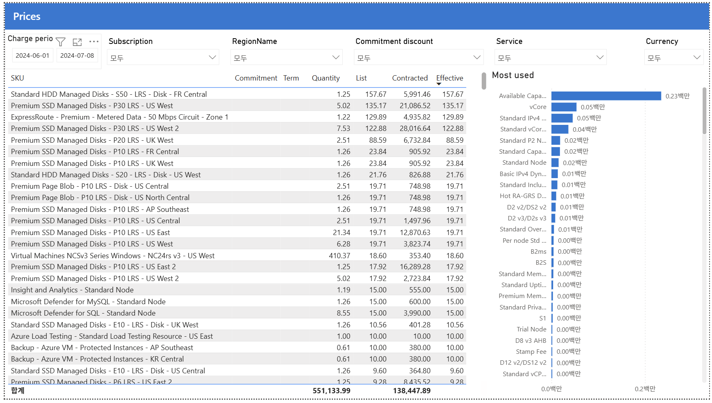

# 09. Prices — SKU별 단가표

> 페이지: Prices · 데이터 범위: 2024-06-01 ~ 2024-07-08(앞 페이지 공통) / 앞 페이지와 동일 필터 / 통화 원본 미표기  
> 원본: CostManagementConnector.pbix (FinOps Toolkit) · Inform 단계 비용 가시화  
> 📌 한 줄 요약(TL;DR): SKU별 단가표로 List=Effective(협상할인 부재)를 재확인하고, Available Capacity 등 최다 사용 미터를 노출하는 요율 참조 화면임.

## 1. 개요
- 목적: Price sheet(단가표) — 나에게 적용되는 SKU별 단가(요율)를 봄.  
  "얼마 썼나(비용)"가 아니라 "단위당 얼마인가(가격)"를 보는 참조 화면임.
- 데이터 범위: 청구기간 2024-06-01 ~ 2024-07-08(앞 페이지 공통) / 앞 페이지와 동일 필터 / 통화 원본 미표기.

## 2. 화면 구조·차트 읽는 법
- 좌측 표: SKU별 Commitment · Term · Quantity · List · Contracted · Effective(3가지 가격).
- 우측: Most used — 사용량(Quantity) 기준 가장 많이 쓴 미터(meter) 순위("백만"=million 단위).
- 3가지 가격 지표(07번 비용 지표의 "단가" 버전):

| 열 | 뜻 |
|---|---|
| List | 정가 단가 (PAYG 공개 요율) |
| Contracted | 계약 단가 (협상 반영 요율) |
| Effective | 실질 단가 (약정까지 반영) |

- 읽는 법: 같은 행에서 List = Effective면 협상·약정에 의한 단가 인하가 없다는 뜻임.

## 3. 분석 요약
> What · 데이터가 보여준 사실(해석 배제)

- 핵심 관찰: 표의 거의 모든 행에서 List = Effective(예: 157.67=157.67, 135.17=135.17) →  
  단가 레벨에서도 협상 할인이 없음(07번의 "Negotiated 0"과 일치).
- 우측 Most used(사용량 상위 미터):
  - Available Capacity 0.23백만(압도적) — Fabric/분석 용량성 미터로 추정.
  - vCore 0.05, Standard IPv4 0.05, Standard vCore 0.04 …
- 표 상단은 단가가 높은 SKU(Premium SSD P30, ExpressRoute Premium 등)로 채워짐.
- 디스크 스토리지 SKU(Premium/Standard Managed Disks)가 표를 다수 차지함.

## 4. 시사점
> So what · 사실의 의미·비용 리스크

- 협상 할인 부재 확인: List=Effective → 계약 단가 협상 여지가 존재(07번과 동일 결론을 단가 근거로 재확인).
- 고가 SKU 존재: Premium SSD P30·ExpressRoute Premium 등 고단가 SKU는 필요성·대안 검토 대상.
- 스토리지 티어 과다 가능성: Premium/Standard Managed Disks가 다수 → 티어 최적화(Premium→Standard) 여지.
- 최다 사용 미터 = 약정 후보: Available Capacity·vCore 등 대량 소비 미터가 RI/SP·용량 최적화 1순위.

## 5. 권고사항
> Now what · Inform 단계 실행 행동(실행은 Optimize 이관 명시)

- (우선순위 1) 최다 사용 미터 약정 검토: Available Capacity·vCore 등 대량 소비 미터를 RI/SP·용량 최적화 1순위로 선별함.
- (우선순위 2) 고가 SKU 필요성 점검: Premium SSD P30·ExpressRoute Premium 등의 사용 목적과 대안을 검토함.
- (우선순위 3) 스토리지 티어 최적화: Managed Disks의 Premium→Standard 전환 가능 대상을 식별함.
- (활용) 단가표 용도: 요금 검증(청구서 대사), 신규 배포 전 비용 예측, 리전 간 단가 비교의 기준 데이터로 사용함.
- Inform → Optimize 이관 포인트: 약정 대상 미터·고가 SKU 대안·스토리지 티어 전환은 Optimize 단계 실행으로 넘김.

## 6. 용어·출처
- Price sheet(단가표): 계정에 적용되는 SKU별 단가(요율) 참조 표.
- List / Contracted / Effective(단가): 정가 요율 / 협상 반영 요율 / 약정까지 반영한 실질 요율.
- meter(미터): 과금 단위. 사용량(Quantity)이 곱해져 비용이 산출됨.
- 출처(공식 문서):
  - Azure Price Sheet(FOCUS 가격 열): https://learn.microsoft.com/cloud-computing/finops/focus/what-is-focus
  - Azure Managed Disks 가격: https://azure.microsoft.com/pricing/details/managed-disks/
  - FinOps Toolkit Power BI 리포트: https://learn.microsoft.com/cloud-computing/finops/toolkit/power-bi/reports

### 보충 — 비용(Cost) vs 가격(Price) 구분
| 화면 | 무엇을 보나 |
|---|---|
| 07번 Charge breakdown | 총비용 분해 (얼마 썼나) |
| 09번 Prices | 단위 요율표 (단위당 얼마인가) |

- 관계식: 비용 = 가격(단가) × 수량(Quantity).
