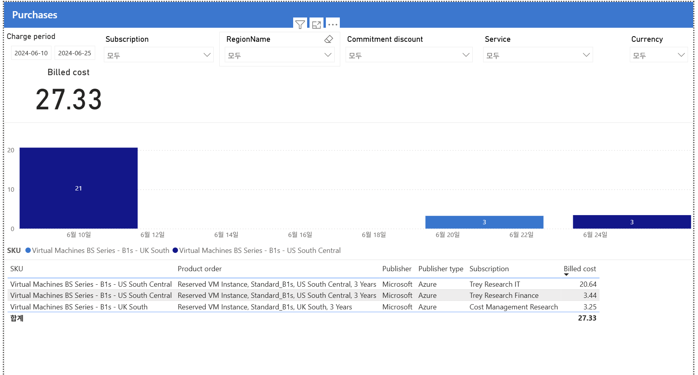

# 10. Purchases — 구매 거래

> 페이지: Purchases · 데이터 범위: 2024-06-10 ~ 2024-06-25(구매 발생 기간으로 자동 축소) / 앞 페이지와 동일 필터 / 통화 원본 미표기  
> 원본: CostManagementConnector.pbix (FinOps Toolkit) · Inform 단계 비용 가시화  
> 📌 한 줄 요약(TL;DR): B1s 3년 RI 3건(총 27.33)이 약정 절감의 실체이며, 전부 1st-party이고 Billed는 시점 통짜·Effective는 기간 분산으로 보는 구매 전용 화면임.

## 1. 개요
- 목적: 사용료(Usage)가 아니라 구매(Purchase) 항목 — 예약(RI)·Savings Plan·Marketplace·지원 플랜 같은  
  일시 구매 거래만 따로 봄.
- 데이터 범위: 이 페이지만 청구기간이 2024-06-10 ~ 2024-06-25로 좁혀짐(앞 페이지는 6/1~7/8) /  
  앞 페이지와 동일 필터 / 통화 원본 미표기.
- 기간이 다른 이유: 구매가 이 기간에만 발생해 자동으로 좁혀진 것. 구매는 매일이 아니라 특정일 이벤트임.

## 2. 화면 구조·차트 읽는 법
- 상단: Billed cost 27.33(이 기간 구매 총액, 소액).
- 막대 차트: 구매 발생일별(6/10=21, 6/20=3, 6/24=3), SKU별 색상.
- 표: SKU · Product order · Publisher · Publisher type · Subscription · Billed cost.
- 읽는 법: 막대의 색 = 구매 SKU, 높이 = 해당 일자 구매액. 표의 Product order = 실제 구매 상품 내용.

## 3. 분석 요약
> What · 데이터가 보여준 사실(해석 배제)

- 청구기간: 2024-06-10 ~ 2024-06-25(구매 발생 기간으로 자동 축소).
- Billed cost: 27.33(구매 총액).
- 구매 발생일별 막대: 6/10=21, 6/20=3, 6/24=3.
- 표 내용:

| SKU | Product order | Publisher type | 구독 | Billed |
|---|---|---|---|---|
| B1s - US South Central | Reserved VM Instance, Standard_B1s, 3 Years | Azure | Trey Research IT | 20.64 |
| B1s - US South Central | Reserved VM Instance, Standard_B1s, 3 Years | Azure | Trey Research Finance | 3.44 |
| B1s - UK South | Reserved VM Instance, Standard_B1s, 3 Years | Azure | Cost Management Research | 3.25 |
| 합계 | | | | 27.33 |

- 3건 모두 Standard_B1s 3년 예약(RI) 구매이며, Publisher type은 전부 Azure(1st-party)임.

## 4. 시사점
> So what · 사실의 의미·비용 리스크

- 약정 구매 실체 확인: B1s 3년 RI 3건 → 앞 페이지들의 "Commitment savings 1.07천"이 이 구매에서 나옴.
- 구매 규모 작음(27.33): 최대 비용원 Microsoft Fabric엔 약정이 안 걸림 → 약정 확대 여지 재확인(07번과 일관).
- 전부 1st-party(Publisher type=Azure): Marketplace(3rd-party) 구매 없음 →  
  MCA 관리 그룹 롤업 제외 이슈에 해당 없음.
- 구매는 특정일 이벤트: 예산·이상 탐지 시 "구매일 스파이크"는 정상(약정 선불)으로 구분해야 함.

## 5. 권고사항
> Now what · Inform 단계 실행 행동(실행은 Optimize 이관 명시)

- (우선순위 1) 약정 확대 대상 선정: 약정이 걸리지 않은 Microsoft Fabric 등 대형 비용원의 RI/SP 적용 가능성을 검토함.
- (우선순위 2) 이상 탐지 규칙 보정: 구매일(6/10 등) 스파이크를 이상이 아닌 정상 약정 선불로 분류하도록 규칙을 조정함.
- (분석 원칙) 관점 구분 사용: 같은 구매를 회계=Billed(시점 통짜), 최적화=Amortized(기간 분산)로 나눠 해석함.
- Inform → Optimize 이관 포인트: Fabric 등 미약정 대형 비용원의 약정 구매 결정은 Optimize 단계 실행으로 넘김.

## 6. 용어·출처
- Product order: 구매한 상품 주문 내용(여기선 "예약 VM 인스턴스, B1s, 3년").
- Publisher: 게시자(Microsoft).
- Publisher type: Azure = 1st-party(MS 자체) / Marketplace = 3rd-party 벤더.
- amortized(상각/Effective): 구매액을 약정 기간에 걸쳐 사용료로 분산해 인식하는 방식.
- 출처(공식 문서):
  - Azure 예약(Reservations) 구매·환불: https://learn.microsoft.com/azure/cost-management-billing/reservations/save-compute-costs-reservations
  - 상각(amortized) 비용 데이터: https://learn.microsoft.com/azure/cost-management-billing/reservations/understand-reserved-instance-usage-ea
  - FinOps Toolkit Power BI 리포트: https://learn.microsoft.com/cloud-computing/finops/toolkit/power-bi/reports

### 보충 — Billed vs Amortized(Effective) 처리 차이
- 07번에서 EffectiveCost의 ChargeCategory Purchase = 0.0이었음.
- 이유: Effective(상각/amortized) 관점에선 구매액을 약정 기간에 걸쳐 사용료로 분산 → 구매 라인은 0.
- 반면 이 Purchases 페이지는 Billed(실제 청구) 관점 → 구매가 거래 시점에 통째로 표시(27.33).
- 즉 같은 구매를 보는 두 관점: 회계(Billed)=시점 통짜, 최적화(Amortized)=기간 분산.
