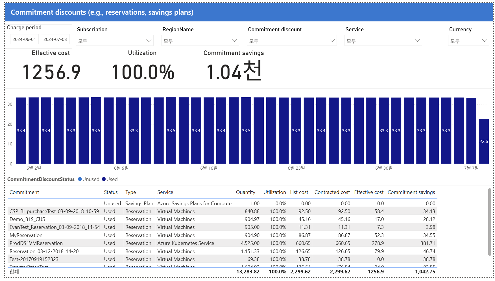

# 11. Commitment discounts — 약정 할인 활용률(건전성) 점검

> 페이지: Commitment discounts · 데이터 범위: 청구기간 원본 미표기 · 필터 없음 · 통화 원본 미표기
> 원본: CostManagementConnector.pbix (FinOps Toolkit) · Inform 단계 비용 가시화
> 📌 한 줄 요약(TL;DR): 활용률 100%로 약정은 건전하나 유휴 Savings Plan 1건은 조사 필요하며, AKS 예약이 최대 절감 효자임.



## 1. 개요
- 이 페이지의 목적: "이미 산 약정(RI/Savings Plan)을 잘 쓰고 있나?"를 보는 활용률(건전성) 점검 화면임.
  뒤 12~15번의 "더 사야 하나?"(권장·Coverage)와 대비되는 "활용" 관점 화면임.
- 데이터 범위: 청구기간 원본 미표기 / 적용 필터 없음 / 통화 원본 미표기(FinOps Toolkit 샘플 데이터)

## 2. 화면 구조·차트 읽는 법
- 상단(핵심지표): 3대 지표 영역 — Effective cost / Utilization / Commitment savings. 이 중 **Utilization**이 가장 중요함.
- 중앙(차트): 일자별 약정 사용량. 색상 = **Used(짙은 남색) / Unused(옅은 파랑)**.
  전부 짙은 색이면 매일 100% 소진 = 낭비 없음으로 읽음.
- 하단(표): 약정별 활용·절감 목록 — 열은 Commitment / Status / Type / Service / Util / Effective / Savings임.
- 읽는 법 핵심: **Utilization = 약정 건전성의 심장**임. 100%면 이상적(낭비 0), 낮으면 안 쓰는 약정 = 돈 버림.

## 3. 분석 요약
> What · 데이터가 보여준 사실(해석 배제)

- 상단 3대 지표
  - Effective cost **1,256.9** (07번 PricingCategory "Committed 1,256.9"와 일치)
  - Utilization **100.0%**
  - Commitment savings **1.04천**
- 차트: 일자별 약정 사용량 ~33.4/일, 전 구간 Used(짙은 남색)로 표시됨.
- 하단 표(약정별 활용·절감)

| Commitment | Status | Type | Service | Util | Effective | Savings |
|---|---|---|---|---|---|---|
| (이름없음) | Unused | Savings Plan | Compute | 0.0% | 0.0 | 0.00 |
| ProdDS1VMReservation | Used | Reservation | AKS | 100% | 278.9 | 381.71 (최대) |
| TransferPatchTest | Used | Reservation | VM | 100% | 94.0 | 82.55 |
| MyReservation | Used | Reservation | VM | 100% | 52.3 | 34.55 |
| CSP_RI_purchaseTest | Used | Reservation | VM | 100% | 58.4 | 34.13 |
| Demo_B1S_CUS | Used | Reservation | VM | 100% | 17.0 | 28.12 |
| … | | | | | | |
| 합계 | | | | 100% | 1,256.9 | 1,042.75 |

- List=Contracted 값이 전부 동일함(07·09번과 일관 — 협상 할인 부재).

## 4. 시사점
> So what · 사실의 의미·비용 리스크

- **전체 활용률 100% = 우수 상태**임. 산 약정을 다 쓰고 있어 낭비가 없음 → 약정 건전성 양호.
- **유휴 Savings Plan 1건(0% 활용) 존재**함. 비용은 0이지만 왜 0% 활용인지 원인 불명(범위 미스매치·대상 리소스 없음 등)의 리스크임.
- **최대 절감원은 ProdDS1VMReservation(AKS) 381.71**임 → AKS 예약이 가장 큰 효자로, 이 계열의 약정 가치가 큼.
- **List=Contracted 동일 → 협상 할인 부재 재확인**됨(07·09번과 일관된 패턴).
- 역할 구분: 11번 = "산 걸 잘 쓰나?"(Utilization/활용), 12~15번 = "더 사면 얼마 아끼나?"(Coverage/권장).

## 5. 권고사항
> Now what · Inform 단계 실행 행동(실행은 Optimize 이관 명시)

- **[우선순위 1·즉시] 유휴 Savings Plan(0%) 원인 조사**함 — 범위(scope) 미스매치 / 대상 리소스 부재 여부를 점검함.
- **[우선순위 2] 건전한 활용률(≈100%)을 근거로 커버리지 확대 검토**를 시작함(12~15번 권장 화면과 연결).
- **[상시 원칙] 활용률 낮은 약정 발견 시** → 범위(scope) 조정 또는 교환/환불 검토를 진행함(실제 범위 조정·교환·환불 실행은 Optimize 단계로 이관).
- **Inform → Optimize 이관 포인트**: 활용률 100%(건전)라는 사실을 근거로, 약정 커버리지 확대 의사결정을
  Optimize 단계로 넘김. 유휴 SP 원인 규명 결과도 함께 이관함.

## 6. 용어·출처

### 용어
- **Utilization(활용률)**: 구매한 약정을 실제로 얼마나 소비했는지 비율. 약정 건전성의 핵심 지표임.
- **Effective cost**: 약정 할인이 적용된 실질 비용.
- **Commitment savings**: 약정으로 아낀 금액(정가 대비 절감액).
- **RI(Reservation)·Savings Plan**: 선구매형 약정 할인 상품. RI는 특정 리소스/유형, SP는 시간당 소비 약정 기반.
- **AKS**: Azure Kubernetes Service. 여기서 최대 절감원 예약이 걸린 서비스임.

### 보충 — 약정 건전성 판단 기준
```
Utilization 높음(≈100%) → 건전. 필요시 커버리지 확대 검토
Utilization 낮음        → 낭비! 범위(scope) 조정 또는 교환/환불 검토
Unused 항목 존재        → 즉시 원인 조사
```

### 출처
- 원본 md에 개별 출처 링크 없음. 아래는 용어·개념의 표준 1차 출처(보완).
- FinOps Toolkit Power BI 리포트: https://learn.microsoft.com/cloud-computing/finops/toolkit/
- Azure 예약 활용률(Reservation utilization): https://learn.microsoft.com/azure/cost-management-billing/reservations/
- FinOps Framework(Rate optimization): https://www.finops.org/framework/
