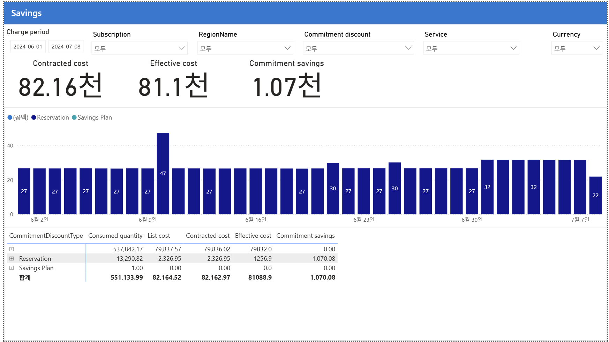

# 12. Savings — 약정 절감·미적용 갭

> 페이지: Savings · 데이터 범위: 청구기간 원본 미표기 · 필터 없음 · 통화 원본 미표기
> 원본: CostManagementConnector.pbix (FinOps Toolkit) · Inform 단계 비용 가시화
> 📌 한 줄 요약(TL;DR): 있는 약정은 잘 쓰지만 비용의 98.5%가 약정 미적용(절감 0)이라 약정 커버리지 확대가 최대 기회임.



## 1. 개요
- 이 페이지의 목적: 11번이 "활용률"이었다면, 이 페이지는 "약정이 실제로 얼마를 아꼈고, 아직 약정 안 걸린 비용이 얼마인가"를 봄.
  즉 절감액과 미적용 갭(gap)을 동시에 보여주는 화면임.
- 데이터 범위: 청구기간 원본 미표기 / 적용 필터 없음 / 통화 원본 미표기(FinOps Toolkit 샘플 데이터)

## 2. 화면 구조·차트 읽는 법
- 상단(핵심지표): 3대 지표 — Contracted cost(약정 전 계약 비용) / Effective cost(약정 적용 후 실질 비용) / Commitment savings.
- 중앙(차트): 일자별 약정 절감액. 색상 = (공백) / Reservation / Savings Plan.
  대부분 Reservation(짙은 남색) ~27/일이며, 6/9에 47 스파이크 등 변동이 있음.
- 하단(표): 약정 유형별(CommitmentDiscountType) 소비·절감 — 열은 Consumed / List / Contracted / Effective / Savings임. 여기가 핵심.
- 읽는 법 핵심: **절감 공식 = Commitment savings = Contracted − Effective**로 읽음(예: 82.16 − 81.1 ≈ 1.07천).

## 3. 분석 요약
> What · 데이터가 보여준 사실(해석 배제)

- 상단 3대 지표
  - Contracted cost **82.16천**
  - Effective cost **81.1천**
  - Commitment savings **1.07천** (= 82.16 − 81.1)
- 하단 표(약정 유형별)

| CommitmentDiscountType | Consumed | List | Contracted | Effective | Savings |
|---|---|---|---|---|---|
| (공백) = 약정 미적용 | 537,842 | 79,837.57 | 79,836.02 | 79,832.0 | 0.00 |
| Reservation | 13,290 | 2,326.95 | 2,326.95 | 1,256.9 | 1,070.08 |
| Savings Plan | 1.00 | 0.00 | 0.00 | 0.0 | 0.00 |
| 합계 | 551,133 | 82,164.52 | 82,162.97 | 81,088.9 | 1,070.08 |

- 약정 미적용(공백) Effective 79,832 / 전체 Effective 81,088.9 → 비용의 98.5%가 약정 미적용임.
- 절감 1,070.08 전부가 Reservation(Effective 1,256.9)에서 발생함. Savings Plan 절감은 0임.

## 4. 시사점
> So what · 사실의 의미·비용 리스크

- **비용의 98.5%가 "약정 미적용(공백)"**임(Effective 79,832 / 전체 81,088.9). 이 거대한 덩어리의 절감 = 0임.
- **약정 적용은 겨우 1,256.9(1.5%)**뿐이며, 발생 절감 1,070은 전부 여기서 나옴 → 절감 구조가 매우 얇음.
- **Savings Plan 절감 0**은 11번의 유휴 SP(0% 활용)와 연결됨 → 산 SP가 일을 안 하는 낭비 리스크.
- **절감률 ~1.3%**(1.07천 / 82.16천)로 성숙한 FinOps 조직 대비 매우 낮음 → Optimize 단계 최우선 과제 신호임.
- 11번과 종합 결론: 있는 약정은 잘 쓰지만(활용률 100%), 약정 커버리지 자체가 턱없이 부족함(98.5% 미적용).

## 5. 권고사항
> Now what · Inform 단계 실행 행동(실행은 Optimize 이관 명시)

- **[우선순위 1·최대 기회] 미적용 79,832에 약정 확대**를 검토함. 특히 07번에서 확인한 Microsoft Fabric(42천)이
  약정 없이 정가로 돌고 있어 우선 대상임.
- **[우선순위 2] 유휴 Savings Plan(절감 0) 원인 규명**함 — 11번 유휴 SP와 동일 이슈, 범위·대상 리소스 점검.
- **[우선순위 3] 절감률(~1.3%) 기준선 기록**함 → Optimize 단계 개선 목표(target) 설정의 출발점으로 삼음.
- **Inform → Optimize 이관 포인트**: "98.5% 미적용 + 절감률 1.3%"라는 사실을 Optimize로 넘겨, 대형 미적용
  워크로드(Fabric 등)의 약정 확대를 최우선 과제로 지정함.

## 6. 용어·출처

### 용어
- **Contracted cost**: 약정(할인) 적용 전, 계약 단가 기준의 비용.
- **Effective cost**: 약정 할인이 적용된 후의 실질 비용.
- **Commitment savings**: 약정으로 아낀 금액. 본 화면 공식 = Contracted − Effective.
- **CommitmentDiscountType**: 약정 할인 유형 구분((공백)=미적용 / Reservation / Savings Plan).
- **(공백) = 약정 미적용**: 어떤 약정 할인도 걸리지 않은 정가 소비분.

### 보충 — 11번 vs 12번 역할 차이
```
11번 Commitment discounts = 산 약정을 "잘 쓰고 있나" (Utilization 100%)
12번 Savings              = 약정이 "얼마 아꼈나" + "얼마가 아직 미적용인가" (98.5% 미적용)
→ 결론: 있는 약정은 잘 쓰지만, 약정 커버리지 자체가 턱없이 부족
```

### 출처
- 원본 md에 개별 출처 링크 없음. 아래는 용어·개념의 표준 1차 출처(보완).
- FinOps Toolkit Power BI 리포트: https://learn.microsoft.com/cloud-computing/finops/toolkit/
- Azure 약정 절감(Commitment discounts): https://learn.microsoft.com/azure/cost-management-billing/
- FinOps Framework(Rate optimization): https://www.finops.org/framework/
