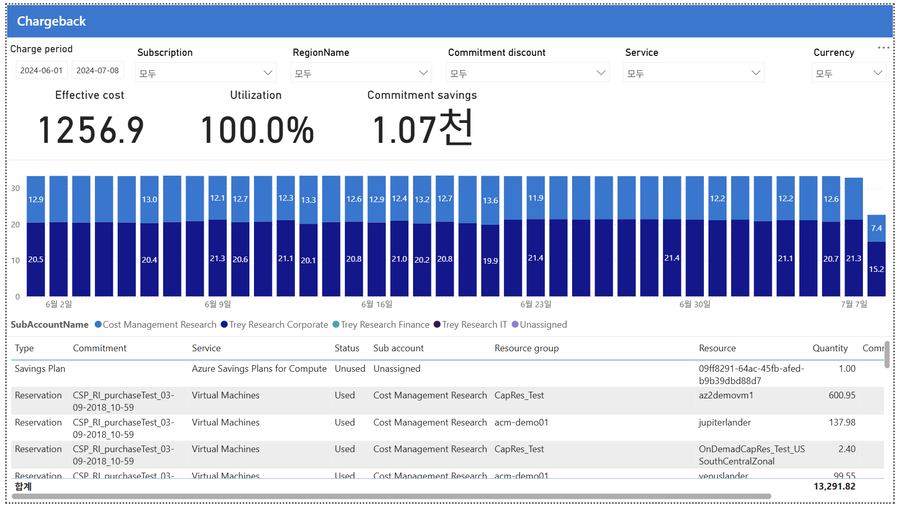

# 13. Chargeback — 약정 소비 주체 귀속(차지백)

> 페이지: Chargeback · 데이터 범위: 청구기간 원본 미표기 · 필터 없음 · 통화 원본 미표기
> 원본: CostManagementConnector.pbix (FinOps Toolkit) · Inform 단계 비용 가시화
> 📌 한 줄 요약(TL;DR): 중앙 구매 약정을 실제 소비한 서브계정·리소스에 귀속시켜 공정 차지백을 가능케 하고, 유휴 SP는 순수 낭비로 확인됨.



## 1. 개요
- 이 페이지의 목적: 차지백의 가장 어려운 케이스 — "중앙에서 산 약정(RI/SP)을 실제로 누가 소비했나"를
  소비 주체·리소스에 되돌려 배분(attribution)하는 화면임.
- 데이터 범위: 청구기간 원본 미표기 / 적용 필터 없음 / 통화 원본 미표기(FinOps Toolkit 샘플 데이터)

## 2. 화면 구조·차트 읽는 법
- 상단(핵심지표): 11번과 동일 약정 지표 — Effective cost / Utilization / Commitment savings.
- 중앙(차트): 일자별 약정 소비를 **소비 주체(SubAccountName) 색상으로 분할**함.
  주로 Trey Research Corporate(짙은 남색) ~20.5 + Cost Management Research(옅은 파랑) ~12.9로 나뉨.
- 하단(표): **리소스 단위 귀속** — 열은 Type / Commitment / Status / Sub account / Resource group / Resource / Qty임.
- 읽는 법 핵심: 어느 예약을, 어느 서브계정의, 어느 리소스(az2demovm1 등)가, 얼마나 소비했는지까지 추적함.

### 왜 약정 차지백이 어려운가
- 예약(RI)은 보통 한 팀/구독이 구매하지만, 그 할인 혜택은 여러 구독의 리소스가 나눠 소비함.
- 그래서 "산 사람 ≠ 쓴 사람" → 실제 소비한 리소스/서브계정에 비용을 되돌려야 공정한 차지백이 됨.
- 이 페이지가 그 소비 주체 귀속을 해줌.

## 3. 분석 요약
> What · 데이터가 보여준 사실(해석 배제)

- 상단 지표(11번과 동일): Effective cost **1,256.9** / Utilization **100.0%** / Commitment savings **1.07천**.
- 차트: 소비 주체별 분배 — Trey Research Corporate ~20.5, Cost Management Research ~12.9.
- 하단 표(리소스 단위 귀속)

| Type | Commitment | Status | Sub account | Resource group | Resource | Qty |
|---|---|---|---|---|---|---|
| Savings Plan | Azure Savings Plans for Compute | Unused | Unassigned | — | (GUID) | 1.00 |
| Reservation | CSP_RI_purchaseTest | Used | Cost Mgmt Research | CapRes_Test | az2demovm1 | 600.95 |
| Reservation | CSP_RI_purchaseTest | Used | Cost Mgmt Research | acm-demo01 | jupiterlander | 137.98 |
| Reservation | CSP_RI_purchaseTest | Used | Cost Mgmt Research | CapRes_Test | (US SC Zonal) | 2.40 |
| Reservation | CSP_RI_purchaseTest | Used | Cost Mgmt Research | acm-demo01 | venuslander | 99.55 |
| 합계 | | | | | | 13,291.82 |

- 유휴 Savings Plan은 Status=Unused, Sub account=Unassigned로 소비 주체가 없음.

## 4. 시사점
> So what · 사실의 의미·비용 리스크

- **공정 차지백의 근거 데이터가 확보됨** — 중앙 구매 예약을 실제 소비 리소스(az2demovm1·jupiterlander 등)에
  귀속시켜 팀별 정산이 가능해짐.
- **Unused Savings Plan → "Unassigned"**임 → 아무도 소비 안 함(11·12번 유휴 SP와 일관). 차지백할 소비자가 없음 = 순수 낭비.
- **혜택 편중** — 약정 혜택이 Cost Mgmt Research·Trey Corporate에 집중됨 → 이들이 약정 비용도 분담해야 공정함.
- **CapRes_Test 리소스 그룹**에 예약이 많이 쓰임 → 특정 용량 예약(Capacity Reservation) 리소스에 소비가 몰림.

## 5. 권고사항
> Now what · Inform 단계 실행 행동(실행은 Optimize 이관 명시)

- **[우선순위 1] 귀속 데이터를 팀별 차지백 정산 근거로 채택**함 — 소비 서브계정·리소스별 약정 비용을 분담시킴.
- **[우선순위 2] 유휴 SP(Unassigned) 처리 결정**함 — 소비자가 없으므로 범위 조정·교환·환불 등 Optimize 조치로 이관.
- **[우선순위 3] 혜택 편중 서브계정(Cost Mgmt Research·Trey Corporate)에 약정 원가 배분 규칙 수립**함.
- **Inform → Optimize 이관 포인트**: 소비 주체 귀속 결과를 근거로, 낭비(유휴 SP) 정리와 편중 워크로드
  약정 재설계를 Optimize 단계에 넘김.

## 6. 용어·출처

### 용어
- **Chargeback(차지백)**: 공용/중앙 비용을 실제 소비한 팀·리소스에 되돌려 배분하는 정산 방식.
- **Attribution(귀속)**: 약정 할인 혜택을 실제 소비 주체(서브계정·리소스)에 매핑하는 과정.
- **SubAccountName(서브계정)**: 소비 주체 단위(구독/계정). 차트 분할·차지백 대상 축임.
- **Unassigned**: 소비 주체가 매핑되지 않은 상태. 유휴 SP처럼 아무도 안 쓴 약정에서 나타남.
- **Capacity Reservation(용량 예약)**: 특정 용량을 사전 확보하는 리소스(예: CapRes_Test).

### 보충 — 11·12·13번 3부작 정리
```
11 Commitments = 약정을 잘 쓰나?        (Utilization 100%)
12 Savings     = 얼마 아꼈나 + 미적용 갭  (98.5% 미적용)
13 Chargeback  = 누가 소비했나 → 되돌림    (서브계정·리소스 귀속)
```

### 출처
- 원본 md에 개별 출처 링크 없음. 아래는 용어·개념의 표준 1차 출처(보완).
- FinOps Toolkit Power BI 리포트: https://learn.microsoft.com/cloud-computing/finops/toolkit/
- FinOps Framework(Allocation·Chargeback): https://www.finops.org/framework/
- Azure 예약 비용 이해: https://learn.microsoft.com/azure/cost-management-billing/reservations/
