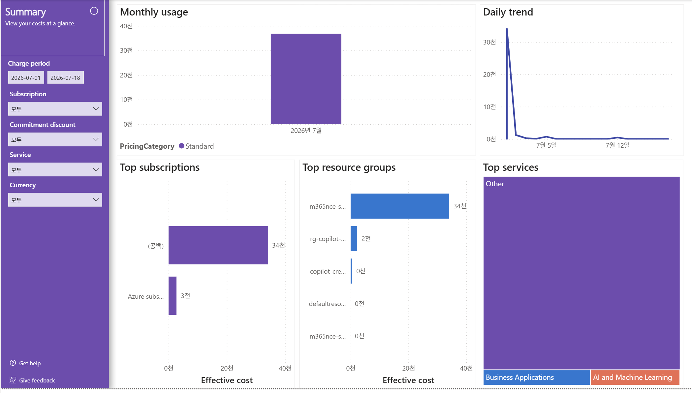

# 01. Summary — 전체 개요 대시보드(총 실질비용·최대 비용원·비용 성격을 한눈에)

> 페이지: Summary · 데이터 범위: 청구기간 2026-07-01 ~ 2026-07-18 · 필터 전체(All) · 통화 샘플("천"=1,000 단위)  
> 원본: FinOps Toolkit Cost summary 리포트 (Storage/데이터 export·FOCUS 기반) · Inform 단계 비용 가시화  
> 📌 한 줄 요약(TL;DR): 이번 기간 비용 대부분이 (공백) 구독 34천에 몰려 있고, 이는 M365 NCE 라이선스 성격의 고정비로  
> 특정일 급등 형태로 계상됨. Azure 실사용은 3천에 불과함.

## 1. 개요
- 보고서의 표지이자 대시보드로 "이번 기간에 어디에 얼마를 썼나"를 한 화면에서 조망하는 화면임
- 데이터 범위: 청구기간 `2026-07-01 ~ 2026-07-18` / 필터 Subscription·Commitment discount·Service·Currency 모두 All /  
  통화 샘플(막대·차트 값은 "천"=1,000 단위 표시)
- admin 리포트와 다른 템플릿으로, 우측에 Monthly usage·Daily trend·Top subscriptions/resource groups/services 5개 시각화 배치

## 2. 화면 구조·차트 읽는 법
화면은 크게 좌측 필터 + 우측 5개 차트로 구성됨.

### ① 좌측 필터 (조건 거르개)
- **Charge period(청구 기간)**: `2026-07-01 ~ 2026-07-18` — 이 기간의 비용만 표시
- **Subscription / Commitment discount / Service / Currency**: 모두 "모두(All)" → 전체 조회 중
- 특정 구독·서비스만 골라 범위를 좁혀 볼 수 있음

### ② Monthly usage (월별 사용량 막대)
- `2026년 7월` 단일 막대 1개(기간이 한 달 안이므로) — 높이 약 **37천**(전체 기간 합계와 일치)
- 범례 `PricingCategory ● Standard`(보라 단색) → **전량 Standard(정가)** 구간, 약정·스팟(Committed/Dynamic) 없음

### ③ Daily trend (일별 추이 선)
- 기간 초(약 7월 2일경) **약 33천으로 단일 급등** 후 이후 전 구간 0천 근처로 평탄
- 매끈한 우상향이 아니라 "하루 큰 계상 + 이후 미미한 사용"의 전형적 형태 → 뒤 running-total·charge-breakdown에서 원인 확인 가능

### ④ Top subscriptions (구독 상위, Effective cost)
| 구독 | 값 |
|---|---|
| **(공백)** | **34천** |
| Azure subs...(Azure subscription 1) | 3천 |

- 최상위가 구독명 (공백) → 이름이 매핑되지 않는 비용에 34천이 집중

### ⑤ Top resource groups (리소스 그룹 상위, Effective cost)
| 리소스 그룹 | 값 |
|---|---|
| m365nce-s...(m365nce-sub) | 34천 |
| rg-copilot-... | 2천 |
| copilot-cre... | 0천 |
| defaultreso... | 0천 |
| m365nce-s... | 0천 |

- 최상위 `m365nce-*` 34천, 그 외 `rg-copilot-*` 2천 → **M365·Copilot 중심 환경**임이 드러남

### ⑥ Top services (서비스 상위, 트리맵)
- **Other**가 화면 대부분을 차지(보라 큰 타일), 하단에 **Business Applications**(파랑)·**AI and Machine Learning**(주황) 소형 타일
- 트리맵 타일에 수치 라벨은 화면상 미표기(정확한 금액은 03.charge-breakdown 참조)

## 3. 분석 요약
> What · 데이터가 보여준 사실(해석 배제)

- 청구기간 `2026-07-01 ~ 2026-07-18`, 필터 전체 All, PricingCategory 전량 **Standard**
- Monthly usage: 2026년 7월 단일 막대 약 **37천**
- Daily trend: 기간 초(7월 2일경) **약 33천 단일 급등** 후 전 구간 0천 근처로 평탄, 7월 5일·12일 부근 미세 융기
- Top subscriptions: **(공백) 34천** + Azure subscription 1 **3천**
- Top resource groups: **m365nce-* 34천** + rg-copilot-* **2천** + 나머지 0천
- Top services: **Other**가 압도적, Business Applications·AI and Machine Learning은 소형 타일
- 상단 지표(Effective cost)는 이 페이지에 카드로 없음 → 총액은 02.running-total(36.79천)에서 확인

## 4. 시사점
> So what · 사실의 의미·비용 리스크

- **비용의 대부분이 (공백) 구독 = m365nce-* RG 34천에 집중**(전체 약 92.6%) → 변동형 Azure 사용료가 아니라  
  M365 NCE 라이선스 성격의 **고정비**로 추정됨(Purchase 성격은 03.charge-breakdown에서 확정)
- Daily trend 급등은 사고·이상 배포가 아니라 **라이선스가 특정일에 일괄 계상**된 형태로 읽는 것이 타당 →  
  단, 이상 여부는 running-total 누적 곡선과 대조해 확정할 것
- PricingCategory 전량 Standard = **약정(RI/SP)·협상 할인 미적용** → 할인 사각지대(절감 0의 근거)
- Top services의 **Other 압도**는 M365/라이선스 비용이 표준 Azure 서비스 분류에 매핑되지 않기 때문으로 추정 →  
  비용 가시성(어떤 서비스에 쓰였나)이 낮음
- 실제 최적화 여지가 있는 **변동형 Azure 사용은 3천(약 7.4%)**에 불과 → 절감 레버는 라이선스 계약 검토 쪽에 큼

## 5. 권고사항
> Now what · Inform 단계 실행 행동(실행은 Optimize 이관 명시)

- **1순위: (공백)/m365nce-* 34천의 성격 규명** — Purchase(구매)인지 확정하고, 라이선스 수량·플랜 최적성 검토 대상으로 지목  
  (charge-breakdown에서 Purchase 34,080 확인 → 계약·라이선스 최적화는 **Optimize 이관**)
- **태깅 거버넌스 착수** — 최상위 구독명이 (공백)이라 원가부서(Cost Center) 귀속이 불가 →  
  구독·RG 태깅 정책 수립(tag_CostCenter 필수화)은 Inform의 즉시 과제
- **할인 사각지대 인지** — 전량 Standard이므로 변동형 Azure 사용(3천)에 대한 약정/협상 여지 검토 →  
  실제 구매·협상 실행은 **Optimize 이관**
- **Daily trend 급등 상시 감시** — 라이선스 계상 외 예기치 않은 급등 시 배포 이력·예산 대비 점검 절차 운영

## 6. 용어·출처

### 용어
- **Effective cost(실질 비용)**: 할인이 모두 적용된 뒤 실제 부담 비용(분석·showback 기준)
- **PricingCategory(가격 분류)**: Standard(정가) / Committed(약정적용) / Dynamic(스팟·변동) — 본 화면은 전량 Standard
- **(공백) 구독/RG**: 구독명·RG명이 비어 있는(매핑 안 된) 비용 묶음. 본 환경에선 M365 NCE 라이선스 성격
- **Treemap(트리맵)**: 면적 크기로 비중을 표현하는 차트. Other가 크면 표준 분류 밖 비용이 큼을 의미

### 출처
- [FinOps Toolkit Power BI 리포트](https://learn.microsoft.com/cloud-computing/finops/toolkit/power-bi/reports)
- [FOCUS(FinOps Open Cost & Usage Spec) 비용 지표 정의](https://focus.finops.org/)
- [Microsoft 365 통한 클라우드 솔루션 공급자(NCE) 개요](https://learn.microsoft.com/partner-center/enroll/csp-overview)
