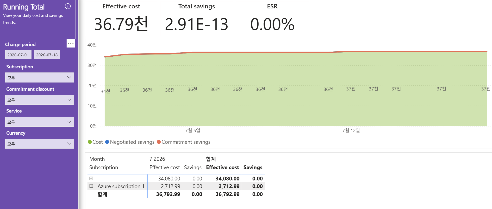

# 02. Running Total — 일별 누적 비용·절감 추이(총 36.79천, 절감 0·ESR 0.00%)

> 페이지: Running Total · 데이터 범위: 청구기간 2026-07-01 ~ 2026-07-18 · 필터 전체(All) · 통화 샘플("천"=1,000 단위)  
> 원본: FinOps Toolkit Cost summary 리포트 (Storage/데이터 export·FOCUS 기반) · Inform 단계 비용 가시화  
> 📌 한 줄 요약(TL;DR): 총 실질비용 36.79천이 첫날 34천에서 시작해 완만히 37천으로 누적됨. 절감은 사실상 0(ESR 0.00%)으로  
> 약정·협상 할인이 전무함.

## 1. 개요
- 목적: 일자별 비용과 절감이 **얼마나 쌓여 가는지(누적)**를 선/영역 차트로 보여주고, 상단 3대 지표로 절감 성과를 요약함
- admin에는 없는 신규 페이지로, 상단에 **Effective cost·Total savings·ESR** 3개 카드가 나란히 배치됨
- 데이터 범위: 청구기간 `2026-07-01 ~ 2026-07-18` / 필터 Subscription·Commitment discount·Service·Currency 모두 All

## 2. 화면 구조·차트 읽는 법

### ① 상단 지표 3개 (제일 먼저 볼 숫자)
| 지표 | 값 | 의미 |
|---|---|---|
| **Effective cost (실질 비용)** | **36.79천** (≈36,792.99) | 할인 적용 후 실제 부담 비용 |
| **Total savings (총 절감액)** | **2.91E-13** (사실상 0) | 이 기간 할인으로 아낀 총액 = 없음 |
| **ESR (Effective Savings Rate, 유효 절감률)** | **0.00%** | 정가 대비 실제로 아낀 비율 = 0% |

- `2.91E-13`은 지수 표기로 0.000...291 수준 → 부동소수 잔여값일 뿐 **실질 0원**임
- ESR 0.00% = **할인이 하나도 적용되지 않은 상태**임을 한 숫자로 확정

### ② 누적 추이 차트 (영역 + 선)
- **초록 영역(Cost)**: 기간 첫날 이미 **약 34천**에서 시작해 완만히 상승, 마지막 **약 37천**에서 마감
- 데이터 라벨이 좌→우로 `34천 → 35천 → 36천 → 36천 → ... → 37천`으로 아주 천천히 증가
- 범례 3색: 🟢 **Cost**(실제 비용) · 🔵 **Negotiated savings**(협상 절감) · 🟠 **Commitment savings**(약정 절감)
- **절감선(파랑·주황)이 사실상 0에 붙어 보이지 않음** → 절감이 없다는 시각적 증거
- 읽는 법: 곡선이 **첫날부터 34천으로 높게 시작**하는 것은 그날 큰 비용(고정비/구매)이 일괄 계상되었다는 신호 →  
  이후 기울기가 매우 완만한 것은 일일 변동 사용이 미미함을 의미

### ③ 하단 표 (구독별 상세)
행 = **구독(Subscription)**, 열 = 월(7 2026) Effective cost·Savings + 합계.

| Subscription | Effective cost | Savings |
|---|---|---|
| **(공백)** | **34,080.00** | 0.00 |
| **Azure subscription 1** | **2,712.99** | 0.00 |
| **합계** | **36,792.99** | **0.00** |

- (공백) 구독 하나가 34,080으로 전체의 약 **92.6%**, Azure subscription 1은 2,712.99(약 7.4%)
- **모든 행의 Savings = 0.00** → 어느 구독에도 할인이 걸리지 않음

## 3. 분석 요약
> What · 데이터가 보여준 사실(해석 배제)

- Effective cost **36.79천**(≈36,792.99), Total savings **2.91E-13(≈0)**, **ESR 0.00%**
- 누적 곡선: 첫날 약 **34천**에서 시작 → 완만 상승 → 마지막 약 **37천**(라벨 34천→...→37천)
- 절감선(Negotiated·Commitment) 모두 0선에 밀착 → 화면상 식별 불가 수준
- 하단 표: (공백) **34,080.00** + Azure subscription 1 **2,712.99** = 합계 **36,792.99**, 전 행 Savings **0.00**

## 4. 시사점
> So what · 사실의 의미·비용 리스크

- **ESR 0.00% = 할인 활용이 전무** → 약정(RI/Savings Plan)·협상 할인이 하나도 적용되지 않은 환경(최대 리스크이자 최대 기회)
- 누적 곡선이 **첫날 34천으로 급출발**하는 것은 (공백) 구독 34,080이 **기간 초 일괄 계상**됨을 의미 →  
  01.summary의 Daily trend 급등과 정확히 일치(라이선스/구매 성격 고정비로 추정, 확정은 03.charge-breakdown)
- 이후 곡선 기울기 매우 완만 = Azure 변동 사용(2,712.99)이 18일간 소액씩 누적(하루 평균 약 150 수준)
- 절감이 전 구독 0 → **할인 사각지대 100%**. 단, 비용의 92.6%가 고정비(라이선스) 성격이면 약정 할인 대상 자체가 제한적일 수 있음  
  → "절감 0"의 원인이 미조치인지, 구조적으로 약정 대상이 아닌지 구분 필요

## 5. 권고사항
> Now what · Inform 단계 실행 행동(실행은 Optimize 이관 명시)

- **ESR 0% 원인 이원화 분석** — (a) 변동형 Azure 사용(2,712.99)의 약정/협상 미적용분과 (b) 라이선스 고정비를 분리 →  
  (a)만 약정·협상 절감 후보로 선별(실제 구매·협상 실행은 **Optimize 이관**)
- **(공백) 구독 34,080의 성격 확정** — Purchase(구매)/라이선스 여부를 03.charge-breakdown Sankey로 확정하고,  
  라이선스 수량·플랜 최적화는 계약 검토 과제로 등록(**Optimize 이관**)
- **누적 곡선 이상 감시 기준선 설정** — "첫날 고정비 계상 + 완만 상승"을 정상 패턴으로 정의하고,  
  기울기 급변 시 신규 배포·예산 초과로 조사
- **절감 성과 KPI로 ESR 채택** — 향후 Optimize 진행 시 ESR 상승을 절감 성과 지표로 추적

## 6. 용어·출처

### 용어
- **Effective cost(실질 비용)**: 할인이 모두 적용된 뒤 실제 부담 비용
- **Total savings(총 절감액)**: 협상 할인 + 약정 할인 절감의 합(본 화면 ≈0)
- **ESR (Effective Savings Rate, 유효 절감률)**: `절감액 ÷ 정가(List)` 형태로 산출하는 **정가 대비 실제 절감 비율**.  
  0%면 정가 그대로 지불(할인 미적용), 값이 클수록 약정·협상으로 잘 절감한 상태 → **절감 성과를 한 숫자로 보는 대표 지표**
- **Negotiated savings(협상 할인 절감)**: 계약 단가 협상으로 아낀 금액(자동 적용). 본 화면 0
- **Commitment savings(약정 할인 절감)**: RI·Savings Plan 구매로 아낀 금액(능동 구매). 본 화면 0
- **Running total(누적 합계)**: 일자별 값을 앞에서부터 더해 나간 값. 곡선 시작 높이 = 첫 구간 비용

### 출처
- [What are Azure Reservations? — 최대 72%](https://learn.microsoft.com/azure/cost-management-billing/reservations/save-compute-costs-reservations)
- [What are savings plans? — 최대 65%](https://learn.microsoft.com/azure/cost-management-billing/savings-plan/savings-plan-overview)
- [FOCUS(FinOps Open Cost & Usage Spec) 비용 지표 정의](https://focus.finops.org/)
- [FinOps Toolkit Power BI 리포트](https://learn.microsoft.com/cloud-computing/finops/toolkit/power-bi/reports)
