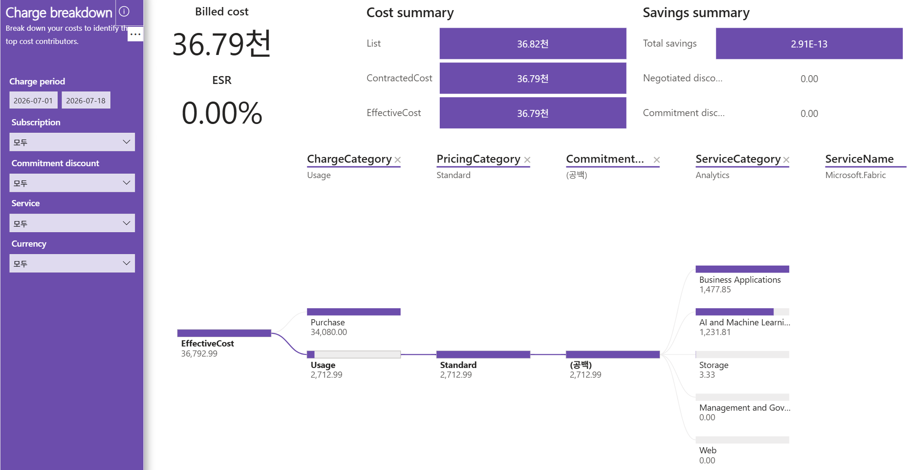

# 03. Charge breakdown — 요금 분해(비용의 92.6%가 Purchase 34,080, 절감 0)

> 페이지: Charge breakdown · 데이터 범위: 청구기간 2026-07-01 ~ 2026-07-18 · 필터 전체(All) · 통화 샘플("천"=1,000 단위)  
> 원본: FinOps Toolkit Cost summary 리포트 (Storage/데이터 export·FOCUS 기반) · Inform 단계 비용 가시화  
> 📌 한 줄 요약(TL;DR): EffectiveCost 36,792.99가 Purchase 34,080(라이선스 구매)과 Usage 2,712.99(Azure 사용료)로 갈라짐.  
> 사용료는 Business Applications·AI/ML(Copilot)에 집중되고 절감은 전부 0임.



## 1. 개요
- 목적: 가장 정보 밀도가 높은 화면으로, 4대 비용 지표 카드와 **Sankey(흐름) 다이어그램**으로  
  EffectiveCost가 요금 유형·가격 분류·서비스로 어떻게 쪼개지는지 추적함
- 데이터 범위: 청구기간 `2026-07-01 ~ 2026-07-18` / 필터 전체 All / 통화 샘플(값은 원 단위 라벨, 카드는 "천" 단위)

## 2. 화면 구조·차트 읽는 법
- 상단 좌측: **Billed cost** 카드 + **ESR** 카드
- 상단 중앙: **Cost summary** — List / ContractedCost / EffectiveCost 3대 지표
- 상단 우측: **Savings summary** — Total / Negotiated / Commitment 절감
- 상단 브레드크럼: `ChargeCategory → PricingCategory → CommitmentDiscount → ServiceCategory → ServiceName`  
  (각 단계로 필터·드릴다운하는 축. 현재 표시 예: Usage → Standard → (공백) → Analytics → Microsoft.Fabric)
- 가운데/하단: **Sankey 분해** — EffectiveCost가 좌→우로 분기하며 흐름(띠) 굵기 = 비용 크기
- 지표 흐름: `List(정가) → Contracted(−협상) → Effective(−약정) → Billed(청구서)`

## 3. 분석 요약
> What · 데이터가 보여준 사실(해석 배제)

- Billed cost **36.79천**, **ESR 0.00%**

- Cost summary (비용 요약)

| 지표 | 값 | 의미 |
|---|---|---|
| List | 36.82천 | 정가(PAYG 공개가) — 할인 전 |
| ContractedCost | 36.79천 | 협상 단가 적용 후 |
| EffectiveCost | 36.79천 | 약정까지 적용한 실질 비용(분석·showback 기준) |

- Savings summary (절감 요약)

| 지표 | 값 | 의미 |
|---|---|---|
| Total savings | 2.91E-13 | 총 절감 = 사실상 0 |
| Negotiated discounts | 0.00 | 협상 할인 없음 |
| Commitment discounts | 0.00 | 약정 할인 없음 |

- 카드 표시상 List(36.82천)가 Effective(36.79천)보다 근소하게 높으나, Savings summary는 Negotiated·Commitment 모두  
  0.00·Total ≈0으로 **유의미한 할인 없음**(천 단위 반올림 표시 차로 판단)

- Sankey 분해(좌→우, EffectiveCost 36,792.99 기준):

```
EffectiveCost 36,792.99
├ [ChargeCategory] Purchase 34,080.00        ← 라이선스 구매 성격(전체의 92.6%)
└ [ChargeCategory] Usage    2,712.99          ← 변동형 Azure 사용료
      └ [PricingCategory]    Standard 2,712.99   (전량 정가)
          └ [CommitmentDiscount] (공백) 2,712.99  (약정 미적용)
              └ [ServiceCategory]
                 ├ Business Applications      1,477.85
                 ├ AI and Machine Learning    1,231.81
                 ├ Storage                        3.33
                 ├ Management and Governance      0.00
                 └ Web                            0.00
```

- Usage 분해 합계 검증: 1,477.85 + 1,231.81 + 3.33 + 0 + 0 = **2,712.99**(Usage 총액과 일치)
- **핵심 사실**: 전체 비용의 92.6%(34,080)는 **Usage(사용료)가 아니라 Purchase(구매)** 요금 유형임

## 4. 시사점
> So what · 사실의 의미·비용 리스크

- **비용 성격이 이원 구조**: ① Purchase 34,080(라이선스/구매·고정비) + ② Usage 2,712.99(변동형 Azure)  
  → 두 축은 최적화 방법이 완전히 다름(전자=계약/수량, 후자=약정/우량화)
- **Purchase 34,080은 약정(RI/SP) 대상이 아님** → running-total의 "절감 0"이 미조치만의 문제가 아니라  
  비용의 92.6%가 구조적으로 약정 할인 대상 밖임을 설명. 이 부분 절감은 **라이선스 계약·수량 조정**으로만 가능
- **변동형 Usage 2,712.99는 전량 Standard(정가)·(공백) 약정** → 여기가 약정/협상으로 절감 가능한 유일 구간(다만 규모 소액)
- Usage는 **Business Applications(1,477.85) + AI and Machine Learning(1,231.81)**에 99.9% 집중 →  
  Copilot/Power Platform 성격 워크로드가 Azure 실사용의 실체
- **Negotiated 0** → 볼륨 협상 여지가 남아 있으나, 대상 규모(2,712.99)가 작아 절감 효과는 제한적
- CommitmentDiscount 축이 전량 (공백) → 약정 커버리지 0%

## 5. 권고사항
> Now what · Inform 단계 실행 행동(실행은 Optimize 이관 명시)

- **(우선순위 1) Purchase 34,080 계약 검토 대상 지정** — 최대 비용원이자 최대 레버.  
  M365 NCE 라이선스 수량·플랜(연간/월간)·미사용 좌석 점검을 **Optimize 이관** 과제로 등록
- **(우선순위 2) Usage 2,712.99 약정/우량화 후보 선별** — Business Applications·AI/ML 워크로드의 상시성 판단 →  
  기저부하는 약정, 변동분은 정가 유지 검토(실제 구매는 **Optimize 이관**)
- **(우선순위 3) 태깅·귀속 정비** — CommitmentDiscount·구독명 (공백) 및 tag_CostCenter 전량 공백 →  
  원가부서 귀속을 위한 태깅 거버넌스 착수(Inform 즉시 과제)
- **(분석 원칙) 지표 용도 구분** — 회계·청구 대사는 Billed(36.79천), 최적화·showback 분석은 Effective(36,792.99) 사용
- Inform → Optimize 이관 포인트: 라이선스 계약 최적화·Usage 약정 확대·협상은 모두 Optimize 단계 실행 과제로 넘김

## 6. 용어·출처

### 용어
- **Billed cost(청구 비용)**: 실제 청구서 금액(상각·시점 반영)
- **List / Contracted / Effective**: 정가 / 협상 단가 적용 / 약정까지 적용한 실질 비용
- **ChargeCategory(요금 유형)**: **Usage(사용료) / Purchase(구매) / Adjustment(조정·환불)** — 본 환경은 Purchase가 92.6%
- **PricingCategory(가격 분류)**: Standard(정가) / Committed(약정적용) / Dynamic(스팟·변동) — 본 환경 전량 Standard
- **CommitmentDiscount(약정 할인)**: 어떤 약정이 적용됐나. (공백)=미적용
- **Sankey(흐름도)**: 띠 굵기로 비용 크기를 표현하며 좌(상위 분류)→우(세부 서비스)로 분해
- **ESR(유효 절감률)**: 정가 대비 실제 절감 비율(0%=할인 미적용)

### 출처
- [FOCUS(FinOps Open Cost & Usage Spec) — ChargeCategory·비용 지표 정의](https://focus.finops.org/)
- [Azure 예약(Reservations) 비용 절감](https://learn.microsoft.com/azure/cost-management-billing/reservations/save-compute-costs-reservations)
- [Azure Savings Plan for compute](https://learn.microsoft.com/azure/cost-management-billing/savings-plan/savings-plan-compute-overview)
- [FinOps Toolkit Power BI 리포트](https://learn.microsoft.com/cloud-computing/finops/toolkit/power-bi/reports)
