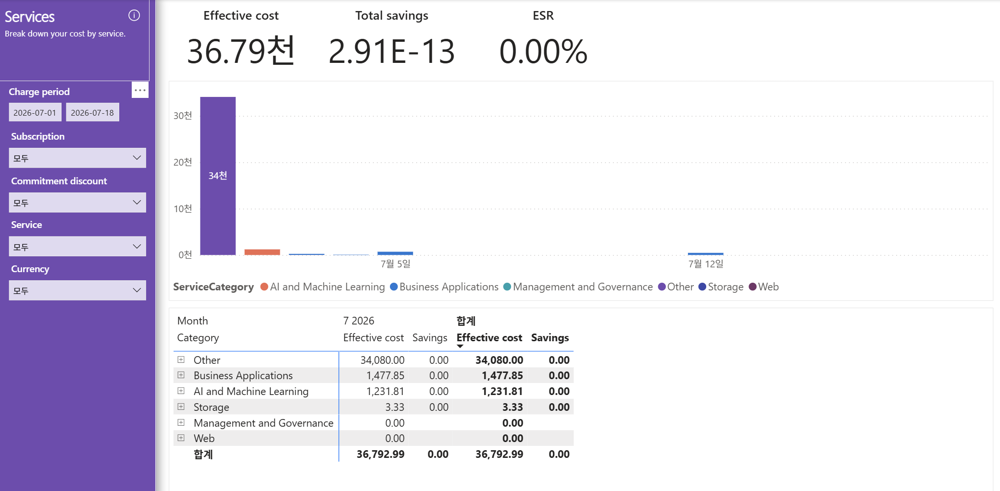

# 04. Services — 서비스 종류별 비용 분해(어디에 돈이 쓰이는가)

> 페이지: Services · 데이터 범위: 청구기간 2026-07-01 ~ 2026-07-18 · 필터 전체(All) · 통화 샘플  
> 원본: FinOps Toolkit Cost summary 리포트 (Storage/데이터 export · FOCUS 기반) · Inform 단계 비용 가시화  
> 📌 한 줄 요약(TL;DR): Other 대분류가 34,080(약 92.6%)로 비용을 독점하고 절감(savings)은 사실상 0이며 ESR 0.00%임.

## 1. 개요
- "어떤 서비스 대분류(ServiceCategory)에 돈을 쓰는가"를 종류별로 쪼개 보는 화면임  
- 데이터 범위: 청구기간 `2026-07-01 ~ 2026-07-18` / 필터 모두 All(모두) / 통화 샘플  
- 좌측 필터: Charge period · Subscription(모두) · Commitment discount(모두) · Service(모두) · Currency(모두)

## 2. 화면 구조·차트 읽는 법
- 상단 KPI: Effective cost **36.79천** / Total savings **2.91E-13**(지수표기, 사실상 0) / ESR **0.00%**  
- 가운데: **일자별 누적 막대(stacked bar)** — 하루치 비용을 ServiceCategory 색깔로 층층이 쌓음  
  - 막대 높이 = 그날의 총비용, 색층 = 대분류별 기여분  
  - x축은 7월 5일 · 7월 12일 눈금 표시, 청구기간 초반(7월 초)에 보라색 **34천** 막대가 크게 솟고 이후 거의 0에 수렴  
- 범례: ServiceCategory 6종 — AI and Machine Learning · Business Applications · Management and Governance ·  
  Other · Storage · Web  
- 하단 표: **ServiceCategory별** `7 2026` 월 컬럼 + 합계 컬럼(Effective cost · Savings)

### 막대 차트에서 꼭 볼 것 — 7월 초 단일 급등
- 청구기간 초반에 보라색(Other) 막대가 **34천**으로 압도적으로 솟고, 이후 날짜는 소액 막대만 남음  
- admin 템플릿의 "6/23 계단식 증가"와 달리, 여기서는 **초반 1회성 대형 계상**이 지배적인 형태임

## 3. 분석 요약
> What · 데이터가 보여준 사실(해석 배제)

하단 표(ServiceCategory별) 수치.

| 대분류 | 합계(Effective cost) | Savings | 비중 |
|---|---|---|---|
| **Other** | **34,080.00** | 0.00 | ~92.6%(압도적 1위) |
| **Business Applications** | **1,477.85** | 0.00 | ~4.0% |
| **AI and Machine Learning** | **1,231.81** | 0.00 | ~3.3% |
| Storage | 3.33 | 0.00 | ~0.01% |
| Management and Governance | 0.00 | (표기 없음) | 0% |
| Web | 0.00 | (표기 없음) | 0% |
| **합계** | **36,792.99** | **0.00** | (KPI 총액과 일치) |

- **Other 34,080.00**으로 전체의 약 92.6%, 단일 대분류 압도적 1위  
- **Business Applications 1,477.85**(~4.0%), **AI and Machine Learning 1,231.81**(~3.3%)로 2 ~ 3위  
- Storage 3.33로 극소액, Management and Governance · Web은 0.00  
- 모든 대분류의 **Savings가 0.00** → Total savings 사실상 0, ESR 0.00%  
- 막대 차트는 7월 초에 보라색(Other) 34천이 단일 급등 후 이후 거의 0에 수렴

## 4. 시사점
> So what · 사실의 의미·비용 리스크

- **Other 단일 92.6% 집중** — 비용의 대부분이 "분류되지 않은(Other)" 대분류에 묶여 있어, 서비스 관점 분석이  
  사실상 불가능함. 이는 M365/Copilot 중심 환경에서 Azure 표준 ServiceCategory 매핑이 비어 있는 구조로 추정됨  
- **절감(savings) 전무·ESR 0.00%** — 약정 할인(Commitment discount)·예약 등 절감 수단이 전혀 적용되지 않은 상태  
- **AI and Machine Learning 1,231.81 존재** — 소액이나 FinOps for AI 관점에서 증가 추세 감시가 필요한 항목  
- **Business Applications 1,477.85** — Copilot/업무앱 계열로 추정되는 정규 분류 비용이나 Other에 비하면 극소  
- 서비스 대분류가 Other로 뭉쳐 있어, 현재 화면만으로는 최적화 대상 서비스를 특정하기 어려운 **가시성 리스크**가 존재

## 5. 권고사항
> Now what · Inform 단계 실행 행동(실행은 Optimize 이관 명시)

- **Other 34,080의 실체 규명** — 어떤 청구 항목이 Other로 분류되는지 드릴다운(+ 확장) 후,  
  M365/Copilot(NCE) 청구가 Azure ServiceCategory에 매핑되지 않는 구조인지 확인(Inform 단계 가시화 과제)  
- **분류 체계·태깅 보강** — Other 비중을 낮추도록 청구 데이터 매핑·태깅 규칙 정비 검토 → 실제 적용은 Optimize 이관  
- **절감 수단 미적용 확인** — ESR 0.00%의 원인(약정·예약 부재)을 점검하고 적용 여지 판단 → 실행은 Optimize 이관  
- **AI/ML 모니터링 등록** — 1,231.81은 소액이나 증가 추세 감시 대상으로 등록  
- 본 화면은 **Inform(가시화) 단계** 산출물이며, right-sizing·약정 등 절감 실행은 Optimize 단계로 이관함을 명시

## 6. 용어·출처

### 용어
- **ServiceCategory**: 서비스 상위 대분류(Compute · Analytics · Storage · Other 등) — 하단 표 단위  
- **Other**: 표준 대분류에 매핑되지 않은 청구 항목이 묶이는 분류. 비중이 크면 가시성 저하 신호  
- **Effective cost**: 실제 부담 비용(할인·상각 반영 후)  
- **Total savings / ESR**: 절감액 및 유효절감률(Effective Savings Rate). 0이면 절감 수단 미적용 상태  
- **누적 막대(stacked bar)**: 하루 총비용을 대분류별로 나눠 쌓은 막대. 높이 = 일 총비용, 색층 = 대분류 기여

### 출처
- FinOps Toolkit "Cost summary" 리포트(Storage/데이터 export · FOCUS 기반), Services 페이지 화면 판독
