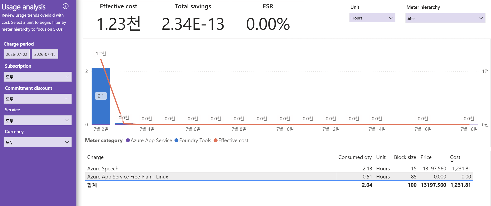

# 05. Usage analysis — 사용량-비용 오버레이 분석(얼마나 써서 얼마가 나왔는가)

> 페이지: Usage analysis · 데이터 범위: 청구기간 2026-07-02 ~ 2026-07-18 · 필터 전체(All) · 통화 샘플  
> 원본: FinOps Toolkit Cost summary 리포트 (Storage/데이터 export · FOCUS 기반) · Inform 단계 비용 가시화  
> 📌 한 줄 요약(TL;DR): Unit=Hours 필터 기준으로 Azure Speech(2.13h)가 비용 1,231.81을 만들고, 사용량은 7월 2일에 집중됨.

## 1. 개요
- "사용량(Consumed qty)과 비용(Effective cost)을 겹쳐 보며, 얼마나 써서 얼마가 나왔는가"를 분석하는 화면임  
- 안내 문구: 단위(Unit)를 먼저 선택해 시작하고, Meter hierarchy로 특정 SKU에 집중하도록 설계됨  
- 데이터 범위: 청구기간 `2026-07-02 ~ 2026-07-18`(다른 페이지보다 하루 늦은 7/2 시작) / 필터 모두 All / 통화 샘플  
- 우상단 전용 필터: **Unit = Hours**, **Meter hierarchy = 모두**

## 2. 화면 구조·차트 읽는 법
- 상단 KPI: Effective cost **1.23천** / Total savings **2.34E-13**(사실상 0) / ESR **0.00%**  
  - 이 페이지 KPI가 총액 36.79천이 아닌 **1.23천**인 이유: **Unit=Hours 필터**가 걸려 "시간 단위로 계량되는 사용량"만  
    집계되기 때문임. 즉 전체 비용 중 Hours로 미터링되는 부분만 표시됨  
- 가운데: **막대(사용량) + 선(비용) 오버레이 콤보 차트**  
  - 막대 = 일자별 Consumed qty(왼쪽 축, 0 ~ 2 규모), 주황 선 = Effective cost(오른쪽 축, 0 ~ 1천 규모)  
  - **7월 2일**에 막대(약 2.1)와 비용 선(약 1.2천)이 동시에 정점을 찍고, 이후 날짜(7/4 ~ 7/18)는 모두 0.0천에 수렴  
  - 사용량과 비용 곡선이 같은 날 함께 솟음 → "그날의 사용이 곧 그날의 비용"임을 시각적으로 확인  
- 범례: Meter category — Azure App Service · Foundry Tools · Effective cost(선)  
- 하단 표 컬럼: **Charge · Consumed qty · Unit · Block size · Price · Cost**

### 표의 각 열 의미(읽는 법)
- **Charge**: 과금 항목(미터/SKU 명). 예: `Azure Speech`, `Azure App Service Free Plan - Linux`  
- **Consumed qty**: 소비량(사용량). 여기서는 Unit=Hours이므로 사용 시간 수  
- **Unit**: 사용량의 단위. 현재 필터로 모두 `Hours`  
- **Block size**: 과금이 이루어지는 가격 블록(pricing block)의 크기. 화면상 Azure Speech=15, App Service Free=85로 표기됨  
- **Price**: 블록/단위당 가격. Azure Speech=13197.560, App Service Free=0.000으로 표기됨  
- **Cost**: 해당 항목의 실제 비용(Effective cost)  
  - ※ Consumed qty × Price가 Cost와 단순 일치하지 않음(블록 단위 과금 구조) → 정확한 산식은 **화면상 판독 불가**

## 3. 분석 요약
> What · 데이터가 보여준 사실(해석 배제)

하단 표(Charge별) 수치.

| Charge | Consumed qty | Unit | Block size | Price | Cost |
|---|---|---|---|---|---|
| **Azure Speech** | 2.13 | Hours | 15 | 13197.560 | **1,231.81** |
| Azure App Service Free Plan - Linux | 0.51 | Hours | 85 | 0.000 | 0.00 |
| **합계** | **2.64** | Hours | 100 | 13197.560 | **1,231.81** |

- Unit=Hours 기준, 과금 항목은 **Azure Speech**와 **Azure App Service Free Plan - Linux** 두 건뿐임  
- **Azure Speech**가 사용량 2.13시간으로 비용 **1,231.81 전액**을 발생시킴(이 페이지 비용의 100%)  
- **Azure App Service Free Plan - Linux**는 0.51시간 사용했으나 Price 0.000 → Cost 0.00(무료 플랜)  
- 합계 Consumed qty 2.64시간, Cost 1,231.81  
- **Savings 2.34E-13(≈0)·ESR 0.00%** → 이 사용량에도 절감 수단 미적용  
- 막대·선 오버레이는 **7월 2일 단일 집중** 후 이후 0.0천에 수렴

## 4. 시사점
> So what · 사실의 의미·비용 리스크

- **Azure Speech가 Hours 기준 비용을 독점(1,231.81)** — AI/음성 인식 사용이 시간 단위 과금의 핵심 원가원임  
  (04번 Services의 AI and Machine Learning 1,231.81과 금액 일치 → 동일 대상으로 해석 가능)  
- **7월 2일 1회성 집중 사용** — 사용량이 특정 하루에 몰린 구조로, 정기 워크로드가 아닌 단발성 실행일 가능성  
- **무료 플랜(App Service Free)은 비용 0** — 사용량은 있으나 과금 없음, 비용 관점 리스크는 낮음  
- **ESR 0.00%** — Azure Speech 같은 사용량 기반 서비스에도 약정·할인이 적용되지 않아 정가 부담 상태  
- **Unit 필터 의존성 유의** — 이 화면 1.23천은 Hours 미터에 한정된 수치이므로, 전체(36.79천)와 혼동하면 안 됨  
  (04·06번의 총액과 축이 다름). 대부분 비용은 Hours로 계량되지 않는 항목(Other 34,080 등)에 있음

## 5. 권고사항
> Now what · Inform 단계 실행 행동(실행은 Optimize 이관 명시)

- **Azure Speech 사용 패턴 확인** — 7/2 집중 사용이 예상된 실행인지, 사용량·블록 과금 구조를 드릴다운해 검증  
- **Unit·Meter hierarchy 전환 분석** — Unit을 Hours 외 단위(GB 등)로 바꿔 나머지 비용의 계량 단위를 가시화  
  (현재 Hours 필터만으로는 전체 원가 구조를 볼 수 없음)  
- **AI 사용량 모니터링 룰 등록** — Azure Speech 등 AI 미터의 사용량-비용 추이를 정기 관찰 대상으로 등록  
- **절감 수단 검토** — 사용량 기반 서비스의 약정/할인 적용 여지 판단 → 실제 적용은 Optimize 이관  
- 본 화면은 **Inform(가시화) 단계** 산출물이며 최적화 실행은 Optimize 단계로 이관함을 명시

## 6. 용어·출처

### 용어
- **Consumed qty**: 소비(사용)량. 선택한 Unit 기준 수량  
- **Unit**: 사용량 측정 단위(Hours, GB 등). 상단 Unit 필터로 선택  
- **Meter hierarchy**: 미터(SKU) 계층 필터. 특정 SKU에 집중해 분석하는 데 사용  
- **Block size**: 과금 가격 블록의 크기(단위 묶음). Price는 이 블록/단위당 가격  
- **사용량-비용 오버레이**: 막대(사용량)와 선(비용)을 한 차트에 겹쳐, 사용 증감이 비용에 미치는 영향을 함께 보는 방식  
- **ESR(Effective Savings Rate, 유효절감률)**: 잠재(정가) 비용 대비 실제 절감액의 비율.  
  절감 수단(약정·예약·할인)이 없으면 0.00%로 표시됨 — 본 dept 환경이 이 경우에 해당함

### 출처
- FinOps Toolkit "Cost summary" 리포트(Storage/데이터 export · FOCUS 기반), Usage analysis 페이지 화면 판독
