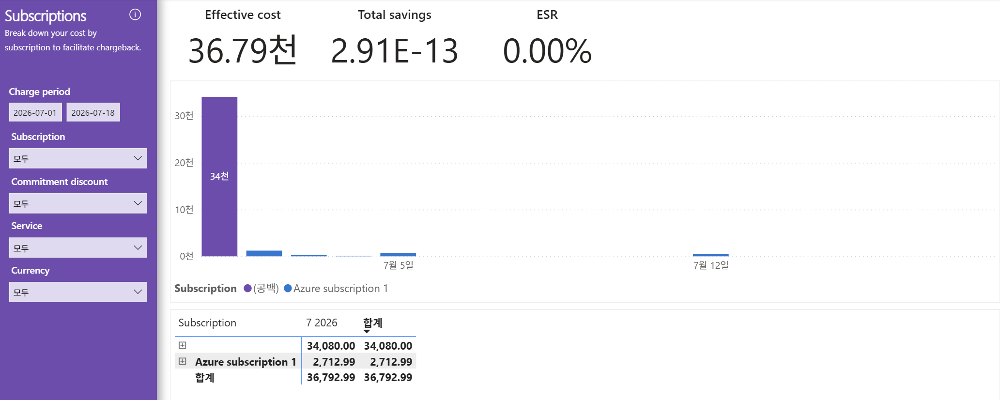

# 06. Subscriptions — 구독별 비용 배분(누가 썼는가·chargeback 기준)

> 페이지: Subscriptions · 데이터 범위: 청구기간 2026-07-01 ~ 2026-07-18 · 필터 전체(All) · 통화 샘플  
> 원본: FinOps Toolkit Cost summary 리포트 (Storage/데이터 export · FOCUS 기반) · Inform 단계 비용 가시화  
> 📌 한 줄 요약(TL;DR): (공백) 구독이 34,080(약 92.6%)로 대부분이며, 이름 없는 구독으로 묶여 chargeback 귀속이 불가능함.

## 1. 개요
- "어느 구독이 비용을 쓰는가"를 구독 단위로 배분해, 부서·팀별 실비 청구(chargeback)를 지원하는 화면임  
- 화면 부제: "Break down your cost by subscription to facilitate chargeback."  
- 데이터 범위: 청구기간 `2026-07-01 ~ 2026-07-18` / 필터 모두 All / 통화 샘플  
- 좌측 필터: Charge period · Subscription(모두) · Commitment discount(모두) · Service(모두) · Currency(모두)

## 2. 화면 구조·차트 읽는 법
- 상단 KPI: Effective cost **36.79천** / Total savings **2.91E-13**(사실상 0) / ESR **0.00%**  
- 가운데: **일자별 누적 막대(stacked bar)** — 하루 비용을 구독별 색깔로 쌓음  
  - 청구기간 초반(7월 초)에 보라색 **34천** 막대가 크게 솟고, 이후 파란색 소액 막대만 남음  
  - x축은 7월 5일 · 7월 12일 눈금 표시  
- 범례: Subscription 2종 — **(공백)**(보라) · **Azure subscription 1**(파랑)  
- 하단 표: **구독별** `7 2026` 월 컬럼 + 합계 컬럼

### 04번(Services)과의 관계 — 읽는 축의 차이
- Services(04) = "무엇에(서비스 대분류)", Subscriptions(06) = "누가(구독)" 썼는가  
- 두 축의 대형 값이 각각 Other 34,080과 (공백) 34,080으로 **동일 금액** → 같은 청구 덩어리를 서로 다른 축에서 본 것임

## 3. 분석 요약
> What · 데이터가 보여준 사실(해석 배제)

하단 표(구독별) 수치.

| 구독 | 합계(Effective cost) | 비중 |
|---|---|---|
| **(공백)** | **34,080.00** | ~92.6%(압도적 1위) |
| **Azure subscription 1** | **2,712.99** | ~7.4% |
| **합계** | **36,792.99** | (KPI 총액과 일치) |

- 구독은 **(공백)**과 **Azure subscription 1** 단 두 개만 표시됨  
- **(공백) 구독이 34,080.00**으로 전체의 약 92.6%, 압도적 1위  
- **Azure subscription 1**은 2,712.99로 약 7.4%  
- 합계 36,792.99로 04번(Services)·KPI 총액과 일치  
- **Savings·ESR 0.00%** → 어느 구독에도 절감 수단 미적용  
- 막대 차트는 7월 초 (공백) 구독이 34천으로 단일 급등 후 이후 소액에 수렴

## 4. 시사점
> So what · 사실의 의미·비용 리스크

- **(공백) 구독이 92.6% 독점** — 비용 대부분이 **구독명이 비어 있는(공백)** 항목에 묶여 있어,  
  "누가 썼는가"를 특정할 수 없음. 이는 **chargeback(실비 배분)의 귀속 불능** 상태를 의미함  
- **(공백)의 원인 추정** — M365/Copilot(NCE) 등 비(非)Azure 구독형 청구가 Azure 구독 축에 매핑되지 않아,  
  구독 식별자 없이 (공백)으로 집계되는 구조로 추정됨(04번 Other 34,080과 동일 금액이 이 해석을 뒷받침)  
- **Azure subscription 1(2,712.99)만 정상 귀속** — 실제 Azure 구독으로 매핑된 비용은 전체의 7.4%에 불과  
- **chargeback 리스크** — 화면 목적이 chargeback 지원이나, 대상의 92.6%가 (공백)이라 배분 리포트로서 기능 제약  
- **절감 전무·ESR 0.00%** — 구독 단위로도 약정·할인 미적용

## 5. 권고사항
> Now what · Inform 단계 실행 행동(실행은 Optimize 이관 명시)

- **(공백) 구독 34,080의 귀속 규명** — 해당 청구가 M365/Copilot(NCE) 등 비Azure 구독형 항목인지 확인하고,  
  구독 식별·태깅으로 chargeback 귀속이 가능하도록 매핑 보강 방안 수립(Inform 단계 가시화·설계 과제)  
- **비용 배분 체계 정비** — 부서·팀 단위 chargeback이 가능하도록 구독/태그 매핑 규칙 정의 → 실제 적용은 Optimize 이관  
- **Azure subscription 1 담당자 지정** — 정상 귀속된 구독은 담당자 지정 후 정기 비용 리뷰 체계 수립  
- **절감 수단 검토** — 구독 단위 약정/할인 적용 여지 판단 → 실행은 Optimize 이관  
- 본 화면은 **Inform(가시화) 단계** 산출물이며 최적화·배분 실행은 Optimize 단계로 이관함을 명시

## 6. 용어·출처

### 용어
- **Subscription(구독)**: 보통 팀·앱·환경 단위의 비용·권한 경계  
- **(공백) 구독**: 구독 식별자가 비어 있는 청구 항목이 묶이는 값. 비중이 크면 배분 귀속 불능 신호  
- **Chargeback**: 부서·팀별 실제 사용 비용을 해당 조직에 청구(배분)하는 방식(showback은 청구 없이 보여주기만 함)  
- **Effective cost / Total savings / ESR**: 실부담 비용 / 절감액 / 유효절감률. 절감 수단 부재 시 savings·ESR은 0

### 출처
- FinOps Toolkit "Cost summary" 리포트(Storage/데이터 export · FOCUS 기반), Subscriptions 페이지 화면 판독
