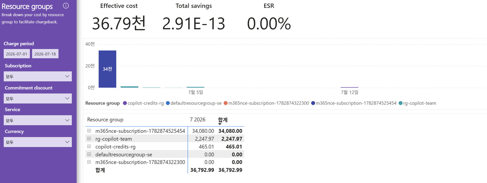

# 07. Resource groups — 리소스 그룹(앱·워크로드)별 비용(어느 그룹이 썼는가)

> 페이지: Resource groups · 데이터 범위: 청구기간 2026-07-01 ~ 2026-07-18 · 필터 전체(All) · 통화 샘플  
> 원본: FinOps Toolkit Cost summary 리포트 (Storage/데이터 export·FOCUS 기반) · Inform 단계 비용 가시화  
> 📌 한 줄 요약(TL;DR): M365 NCE 구독명 그룹 하나가 34,080(약 92.6%)로 지배적이고, 실제 Azure RG는  
> rg-copilot-team·copilot-credits-rg 소액이며 절감은 0임.



## 1. 개요

- 구독보다 한 단계 세밀하게 "어느 리소스 그룹(=보통 애플리케이션·워크로드 단위)이 비용을 쓰는가"를 보는 화면임  
- 부제(화면 문구)는 "Break down your cost by resource group to facilitate chargeback" — RG 단위 차지백(비용 배분) 목적  
- 데이터 범위: 청구기간 `2026-07-01 ~ 2026-07-18` / 통화 샘플("천"=1,000)  
  필터 4종(Subscription·Commitment discount·Service·Currency) 모두 `모두`

## 2. 화면 구조·차트 읽는 법

- 상단 카드: Effective cost **36.79천**, Total savings **2.91E-13**(사실상 0), ESR **0.00%**  
- 좌측 패널: Charge period(2026-07-01 ~ 2026-07-18) + 필터 4종 드롭다운(모두 `모두`)  
- 가운데: **일자별 누적 막대** — 리소스 그룹별 색상. 첫 구간에 큰 남색 막대(**34천**)가 지배적이며 이후 구간은 매우 낮음  
- 범례(Resource group): copilot-credits-rg · defaultresourcegroup-se · m365nce-subscription-1782874322300 ·  
  m365nce-subscription-1782874525454 · rg-copilot-team  
- 하단 표: **Resource group별 7 2026 / 합계** 2개 열, 각 행 앞 `⊞` 아이콘으로 개별 리소스 드릴다운 가능

### 표에서 눈여겨볼 점 — (공백) 대신 "구독명 = RG"로 표시됨

- admin 템플릿에서는 RG 없는 비용이 범례 **`(공백)`**으로 빠졌으나, 이 dept 화면에서는 화면상 `(공백)` 라벨이 보이지 않음  
- 대신 최대 항목 이름이 구독 식별자 그대로인 **`m365nce-subscription-1782874525454`(34,080.00)** 로 표시됨  
- 이는 M365/Copilot NCE 비용이 실제 Azure 리소스 그룹에 매핑되지 않아 **구독명을 딴 유사(pseudo) 그룹**으로 묶인 결과임  
  (= admin 화면의 `(공백)` 개념과 동일한 "RG 매핑 부재"의 dept 표현)  
- 실제 Azure RG는 **rg-copilot-team**·**copilot-credits-rg**·**defaultresourcegroup-se** 이며 합이 소액임

## 3. 분석 요약

> What · 데이터가 보여준 사실(해석 배제)

- 상단 카드: Effective cost 36.79천 / Total savings 2.91E-13(≈0) / ESR 0.00%  
- 리소스 그룹별 표(합계 기준):

| Resource group | 7 2026 | 합계 |
|---|---|---|
| m365nce-subscription-1782874525454 | 34,080.00 | 34,080.00 |
| rg-copilot-team | 2,247.97 | 2,247.97 |
| copilot-credits-rg | 465.01 | 465.01 |
| defaultresourcegroup-se | 0.00 | 0.00 |
| m365nce-subscription-1782874322300 | 0.00 | 0.00 |
| **합계** | **36,792.99** | **36,792.99** |

- 최대 항목 `m365nce-subscription-1782874525454` 34,080.00 = 총액의 약 92.6%(34,080 / 36,792.99)로 지배적  
- 일자별 누적 막대에서 첫 구간 남색 막대(34천)가 대부분을 차지하고 이후 구간은 거의 0에 수렴  
- 실제 Azure RG(rg-copilot-team + copilot-credits-rg) 합 = 2,712.98 ≈ Azure subscription 1 비용 2,712.99  
- Total savings 2.91E-13 → 화면상 절감 실질 0

## 4. 시사점

> So what · 사실의 의미·비용 리스크

- **M365 NCE 유사 그룹이 총비용의 대부분** — 비용의 92.6%가 실제 Azure RG가 아닌 구독명 유사 그룹에 집중됨  
- **RG 단위 차지백의 한계** — 부제는 "chargeback"을 표방하나, 지배적 비용이 실제 RG 경계와 무관해 RG 뷰만으로  
  앱·워크로드별 배분이 성립하지 않음(= admin의 `(공백)` 사각지대와 동일 성격)  
- **실제 Azure RG는 소액** — rg-copilot-team(2,247.97)·copilot-credits-rg(465.01) 수준으로, 관리 여지가 큰  
  IaaS/PaaS 리소스형 비용 비중이 낮음  
- **절감 0** — 약정·할인이 적용된 흔적이 없어, 현 단계는 가시화 위주이며 최적화 여지는 별도 판단 필요

## 5. 권고사항

> Now what · Inform 단계 실행 행동(실행은 Optimize 이관 명시)

- **M365 NCE 비용의 배분 규칙 수립** — 구독명 유사 그룹(34,080)은 RG 경계가 없으므로 부서·팀별 별도 배분  
  기준(라이선스 수·사용자 수 등)을 정의(라이선스 최적화 실행은 Optimize 이관)  
- **실제 Azure RG 드릴다운으로 원인 규명** — `rg-copilot-team`·`copilot-credits-rg`를 `⊞`로 펼쳐 개별 리소스별  
  비용을 08.Resources와 대조해 원인 리소스 특정  
- **RG 태깅·명명 규칙 정비** — RG가 앱/워크로드 경계와 일치하도록 정리해 차지백 가시성 확보  
- **배분·책임 계층 운영** — 원인 추적은 리소스(08번), 배분·책임은 구독/RG 단위로 운영. 절감 0은 약정·할인  
  적용 여지를 Optimize 단계에서 재검토

## 6. 용어·출처

### 용어

- **Resource group(리소스 그룹, RG)**: 보통 애플리케이션·워크로드 단위로 리소스를 묶는 논리 그룹  
- **차지백(chargeback)**: 사용 비용을 실제 사용 부서·팀에 되돌려 청구·배분하는 것  
- **M365 NCE(New Commerce Experience)**: Microsoft 365/Copilot 등 구독형 라이선스 상거래 체계.  
  Azure 리소스 그룹이 없어 구독명 유사 그룹으로 표시됨(= admin의 `(공백)`에 해당하는 매핑 부재)  
- **ESR(Effective Savings Rate)**: 실효 절감률. 이 화면은 0.00%

### 보충 — 배분 계층 정리

```
구독(팀) → 리소스 그룹(앱/워크로드) → 리소스(개별 자원)
              07번(이 페이지)            08번 Resources
```

아래로 갈수록 세밀 → 원인 추적은 리소스(08번), 배분·책임은 구독/RG 단위가 실용적임.  
단, M365 NCE 비용은 RG 경계가 없어 별도 배분 규칙이 필요함.

### 출처

- 원본 Power BI 페이지에 개별 출처 링크 없음 — 별도 1차 출처 표기 생략(FinOps Toolkit Cost summary 리포트 참조).
