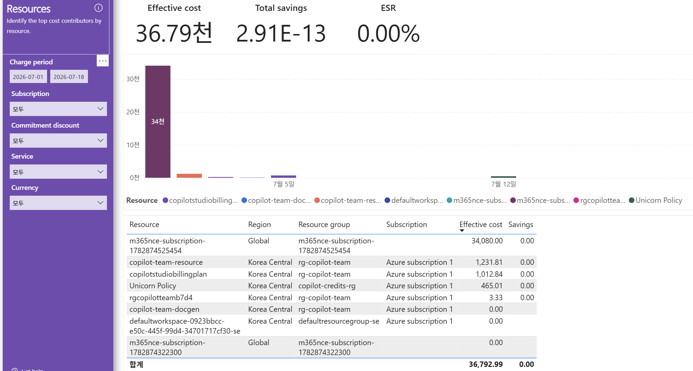

# 08. Resources — 개별 리소스 최세밀 뷰(이상 비용의 범인 리소스 특정)

> 페이지: Resources · 데이터 범위: 청구기간 2026-07-01 ~ 2026-07-18 · 필터 전체(All) · 통화 샘플  
> 원본: FinOps Toolkit Cost summary 리포트 (Storage/데이터 export·FOCUS 기반) · Inform 단계 비용 가시화  
> 📌 한 줄 요약(TL;DR): 리소스 8개 중 M365 NCE 1건이 34,080(약 92.6%)로 지배적이고 구독·리전이 (공백)/Global,  
> 나머지 Copilot 팀 리소스는 Korea Central 소액이며 절감은 0임.



## 1. 개요

- 가장 세밀한 레벨 — 개별 리소스 단위로 비용을 보는 화면임  
- 부제(화면 문구)는 "Identify the top cost contributors by resource" — 리소스 단위 최대 비용 기여자 식별 목적  
- 데이터 범위: 청구기간 `2026-07-01 ~ 2026-07-18` / 필터 4종 모두 `모두` / 통화 샘플("천"=1,000)

## 2. 화면 구조·차트 읽는 법

- 상단 카드: Effective cost **36.79천**, Total savings **2.91E-13**(≈0), ESR **0.00%**  
- 가운데: **일자별 누적 막대** — 개별 리소스별 색상. 첫 구간 큰 자주색 막대(**34천**)가 지배적, 이후 구간은 매우 낮음  
- 범례(Resource): copilotstudiobilling… · copilot-team-doc… · copilot-team-res… · defaultworksp… ·  
  m365nce-subs… · m365nce-subs… · rgcopilottea… · Unicorn Policy (8개 리소스 색상 구분)  
- 하단 표: **Resource · Region · Resource group · Subscription · Effective cost · Savings** 6개 열

### 눈여겨볼 3가지

**① 최대 리소스는 구독·리전이 비어 있음(매핑 부재)**

- 최대 행 `m365nce-subscription-1782874525454`(34,080.00)는 **Region = Global**, **Subscription = (공백)**  
- 리소스명·RG명이 구독 식별자 그대로이며 Azure 구독에 매핑되지 않음 → M365/Copilot NCE 비용의 특성  
- admin 템플릿의 `(공백)/Unassigned/Global`로 빠지는 용량성·무매핑 비용과 동일한 성격임

**② 실제 앱 리소스는 Korea Central·소액**

- 나머지 리소스는 대부분 **Region = Korea Central**, **Subscription = Azure subscription 1**, RG는 `rg-copilot-team`  
  또는 `copilot-credits-rg`에 매핑됨  
- 개별 금액은 1,231.81 / 1,012.84 / 465.01 / 3.33 / 0.00 수준으로 최대 리소스 대비 매우 작음

**③ Tags(태그) 열이 화면에 없음**

- admin 05번에는 원본 JSON `Tags` 열이 있었으나, 이 dept 화면 표에는 **Tags 열이 표시되지 않음**(화면상 판독 불가)  
- 태그 기반 부서·환경별 배분의 원천 데이터를 이 화면만으로는 확인 불가

## 3. 분석 요약

> What · 데이터가 보여준 사실(해석 배제)

- 상단 카드: Effective cost 36.79천 / Total savings 2.91E-13(≈0) / ESR 0.00%  
- 리소스별 표(총 8행):

| Resource | Region | Resource group | Subscription | Effective cost | Savings |
|---|---|---|---|---|---|
| m365nce-subscription-1782874525454 | Global | m365nce-subscription-1782874525454 | (공백) | 34,080.00 | 0.00 |
| copilot-team-resource | Korea Central | rg-copilot-team | Azure subscription 1 | 1,231.81 | 0.00 |
| copilotstudiobillingplan | Korea Central | rg-copilot-team | Azure subscription 1 | 1,012.84 | 0.00 |
| Unicorn Policy | Korea Central | copilot-credits-rg | Azure subscription 1 | 465.01 | 0.00 |
| rgcopilotteamb7d4 | Korea Central | rg-copilot-team | Azure subscription 1 | 3.33 | 0.00 |
| copilot-team-docgen | Korea Central | rg-copilot-team | Azure subscription 1 | 0.00 | 0.00 |
| defaultworkspace-0923bbcc-e50c-445f-99d4-34701717cf30-se | Korea Central | defaultresourcegroup-se | Azure subscription 1 | 0.00 | (공백) |
| m365nce-subscription-1782874322300 | Global | m365nce-subscription-1782874322300 | (공백) | 0.00 | (공백) |
| **합계** | | | | **36,792.99** | **0.00** |

- 최대 리소스 `m365nce-subscription-1782874525454` 34,080.00 = 총액의 약 92.6%로 지배적  
- 해당 리소스만 Region=Global·Subscription=(공백), 나머지는 Region=Korea Central·Azure subscription 1  
- 일자별 누적 막대에서 첫 구간 자주색 막대(34천)가 대부분, 이후 구간은 거의 0에 수렴  
- 표 전체 Savings 열 합계 0.00 → 화면상 절감 실질 0  
- Tags 열은 이 화면 표에 미표시(화면상 판독 불가)

## 4. 시사점

> So what · 사실의 의미·비용 리스크

- **최종 원인 추적 지점** — 이상·급증 비용의 "범인 리소스"를 Resource명·RG·구독·리전까지 여기서 특정 가능.  
  단, 현 데이터에서 지배 비용은 M365 NCE 1건에 집중됨  
- **매핑 부재 = 배분 사각지대** — 최대 리소스의 Subscription=(공백)·Region=Global은 Azure 리소스가 아닌  
  구독형 라이선스 비용으로, 리소스 단위 최적화(리사이징·스케줄링)가 성립하지 않음  
- **실제 관리 대상은 소액 Copilot 팀 리소스** — copilot-team-resource·copilotstudiobillingplan 등 Korea Central  
  리소스가 실 IaaS/PaaS 관리 대상이나 금액 비중이 낮음  
- **태그 미표시 = 배분 근거 확인 곤란** — Tags 열이 없어 CostCenter/env/org 기반 부서·환경별 배분 근거를  
  이 화면만으로는 검증 불가  
- **절감 0** — 리소스 단위 약정·할인 적용 흔적 없음

## 5. 권고사항

> Now what · Inform 단계 실행 행동(실행은 Optimize 이관 명시)

- **지배 비용의 성격 규명 우선** — 34,080의 M365 NCE 비용은 리소스 최적화 대상이 아니라 라이선스·구독  
  최적화 대상임을 구분(라이선스 정비 실행은 Optimize 이관)  
- **소액 실 리소스 원인 추적** — copilot-team-resource·copilotstudiobillingplan을 RG(07번)와 대조해 사용량·용도  
  확인 후 필요 시 Optimize 이관  
- **태그 노출·강제 정책 검토** — 부서·환경별 배분을 위해 리포트에 Tags 열 노출 여부 점검, 필수 태그  
  (CostCenter/env/org)를 Azure Policy로 강제(정책 적용 실행은 Optimize 이관)  
- **(공백)/무매핑 리소스 정리** — Subscription 공백·값 0 리소스(defaultworkspace-…-se 등)를 식별해 정리 대상  
  후보로 관리(정리 실행은 Optimize 이관)

## 6. 용어·출처

### 용어

- **Resource(리소스)**: VM·SQL·Storage·라이선스 등 개별 자원. 비용의 최세밀 단위  
- **Tags(태그)**: 리소스에 붙는 key-value 메타데이터(예: CostCenter, env, org). 부서·환경별 배분의 원천  
  (이 dept 화면 표에는 미표시)  
- **(공백)/Global**: 구독·리전·RG가 매핑되지 않아 세밀 배분에서 빠지는 항목(M365 NCE 등 구독형 라이선스 비용)  
- **M365 NCE(New Commerce Experience)**: Microsoft 365/Copilot 구독형 라이선스 상거래 체계

### 보충 — 배분 계층 최하단

```
구독(팀) → 리소스그룹(07) → 리소스(08, 이 페이지)
                                 ↑ 가장 세밀, 원인 추적 지점
```

아래로 갈수록 세밀 → 원인 추적은 리소스 단위이나,  
M365 NCE 비용은 구독·리전이 (공백)/Global로 빠지므로 총액은 상단 카드(36.79천)로 확인함.

### 출처

- 원본 Power BI 페이지에 개별 출처 링크 없음 — 별도 1차 출처 표기 생략(FinOps Toolkit Cost summary 리포트 참조).
