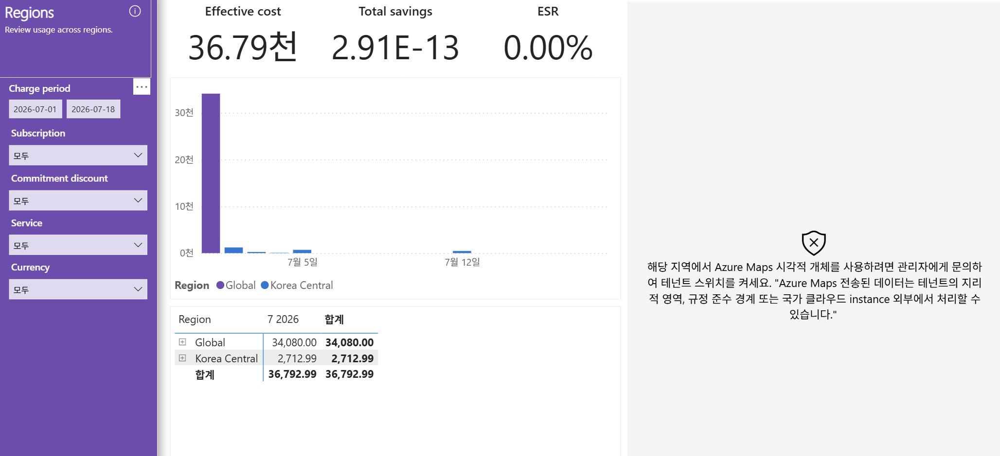

# 09. Regions — 지역별 비용 분포(Global vs Korea Central)

> 페이지: Regions · 데이터 범위: 청구기간 2026-07-01 ~ 2026-07-18 · 필터 전체(All) · 통화 샘플  
> 원본: FinOps Toolkit Cost summary 리포트 (Storage/데이터 export·FOCUS 기반) · Inform 단계 비용 가시화  
> 📌 한 줄 요약(TL;DR): Global 34,080(약 92.6%) + Korea Central 2,712.99로 2개 리전에만 분포, 지도는 테넌트  
> 스위치 미허용으로 비활성이며 절감은 0임.

## 1. 개요

- 목적: "어느 리전(Azure 데이터센터 지역)에서 비용이 발생하는가"를 보는 화면임  
  리전은 가격·규정 준수·지연·전송(egress) 비용에 직접 영향을 줌  
- 부제(화면 문구)는 "Review usage across regions" — 리전별 사용 검토 목적  
- 데이터 범위: 청구기간 `2026-07-01 ~ 2026-07-18` / 필터 4종 모두 `모두` / 통화 샘플("천"=1,000)

## 2. 화면 구조·차트 읽는 법

- 상단 카드: Effective cost **36.79천**, Total savings **2.91E-13**(≈0), ESR **0.00%**  
- 좌측 가운데: **일자별 누적 막대** — 색상이 리전을 구분. 첫 구간 큰 보라색 막대(약 34천, Global) 이후 구간은 낮음  
- 범례(Region): **Global**(보라) · **Korea Central**(파랑) — 2개 리전만 존재  
- 좌측 하단: **Region별 7 2026 / 합계** 표(각 행 `⊞`로 드릴다운 가능)  
- 우측: **Azure Maps 지도 시각화(비어 있음)** — 테넌트 스위치 미허용 오류로 렌더링되지 않음  
- 읽는 법: 막대 색 = 리전, 높이 = 해당 일자 비용 / 표 행 = 리전, 합계 열 = 리전 누적 비용

### 지도 공백 사유

- 화면 우측 오류 메시지(원문): "해당 지역에서 Azure Maps 시각적 개체를 사용하려면 관리자에게 문의하여 테넌트  
  스위치를 켜세요. 'Azure Maps 전송된 데이터는 테넌트의 지리적 영역, 규정 준수 경계 또는 국가 클라우드  
  instance 외부에서 처리할 수 있습니다.'"  
- 테넌트 관리자 설정으로 Azure Maps가 꺼져 지도가 렌더링되지 않음. 지도는 부가 시각화이며 비용 데이터는  
  좌측 표·차트로 정상 확인 가능함

## 3. 분석 요약

> What · 데이터가 보여준 사실(해석 배제)

- 상단 카드: Effective cost 36.79천 / Total savings 2.91E-13(≈0) / ESR 0.00%  
- 리전별 표(합계 기준):

| Region | 7 2026 | 합계 |
|---|---|---|
| Global | 34,080.00 | 34,080.00 |
| Korea Central | 2,712.99 | 2,712.99 |
| **합계** | **36,792.99** | **36,792.99** |

- **Global** 34,080.00 = 총액의 약 92.6%(34,080 / 36,792.99)로 지배적  
- **Korea Central** 2,712.99 = 나머지 약 7.4%  
- 리전은 2개뿐이며, admin 화면처럼 다수 US 리전으로 분산되지 않음  
- 일자별 누적 막대에서 첫 구간 보라색(Global) 막대가 대부분을 차지  
- 우측 Azure Maps 지도는 테넌트 스위치 미허용으로 표시되지 않음  
- Total savings 2.91E-13 → 화면상 절감 실질 0

## 4. 시사점

> So what · 사실의 의미·비용 리스크

- **Global 집중 = 리전 최적화 여지 제한** — 비용 92.6%가 Global(M365/Copilot NCE 등 리전 비종속 서비스)로,  
  "저렴한 리전 이전"류 최적화가 성립하지 않는 구조임  
- **Korea Central = 유일한 리전형 비용** — 실제 Azure 리소스(Copilot 팀)의 비용이 단일 리전에 집중됨.  
  단일 리전 장애·가격 변동 시 해당 워크로드 비용 리스크가 집중됨  
- **전송(egress) 리스크 낮음** — 리전 분산이 2개뿐이고 대부분 Global이라 리전 간 데이터 이동 비용 리스크는  
  현 데이터상 낮게 관찰됨(단, egress 비중은 별도 화면에서 확인 필요)  
- **규정 준수·데이터 주권** — Korea Central 집중은 국내 데이터 소재 요건에는 부합할 수 있으나, Global 처리  
  비용의 데이터 소재는 서비스 약관 기준으로 별도 확인 필요  
- **절감 0** — 리전 관점에서도 약정·할인 적용 흔적 없음

## 5. 권고사항

> Now what · Inform 단계 실행 행동(실행은 Optimize 이관 명시)

- **(우선순위 1) Global 비용의 성격 구분** — Global 34,080은 리전 이전 대상이 아니라 구독형 라이선스 비용임을  
  명확히 하여 리전 최적화 범위에서 제외  
- **(우선순위 2) Korea Central 단일 리전 점검** — 실제 Azure 리소스가 단일 리전에 집중된 것이 가용성·규정  
  요건에 부합하는지 확인(다중 리전화 검토·실행은 Optimize 이관)  
- **(우선순위 3) egress 비중 확인** — 리전 간 전송비 존재 여부를 Charge breakdown 등 후속 화면에서 확인  
- **(운영) 지도 활성화 필요 시** — Entra 관리자가 "Azure Maps 데이터 전송" 테넌트 스위치를 허용해야 함  
  (데이터가 테넌트 지리 경계 밖에서 처리될 수 있다는 고지 포함)  
- **Inform → Optimize 이관 포인트** — 리전 재배치는 지연·규정을 함께 평가한 뒤 Optimize 단계의 실제 이전  
  실행으로 넘김

## 6. 용어·출처

- **리전(Region)**: Azure 데이터센터가 위치한 지리적 지역. 서비스 단가·규정·지연에 영향  
- **Global**: 특정 리전에 종속되지 않는 글로벌 서비스 비용(M365/Copilot NCE 등 구독형 서비스 포함)  
- **egress(전송 비용)**: 리전/영역 밖으로 데이터가 나갈 때 부과되는 대역폭 과금  
- **데이터 주권**: 데이터를 특정 국가·지역 경계 안에 보관·처리해야 하는 규제 요건  
- **Azure Maps 테넌트 스위치**: Power BI Azure Maps 시각화 사용을 테넌트 단위로 켜고 끄는 관리자 설정  

### 출처(공식 문서)

- Azure Maps Power BI 시각적 개체: https://learn.microsoft.com/azure/azure-maps/power-bi-visual-get-started  
- Azure 대역폭(데이터 전송) 요금: https://azure.microsoft.com/pricing/details/bandwidth/  
- FinOps Toolkit 개요: https://learn.microsoft.com/cloud-computing/finops/toolkit/finops-toolkit-overview  

### 보충 — FinOps에서 리전을 보는 이유

| 관점 | 내용 |
|---|---|
| 가격 | 리전별 단가 차이 → 최적화 기회(단, Global 비용은 대상 아님) |
| 규정 | 데이터 주권·컴플라이언스 경계 |
| 지연 | 사용자 근접 리전 = 성능 |
| 전송비 | 리전 간 이동 = egress 과금 |
