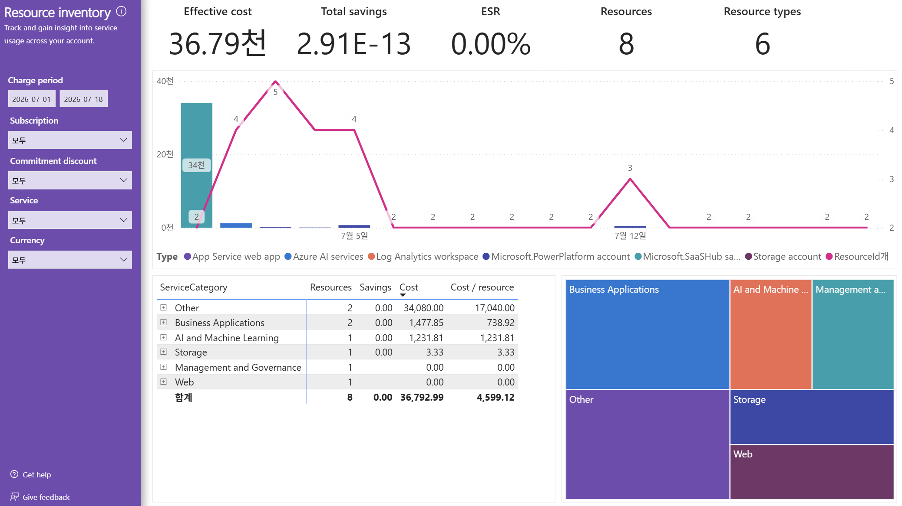

# 10. Resource inventory — 리소스 인벤토리(리소스당 비용으로 효율 진단)

> 페이지: Resource inventory · 데이터 범위: 청구기간 2026-07-01 ~ 2026-07-18 · 필터 전체(All) · 통화 샘플  
> 원본: FinOps Toolkit Cost summary 리포트 (Storage/데이터 export·FOCUS 기반) · Inform 단계 비용 가시화  
> 📌 한 줄 요약(TL;DR): 리소스 8개·유형 6개를 ServiceCategory별로 집계해 **리소스당 비용(Cost/resource)**으로 효율을
> 진단하며, Other 카테고리 2개 리소스가 총비용의 대부분(34,080)을 차지함.



## 1. 개요
- 목적: 계정 전반의 리소스 사용을 추적하는 화면("Track and gain insight into service usage across your account")  
- 개별 리소스 나열이 아니라 **ServiceCategory(서비스 범주)별로 리소스 수·비용·리소스당 비용**을 집계해 보여줌  
- 데이터 범위: 청구기간 `2026-07-01 ~ 2026-07-18` / 필터 Subscription·Commitment discount·Service·Currency 모두 All / 통화 샘플

## 2. 화면 구조·차트 읽는 법
- 상단 카드 5종: Effective cost **36.79천** · Total savings **2.91E-13**(≈0) · ESR **0.00%**  
  · Resources **8** · Resource types **6**  
- 가운데 콤보 차트: **막대 = 리소스 유형별 비용**(최대 막대 34천, 그 옆 2), **선 = ResourceId 개수**(우측 축, 최대 5 → 2로 하강)  
- 범례(Type): App Service web app · Azure AI services · Log Analytics workspace · Microsoft.PowerPlatform account ·
  Microsoft.SaaSHub sa ~ · Storage account · ResourceId개  
- 하단 좌측 표: **ServiceCategory · Resources · Savings · Cost · Cost / resource**(Cost 내림차순 정렬)  
- 하단 우측 트리맵: ServiceCategory별 면적 비중(Business Applications · AI and Machine ~ · Management a ~ · Other · Storage · Web)

### 눈여겨볼 3가지

**① Cost / resource(리소스당 비용) = 효율 지표**
- 같은 카테고리라도 리소스 1개가 얼마를 쓰는지를 보여줌 → 소수 리소스가 고비용이면 여기서 드러남  
- 표 합계행: Resources 8 · Cost 36,792.99 · Cost/resource **4,599.12**(= 36,792.99 ÷ 8)

**② Other 카테고리가 압도적**
- Other: 리소스 **2개**, Cost **34,080.00**, Cost/resource **17,040.00** → 총비용의 대부분이 여기 집중  
- 리소스는 2개뿐인데 리소스당 비용이 17,040으로 다른 카테고리 대비 수십 배 → 소수 고비용 리소스 존재 신호

**③ Savings 전 항목 0.00 · ESR 0.00%**
- 모든 ServiceCategory의 Savings가 0.00, 총 Total savings 2.91E-13(사실상 0), ESR 0.00%  
- → 약정·예약·협상 할인이 전혀 적용되지 않은 순수 정가 사용 환경임을 인벤토리 단에서도 재확인

## 3. 분석 요약
> What · 데이터가 보여준 사실(해석 배제)

- 상단 카드: Effective cost 36.79천 · Total savings 2.91E-13(≈0) · ESR 0.00% · Resources 8 · Resource types 6  
- ServiceCategory별 표(Cost 내림차순):

| ServiceCategory | Resources | Savings | Cost | Cost / resource |
|---|---|---|---|---|
| Other | 2 | 0.00 | 34,080.00 | 17,040.00 |
| Business Applications | 2 | 0.00 | 1,477.85 | 738.92 |
| AI and Machine Learning | 1 | 0.00 | 1,231.81 | 1,231.81 |
| Storage | 1 | 0.00 | 3.33 | 3.33 |
| Management and Governance | 1 | 0.00 | 0.00 | 0.00 |
| Web | 1 | 0.00 | 0.00 | 0.00 |
| **합계** | **8** | **0.00** | **36,792.99** | **4,599.12** |

- 콤보 차트: 최대 막대 34천(단일 유형에 비용 집중), 선(ResourceId 개수) 최대 5 → 2로 하강  
- 트리맵: Other가 큰 면적을 차지하고 Business Applications·AI and Machine Learning이 뒤를 이음  
- Management and Governance·Web은 리소스 1개씩 존재하나 Cost 0.00

## 4. 시사점
> So what · 사실의 의미·비용 리스크

- **소수 고비용 리소스 구조**: 리소스 8개 중 Other 2개가 총비용 34,080(전체 36,792.99의 약 92.6%)을 차지 →
  비용 관리의 핵심은 이 소수 리소스에 집중해야 함  
- **Cost/resource 편차 큼**: Other 17,040 vs Storage 3.33 → 리소스당 비용 격차가 극단적이며, 고비용 리소스의 사용 목적·규모 검증 필요  
- **절감 여지 잠재**: 전 항목 Savings 0·ESR 0.00% → 약정/예약 구매 전무이므로 대형 비용원에 약정 적용 시 절감 여지 존재  
- **저비용/무비용 리소스 존재**: Management and Governance·Web·Storage는 비용이 미미 → 유휴·미사용 여부 점검 대상(배분 사각지대 가능)

## 5. 권고사항
> Now what · Inform 단계 실행 행동(실행은 Optimize 이관 명시)

- (우선순위 1) **Other 카테고리 2개 리소스 정체 규명**: 34,080이 어떤 리소스(M365/Copilot 계열 추정)인지 식별하고
  사용 인원·라이선스 수 대비 적정성을 확인함(실제 라이선스 조정은 Optimize 이관)  
- (우선순위 2) **Cost/resource 상위 리소스 우선 검토**: 리소스당 비용이 높은 항목을 약정·라이선스 최적화 후보로 선별함  
- (우선순위 3) **저/무비용 리소스 점검**: Cost 0.00 리소스(Management and Governance·Web)의 유휴·중복 여부를 확인해 정리 후보로 태깅함  
- Inform → Optimize 이관 포인트: 라이선스 수 조정·약정 적용·유휴 리소스 정리 등 실제 실행은 Optimize 단계로 넘김

## 6. 용어·출처

### 용어
- **ServiceCategory(서비스 범주)**: 리소스를 서비스 성격별로 묶은 분류(Other·Business Applications·AI and Machine Learning 등)  
- **Cost / resource(리소스당 비용)**: 카테고리 Cost ÷ 해당 카테고리 Resources. 리소스 단위 비용 효율을 나타내는 지표  
- **Resources / Resource types**: 리소스 개수 / 리소스 유형(종류) 개수. 이 화면은 리소스 8개·유형 6개  
- **ESR(Effective Savings Rate)**: 실질 절감률. 0.00% = 약정·할인에 의한 절감 없음  
- **Total savings 2.91E-13**: 지수 표기(≈0.0000000000003)로 사실상 0을 의미함

### 보충 — 인벤토리로 보는 효율 진단
```
총비용(36,792.99) ÷ 리소스 8개 = 리소스당 평균 4,599.12
                     ↑ 특정 카테고리(Other)에 편중되면 평균이 왜곡 → Cost/resource로 편차 확인
```
리소스 수가 적어도 **소수 리소스가 고비용**이면 Cost/resource가 급등하므로, 총액보다 리소스당 비용으로 효율을 진단함.

### 출처(공식 문서)
- FinOps Toolkit Power BI 리포트(Cost summary): https://learn.microsoft.com/cloud-computing/finops/toolkit/power-bi/reports  
- Azure Cost Management 비용 분석: https://learn.microsoft.com/azure/cost-management-billing/costs/quick-acm-cost-analysis
