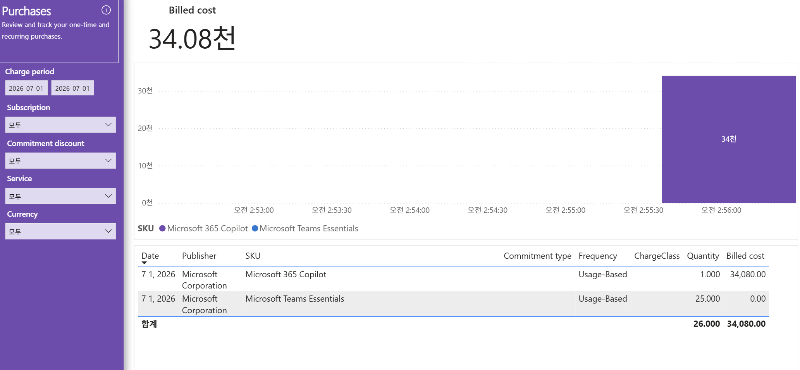

# 11. Purchases — 구매 거래(M365 라이선스 구매, 약정 구매 부재)

> 페이지: Purchases · 데이터 범위: 화면상 청구기간 2026-07-01 ~ 2026-07-01(구매 발생일로 자동 축소) · 필터 전체(All) · 통화 샘플  
> 원본: FinOps Toolkit Cost summary 리포트 (Storage/데이터 export·FOCUS 기반) · Inform 단계 비용 가시화  
> 📌 한 줄 요약(TL;DR): 구매 항목은 **Microsoft 365 Copilot(34,080)·Microsoft Teams Essentials(0)** 2건뿐이며,
> 둘 다 Usage-Based·Commitment type 공백 → **예약/Savings Plan 등 약정 구매는 전무**함.

## 1. 개요
- 목적: 사용료(Usage)와 별개로 일시·반복 구매(Purchase) 항목만 따로 봄
  ("Review and track your one-time and recurring purchases")  
- 예약(RI)·Savings Plan·Marketplace·라이선스 같은 구매성 거래를 확인하는 전용 화면  
- 데이터 범위: 화면상 청구기간이 `2026-07-01 ~ 2026-07-01`로 표시됨 — 구매가 이 날짜에만 발생해 자동 축소된 것으로 보임  
- 필터: Subscription·Commitment discount·Service·Currency 모두 All / 통화 샘플

## 2. 화면 구조·차트 읽는 법
- 상단 카드: Billed cost **34.08천**(이 화면 구매 총액)  
- 막대 차트: 우측 끝에 단일 막대 **34천** — X축이 시각(오전 2:53 ~ 2:56) 단위로 표시됨(단일 시점 구매)  
- 범례(SKU): Microsoft 365 Copilot · Microsoft Teams Essentials  
- 하단 표: **Date · Publisher · SKU · Commitment type · Frequency · ChargeClass · Quantity · Billed cost**  
- 읽는 법: 막대 = 구매 발생 시점·금액, 표의 SKU = 실제 구매 상품, **Commitment type 열이 비어 있으면 약정성 구매가 아님**

## 3. 분석 요약
> What · 데이터가 보여준 사실(해석 배제)

- Billed cost: 34.08천(구매 총액), 막대 차트는 단일 시점에 34천 하나  
- 표 내용(2건):

| Date | Publisher | SKU | Commitment type | Frequency | Quantity | Billed cost |
|---|---|---|---|---|---|---|
| 7 1, 2026 | Microsoft Corporation | Microsoft 365 Copilot | (공백) | Usage-Based | 1.000 | 34,080.00 |
| 7 1, 2026 | Microsoft Corporation | Microsoft Teams Essentials | (공백) | Usage-Based | 25.000 | 0.00 |
| **합계** | | | | | **26.000** | **34,080.00** |

- 두 건 모두 Publisher는 **Microsoft Corporation**, Frequency는 **Usage-Based**, **Commitment type·ChargeClass 열은 공백**  
- Microsoft 365 Copilot: Quantity 1.000 · Billed 34,080.00(전체 구매액의 대부분)  
- Microsoft Teams Essentials: Quantity 25.000 · Billed 0.00(수량은 있으나 청구액 0)  
- 화면상 **예약(Reserved Instance)·Savings Plan·Marketplace(3rd-party) 구매 항목은 없음**

## 4. 시사점
> So what · 사실의 의미·비용 리스크

- **구매 = M365 라이선스형 소비**: 구매 항목이 Microsoft 365 Copilot·Teams Essentials뿐 → 인프라 약정이 아니라 SaaS 라이선스 성격  
- **약정 구매 전무 확인(핵심)**: Commitment type 전부 공백·Usage-Based → 예약/Savings Plan 미보유 → 앞 화면들의 Savings 0·ESR 0.00%와 정합  
- **단일 대형 구매 집중**: 34,080이 Microsoft 365 Copilot 1건에 집중 → 라이선스 수·사용률에 따라 비용 변동 리스크 큼  
- **Teams Essentials 0.00**: 25 수량이나 청구액 0(무료/포함 SKU 가능성) → 실제 활성 라이선스 수와 대조 필요

## 5. 권고사항
> Now what · Inform 단계 실행 행동(실행은 Optimize 이관 명시)

- (우선순위 1) **Microsoft 365 Copilot 라이선스 적정성 확인**: 34,080에 해당하는 라이선스 수량·실사용률을 점검해 과다 할당 여부를 식별함  
- (우선순위 2) **약정 미보유 사실 기록**: 예약/Savings Plan 구매가 없음을 Inform 산출물에 명시해 후속 약정 검토의 출발점으로 삼음  
- (우선순위 3) **Teams Essentials 수량-비용 대조**: Quantity 25·Billed 0의 의미(무료/번들)를 확인해 배분·리포팅 오해를 방지함  
- Inform → Optimize 이관 포인트: 라이선스 수 조정·약정(RI/SP) 신규 도입 결정은 Optimize 단계 실행으로 넘김

## 6. 용어·출처
- **Purchase(구매)**: 사용료와 별개인 일시·반복 구매 거래(예약·SP·Marketplace·라이선스 등)  
- **Commitment type(약정 유형)**: Reserved/Savings Plan 등 약정 구분. **공백 = 약정성 구매 아님**  
- **Frequency(주기)**: Usage-Based = 사용량 기반 청구 / OneTime·Recurring = 일시·반복 구매  
- **Billed cost(청구 비용)**: 거래 시점에 실제 청구된 금액(상각 전, 시점 통짜 인식)  
- **Publisher / Publisher type**: 게시자(Microsoft) / Azure=1st-party · Marketplace=3rd-party (이 화면은 전부 Microsoft)  
- 출처(공식 문서):  
  - Azure 예약(Reservations) 구매: https://learn.microsoft.com/azure/cost-management-billing/reservations/save-compute-costs-reservations  
  - FinOps Toolkit Power BI 리포트: https://learn.microsoft.com/cloud-computing/finops/toolkit/power-bi/reports

### 보충 — 이 부서(dept)의 구매 특성
- admin 버전 Purchases는 B1s 3년 예약(RI) 다건이 있었으나, **이 dept는 예약/SP가 전혀 없고 M365 라이선스형 구매만 존재**함  
- 즉 구매 총액은 크지만(34,080) 전부 사용량 기반 SaaS 라이선스여서 **약정 절감 대상이 아직 발굴되지 않은 상태**임(Optimize 단계 과제).
