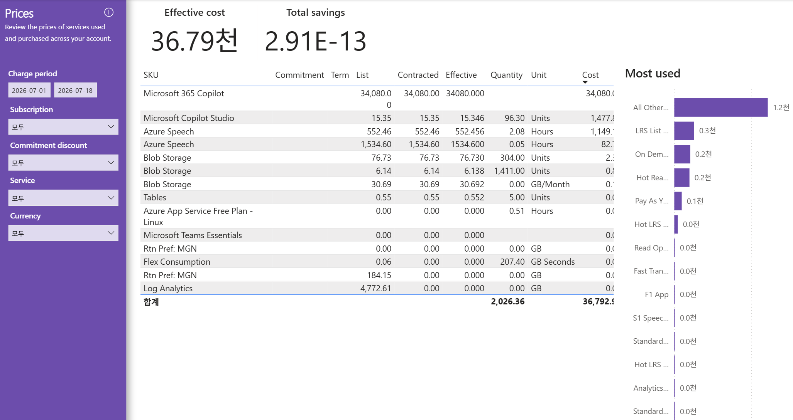

# 12. Prices — SKU별 단가표(List=Effective, 협상·약정 할인 부재)

> 페이지: Prices · 데이터 범위: 청구기간 2026-07-01 ~ 2026-07-18 · 필터 전체(All) · 통화 샘플  
> 원본: FinOps Toolkit Cost summary 리포트 (Storage/데이터 export·FOCUS 기반) · Inform 단계 비용 가시화  
> 📌 한 줄 요약(TL;DR): SKU별 단가표로 **List=Contracted=Effective**(협상·약정 할인 부재)를 재확인하고,
> Microsoft 365 Copilot 단가가 압도적(34,080)이며 스토리지 미터가 사용량 상위를 차지함.

## 1. 개요
- 목적: Price sheet(단가표) — 계정에 적용되는 SKU별 단가(요율)를 봄
  ("Review the prices of services used and purchased across your account")  
- "얼마 썼나(비용)"가 아니라 "단위당 얼마인가(가격)"를 보는 참조 화면  
- 데이터 범위: 청구기간 `2026-07-01 ~ 2026-07-18` / 필터 Subscription·Commitment discount·Service·Currency 모두 All / 통화 샘플

## 2. 화면 구조·차트 읽는 법
- 상단 카드: Effective cost **36.79천** · Total savings **2.91E-13**(≈0)  
- 좌측 표: **SKU · Commitment · Term · List · Contracted · Effective · Quantity · Unit · Cost**  
- 우측: **Most used** — 사용량(Quantity) 기준 최다 사용 미터 순위("천"=1,000 단위)  
- 3가지 가격 지표:

| 열 | 뜻 |
|---|---|
| List | 정가 단가(PAYG 공개 요율) |
| Contracted | 계약 단가(협상 반영 요율) |
| Effective | 실질 단가(약정까지 반영) |

- 읽는 법: 같은 행에서 **List = Effective면 협상·약정에 의한 단가 인하가 없다는 뜻**이며, Commitment 열 공백은 약정 미적용을 의미함

## 3. 분석 요약
> What · 데이터가 보여준 사실(해석 배제)

- 핵심 관찰: **Commitment·Term 열 전 행 공백**, 대부분 행에서 List = Contracted = Effective
  (예: Azure Speech 552.46 = 552.46 = 552.456) → 단가 레벨에서도 할인 없음(Total savings ≈ 0과 일치)  
- 단가표 주요 행:

| SKU | List | Contracted | Effective | Quantity | Unit |
|---|---|---|---|---|---|
| Microsoft 365 Copilot | 34,080.00 | 34,080.00 | 34080.000 | | |
| Microsoft Copilot Studio | 15.35 | 15.35 | 15.346 | 96.30 | Units |
| Azure Speech | 552.46 | 552.46 | 552.456 | 2.08 | Hours |
| Azure Speech | 1,534.60 | 1,534.60 | 1534.600 | 0.05 | Hours |
| Blob Storage | 76.73 | 76.73 | 76.730 | 304.00 | Units |
| Blob Storage | 6.14 | 6.14 | 6.138 | 1,411.00 | Units |
| Blob Storage | 30.69 | 30.69 | 30.692 | 0.00 | GB/Month |
| Tables | 0.55 | 0.55 | 0.552 | 5.00 | Units |
| Azure App Service Free Plan - Linux | 0.00 | 0.00 | 0.000 | 0.51 | Hours |
| Microsoft Teams Essentials | 0.00 | 0.00 | 0.000 | | |
| Rtn Pref: MGN | 0.00 | 0.00 | 0.000 | 0.00 | GB |
| Flex Consumption | 0.06 | 0.00 | 0.000 | 207.40 | GB Seconds |
| Rtn Pref: MGN | 184.15 | 0.00 | 0.000 | 0.00 | GB |
| Log Analytics | 4,772.61 | 0.00 | 0.000 | 0.00 | GB |

- 합계행: Quantity **2,026.36** · Cost **36,792.9**(≈ 총 Effective cost와 일치)  
- 일부 행은 List > Contracted=Effective=0(예: Log Analytics List 4,772.61이나 Quantity 0.00) → **미사용(수량 0) SKU의 정가만 표시**  
- 우측 Most used(사용량 상위 미터): All Other ~ **1.2천** · LRS List ~ **0.3천** · On Dem ~ **0.2천** · Hot Rea ~ **0.2천** ·
  Pay As Y ~ **0.1천** · 이하 Hot LRS·Read Op·Fast Tran·F1 App·S1 Speec·Standard·Analytics 등 0.0천대  
- Most used 상위 미터는 대부분 **스토리지(LRS/Hot/Read) 성격**의 소액 대량 소비 미터로 구성됨

## 4. 시사점
> So what · 사실의 의미·비용 리스크

- **협상·약정 할인 부재 확정**: List=Contracted=Effective·Commitment 공백 → 계약 단가 협상·약정 여지가 그대로 남아 있음  
- **단가 이상 탐지 기준선 확보**: 이 단가표가 청구서 대사·신규 배포 비용 예측의 기준 → 향후 단가 급변 시 이상 탐지 근거로 활용 가능  
- **비용 편중은 단가에서 기인**: Microsoft 365 Copilot 단가 34,080이 총액 대부분을 설명 → 비용 통제 지점은 이 SKU의 단가×수량  
- **무비용(수량 0) SKU 다수**: Log Analytics·Rtn Pref: MGN 등 List만 있고 사용량 0 → 미사용 SKU로 배분·정리 점검 대상  
- **사용량은 스토리지 미터에 분산**: Most used 상위가 LRS/Hot 등 스토리지 → 단가는 낮으나 소액 대량 소비 구조

## 5. 권고사항
> Now what · Inform 단계 실행 행동(실행은 Optimize 이관 명시)

- (우선순위 1) **최대 단가 SKU 관리**: Microsoft 365 Copilot 단가·수량을 정기 모니터링해 라이선스 수 변동 대비 기준선으로 삼음  
- (우선순위 2) **단가표 기준선 보관**: 이 List/Effective 값을 청구서 대사·단가 이상 탐지의 기준 데이터로 보관·재사용함  
- (우선순위 3) **미사용(수량 0) SKU 식별**: Log Analytics·Rtn Pref: MGN 등 정가만 있고 사용량 0인 SKU의 필요성·정리 여부를 점검함  
- (활용) 단가표 용도: 요금 검증(청구서 대사), 신규 배포 전 비용 예측, 협상 전 정가 근거로 사용함  
- Inform → Optimize 이관 포인트: 단가 협상·약정(RI/SP) 도입·미사용 SKU 정리 등 실제 실행은 Optimize 단계로 넘김

## 6. 용어·출처
- **Price sheet(단가표)**: 계정에 적용되는 SKU별 단가(요율) 참조 표  
- **List / Contracted / Effective(단가)**: 정가 요율 / 협상 반영 요율 / 약정까지 반영한 실질 요율  
- **Commitment / Term(열)**: 약정 유형 / 약정 기간. 이 화면은 전 행 공백 → 약정 미적용  
- **meter(미터)**: 과금 단위. 사용량(Quantity)이 곱해져 비용이 산출됨  
- **Most used**: 사용량(Quantity) 기준 최다 사용 미터 순위  
- 출처(공식 문서):  
  - Azure Price Sheet(FOCUS 가격 열): https://learn.microsoft.com/cloud-computing/finops/focus/what-is-focus  
  - Azure Cost Management 가격표: https://learn.microsoft.com/azure/cost-management-billing/manage/ea-pricing  
  - FinOps Toolkit Power BI 리포트: https://learn.microsoft.com/cloud-computing/finops/toolkit/power-bi/reports

### 보충 — 비용(Cost) vs 가격(Price) 구분
| 화면 | 무엇을 보나 |
|---|---|
| 10. Resource inventory | 리소스별 총비용·리소스당 비용(얼마 썼나) |
| 12. Prices | 단위 요율표(단위당 얼마인가) |

- 관계식: 비용 = 가격(단가) × 수량(Quantity)  
- 이 dept는 List=Effective·약정 부재이므로, 단가 인하 여지(협상·약정)가 통째로 미개척 상태임(Optimize 과제).
