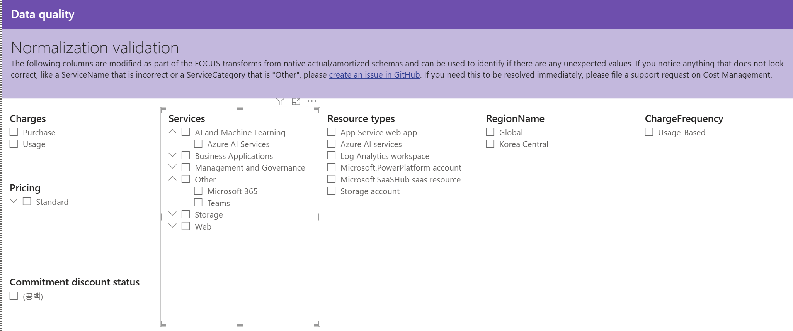

# 13. Data quality / Normalization validation — 정규화 검증(FOCUS 변환 컬럼 이상값 점검)

> 페이지: Data quality · 데이터 범위: 청구기간 2026-07-01 ~ 2026-07-18 · 필터 전체(All) · 통화 샘플  
> 원본: FinOps Toolkit Cost summary 리포트 (Storage/데이터 export·FOCUS 기반) · Inform 단계 비용 가시화  
> 📌 한 줄 요약(TL;DR): FOCUS 변환으로 수정된 컬럼(Service·ServiceCategory 등)을 슬라이서로 훑어 "Other 과다"  
> 같은 오분류가 없는지 눈으로 점검하는 데이터 품질 첫 화면임.

## 1. 개요
- Data quality 페이지의 첫 번째 뷰인 **Normalization validation(정규화 검증)** 화면임  
- 목적: native actual/amortized 스키마를 FOCUS로 변환(transform)하면서 **수정된 컬럼**에 이상값이 없는지 확인  
- 화면 안내문(원문 요지): FOCUS 변환으로 수정된 컬럼들로 예상치 못한 값을 식별 가능함. ServiceName이 틀렸거나  
  ServiceCategory가 "Other"로 잘못 분류된 것 등을 발견하면 **GitHub 이슈 생성**, 즉시 해결이 필요하면  
  **Cost Management 지원 요청(support request)** 안내가 있음  
- admin 커넥터 리포트에는 없던 dept 템플릿 신규 페이지임(비용 집계가 아닌 **데이터 신뢰성 점검용** 화면)

## 2. 화면 구조·차트 읽는 법
- 이 화면은 표·차트가 아닌 **슬라이서(거르개) 나열**로 구성됨 — 각 슬라이서가 정규화 결과 컬럼의 실제 값 목록임  
- 슬라이서에 뜬 값 자체가 "변환 결과물"이므로, 목록에 **낯설거나 잘못된 항목**이 섞였는지 훑어보는 방식으로 점검함

| 슬라이서 | 화면에 보이는 값 | 점검 관점 |
|---|---|---|
| **Charges** | Purchase · Usage | 청구 유형이 정상 2종으로 분류됐는지 |
| **Pricing** | Standard | 가격 책정 범주가 정상값인지 |
| **Commitment discount status** | (공백) | 약정 할인 상태 — 전량 공백(약정 미사용 환경) |
| **Services**(트리) | AI and Machine Learning > Azure AI Services / Business Applications / Management and Governance / **Other** > Microsoft 365 · Teams / Storage / Web | 서비스 트리에 **Other로 빠진 항목**이 과도한지가 핵심 점검 포인트 |
| **Resource types** | App Service web app · Azure AI services · Log Analytics workspace · Microsoft.PowerPlatform account · Microsoft.SaaSHub saas resource · Storage account | 리소스 유형명이 올바르게 매핑됐는지 |
| **RegionName** | Global · Korea Central | 리전명 정규화가 정상인지 |
| **ChargeFrequency** | Usage-Based | 청구 빈도 분류가 정상인지 |

- **읽는 법**: 슬라이서 값 중 하나를 클릭 → 해당 값에 묶인 데이터만 필터링되어 다른 페이지에서 원인 추적 가능  
- 특히 **Services 트리의 "Other"** 하위에 Microsoft 365·Teams가 들어와 있음 — Microsoft 365 중심 환경 특성상  
  Other 분류가 넓게 잡히는지 여부가 이 화면의 대표 점검 항목임

## 3. 분석 요약
> What · 데이터가 보여준 사실(해석 배제)

- Charges는 **Purchase · Usage** 2종으로 정상 분류됨  
- Pricing은 **Standard** 단일값, ChargeFrequency는 **Usage-Based** 단일값임  
- Commitment discount status는 **(공백) 단일** → 약정 할인 상태값이 없음  
- Services 트리에 **Other** 범주가 존재하며, 그 하위에 **Microsoft 365 · Teams**가 분류돼 있음  
- Resource types는 6종(App Service web app · Azure AI services · Log Analytics workspace ·  
  Microsoft.PowerPlatform account · Microsoft.SaaSHub saas resource · Storage account)으로 표시됨  
- RegionName은 **Global · Korea Central** 2종임  
- 화면상 슬라이서 값 목록에 명백히 깨진 문자열·중복·오류 표기는 판독되지 않음(수치·오류 카운트는 이 화면에 미표시)

## 4. 시사점
> So what · 사실의 의미·비용 리스크

- 이 화면은 비용을 "얼마 썼나"가 아니라 **"데이터를 믿어도 되나"**를 판정하는 관문임 — 이후 모든 분석의 신뢰 기반임  
- **Other 범주 존재**는 주의 신호임. Microsoft 365·Teams가 Other로 묶여 있어, 정상 매핑인지 아니면  
  본래 별도 서비스로 분류돼야 할 항목이 뭉뚱그려졌는지 확인 필요함(과다 시 서비스별 비용 배분 정확도 저하)  
- Commitment discount status 전량 (공백)은 정규화 오류가 아니라 **약정 미사용 환경**을 반영한 정상 결과로 해석됨  
- 정규화 오류를 방치하면 서비스별·리소스별 비용 리포트가 왜곡되어 **잘못된 최적화 우선순위**로 이어질 위험이 있음

## 5. 권고사항
> Now what · Inform 단계 실행 행동(실행은 Optimize 이관 명시)

- **Services 트리 Other 하위 점검**: Other로 분류된 항목(Microsoft 365·Teams 등)이 의도된 매핑인지 확인.  
  잘못된 오분류(예: 정상 서비스가 Other로 빠짐) 발견 시 **GitHub 이슈 생성** 또는 **Cost Management 지원 요청**  
- **슬라이서 순회 점검을 정례화**: 각 슬라이서 값을 훑어 낯선 값·깨진 문자열이 없는지 릴리스 전 확인 절차로 운영  
- **정규화 검증 통과를 데이터 품질 게이트로 지정**: 이 화면 이상 없음 확인 후에야 서비스별·리소스별 분석을 신뢰  
- 실제 재분류·매핑 수정·거버넌스 규칙 반영은 **Optimize/거버넌스 단계로 이관**함(Inform 단계는 이상 식별·보고까지)

## 6. 용어·출처

### 용어
- **Normalization(정규화)**: native actual/amortized 스키마를 FOCUS 표준 스키마로 변환하는 과정  
- **FOCUS**: FinOps Open Cost and Usage Specification. 벤더별 비용 데이터를 공통 스키마로 통일한 표준  
- **ServiceCategory "Other"**: 표준 서비스 범주에 매핑되지 못한 항목이 담기는 기타 분류. 과다 시 오분류 의심  
- **Commitment discount status**: 약정 할인(RI·Savings Plan) 적용 상태. 공백은 미적용 의미

### 출처
- [FinOps Toolkit — Cost summary report](https://learn.microsoft.com/en-us/cloud-computing/finops/toolkit/power-bi/cost-summary)  
- [FOCUS overview (FinOps Foundation)](https://focus.finops.org/)  
- [FinOps Toolkit — Data quality (GitHub 이슈·지원 요청 안내)](https://github.com/microsoft/finops-toolkit)
