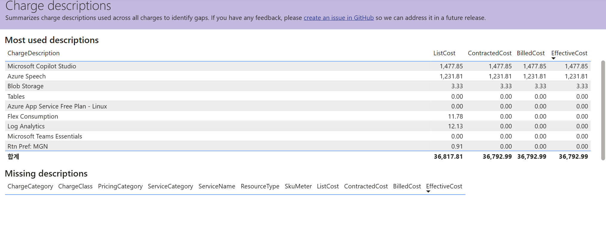

# 13. Data quality / Charge descriptions — 청구 설명 커버리지 점검(누락 설명 확인)

> 페이지: Data quality · 데이터 범위: 청구기간 2026-07-01 ~ 2026-07-18 · 필터 전체(All) · 통화 샘플  
> 원본: FinOps Toolkit Cost summary 리포트 (Storage/데이터 export·FOCUS 기반) · Inform 단계 비용 가시화  
> 📌 한 줄 요약(TL;DR): 청구 설명(ChargeDescription)이 4개 비용 컬럼에 제대로 채워졌는지 점검하는 화면임.  
> "Missing descriptions" 표가 비어 있어 **설명 누락은 없음**으로 판독됨.

## 1. 개요
- Data quality 페이지의 두 번째 뷰인 **Charge descriptions(청구 설명)** 화면임  
- 목적: 모든 청구 건에 걸쳐 사용된 청구 설명을 요약해 **설명 누락(gap)**이 있는지 식별  
- 화면 안내문(원문 요지): 청구 설명 커버리지를 요약해 gap을 식별함. 피드백은 **GitHub 이슈**로 제출 안내  
- 상단 "Most used descriptions"(가장 많이 쓰인 설명) 표 + 하단 "Missing descriptions"(누락 설명) 표로 구성됨

## 2. 화면 구조·차트 읽는 법
- 화면은 상하 2개 표로 구성됨

### ① Most used descriptions (가장 많이 쓰인 청구 설명)
행 = 청구 설명(ChargeDescription), 열 = 4대 비용 지표

| 열 이름 | 뜻 |
|---|---|
| **ListCost** | 정가(할인 전 표시 가격) |
| **ContractedCost** | 계약 단가 반영 비용 |
| **BilledCost** | 실제 청구 비용 |
| **EffectiveCost** | 할인 다 적용된 실질 비용 |

- **읽는 법**: 각 설명별 4개 값을 비교. ListCost > EffectiveCost이면 그 항목에 할인·무료 혜택이 반영된 것  
- ListCost는 있는데 나머지가 0이면 **무료 플랜(Free Plan)·크레딧 처리** 등으로 실제 청구가 0인 항목임

### ② Missing descriptions (설명이 누락된 청구)
- 열: ChargeCategory · ChargeClass · PricingCategory · ServiceCategory · ServiceName · ResourceType ·  
  SkuMeter · ListCost · ContractedCost · BilledCost · EffectiveCost  
- **읽는 법**: 이 표에 행이 뜨면 그 청구 건은 설명이 비어 있다는 뜻 → 데이터 품질 결함. **행이 없으면 누락 0(정상)**

## 3. 분석 요약
> What · 데이터가 보여준 사실(해석 배제)

- Most used descriptions 상위 항목(EffectiveCost 기준)  
  - **Microsoft Copilot Studio**: List·Contracted·Billed·Effective 모두 **1,477.85**  
  - **Azure Speech**: 4개 컬럼 모두 **1,231.81**  
  - **Blob Storage**: 4개 컬럼 모두 **3.33**  
- EffectiveCost 0.00 항목: Tables · Azure App Service Free Plan - Linux · Microsoft Teams Essentials(모든 컬럼 0)  
- ListCost만 값이 있고 나머지 0인 항목: **Flex Consumption**(List 11.78) · **Log Analytics**(List 12.13) ·  
  **Rtn Pref: MGN**(List 0.91) → 정가는 있으나 실질 청구 0  
- 합계(총계) 행: **ListCost 36,817.81 / ContractedCost 36,792.99 / BilledCost 36,792.99 / EffectiveCost 36,792.99**  
- **Missing descriptions 표는 빈 상태**(행 없음) → 설명 누락 건 없음으로 판독됨

## 4. 시사점
> So what · 사실의 의미·비용 리스크

- EffectiveCost 합계 **36,792.99**는 공통 확정 총 실질비용과 일치함 → 이 화면 집계가 원본과 정합함을 방증  
- ListCost 합계(36,817.81)가 EffectiveCost 합계(36,792.99)보다 소폭 큼 → 정가 대비 실질비용 차이는  
  약 24.82로 크지 않음. 대규모 할인·크레딧이 걸린 환경은 아님(약정 미사용 환경과 일관됨)  
- **Missing descriptions 없음**은 긍정 신호임 — 청구 설명 기반 분석·리포트를 신뢰할 수 있음  
- 비용 대부분이 **Microsoft Copilot Studio · Azure Speech**(합 2천 대) 등 소수 설명에 집중됨(비용 집중 구조)

## 5. 권고사항
> Now what · Inform 단계 실행 행동(실행은 Optimize 이관 명시)

- **Missing descriptions 표를 비어 있는 상태로 유지**하도록 주기 점검 — 행이 나타나면 즉시 원인 추적  
- 청구 설명 gap 발견 시 **GitHub 이슈**로 피드백 제출(화면 안내 경로 준수)  
- ListCost만 있고 실질 0인 항목(Free Plan·Flex Consumption 등)은 정상 무료 처리인지 확인해 오해 방지  
- 청구 설명은 비용 배분·차지백의 라벨 근거가 되므로, **설명 커버리지 확보를 데이터 품질 게이트**로 운영  
- 설명·태그 표준화 규칙 수립은 **거버넌스/Optimize 단계로 이관**함(Inform 단계는 커버리지 확인·보고까지)

## 6. 용어·출처

### 용어
- **ChargeDescription(청구 설명)**: 각 청구 건에 대한 설명 텍스트. 비용 항목 식별의 라벨 역할  
- **ListCost / ContractedCost / BilledCost / EffectiveCost**: 정가 / 계약가 / 청구가 / 실질비용의 4대 비용 지표  
- **Missing descriptions(누락 설명)**: 청구 설명이 비어 있는 건. 데이터 품질 결함 지표  
- **Free Plan / Flex Consumption**: 무료·소비 기반 플랜. 정가는 있으나 실질 청구 0인 경우가 있음

### 출처
- [FinOps Toolkit — Cost summary report](https://learn.microsoft.com/en-us/cloud-computing/finops/toolkit/power-bi/cost-summary)  
- [FOCUS columns 정의(ChargeDescription 등)](https://focus.finops.org/)  
- [FinOps Toolkit (GitHub 이슈 피드백 경로)](https://github.com/microsoft/finops-toolkit)
