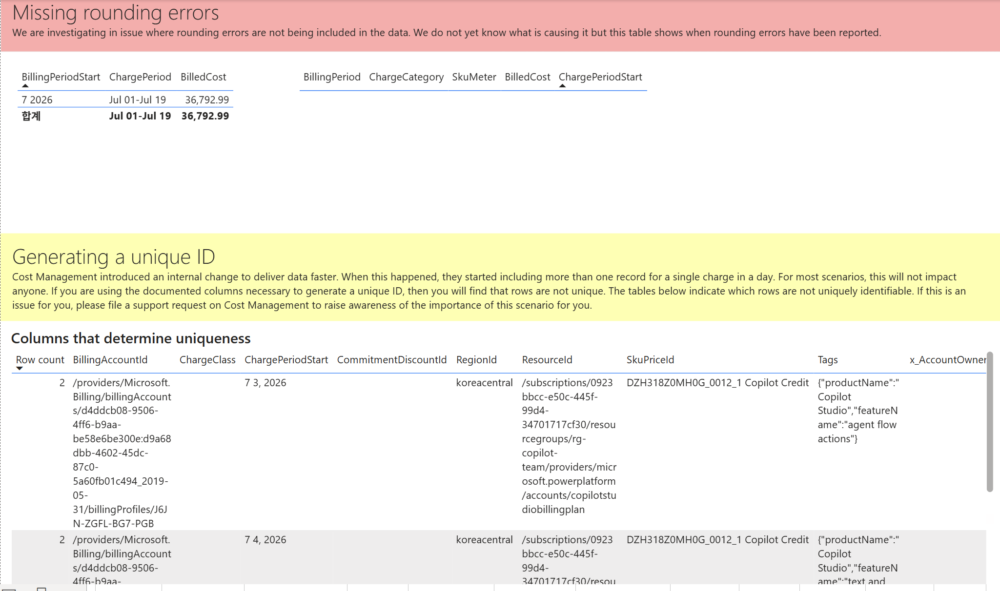

# 13. Data quality / Rounding errors · Unique ID — 반올림 오차·고유 ID 중복 점검

> 페이지: Data quality · 데이터 범위: 청구기간 2026-07-01 ~ 2026-07-18 · 필터 전체(All) · 통화 샘플  
> 원본: FinOps Toolkit Cost summary 리포트 (Storage/데이터 export·FOCUS 기반) · Inform 단계 비용 가시화  
> 📌 한 줄 요약(TL;DR): 반올림 오차 누락 여부와 "하루 한 청구가 여러 레코드로 쪼개져 행이 고유하지 않은지"를  
> 점검하는 화면임. 동일 청구가 하루 **2건(Row count 2)**으로 잡히는 비고유 행이 관측됨.

## 1. 개요
- Data quality 페이지의 세 번째 뷰로, **Missing rounding errors(반올림 오차 누락)** +  
  **Generating a unique ID(고유 ID 생성)** 두 섹션이 함께 보이는 화면임  
- 목적: ① 반올림 오차가 데이터에 포함되지 않는 이슈를 보고, ② 한 청구가 하루에 여러 레코드로 들어와  
  **행이 고유하게 식별되지 않는(row not unique)** 케이스를 식별  
- 화면 안내문(원문 요지)  
  - 반올림 오차(빨강 배너): "반올림 오차가 데이터에 포함되지 않는 이슈를 조사 중이며 원인은 아직 미상.  
    이 표는 반올림 오차가 보고된 시점을 보여줌"  
  - 고유 ID(노랑 배너): "Cost Management가 데이터를 더 빨리 전달하려는 내부 변경으로 하루 한 청구에  
    2개 이상 레코드를 포함하기 시작함. 고유 ID 생성에 쓰는 문서화된 컬럼을 사용하면 행이 고유하지 않을 수 있음.  
    아래 표가 고유 식별 불가 행을 표시. 이슈가 되면 **Cost Management 지원 요청**으로 중요성 알림 안내"

## 2. 화면 구조·차트 읽는 법
화면은 색상 배너로 구분된 3개 표 영역으로 구성됨.

### ① Missing rounding errors (반올림 오차 — 빨강 배너)
- 좌측 표: BillingPeriodStart · ChargePeriod · BilledCost  
- 우측 표: BillingPeriod · ChargeCategory · SkuMeter · BilledCost · ChargePeriodStart  
- **읽는 법**: 반올림 오차가 보고된 기간·비용을 표시. 값이 뜨면 해당 기간 데이터에 오차 이슈 존재 참고

### ② Columns that determine uniqueness (고유성을 결정하는 컬럼 — 노랑 배너 하위)
- 열: **Row count** · BillingAccountId · ChargeClass · ChargePeriodStart · CommitmentDiscountId ·  
  RegionId · ResourceId · SkuPriceId · Tags · x_AccountOwner  
- **읽는 법**: **Row count가 2 이상**이면 그 조합의 행이 하루에 여러 건 존재 → 고유 ID로 식별 불가한 중복 행임

## 3. 분석 요약
> What · 데이터가 보여준 사실(해석 배제)

### 반올림 오차 표
- BillingPeriodStart **7 2026**, ChargePeriod **Jul 01 - Jul 19**, BilledCost **36,792.99**  
- 합계 행: Jul 01 - Jul 19 / **36,792.99**  
- 우측 표(BillingPeriod·ChargeCategory·SkuMeter·BilledCost·ChargePeriodStart)는 **빈 상태**(행 없음)

### 고유성 결정 컬럼 표
- 관측된 행들의 **Row count = 2**(하루 한 청구가 2개 레코드로 쪼개짐)  
- 예시 행 1: BillingAccountId `/providers/Microsoft.Billing/billingAccounts/d4ddcb08-...`,  
  ChargePeriodStart **7 3, 2026**, RegionId **koreacentral**,  
  ResourceId `/subscriptions/0923bbcc-...resourcegroups/rg-copilot-team/.../accounts/copilotstudiobillingplan`,  
  SkuPriceId **DZH318Z0MH0G_0012_1 Copilot Credit**,  
  Tags `{"productName":"Copilot Studio","featureName":"agent flow actions"}`  
- 예시 행 2: 동일 BillingAccountId·ResourceId, ChargePeriodStart **7 4, 2026**, koreacentral,  
  같은 SkuPriceId, Tags `{"productName":"Copilot Studio","featureName":"text and..."}`  
- CommitmentDiscountId·ChargeClass 열은 공백으로 표시됨

## 4. 시사점
> So what · 사실의 의미·비용 리스크

- 반올림 오차 표에 청구기간·총 BilledCost(36,792.99)가 잡히나 세부(우측) 표는 비어 있음 → 세부 오차 항목은  
  현재 보고되지 않음으로 판독됨. 총액 정합성 자체에는 큰 이상 신호가 아님  
- **핵심 리스크는 고유 ID 중복(Row count 2)**임. 하루 한 청구가 2개 레코드로 쪼개져, FOCUS 문서화 컬럼만으로  
  행을 유일 식별하면 **중복 합산·조인 오류**가 발생할 수 있음(비용 이중 계상 위험)  
- 중복이 관측된 대상이 **Copilot Studio / Copilot Credit(koreacentral)** 리소스임 → Microsoft 365/Copilot  
  중심 환경에서 특히 주의가 필요한 지점임  
- 이는 리포트 오류가 아니라 **Cost Management의 데이터 전달 방식 변경**에서 비롯된 알려진 현상임

## 5. 권고사항
> Now what · Inform 단계 실행 행동(실행은 Optimize 이관 명시)

- **중복 행을 인지한 채 분석**: 원시 행 단순 합산 대신, 사전 집계된 EffectiveCost/BilledCost 지표(총액 정합 확인)를  
  기준으로 사용해 이중 계상을 피함  
- **고유 ID가 실무에 필요하면** 화면 안내대로 **Cost Management 지원 요청**을 제출해 시나리오 중요성을 알림  
- 반올림 오차 보고 여부를 주기 모니터링해, 세부 표에 행이 나타나면 총액 정합성을 재확인  
- 커스텀 조인·중복 제거 로직 정비, 데이터 파이프라인 표준화는 **Optimize/데이터 엔지니어링 단계로 이관**함  
  (Inform 단계는 중복·오차 존재 식별과 보고까지)

## 6. 용어·출처

### 용어
- **Rounding error(반올림 오차)**: 비용 계산 과정의 소수점 반올림에서 생기는 미세 차이. 누락 시 총액 오차 유발  
- **Unique ID / row uniqueness(고유 ID·행 고유성)**: 한 청구 건을 유일하게 식별하는 컬럼 조합. 중복 시 이중 계상 위험  
- **Row count**: 동일 컬럼 조합으로 존재하는 행 수. 2 이상이면 비고유(중복) 행  
- **SkuPriceId / ResourceId / BillingAccountId**: 청구를 식별하는 FOCUS 표준 식별자 컬럼

### 출처
- [FinOps Toolkit — Cost summary report](https://learn.microsoft.com/en-us/cloud-computing/finops/toolkit/power-bi/cost-summary)  
- [FOCUS specification (고유 식별 컬럼 정의)](https://focus.finops.org/)  
- [Azure Cost Management — 지원 요청(support request)](https://learn.microsoft.com/en-us/azure/cost-management-billing/)
