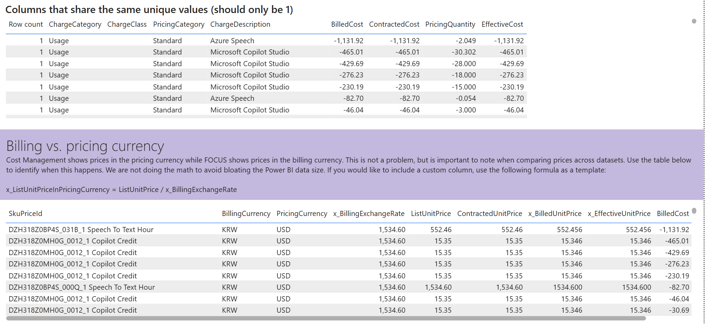

# 13. Data quality / Duplicate values · Currency — 중복 고유값·청구 vs 가격 통화 점검

> 페이지: Data quality · 데이터 범위: 청구기간 2026-07-01 ~ 2026-07-18 · 필터 전체(All) · 통화 KRW/USD  
> 원본: FinOps Toolkit Cost summary 리포트 (Storage/데이터 export·FOCUS 기반) · Inform 단계 비용 가시화  
> 📌 한 줄 요약(TL;DR): "고유해야 하는데 같은 값을 공유하는 행"과 "청구 통화(KRW) vs 가격 통화(USD) 불일치"를  
> 점검하는 화면임. 청구=KRW / 가격=USD, 환율 **1,534.60**으로 통화 이원화가 확인됨.

## 1. 개요
- Data quality 페이지의 네 번째 뷰로, **Columns that share the same unique values(고유값 중복)** +  
  **Billing vs. pricing currency(청구 통화 대 가격 통화)** 두 섹션이 함께 보이는 화면임  
- 목적: ① 원래 1건이어야 할 값이 중복 공유되는 행을 식별, ② Cost Management(가격 통화 표시)와  
  FOCUS(청구 통화 표시)의 **통화 차이**를 인지하도록 안내  
- 화면 안내문(원문 요지, 보라 배너): "Cost Management는 가격 통화(pricing currency)로, FOCUS는 청구 통화  
  (billing currency)로 가격을 표시함. 문제는 아니나 데이터셋 간 가격 비교 시 유의 필요. 데이터 크기 팽창을  
  피하려 계산은 하지 않음. 커스텀 컬럼이 필요하면 `x_ListUnitPriceInPricingCurrency = ListUnitPrice / x_BillingExchangeRate` 공식 사용"

## 2. 화면 구조·차트 읽는 법
화면은 상하 2개 표로 구성됨.

### ① Columns that share the same unique values (should only be 1)
- 열: **Row count** · ChargeCategory · ChargeClass · PricingCategory · ChargeDescription ·  
  BilledCost · ContractedCost · PricingQuantity · EffectiveCost  
- **읽는 법**: 원칙상 Row count는 **1**이어야 함. 값이 **음수(마이너스)**로 뜬 행들은 크레딧·환불·조정 성격의  
  청구로, 고유값 검증 대상에 포착된 항목임

### ② Billing vs. pricing currency (청구 통화 대 가격 통화 — 보라 배너 하위)
- 열: SkuPriceId · BillingCurrency · PricingCurrency · x_BillingExchangeRate · ListUnitPrice ·  
  ContractedUnitPrice · x_BilledUnitPrice · x_EffectiveUnitPrice · BilledCost  
- **읽는 법**: BillingCurrency와 PricingCurrency가 **다르면** 두 통화 체계가 공존한다는 뜻.  
  단가 비교 시 반드시 x_BillingExchangeRate(환율)로 환산해야 정확함

## 3. 분석 요약
> What · 데이터가 보여준 사실(해석 배제)

### 고유값 중복 표 (Row count 전부 1)
- 모든 표시 행의 Row count = **1**, ChargeCategory=**Usage**, PricingCategory=**Standard**  
- 값이 음수인 항목(BilledCost=ContractedCost=EffectiveCost)  
  - Azure Speech **-1,131.92** (PricingQuantity -2.049)  
  - Microsoft Copilot Studio **-465.01** / **-429.69** / **-276.23** / **-230.19** / **-46.04**  
  - Azure Speech **-82.70** (PricingQuantity -0.054)

### 청구 vs 가격 통화 표
- 모든 행 **BillingCurrency = KRW / PricingCurrency = USD**, **x_BillingExchangeRate = 1,534.60**  
- 예시  
  - `DZH318Z0BP4S_031B_1 Speech To Text Hour`: ListUnitPrice 552.46 / Contracted 552.46 /  
    x_Billed 552.456 / x_Effective 552.456 / BilledCost **-1,131.92**  
  - `DZH318Z0MH0G_0012_1 Copilot Credit`: ListUnitPrice 15.35 / Contracted 15.35 /  
    x_Billed 15.346 / x_Effective 15.346 / BilledCost **-465.01**(및 -429.69·-276.23·-230.19·-46.04·-30.69)  
  - `DZH318Z0BP4S_000Q_1 Speech To Text Hour`: 단가 1,534.60 대 / BilledCost **-82.70**

## 4. 시사점
> So what · 사실의 의미·비용 리스크

- 고유값 중복 표의 행 Row count가 모두 **1**임 → "같은 고유값을 공유하는 중복" 문제는 이 화면에서 발견되지 않음  
- 표에 잡힌 항목들이 **음수**인 점은 크레딧·조정·환불성 청구가 존재함을 의미함(Copilot Studio·Azure Speech 중심)  
- **통화 이원화(청구 KRW / 가격 USD)**가 확정 사실임. 단가를 그대로 비교하면 통화 단위가 섞여 오독 위험이 큼  
  → 반드시 환율(1,534.60)로 환산해야 데이터셋 간 비교가 정확함  
- 이는 오류가 아니라 **Cost Management와 FOCUS의 통화 표시 방식 차이**로, 인지하고 다뤄야 할 특성임

## 5. 권고사항
> Now what · Inform 단계 실행 행동(실행은 Optimize 이관 명시)

- **단가 비교 시 통화 환산 필수**: 화면 제공 공식 `x_ListUnitPriceInPricingCurrency = ListUnitPrice / x_BillingExchangeRate`를  
  커스텀 컬럼으로 추가해 KRW/USD를 통일한 뒤 비교  
- **음수(크레딧·조정) 항목 성격 확인**: 환불·크레딧이 정상 처리인지 점검하고, 순비용 해석 시 부호를 명확히 반영  
- 고유값 중복은 현재 없음(Row count 1) → 상태 유지 여부를 주기 점검  
- 통화 환산 컬럼·표준 리포트 반영, 크레딧 회계 처리 규칙 수립은 **Optimize/데이터·재무 거버넌스 단계로 이관**함  
  (Inform 단계는 통화 이원화·중복 여부 식별과 보고까지)

## 6. 용어·출처

### 용어
- **BillingCurrency(청구 통화)**: 실제 청구서에 찍히는 통화. 여기서는 KRW  
- **PricingCurrency(가격 통화)**: 가격표 기준 통화. 여기서는 USD  
- **x_BillingExchangeRate(청구 환율)**: 가격 통화를 청구 통화로 환산하는 환율. 여기서는 1,534.60  
- **PricingQuantity / UnitPrice**: 가격 산정 수량 / 단가. 음수는 크레딧·조정성 청구를 의미  
- **Row count(고유값)**: 원칙상 1이어야 하며, 2 이상이면 중복 공유 행

### 출처
- [FinOps Toolkit — Cost summary report](https://learn.microsoft.com/en-us/cloud-computing/finops/toolkit/power-bi/cost-summary)  
- [FOCUS — currency 컬럼(Billing/Pricing Currency) 정의](https://focus.finops.org/)  
- [Azure Cost Management — 통화 및 환율 처리](https://learn.microsoft.com/en-us/azure/cost-management-billing/)
