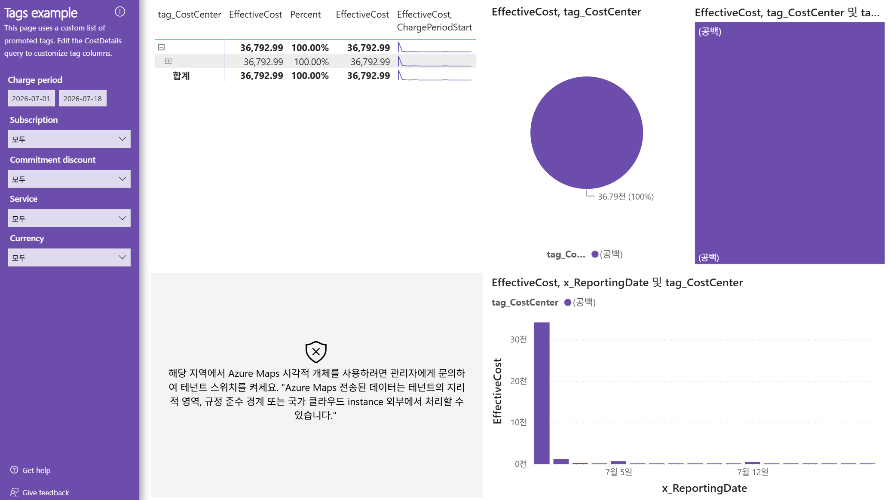

# 14. Tags example — 태그 기반 비용 배분(tag_CostCenter 전량 공백)

> 페이지: Tags example · 데이터 범위: 청구기간 2026-07-01 ~ 2026-07-18 · 필터 전체(All) · 통화 샘플  
> 원본: FinOps Toolkit Cost summary 리포트 (Storage/데이터 export·FOCUS 기반) · Inform 단계 비용 가시화  
> 📌 한 줄 요약(TL;DR): tag_CostCenter가 **전량 (공백)**이라 EffectiveCost 36,792.99 전액(100%)이 태그 없음.  
> 부서·비용센터별 배분이 불가능한 **태깅 거버넌스 부재** 상태임.

## 1. 개요
- 태그(tag_CostCenter) 기반으로 비용을 배분해 보여주는 **Tags example** 화면임  
- 화면 안내문(원문): "This page uses a custom list of promoted tags. Edit the CostDetails query to customize tag columns."  
  (승격된 태그의 커스텀 목록을 사용하며, 태그 컬럼은 CostDetails 쿼리 편집으로 커스터마이즈함)  
- 목적: 비용을 **CostCenter(비용센터) 태그**로 쪼개어 쇼백/차지백의 근거를 마련하는 데 있음  
- 그러나 이 환경은 태그 값이 전부 비어 있어, **태깅이 안 된 상태를 그대로 드러내는** 화면이 됨

## 2. 화면 구조·차트 읽는 법
화면은 좌측 필터 + 우측 표·차트 4종으로 구성됨.

### ① 좌측 필터 (거르개)
- **Charge period**: 2026-07-01 ~ 2026-07-18  
- **Subscription / Commitment discount / Service / Currency**: 모두 "모두(All)"

### ② 상단 표 (tag_CostCenter별 비용)
- 열: tag_CostCenter · EffectiveCost · Percent · EffectiveCost · EffectiveCost·ChargePeriodStart(스파크라인)  
- **읽는 법**: 태그 값별 비용·비중을 봄. 태그가 채워졌다면 여기 CostCenter 목록이 나열됨

### ③ 원형 차트 (EffectiveCost, tag_CostCenter)
- **읽는 법**: 비용센터별 비중을 원형으로 표현. 조각이 하나뿐이면 단일값(여기서는 공백)에 전액 집중된 것

### ④ 트리맵 (EffectiveCost, tag_CostCenter 및 ta...)
- **읽는 법**: 태그 조합별 비용을 면적으로 표현. 한 칸이 전체를 덮으면 값이 하나로 쏠린 것

### ⑤ 막대 차트 (EffectiveCost, x_ReportingDate 및 tag_CostCenter)
- **읽는 법**: 날짜별 비용을 태그 색상으로 구분. 색이 하나면 전 기간 동일 태그(여기서는 공백)

### ⑥ Azure Maps 시각적 개체 (비활성화)
- 화면 중앙에 지도 시각화 자리에 **비활성화 안내**가 표시됨(아래 3절 참조)

## 3. 분석 요약
> What · 데이터가 보여준 사실(해석 배제)

- 상단 표: tag_CostCenter 행이 **(공백) 단일**, EffectiveCost **36,792.99**, Percent **100.00%**  
  합계 행도 동일하게 36,792.99 / 100.00%  
- 원형 차트: 조각 1개 = **36.79천 (100%)**, 범례 `tag_Co... ●(공백)`  
- 트리맵: 전체 면적이 **(공백)** 한 칸으로 채워짐  
- 막대 차트: 범례 `tag_CostCenter ●(공백)` 단색, 7월 1 ~ 2일경 약 **33천**의 큰 막대 1개 + 이후 소액 막대들  
  (7월 5일·7월 12일 축 라벨 표시)  
- **Azure Maps 시각적 개체 비활성화 안내**(원문): "해당 지역에서 Azure Maps 시각적 개체를 사용하려면  
  관리자에게 문의하여 테넌트 스위치를 켜세요. 'Azure Maps 전송된 데이터는 테넌트의 지리적 영역, 규정 준수  
  경계 또는 국가 클라우드 instance 외부에서 처리할 수 있습니다.'"

## 4. 시사점
> So what · 사실의 의미·비용 리스크

- **tag_CostCenter 전량 공백 = 태깅 거버넌스 부재**임. 총 실질비용 36,792.99의 **100%가 태그 없음**  
- 결과적으로 부서·팀·프로젝트별로 비용을 **쇼백(showback)·차지백(chargeback)할 근거가 전혀 없음**  
  → "누가 이 비용을 발생시켰나"를 데이터로 답할 수 없는 상태임  
- 태그가 없으면 비용 책임 소재가 불명확해 **비용 인식·절감 동기부여가 작동하지 않음**(FinOps Inform의 핵심 결손)  
- 막대 차트상 초기 1 ~ 2일에 비용이 크게 집중됨 → 태그가 있었다면 어느 CostCenter가 이 급증을 유발했는지  
  즉시 추적 가능했을 것이나, 현재는 원인 부서 식별 불가  
- Azure Maps 비활성화는 태깅 문제와 무관한 **테넌트 설정 이슈**임 — 지리 기반 비용 시각화는 관리자 스위치가  
  켜져야 사용 가능함

## 5. 권고사항
> Now what · Inform 단계 실행 행동(실행은 Optimize 이관 명시)

- **태깅 부재를 리스크로 공식 보고**: "비용의 100%가 CostCenter 미태깅"을 Inform 단계 핵심 발견으로 기록  
- **필수 태그 표준 정의 착수**: 최소 CostCenter(비용센터)·Owner·Environment 등 필수 태그 키 목록을 합의  
- **미태깅 리소스 식별**: 리소스별 뷰와 교차해 태그 없는 리소스를 목록화(쇼백 대상 파악 사전 작업)  
- **태그 강제·자동화는 Optimize/거버넌스 단계로 이관**: Azure Policy로 태그 필수화·상속·자동 부여 규칙 적용은  
  실행 단계에서 수행함(Inform 단계는 부재 식별·표준안 제안까지)  
- 지리 기반 비용 분석이 필요하면 **관리자에게 Azure Maps 테넌트 스위치 활성화**를 별도 요청

## 6. 용어·출처

### 용어
- **tag_CostCenter(비용센터 태그)**: 비용을 부서·비용센터 단위로 귀속시키는 태그. 쇼백/차지백의 핵심 라벨  
- **Showback(쇼백)**: 부서별 사용 비용을 "청구 없이 보여주기"만 하는 방식  
- **Chargeback(차지백)**: 부서별 사용 비용을 실제로 "청구·정산"하는 방식  
- **Promoted tags(승격 태그)**: 리포트에 컬럼으로 노출되도록 지정한 태그 목록  
- **Azure Maps 시각적 개체**: 지리 기반 지도 시각화. 테넌트 관리자 스위치가 켜져야 사용 가능

### 출처
- [FinOps Toolkit — Cost summary report](https://learn.microsoft.com/en-us/cloud-computing/finops/toolkit/power-bi/cost-summary)  
- [Azure resource tagging 전략 및 거버넌스](https://learn.microsoft.com/en-us/azure/cloud-adoption-framework/ready/azure-best-practices/resource-tagging)  
- [Azure Policy로 태그 강제·상속](https://learn.microsoft.com/en-us/azure/azure-resource-manager/management/tag-policies)  
- [FinOps Framework — Allocation(비용 배분) 역량](https://www.finops.org/framework/capabilities/allocation/)
