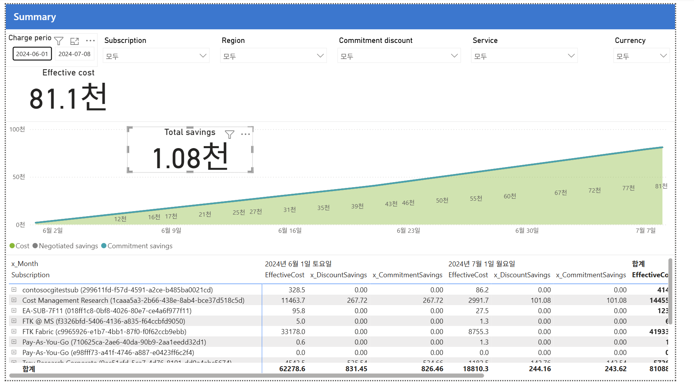

# 01. Summary (요약)

CostManagementConnector 샘플 보고서의 **Summary** 페이지 해설임.
이 페이지는 보고서의 표지이자 대시보드로, "이번 기간에 총 얼마 썼고 얼마 아꼈나"를 한눈에 보는 화면임.



---

## 화면 구조 4부분

### ① 상단 필터 (조건 거르개)
- **Charge period(청구 기간)**: `2024-06-01 ~ 2024-07-08` — 이 기간의 비용만 표시
- **Subscription / Region / Commitment discount / Service / Currency**: 모두 "모두(All)" → 전체 조회 중
- 특정 구독·서비스만 골라 범위를 좁혀 볼 수 있음

### ② 핵심 지표 2개 (제일 먼저 볼 숫자)

| 지표 | 값 | 의미 |
|---|---|---|
| **Effective cost (실질 비용)** | **81.1천** (≈81,100) | 할인이 다 적용된 뒤 실제로 부담하는 비용. "진짜 낸 돈" |
| **Total savings (총 절감액)** | **1.08천** (≈1,080) | 이 기간에 할인으로 아낀 총액 |

- "천" = 1,000 단위. 즉 81.1천 = 약 8만 1천 (샘플이라 통화는 USD 기준)

### ③ 가운데 추이 차트 (시간에 따른 누적 비용)
- **누적(Accumulated) 곡선** — 6월 2일 0에서 시작해 7월 7일 81천까지 우상향
- 매일 조금씩 쌓여 12천 → 27천 → 50천 → 81천으로 증가 (누적이라 계속 올라감)
- 범례 3색
  - 🟢 **Cost** — 실제 비용
  - ⚫ **Negotiated savings** — 협상 할인 절감 (단가 협상으로 아낀 것)
  - 🔵 **Commitment savings** — 약정 할인 절감 (RI·Savings Plan으로 아낀 것)
- 선이 완만한 직선이면 매일 비용이 일정하다는 뜻
- 특정일에 꺾여 급등하면 그날 뭔가 크게 배포된 것 → 이상 탐지 신호

### ④ 하단 표 (구독별·월별 상세)
행 = **구독(Subscription)**, 열 = 월(6월/7월)별 3개 값 + 합계

| 열 이름 | 뜻 |
|---|---|
| **EffectiveCost** | 그 구독이 실제로 낸 비용 |
| **x_DiscountSavings** | 협상 할인으로 아낀 금액 |
| **x_CommitmentSavings** | 약정 할인으로 아낀 금액 |

읽어보면
- 가장 큰 구독은 **FTK Fabric** (6월 33,178 + 7월 8,755 = 41,933) → 전체 비용의 절반 이상. 1순위 최적화 대상
- 두 번째 **Cost Management Research** (합계 14,455) — 이 구독만 할인 절감(267+101)이 발생 → RI/협상 할인이 적용된 유일한 구독
- 나머지(EA-SUB, FTK@MS, Pay-As-You-Go 등)는 소액
- **합계 행**: 6월 62,278 + 7월 18,810 = 81,088 (상단 Effective cost 81.1천과 일치)

---

## 이 페이지로 얻는 인사이트 (읽는 법)

1. **총액 파악**: "이 기간 8만 1천 썼고, 1천 아꼈다" → 절감률 약 1.3%로 아직 할인 활용이 미미 = 최적화 여지 큼
2. **집중 대상 식별**: FTK Fabric 하나가 비용 절반 → 여기부터 파고들면 효과 최대
3. **할인 사각지대**: 대부분 구독의 절감액이 0 → 약정(RI/SP)·협상 할인이 거의 안 걸려 있음 → Optimize 단계 과제
4. **추이 이상 여부**: 곡선이 매끈하면 안정적, 급등 구간 있으면 원인 조사

**한 줄 요약**: Summary는 "총 실질비용 81천 / 절감 1천 / FTK Fabric이 최대 비용원 / 할인 활용은 아직 부족"을
보여주는 전체 개요 대시보드임.

---

## 보충 1 — 협상 할인 vs 약정 할인 차이

차트의 회색(Negotiated)·청록(Commitment) 두 절감이 이 둘임.
핵심 차이는 **"계약으로 자동 받느냐" vs "내가 사서 받느냐"** 임.

| 구분 | 협상 할인 (Negotiated) | 약정 할인 (Commitment) |
|---|---|---|
| 정체 | Microsoft/파트너와 계약 단가 협상으로 받는 할인 | 예약(RI)·Savings Plan을 구매해 받는 할인 |
| 받는 방식 | 계약 조건에 반영 → 자동 적용 (단가표 반영) | 포털에서 직접 구매(commit)해야 적용 |
| 약정 필요? | 구매 행위 없음 (계약 자체가 근거) | 1년/3년 사용 약정 필요 |
| 할인폭 | 협상력·볼륨에 따라 | RI 최대 ~72%, Savings Plan 최대 ~65% |
| 누가 신청 | 영업 담당(EA)·파트너/CSP(MCA)와 협상 | 청구 권한자가 포털에서 구매 |
| 자기 조작 | 불가 (셀프서비스 아님) | 가능 (포털에서 클릭 구매) |

쉽게
- **협상 할인** = "많이 쓸 테니 단가 깎아주세요" → 계약서에 반영 (자동)
- **약정 할인** = "1년치 미리 예약할게요" → 포털에서 구매 (능동)

### Azure Portal에서 신청하는 법

**약정 할인 — 셀프서비스 (포털에서 직접 구매)**

예약(Reservation, RI)
```
포털 검색 "Reservations"(예약) → + 추가
→ 서비스 선택(VM, SQL, Storage, Cosmos DB 등)
→ 범위(Scope): 공유 / 단일 구독 / 관리 그룹
→ 기간: 1년 또는 3년
→ 수량·결제(선불/월별) 선택 → 구매
```

Savings Plan(절감 플랜)
```
포털 검색 "Savings plans"(절감 플랜) → + 추가
→ 컴퓨팅 절감 플랜
→ 시간당 약정 금액(hourly commitment) 입력
→ 기간 1년/3년 → 구매
```

- 추천받아 구매: `Cost Management` 또는 `Azure Advisor`가 사용 패턴 기반 RI/SP 권장을 제시 → 거기서 바로 구매 가능
- 필요 권한(MCA): 청구 프로필/계정에 예약 구매 권한. 청구 프로필 정책 페이지에서 "Azure Reservation 구매 = 예"여야 함

**협상 할인 — 셀프서비스 아님 (협상 필요)**
- EA: Microsoft 영업 담당/계정팀과 볼륨·조건 협상 → 등록(enrollment) 단가에 반영
- MCA: 직접 계약 조건 또는 파트너/CSP를 통해 협상
- 포털에 신청 버튼 없음 — 협상 결과가 단가표(Price sheet)에 자동 반영

---

## 보충 2 — 적정 할인률·약정 수준 (공식 근거)

"할인률"은 두 층위로 나뉨 — ① 할인 폭(못 고름, MS 고정), ② 적정 약정 수준(내가 정함).

### ① 할인 폭 — Microsoft가 고정 (선택 불가)

| 상품 | 최대 할인 (PAYG 대비) |
|---|---|
| 예약(Reservation, RI) | 최대 72% |
| Savings Plan | 최대 65% |

- 할인률 자체는 협상 대상이 아니라 상품·기간(1년/3년)·리전·SKU에 따라 정해짐
- 3년 약정이 1년보다 할인폭이 큼

### ② 적정 약정 수준 — 공식 권고: "권장값의 ~70%까지, 나눠서"

Microsoft 공식 권고 (원문)
> "Purchase up to ~70% of the above value. Wait at least three days for the newly purchased
> savings plan to affect your subscription recommendations. Repeat ... until you have your
> desired coverage levels."

적정 커버리지 잡는 법
```
1. 포털/Advisor의 권장 약정값 확인
2. 그 값의 ~70%만 우선 구매 (100% 다 사지 말 것)
3. 3일 이상 대기 (권장값 재계산 반영)
4. 다시 권장값 확인 → 부족하면 추가 구매
5. 원하는 커버리지까지 반복
```

- 왜 100%가 아니라 70%인가: 권장값은 과거 사용량 기반이라, 다 사버리면 사용량이 줄 때 낭비(미활용 약정) 발생
- 나눠 사며 실제 반영을 보고 조정하는 게 안전

### 핵심 원칙 — "안정적 기저부하(baseline)만 약정"
- 권장 엔진은 look-back(7/30/60일) 사용량을 시뮬레이션해 절감이 최대가 되는 약정 금액을 제시 → 사실상 기저 사용량
- 변동·일시 사용량은 PAYG로 남기고, 항상 켜져 있는 기저만 약정 → 미활용 위험 최소화

### RI와 Savings Plan 동시 구매 주의 (공식)
> "If you buy either a savings plan or a reservation, allow at least 7 days ... Avoid purchasing
> both products at the same time to ensure recommendations are accurate."

### 어디서 권장값 확인
- Azure Advisor (구독 범위, 30일 look-back)
- Azure Portal (공유/구독/리소스그룹 범위, 30일)
- Benefit recommendations API (7/30/60일)
- ※ 관리 그룹 단위 권장은 미지원 → 하위 구독 권장값을 합산해서 위 절차 적용

**정리**: 할인 폭은 못 고름(RI 72%·SP 65% 상한). 내가 정하는 건 "얼마나 약정하느냐"이고,
공식 권고는 "권장값의 70%까지만, 3일 간격으로 나눠 사며 기저부하만 커버"임.

---

## 출처
- [What are Azure Reservations? — 최대 72%](https://learn.microsoft.com/en-us/azure/cost-management-billing/reservations/save-compute-costs-reservations)
- [What are savings plans? — 최대 65%](https://learn.microsoft.com/en-us/azure/cost-management-billing/savings-plan/savings-plan-overview)
- [Choose a savings plan commitment amount — ~70%·3일·반복](https://learn.microsoft.com/en-us/azure/cost-management-billing/savings-plan/choose-commitment-amount)
- [Savings plan recommendations — 생성 방식·look-back](https://learn.microsoft.com/en-us/azure/cost-management-billing/savings-plan/purchase-recommendations)
- [Decide between a savings plan and a reservation](https://learn.microsoft.com/en-us/azure/cost-management-billing/savings-plan/decide-between-savings-plan-reservation)
