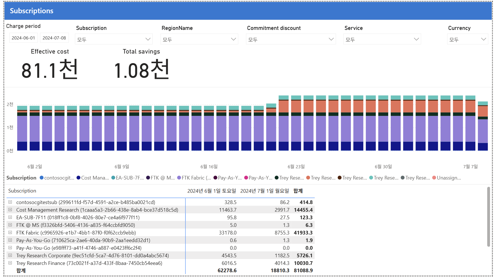

# 03. Subscriptions (구독)

CostManagementConnector 샘플 보고서의 **Subscriptions** 페이지 해설임.
"어느 구독(=보통 팀·앱·환경 단위)이 비용을 쓰는가"를 보는 화면으로, 조직 단위 비용 배분(showback)의 기본임.

---

## 화면 구조
- 상단: 동일 필터 + Effective cost **81.1천** / Total savings **1.08천**
- 가운데: **일자별 누적 막대** — 하루 비용을 구독별 색깔로 쌓음
- 하단 표: **구독별** 6월/7월/합계

## 막대 차트 — 6/23 급등 (02번과 동일 사건)
- 6/23부터 **주황색 띠가 새로 등장**하며 막대가 높아짐
- 02번(Services)의 Analytics 급증과 같은 시점 → 특정 구독에서 분석 서비스를 크게 돌리기 시작한 것으로 해석됨

## 하단 표 (구독별)

| 구독 | 합계 | 비중 |
|---|---|---|
| **FTK Fabric** | **41,933.3** | ~52% (1위) |
| **Cost Management Research** | **14,455.4** | ~18% |
| **Trey Research Finance** | **10,030.7** | ~12% |
| Trey Research Corporate | 5,726.1 | ~7% |
| contosocgitestsub | 414.8 | |
| EA-SUB-7F11 | 123.3 | |
| FTK @ MS | 6.3 | |
| Pay-As-You-Go ×2 | 1.9 / 0.0 | |
| **합계** | **81,088.9** | (01·02번과 일치) |

## 인사이트 (읽는 법)
1. **비용 상위 3개 구독이 전체의 ~82%** (FTK Fabric + Cost Mgmt Research + Trey Finance) → 이 3개만 관리해도 대부분 통제 가능 (파레토 법칙)
2. **FTK Fabric 단일 52%** — 02번 Analytics와 동일 대상. 최우선 최적화·약정 검토 대상
3. **6/23 주황 띠 급등** — 특정 구독의 신규/확장 워크로드 → 예산·이상 탐지 대상
4. **구독=조직 단위 배분** — 각 구독이 팀/앱이면, 이 표가 곧 팀별 showback 리포트. MCA에선 관리 그룹 대신 이 구독 단위로 배분

## 02번(Services)과의 관계
- Services = "무엇에(서비스)", Subscriptions = "누가(구독/팀)" 썼는가
- 두 축을 교차하면 "어느 팀이 어느 서비스에 얼마" → 정밀 배분 완성

**한 줄 요약**: Subscriptions는 "상위 3개 구독이 82%, FTK Fabric이 절반, 6/23 특정 구독 급등"을 보여줌 →
소수 구독 집중 관리 + 팀별 showback의 기준 화면.
