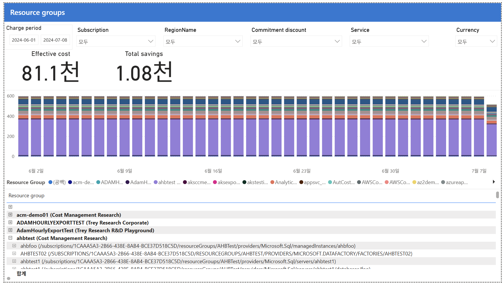

# 04. Resource groups (리소스 그룹)

CostManagementConnector 샘플 보고서의 **Resource groups** 페이지 해설임.
구독보다 한 단계 더 세밀하게, "어느 리소스 그룹(=보통 애플리케이션·워크로드 단위)이 비용을 쓰는가"를 보는 화면임.



---

## 화면 구조
- 상단: 동일 필터 + Effective cost **81.1천** / Total savings **1.08천**
- 가운데: **일자별 누적 막대** — 리소스 그룹별 색깔. 큰 보라색 띠 = **ahbtest** RG가 지배적
- 하단 표: **리소스 그룹별** (괄호 안에 소속 구독 표기), **개별 리소스까지 드릴다운** 가능

## 표에서 눈여겨볼 점 — 계층 드릴다운
- 각 RG 앞의 `⊞` 아이콘 → 펼치면 그 안의 개별 리소스가 나옴
- 예: `ahbtest (Cost Management Research)` 펼침 →
  - `ahbfoo` (SQL Managed Instance)
  - `AHBTEST02` (Data Factory)
  - `ahbtest1` (SQL servers)
- **RG → 리소스**까지 파고들어 비용 원인을 리소스 단위로 특정 가능

## 중요한 관찰 — 차트 눈금이 낮음 (~600/일)
- 앞 페이지(Services·Subscriptions)는 하루 ~2천이었으나, 이 RG 차트는 하루 ~600 수준
- 이유: **모든 비용이 리소스 그룹에 매핑되지 않기 때문**
  - 예약(RI)·Marketplace 구매, 구독 레벨 요금, 용량(capacity) 기반 과금 등은 RG가 없음
  - 그래서 범례에 **`(공백)` = 리소스 그룹 없음** 항목이 존재
- 즉 RG 뷰만으로는 총비용이 다 안 보임 → 총액은 상단 카드(81.1천)로 확인

## 인사이트 (읽는 법)
1. **ahbtest RG(보라)가 RG 레벨 최대** — 애플리케이션 단위 최적화 1순위
2. **RG=애플리케이션 경계** — 각 RG가 앱/워크로드면, 이 표가 곧 앱별 비용
3. **리소스 드릴다운** — 급증 원인을 개별 리소스(특정 SQL·Data Factory 등)까지 추적
4. **`(공백)` 주의** — RG 없는 비용(구매·용량 등)은 RG 뷰에서 누락 → 배분 시 별도 처리 필요

## 배분 계층 정리
```
구독(팀) → 리소스 그룹(앱/워크로드) → 리소스(개별 자원)
 03번        04번(이 페이지)            04번 드릴다운
```
아래로 갈수록 세밀 → 원인 추적은 리소스, 배분·책임은 구독/RG 단위가 실용적

**한 줄 요약**: Resource groups는 "ahbtest RG가 최대, RG→리소스 드릴다운으로 원인 추적 가능,
단 RG 없는 비용(구매·용량)은 누락"을 보여주는 애플리케이션 단위 화면.
