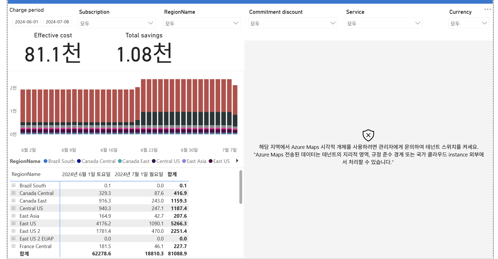

# 06. Regions (지역)

CostManagementConnector 샘플 보고서의 **Regions** 페이지 해설임.
"어느 리전(Azure 데이터센터 지역)에서 비용이 발생하는가"를 보는 화면임.
리전은 **가격·규정 준수·지연·전송(egress) 비용**에 직접 영향을 줌.



---

## 화면 구조
- 상단: 동일 필터 + Effective cost **81.1천** / Total savings **1.08천**
- 좌측 가운데: **일자별 누적 막대** — 리전별 색깔 (6/23 급등 재확인)
- 좌측 하단: **RegionName별** 6월/7월/합계 표
- **우측: Azure Maps 지도 시각화 (비어 있음)**

## 우측 지도가 안 나오는 이유
- 오류 메시지: "Azure Maps 시각적 개체를 사용하려면 관리자에게 문의하여 테넌트 스위치를 켜세요"
- 즉 **테넌트 관리자 설정으로 Azure Maps가 꺼져 있어** 지도가 렌더링되지 않음
- 지도는 부가 시각화일 뿐, 비용 데이터는 좌측 표·차트로 정상 확인 가능
- 지도를 켜려면 Entra 관리자가 "Azure Maps 데이터 전송" 테넌트 스위치를 허용해야 함 (데이터가 테넌트 지리 경계 밖에서 처리될 수 있다는 고지 포함)

## 하단 표 (RegionName별, 상위 일부)

| 리전 | 합계 |
|---|---|
| **East US** | **5,266.3** (US 최대) |
| **East US 2** | **2,251.4** |
| **Central US** | **1,187.4** |
| **Canada East** | **1,159.3** |
| Canada Central | 416.9 |
| France Central | 227.7 |
| East Asia | 207.6 |
| Brazil South | 0.1 |
| East US 2 EUAP | 0.0 |
| **합계** | **81,088.9** (스크롤 아래 리전 더 있음) |

## 인사이트 (읽는 법)
1. **미국 리전 집중** (East US + East US 2 + Central US) — 05번 리소스 표의 "East US" 다수와 일치
2. **6/23 급등** — 특정 리전에서 워크로드 확장 (앞 페이지들과 동일 사건, 리전 관점 재확인)
3. **리전 = 가격 차이** — 같은 서비스도 리전별 단가가 다름 → 저렴한 리전으로 이전 검토 가능(단 지연·규정 고려)
4. **규정 준수·데이터 주권** — 특정 데이터는 특정 리전에만 둬야 하는 규제 → 리전 분포로 준수 여부 점검
5. **전송(egress) 비용** — 리전 간 데이터 이동 시 대역폭 과금 → 리전 분산이 심하면 07번(charge breakdown)에서 확인

## FinOps에서 리전을 보는 이유
```
가격    : 리전별 단가 차이 → 최적화 기회
규정    : 데이터 주권·컴플라이언스 경계
지연    : 사용자 근접 리전 = 성능
전송비  : 리전 간 이동 = egress 과금
```

**한 줄 요약**: Regions는 "미국 리전(East US 중심)에 비용 집중, 6/23 급등, 지도는 테넌트 설정으로 비활성"을
보여줌 → 가격·규정·전송비 관점의 리전 전략 검토 화면.
