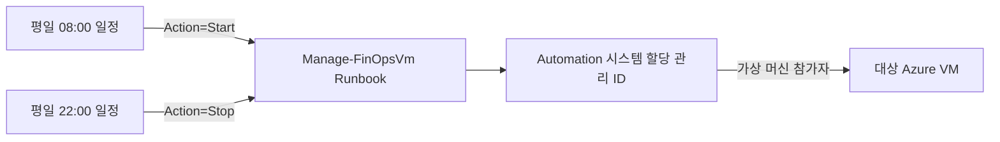
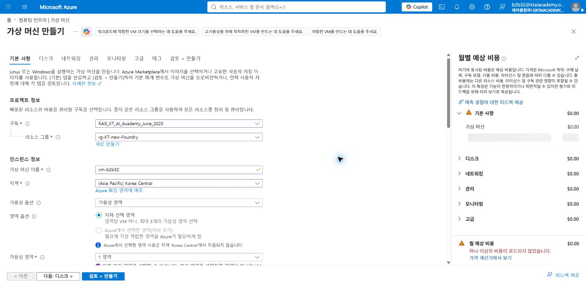
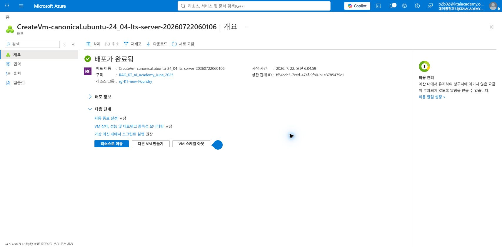
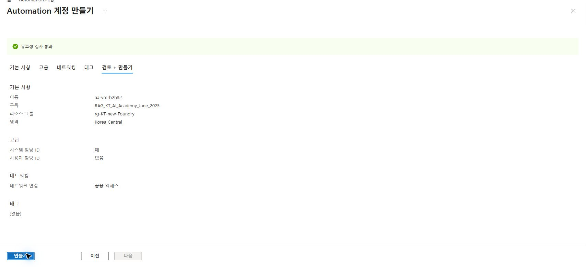
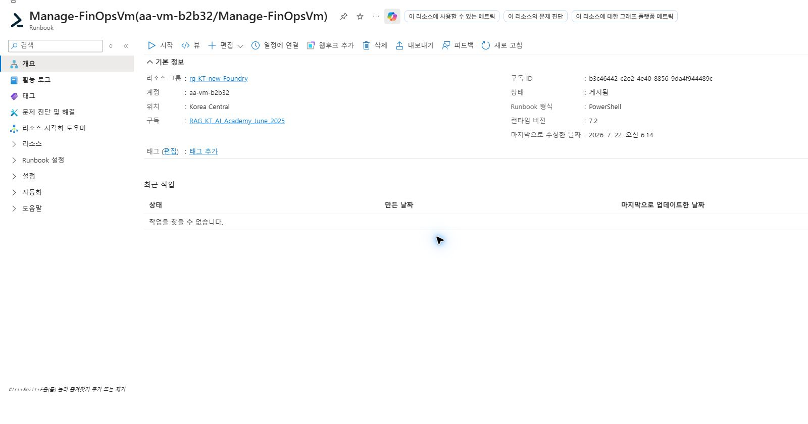
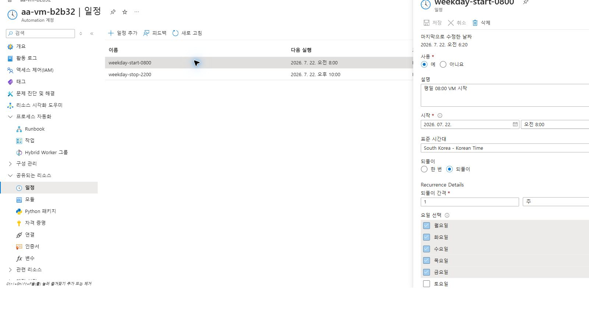
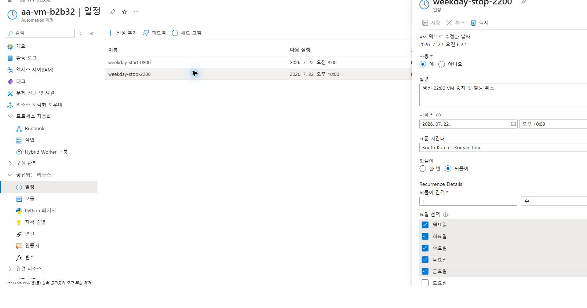
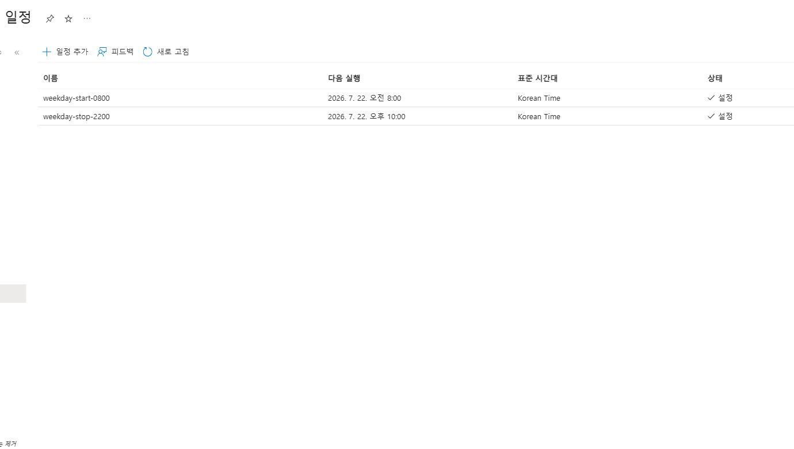
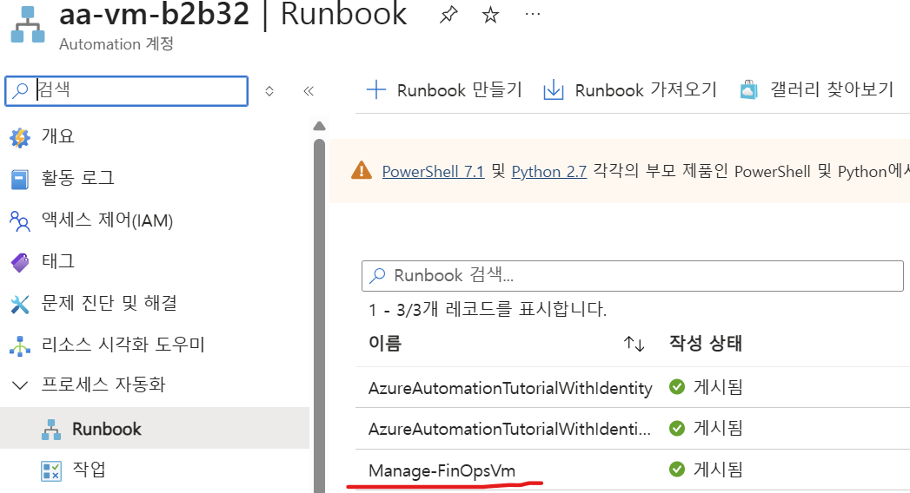

# Azure Automation으로 VM 야간·주말 자동 중지 및 시작

## 1. 실습 개요

업무 시간에만 필요한 Azure VM을 평일 오전에 시작하고 야간에 할당 취소하는 실습임.

금요일 22:00에 VM을 중지하고 월요일 08:00에 다시 시작하므로 주말에는 컴퓨팅 요금이 발생하지 않는 구성임.

> [!IMPORTANT]
> 포털의 `중지`와 게스트 OS 내부의 종료는 비용 효과가 다름.  
> 컴퓨팅 요금 중지를 위해 전원 상태가 `중지됨(할당 취소)`인지 확인 필요함.

### 학습 목표

- `Standard_D2s_v6` 크기의 Linux VM 생성

- Azure Automation 계정의 시스템 할당 관리 ID 활성화

- VM 범위의 최소 권한 역할 할당

- 하나의 매개 변수형 Runbook으로 VM 시작과 할당 취소 구현

- 한국 표준시 기준 평일 08:00 시작 및 22:00 중지 일정 구성

- 일정, Runbook, 매개 변수 연결 상태 검증

### 예상 소요 시간

약 45분임.

### 구성 흐름



## 2. 실습 환경

| 항목 | 검증 환경 값 |  
|---|---|  
| 구독 | `RAG_KT_AI_Academy_June_2025` |  
| 리소스 그룹 | `rg-KT-new-Foundry` |  
| 지역 | `Korea Central` |  
| VM | `vm-b2b32` |  
| Automation 계정 | `aa-vm-b2b32` |  
| Runbook | `Manage-FinOpsVm` |  
| 런타임 | PowerShell 7.2 |  

## 3. 사전 요구 사항

- Azure 구독에서 VM과 Automation 계정을 만들 수 있는 권한

- 대상 VM에 역할을 할당할 수 있는 `소유자` 또는 `사용자 액세스 관리자` 권한

- 리소스 생성에 따른 요금 발생 가능성 확인

- 일정 시작 시각보다 최소 5분 이전에 구성 완료

## 4. VM 생성

### 4.1 기본 사항 입력

1. Azure Portal에서 `가상 머신`을 검색함.

2. `만들기` > `Azure 가상 머신`을 선택함.

3. 다음 값을 입력함.

| 항목 | 입력값 |  
|---|---|  
| 리소스 그룹 | 실습용 리소스 그룹 |  
| 가상 머신 이름 | 예: `vm-b2b32` |  
| 지역 | Automation 계정과 같은 지역 권장 |  
| 이미지 | Ubuntu Server 24.04 LTS x64 Gen2 |  
| 크기 | `Standard_D2s_v6` |  
| 인증 형식 | SSH 공개 키 |  



### 4.2 VM 크기와 배포 확인

1. `모든 크기 보기`를 선택함.

2. 검색 상자에 `D2s v6`를 입력함.

3. `Standard_D2s_v6`를 선택함.

4. `검토 + 만들기`에서 예상 요금과 리소스 구성을 확인함.

5. 유효성 검사 성공 후 `만들기`를 선택함.

6. 배포 완료 후 `리소스로 이동`을 선택함.



## 5. Automation 계정 생성

1. 포털에서 `Automation 계정`을 검색함.

2. `만들기`를 선택함.

3. VM과 동일한 구독, 리소스 그룹, 지역을 선택함.

4. 계정 이름을 입력함. 예: `aa-vm-b2b32`임.

5. `고급` 또는 `ID` 설정에서 `시스템 할당 관리 ID`를 `켜기`로 설정함.

6. `검토 + 만들기` > `만들기`를 선택함.



## 6. 관리 ID에 VM 제어 권한 부여

관리 ID를 사용하면 Runbook에 사용자 암호, 서비스 주체 비밀, 인증서를 저장하지 않아도 됨.

1. 대상 VM의 `액세스 제어(IAM)`로 이동함.

2. `추가` > `역할 할당 추가`를 선택함.

3. 역할에서 `가상 머신 참가자`를 선택함.

4. 액세스 할당 대상에서 `관리 ID`를 선택함.

5. `멤버 선택`에서 대상 Automation 계정의 시스템 할당 관리 ID를 선택함.

6. 범위가 구독이나 리소스 그룹이 아닌 대상 VM인지 확인함.

7. `검토 + 할당`을 선택함.

> [!TIP]
> 여러 VM을 하나의 Runbook으로 관리해야 할 때만 리소스 그룹 범위를 고려함.  
> 단일 VM 실습에서는 VM 범위가 최소 권한 원칙에 부합함.

## 7. PowerShell Runbook 작성

### 7.1 Runbook 생성

1. Automation 계정에서 `프로세스 자동화` > `Runbook`을 선택함.

2. `Runbook 만들기`를 선택함.

3. 이름에 `Manage-FinOpsVm`을 입력함.

4. Runbook 형식은 `PowerShell`, 런타임 버전은 `7.2`를 선택함.

5. `만들기`를 선택함.

### 7.2 런타임 패키지 확인

PowerShell 7.2 런타임 환경에 다음 패키지가 있는지 확인함.

- `Az.Accounts`

- `Az.Compute`

패키지가 없으면 Automation 계정의 `런타임 환경`에서 해당 패키지를 추가함.

### 7.3 코드 입력

Runbook 편집기에서 다음 코드를 입력함.

```powershell
param(
    [Parameter(Mandatory = $true)]
    [string] $SubscriptionId,

    [Parameter(Mandatory = $true)]
    [string] $ResourceGroupName,

    [Parameter(Mandatory = $true)]
    [string] $VmName,

    [Parameter(Mandatory = $true)]
    [ValidateSet("Start", "Stop")]
    [string] $Action
)

$ErrorActionPreference = "Stop"

try {
    Disable-AzContextAutosave -Scope Process

    $context = (Connect-AzAccount -Identity).Context
    $context = Set-AzContext `
        -SubscriptionId $SubscriptionId `
        -DefaultProfile $context

    $vm = Get-AzVM `
        -ResourceGroupName $ResourceGroupName `
        -Name $VmName `
        -Status `
        -DefaultProfile $context

    $powerState = ($vm.Statuses |
        Where-Object Code -Like "PowerState/*").Code

    Write-Output "Current state: $powerState"

    if ($Action -eq "Start") {
        if ($powerState -eq "PowerState/running") {
            Write-Output "VM is already running. No action required."
            return
        }

        Start-AzVM `
            -ResourceGroupName $ResourceGroupName `
            -Name $VmName `
            -DefaultProfile $context

        Write-Output "Start request completed."
        return
    }

    if ($powerState -eq "PowerState/deallocated") {
        Write-Output "VM is already deallocated. No action required."
        return
    }

    Stop-AzVM `
        -ResourceGroupName $ResourceGroupName `
        -Name $VmName `
        -Force `
        -DefaultProfile $context

    Write-Output "Stop and deallocation request completed."
}
catch {
    Write-Error $_
    throw
}
```

`Stop-AzVM -Force`는 VM을 중지하고 할당 취소함.  
`-StayProvisioned`를 추가하면 VM이 할당된 상태로 남아 컴퓨팅 요금이 계속 발생할 수 있음.

### 7.4 저장 및 게시

1. `저장`을 선택함.

2. `게시`를 선택함.

3. 개요에서 상태가 `게시됨`, 런타임 버전이 `7.2`인지 확인함.



## 8. 평일 시작 일정 연결

1. Runbook 개요에서 `일정에 연결`을 선택함.

2. `일정` > `일정 추가`를 선택함.

3. 다음 값을 입력함.

| 항목 | 입력값 |  
|---|---|  
| 이름 | `weekday-start-0800` |  
| 시작 시각 | 오전 08:00 |  
| 표준 시간대 | `South Korea - Korean Time` |  
| 되풀이 | 매 1주 |  
| 요일 | 월요일, 화요일, 수요일, 목요일, 금요일 |  
| 만료 | 없음 |  

4. `매개 변수 및 실행 설정`을 열고 다음 값을 입력함.

| 매개 변수 | 입력값 |  
|---|---|  
| `SubscriptionId` | 대상 구독 ID |  
| `ResourceGroupName` | 대상 VM의 리소스 그룹 |  
| `VMName` | 대상 VM 이름 |  
| `Action` | `Start` |  

5. 실행 위치는 `Azure`를 선택하고 일정을 Runbook에 연결함.



## 9. 평일 중지 일정 연결

1. 같은 Runbook에서 `일정에 연결`을 다시 선택함.

2. 이름이 `weekday-stop-2200`인 일정을 추가함.

3. 표준 시간대를 `South Korea - Korean Time`으로 설정함.

4. 반복을 매 1주, 월요일부터 금요일까지로 설정함.

5. 시작 시각을 오후 22:00로 설정함.

6. Runbook 매개 변수는 시작 일정과 동일하게 입력하고 `Action`만 `Stop`으로 설정함.



금요일 22:00 중지 후 다음 시작 일정은 월요일 08:00이므로 주말 내내 VM이 할당 취소 상태로 유지됨.

## 10. 구성 검증

### 10.1 일정 목록 확인

Automation 계정의 `공유되는 리소스` > `일정`에서 다음 두 행을 확인함.

| 일정 | 다음 실행 | 상태 |  
|---|---|---|  
| `weekday-start-0800` | 평일 08:00 | 설정 |  
| `weekday-stop-2200` | 평일 22:00 | 설정 |  



각 일정의 상세 화면에서 `연결된 Runbook`에 `Manage-FinOpsVm`이 표시되는지 확인함.

### 10.2 수동 실행 시험

> [!CAUTION]
> `Action=Stop` 시험은 대상 VM을 실제로 중지하고 할당 취소함.  
> SSH 연결과 VM에서 실행 중인 작업이 종료될 수 있으므로 영향도 확인 후 수행함.

1. Runbook에서 `시작`을 선택함.
      
   
2. 대상 구독 ID, 리소스 그룹, VM 이름을 입력함.

3. 먼저 `Action=Stop`으로 실행함.

4. 작업 출력에 `Stop and deallocation request completed.`가 표시되는지 확인함.

5. VM 개요에서 상태가 `중지됨(할당 취소)`인지 확인함.

6. 다시 Runbook을 열고 같은 값에 `Action=Start`로 실행함.

7. 작업 출력에 `Start request completed.`가 표시되는지 확인함.

8. VM 개요에서 상태가 `실행 중`인지 확인함.

### 10.3 실제 구성 검증 기록

2026-07-22 포털 실습에서 다음 항목까지 확인함.

- VM `vm-b2b32` 생성

- Automation 계정 `aa-vm-b2b32` 및 시스템 할당 관리 ID 생성

- VM 범위의 `가상 머신 참가자` 역할 할당

- PowerShell 7.2 Runbook `Manage-FinOpsVm` 게시

- 시작·중지 일정 생성 및 Job Schedule 연결

- 두 Job Schedule의 Runbook 이름과 네 개 매개 변수를 Azure REST 응답으로 확인

수동 `Stop` 후 `Start` 실행 시험은 VM 중단 영향 확인 전이므로 미수행 상태임.

## 11. 비용 및 운영 주의 사항

- VM이 `중지됨(할당 취소)` 상태이면 VM 컴퓨팅 요금이 청구되지 않음.

- 관리 디스크, 스냅샷, 백업, 고정 공용 IP 등 부속 리소스 요금은 계속 발생 가능함.

- 게스트 OS에서만 종료하면 `중지됨(할당됨)` 상태가 되어 컴퓨팅 요금이 계속 발생할 수 있음.

- 공휴일은 평일 일정만으로 제외되지 않으므로 별도 일정 비활성화 또는 예외 처리 필요함.

- 주말에 수동으로 VM을 시작하면 월요일 전까지 자동 중지되지 않음.  
  필요 시 토요일과 일요일 오전에 `Action=Stop` 안전 일정을 추가함.

## 12. 문제 해결

### `Connect-AzAccount -Identity` 실패

- Automation 계정의 시스템 할당 관리 ID가 켜져 있는지 확인함.

- Runbook 실행 위치가 Azure인지 확인함.

### `AuthorizationFailed` 발생

- 관리 ID에 대상 VM 범위의 `가상 머신 참가자` 역할이 있는지 확인함.

- 역할 할당 후 전파에 몇 분이 필요할 수 있으므로 잠시 후 재실행함.

### `Get-AzVM` 또는 `Start-AzVM`을 찾을 수 없음

- PowerShell 7.2 런타임 환경에 `Az.Accounts`와 `Az.Compute` 패키지가 있는지 확인함.

### 일정은 있지만 실행되지 않음

- 일정 상태가 `설정`인지 확인함.

- 표준 시간대가 `Korean Time`인지 확인함.

- 일정 상세의 `연결된 Runbook`과 Runbook 매개 변수를 확인함.

- Runbook이 초안이 아닌 `게시됨` 상태인지 확인함.

## 13. 실습 정리

비용 발생을 원하지 않으면 다음 순서로 리소스를 정리함.

1. `weekday-start-0800`과 `weekday-stop-2200` 일정을 비활성화함.

2. VM이 실행 중이면 중지하고 할당 취소함.

3. 실습 전용 리소스 그룹을 사용했다면 리소스 그룹을 삭제함.

4. 공유 리소스 그룹이면 VM, 네트워크 인터페이스, 디스크, 공용 IP, Automation 계정을 개별 삭제함.

## 참고 자료

- [Azure Automation 일정 관리][automation-schedules]

- [Automation 계정 시스템 할당 관리 ID][automation-managed-identity]

- [Azure Automation Runbook 관리][automation-runbooks]

- [Azure VM 전원 상태와 요금][vm-states-billing]

[automation-schedules]: https://learn.microsoft.com/en-us/azure/automation/shared-resources/schedules
[automation-managed-identity]: https://learn.microsoft.com/en-us/azure/automation/enable-managed-identity-for-automation
[automation-runbooks]: https://learn.microsoft.com/en-us/azure/automation/manage-runbooks
[vm-states-billing]: https://learn.microsoft.com/en-us/azure/virtual-machines/states-billing
